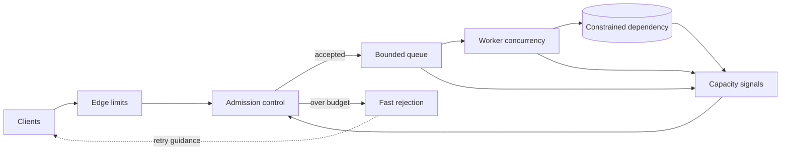

نادراً ما تتعطل خدمة في اللحظة نفسها التي يتجاوز فيها الطلب قدرتها. يحدث التعطل عادة بعد ذلك، حين يتراكم العمل الزائد داخل الطوابير، ومجموعات الخيوط، ومجمعات الاتصالات، وحلقات إعادة المحاولة لدى العملاء.

هذا التأخير يجعل فرط الحمل خادعًا. تكون الخدمة قد فقدت قدرتها على مواكبة الطلب، لكنها تستمر في قبول طلبات جديدة. يرتفع زمن الاستجابة، وتنتهي المهل، ويعيد العملاء المحاولة. تستهلك المحاولات الجديدة السعة التي كان ينبغي أن تكمل العمل المفيد. وهكذا تتحول قفزة قصيرة في الزيارات إلى تراكم يغذي نفسه.

يحتاج التصميم الموثوق إلى عقد واحد يغطي مسار الطلب كاملًا. يخبر الضغط العكسي المنتجين بأن يبطئوا. يقرر التحكم في القبول هل يسمح بدخول عمل جديد. يرفض إسقاط الحمل العمل الذي لا يمكن إنهاؤه ضمن الميزانية المتاحة. تجعل الطوابير المحدودة الحد صريحًا. وتمنع سياسة إعادة المحاولة الرفض من التحول إلى حمل إضافي.

تعرض هذه المقالة ذلك العقد بوصفه معمارية مرجعية. وهي تشرح آليات واختبارات عامة، ولا تدّعي وصف نظام إنتاج محدد أو نتائج مقاسة.

## يبدأ فرط الحمل بالانتظار لا باستهلاك المعالج

قد يكون ارتفاع استهلاك المعالج إشارة مفيدة، لكنه ليس الصورة الكاملة. يمكن أن تختنق الخدمة بسبب اتصالات قاعدة البيانات، أو الذاكرة، أو واصفات الملفات، أو التزامن مع خدمة تابعة، أو قسم ساخن واحد، أو حد معدل تفرضه خدمة خارجية. وقد يبقى متوسط الاستهلاك معتدلًا بينما تحجز فئة مكلفة من الطلبات كل الطلبات الرخيصة خلفها.

تكون أول علامة مفيدة غالبًا نمو العمل المنتظر. يزداد عمق الطابور. يصبح وقت انتظار العامل أطول من وقت التنفيذ. يتباطأ الحصول على اتصال. تقترب الطلبات من مهلتها قبل أن يبدأ منطق العمل. يتوقف معدل الإنجاز عن الارتفاع مع استمرار تدفق طلبات جديدة.

يخفي الطابور غير المحدود هذه الحالة. فهو يحول رفضًا فوريًا واضحًا إلى انتهاء مهلة متأخر وضغط على الذاكرة. ويصعّب التعافي أيضًا: بعد عودة الطلب إلى مستواه الطبيعي، تظل الخدمة تعالج عملًا قديمًا لم يعد العميل يحتاج إليه.

تصوغ مواصفة [Reactive Streams](https://www.reactive-streams.org/) المشكلة الأساسية بدقة: يجب ألا يضطر مستقبل غير متزامن إلى تخزين كمية اعتباطية من البيانات يرسلها منتج أسرع. والحل هو ضغط عكسي غير حاجب عبر الحد غير المتزامن. هذه الآلية ضرورية داخل التدفق، لكن الخدمة الكاملة تحتاج أيضًا إلى سياسة للزيارات التي لا تستطيع الانتظار ولا يمكن إبطاؤها.

## الضغط العكسي والتحكم في القبول وإسقاط الحمل تعالج مراحل مختلفة

ترتبط هذه الآليات ببعضها، لكنها ليست بدائل متطابقة.

**الضغط العكسي** يبلغ المنبع بحجم الطلب المتاح. لا يطلب المستهلك إلا ما يستطيع معالجته، أو يؤخر النقل المتدفق عمليات الكتابة، أو يتوقف العامل عن سحب الرسائل عندما تنفد ميزانية التزامن. هذه آلية تعاونية؛ يجب أن يستجيب المنتج للإشارة.

**التحكم في القبول** يقيّم وحدة عمل جديدة قبل حجز مورد نادر. يمكنه فحص عدد العمليات الجارية، والكلفة المتوقعة، وحصة المستأجر، والأولوية، والمهلة، وصحة الخدمة التابعة. وتكون النتيجة قبول العمل أو تقديم نسخة أخف أو تأجيله أو رفضه.

**إسقاط الحمل** هو رفض متعمد للعمل أثناء فرط الحمل. يحمي السعة المتبقية كي تكمل الخدمة العمل الذي ما زالت قادرة عليه. الرفض هنا ليس مسار انهيار استثنائيًا، بل إجراء تحكم طبيعي له استجابة واضحة ومقياس وعقد مع العميل.

**الطوابير المحدودة** تصل هذه المراحل ببعضها. ينبغي تبرير سعة الطابور بمعدل الإنجاز وزمن الانتظار المقبول، لا بأكبر عدد صحيح تسمح به المكتبة. وعند بلوغ الحد، يجب تطبيق سياسة معروفة بدل تخصيص مزيد من الذاكرة بصمت.

يشرح [دليل التحكم في التدفق في gRPC](https://grpc.io/docs/guides/flow-control/) كيف تمنع RPCs المتدفقة مرسلًا سريعًا من إغراق المستقبل. كما يوضح أن نجاح استدعاء الكتابة قد يعني فقط تسليم البيانات إلى الإطار، لا خروجها إلى الشبكة. يحمي التحكم على مستوى النقل المخازن المؤقتة، لكنه لا يقرر هل كان يجب قبول عملية العمل أصلًا.

## ضع حلقة التحكم قبل المورد النادر

يجب أن يقع حد فرط الحمل قبل المورد الذي يتشبع. إذا كان مجمع اتصالات قاعدة البيانات هو القيد، يأتي الرفض بعد الحصول على اتصال متأخرًا. وإذا كان تحليل الحمولة يستهلك المعالج، فإن تحليلها كاملًا قبل قرار القبول يهدر المورد المطلوب حمايته.

تطبق الحافة وسائل رخيصة مثل حد حجم الطلب، والمصادقة، وحصص المستأجرين، وحدود المعدل العامة. ثم يستخدم التحكم في القبول إشارات السعة المحلية ليقرر دخول الطلب. ينتقل العمل المقبول إلى طابور محدود ومجموعة عمال ذات تزامن مقيد. ويحصل العمل المرفوض على استجابة توضح هل إعادة المحاولة مناسبة.

يبقي هذا التصميم القرار قريبًا من موضع الاختناق. يستطيع متحكم عالمي توزيع حصص طويلة الأجل أو قيمة تزامن مطلوبة، لكن كل نسخة من الخدمة تحتاج إلى حماية محلية سريعة. لا يستطيع قرار مركزي يصل بعد استنزاف مجمع العملية المحلي أن يحميها.

ويجب أن يكون مسار التحكم أرخص من العمل الذي يرفضه. قد تجعل استدعاءات سياسة بعيدة ومعقدة، أو فك الحمولة كاملًا، أو المصادقة المكلفة بعد التشبع، الرفض قريب الكلفة من النجاح. الأفضل تخزين مدخلات السياسة المستقرة محليًا وتنفيذ أرخص فحص آمن أولًا.

## اختر إشارات تصف السعة المتبقية

معدل الطلبات وحده إشارة ضعيفة، لأن كلفة الطلبات قد تختلف كثيرًا. قد ينفذ طلب قراءة بسيطة من ذاكرة مؤقتة، بينما يتفرع آخر إلى خدمات عدة ويمسح مجموعة كبيرة من النتائج. يشرح فصل Google SRE عن [معالجة فرط الحمل](https://sre.google/sre-book/handling-overload/) هذا القيد، ويوصي بالاستدلال من استهلاك الموارد بدل افتراض أن عدد الاستعلامات في الثانية يمثل السعة.

من الإشارات المحلية المفيدة:

1. العمل الجاري مقارنة بحد تزامن جرى اختباره.
2. عمق الطابور وعمر أقدم عنصر منتظر.
3. استهلاك العمال وتأخر حلقة الأحداث.
4. زمن انتظار اتصال بقاعدة البيانات أو بخدمة تابعة.
5. ما تبقى من ميزانية المهلة عند القبول.
6. ضغط الذاكرة ووقت جمع المهملات.
7. زمن الاستجابة ومعدل الخطأ حديثًا لدى التبعيات.

لا توجد إشارة واحدة مناسبة لكل نظام. قد يكون استهلاك المعالج مناسبًا للعمل الحسابي، بينما يكون انتظار الاتصال أوضح في API مقيدة بقاعدة البيانات. وغالبًا يكون عمر الطابور أكثر فائدة من عمقه لأنه يربط التراكم بزمن الاستجابة الذي يراه المستخدم.

ينبغي ألا يتقلب المتحكم عند عتبة واحدة دقيقة. يمكن لتغيرات صغيرة أن تسبب تناوبًا سريعًا بين القبول والرفض. استخدم عتبات مختلفة للفتح والإغلاق، أو قياسًا مصقولًا، أو خوارزمية تزامن تكيفية ذات حدين أدنى وأعلى صريحين. وحتى المتحكم التكيفي يحتاج إلى سقف صلب للأمان.

يجب تقييد الأولوية أيضًا. إذا وصف كل عميل طلبه بأنه حرج، فلن تعني الأولوية شيئًا. عرّف عددًا صغيرًا من الفئات المراجعة واحجز السعة عمدًا. وينبغي أن تبقى فحوص الصحة الإدارية رخيصة ومستقلة بما يكفي للإبلاغ عن فرط الحمل بدل الانضمام إلى الطابور المشبع نفسه.

## قيّد الطوابير بميزانية الانتظار

يكون الطابور مفيدًا عندما يمتص تغيرًا طبيعيًا في الجدولة. ويصبح خطرًا عندما يخزن عملًا أكثر مما يمكن إنهاؤه قبل المهل المحددة.

يبدأ الحد العملي من معدل الخدمة وزمن الانتظار المقبول. إذا كان العمال ينجزون قرابة 200 عملية في الثانية وكان أقصى انتظار مقبول 250 ميلي ثانية، فإن 50 عملية منتظرة تمثل نقطة بداية تقريبية. هذا مثال للحساب لا إعدادًا عامًا؛ تحتاج الأحمال الحقيقية إلى قياس توزيع زمن الخدمة واختبارات فشل.

ينبغي فحص عمر الطلب عند القبول وقبل التنفيذ. قد يكون صالحًا عند دخوله ثم يصبح عديم القيمة عندما يصل إلى عامل. إن إسقاط العمل المنتهي قبل المعالجة المكلفة يحفظ السعة ويتجنب إنتاج استجابة بعد أن يكون العميل قد تخلى عن الطلب.

يمكن لطوابير منفصلة حماية العمل الحساس للزمن من العمل الدفعي، لكن كل طابور يحتاج إلى حد وقاعدة جدولة. قد تؤجل طوابير الأولوية العمل الأقل أولوية إلى الأبد إن لم تمنع التجويع. وقد يسبب طابور FIFO واحد حجب مقدمة الصف عندما يؤخر عنصر مكلف عددًا كبيرًا من العناصر الرخيصة.

في العمل غير المتزامن الدائم، قد يعني الرفض إعادة استجابة فرط حمل قبل إنشاء المهمة. بعد قبول مهمة قبولًا دائمًا، تكون الخدمة قد قدمت وعدًا مختلفًا وتحتاج إلى قواعد للاحتفاظ وإعادة المحاولة والإنجاز. لا يصح تأكيد القبول الدائم ثم إسقاط المهمة لأن طابور العمال داخل الذاكرة امتلأ.

## اجعل الرفض جزءًا من بروتوكول العميل

لا يفيد الرفض السريع إلا إذا فسّره العملاء بصورة صحيحة. ينبغي للخدمة المثقلة أن تعيد حالة محددة وسببًا ثابتًا يمكن للآلة قراءته وإرشادًا لإعادة المحاولة حين تكون مفيدة. تميّز خدمات HTTP عادة بين فرط الحمل أو عدم التوفر المؤقت وبين أخطاء التحقق والصلاحيات. وتحتاج أنظمة التدفق والرسائل إلى نتائج نوعية مماثلة.

تحتاج إعادة المحاولة إلى تراجع أسي، وJitter، وعدد محاولات محدود، والمهلة الشاملة الأصلية. لا تقدم محاولة تبدأ بعد انتهاء مهلة العميل أي قيمة. وقد تتزامن المحاولات الفورية من آلاف العملاء لتشكل عاصفة تبقي النظام الخلفي مثقلًا بعد زوال القفزة الأصلية.

تحد ميزانية إعادة المحاولة حجم المحاولات مقارنة بالزيارات الأصلية. وهي تمنع العميل من اعتبار كل فشل إذنًا بإرسال مزيد من العمل. ويمكن للخنق المحلي في جهة العميل أن يرفض بعض الطلبات قبل أن تصل أصلًا إلى خدمة خلفية ترفض الزيارات.

لا تعد إلا العمليات التي تسمح دلالتها بذلك. تكون القراءة آمنة غالبًا، بينما قد تحتاج الكتابة إلى مفتاح تكرار آمن أو استعلام عن حالة العملية. لا يزيل التحكم في الحمل خطر الآثار المكررة.

الاستجابة المخففة خيار آخر إذا كان عمل أرخص ما زال يقدم قيمة. يمكن للخدمة حذف إثراء مكلف، أو إعادة بيانات مخزنة مع بيان قدمها، أو تقليل التفرع. يجب أن تستهلك النسخة المخففة قدرًا أقل فعلًا من المورد المشبع. لن يفيد تصغير الاستجابة إذا كان استعلام قاعدة البيانات المكلف قد نُفذ بالفعل.

## راقب العمل المقبول والمرفوض معًا

قد تجعل لوحة تعرض معدل الإنجاز الناجح وحده إسقاط الحمل يبدو تعافيًا. ربما تخدم الخدمة الطلبات المقبولة بسرعة بينما ترفض نصف الطلب الفعلي.

ضع الوصول والقبول والرفض والإنجاز وإعادة المحاولة وعمق الطابور وعمره والعمل الجاري وتشبع التبعيات على المحور الزمني نفسه. صنف الرفض حسب السبب والمستأجر والمسار والأولوية من دون كشف هويات حساسة. وقس زمن الاستجابة منذ وصول الطلب، لا منذ بدء العامل فقط.

النسبة الأهم هي الحمل المعروض إلى العمل المفيد المكتمل. لا يكفي عد الطلبات المقبولة إذا انتهت مهلة كثير منها لاحقًا. وقد يستهلك الإنجاز بعد مهلة العميل موارد من دون تقديم قيمة.

يجب أن تميز التنبيهات بين إسقاط مضبوط وانهيار غير مضبوط. قد يثبت معدل رفض صغير أثناء قفزة معروفة أن الحماية تعمل. أما استمرار الرفض، أو استنزاف السعة المحجوزة، أو نمو عمر الطابور، أو انخفاض معدل الإنجاز، فيتطلب تدخلًا. وينبغي إظهار عتبة المتحكم وإشارته الحالية كي يستطيع المشغل تفسير كل قرار رفض.

## اختبر التعافي والعدالة وتضخيم إعادة المحاولة

يفوت اختبار حمل يتوقف فور ارتفاع الزمن السلوك الأهم. ارفع الحمل فوق القدرة المستدامة، وأبقه هناك، ثم اخفض الوصول وراقب هل تتعافى الخدمة من دون إعادة تشغيل.

ينبغي أن تتحقق حزمة الاختبارات من الآتي:

1. يبقى عمق الطابور والذاكرة محدودين فوق معدل الوصول المستدام.
2. يكتمل العمل المقبول ضمن مهلته أثناء إسقاط مضبوط.
3. يكون الرفض سريعًا وأرخص بوضوح من التنفيذ العادي.
4. تبقى محاولات العملاء ضمن الميزانية وتستخدم Jitter.
5. تحتفظ الزيارات ذات الأولوية بالسعة المحجوزة من دون تجويع الفئات الأخرى إلى الأبد.
6. يسقط العمل المنتهي قبل استهلاك المورد المقيد.
7. تتعافى الخدمة سريعًا بعد انخفاض الحمل بدل تفريغ تراكم قديم كبير.
8. لا تستنزف تبعية مثقلة مجمعات غير مرتبطة عبر تزامن مشترك.
9. لا تتذبذب العتبات عندما تكون الزيارات قريبة من الحد.
10. تحصي المقاييس العمل المعروض والمقبول والمرفوض والمنتهي والمكتمل.

نفذ الاختبارات نفسها مع تبعية بطيئة، لا مع ارتفاع عدد الطلبات فقط. يؤدي تضخم الزمن إلى خفض السعة الفعلية حتى لو بقي معدل الوصول ثابتًا. واختبر الفشل الجزئي حيث تتباطأ نسخة أو قسم واحد، لأن موازن حمل ساذجًا قد يستمر في إرسال الطلبات إلى هدف مريض.

الثابت واضح: يجب ألا يقبل النظام عملًا أكثر مما يستطيع الاحتفاظ به وإنهاؤه تحت سياسته المعلنة. عند فرط الحمل، ينبغي أن يخسر العمل الاختياري عمدًا بدل أن يفقد السيطرة على كل العمل عرضًا.

## عقد عملي لفرط الحمل

يصف التصميم الكامل العقد عند كل حد:

1. يعرف المنتجون كيف تصلهم إشارة السعة.
2. يحدث القبول قبل المورد المقيد.
3. للطوابير ومجمعات التزامن حدود صريحة.
4. للرفض استجابة نوعية يمكن للعميل مراقبتها.
5. تحافظ المحاولات على المهل وتستهلك ميزانية محدودة.
6. سياسات الأولوية والتخفيف محدودة ومختبرة.
7. يجري التحقق من التعافي بعد فرط حمل مستمر.

يكون الضغط العكسي أقوى حين يستطيع المنتج الإبطاء. يصبح إسقاط الحمل ضروريًا حين لا يستطيع ذلك، أو حين يكون العمل قد تأخر أصلًا، أو حين يهدد قبوله عملًا أعلى قيمة. ويجمع التحكم في القبول القرارين عند نقطة ما زالت فيها سعة يمكن حمايتها.

الهدف ليس منع كل رفض. الهدف أن يبقى فرط الحمل محدودًا وواضحًا وقابلًا للتعافي.