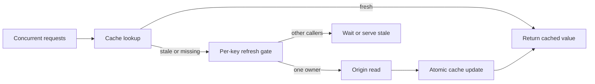

تمنع ذاكرة التخزين المؤقت تكرار العمل ما دامت القيمة المخزنة قابلة للاستخدام. لكن عندما تنتهي صلاحية مفتاح شديد الرواج، قد تلاحظ مئات الطلبات فقدان القيمة في اللحظة نفسها تقريبًا. وإذا استعلم كل طلب عن المصدر بصورة مستقلة، تتحول لحظة انتهاء واحدة إلى اختبار حمل متزامن ضد قاعدة البيانات أو خدمة المصب.

هذه هي ظاهرة تدافع ذاكرة التخزين المؤقت. الخطر ليس مجرد انخفاض نسبة الإصابات، بل تزامن عدد كبير من العمليات على الاعتمادية نفسها، وغالبًا في وقت تكون فيه تلك الاعتمادية بطيئة أصلًا. إطالة مدة `TTL` تقلل تكرار لحظات الانتهاء، لكنها لا تضبط السلوك عند حدود الانتهاء.

يحتاج التصميم الموثوق إلى عقد تحديث محدود: طلب واحد يجدد المفتاح، والطلبات المتزامنة تعيد استخدام العمل نفسه أو تحصل على قيمة قديمة مقبولة، مع بقاء المصدر محميًا بقيود قبول واضحة. يعرض هذا المقال ذلك العقد بوصفه معمارية مرجعية عامة، لا ادعاءً عن نظام إنتاج محدد أو نتائج مقاسة.

## انتهاء الصلاحية يحول الطلبات المستقلة إلى حمل متزامن

لنفترض أن صفحة منتج تستقبل حركة ثابتة، وأن قيمتها المخزنة تنتهي كل خمس دقائق. عند وجود Cache Hit عادي تكون الطلبات قليلة الكلفة ومستقلة إلى حد كبير. بعد الانتهاء ترى كل الطلبات الواصلة قبل اكتمال أول تحديث أن المفتاح مفقود، فتتحول كلها إلى قراءات من المصدر.

يتناسب التضخيم تقريبًا مع معدل وصول الطلبات مضروبًا في زمن التحديث. عند 500 طلب في الثانية وقراءة من المصدر تستغرق 200 ميلي ثانية، قد يتنافس نحو 100 طلب على بناء القيمة ذاتها. وإذا تباطأ المصدر تحت الضغط إلى ثانيتين، فقد يقترب السباق من 1,000 طلب. تتغير الأرقام الدقيقة حسب نمط الوصول والجدولة، لكن حلقة التغذية الراجعة ثابتة: التحديث الأبطأ ينتج منفذين متزامنين أكثر، وهؤلاء يجعلون المصدر أبطأ.

تؤجل `TTL` الأطول هذه اللحظة فقط. ويمكن لإضافة تفاوت عشوائي إلى أوقات الانتهاء أن توزع مفاتيح مختلفة على الزمن. لكن أيًا من الأسلوبين لا يضمن التحكم في التزامن لمفتاح ساخن واحد؛ فقد تنتهي قيمته مرة واحدة وتطلق موجة كبيرة.

السؤال الصحيح إذن ليس: «كم يجب أن تعيش القيمة؟» فقط. السؤال هو: «عندما تحتاج القيمة إلى تحديث، كم مستدعيًا يسمح له بتنفيذ التحديث، وماذا يحصل عليه الباقون، وكيف نحمي المصدر؟»

## فصل حداثة البيانات عن التوافر والتزامن

ينبغي لسياسة التخزين المؤقت أن تفصل بين ثلاثة اعتبارات تختصر عادة في قيمة `TTL` واحدة.

**حداثة البيانات** تحدد العمر الذي تصبح عنده القيمة بحاجة إلى تحديث. هذا قرار يتعلق بالمنتج وبالصحة المنطقية. قرار الصلاحيات لا يحتمل غالبًا بيانات قديمة، بينما قد يقبل وصف عام لعنصر في كتالوج تأخرًا لعدة دقائق.

**التوافر** يحدد إمكان تقديم قيمة أقدم إذا كان التحديث بطيئًا أو فاشلًا. يعرّف [RFC 5861](https://www.rfc-editor.org/rfc/rfc5861) توجيهي HTTP المعروفين باسم `stale-while-revalidate` و`stale-if-error`. ويمكن تطبيق الفكرة نفسها داخل الخدمة، لكن فقط عندما تسمح دلالة البيانات بذلك.

**تزامن التحديث** يحدد عدد العمال المسموح لهم بإعادة بناء مفتاح واحد. الإجابة المعتادة هي منفذ نشط واحد لكل مفتاح، لا منفذ واحد لكل طلب. يسمى ذلك Request Coalescing أو Duplicate Suppression أو Single Flight.

تحتاج هذه القرارات إلى ميزانيات مستقلة. قد تكون القيمة حديثة 60 ثانية، ومسموحًا بتقديمها قديمة 30 ثانية إضافية، ومحمية بعقد تحديث مدته خمس ثوان. اختزال ذلك كله في «`TTL = 60`» يخفي سلوك الفشل.

## دمج حالات الفقدان المتزامنة حول تحديث واحد

يحتفظ Request Coalescing بسجل للعمليات الجارية مفهرس بالمفتاح القياسي. يبدأ أول مستدعٍ القراءة من المصدر، ثم تنتظر الطلبات اللاحقة للمفتاح نفسه النتيجة الجارية بدل إنشاء عمل جديد. تصف حزمة [singleflight](https://pkg.go.dev/golang.org/x/sync/singleflight) في Go هذه الآلية بأنها منع استدعاءات الدالة المتكررة.

```ts
const inFlight = new Map<string, Promise<CacheValue>>()

async function getOrRefresh(key: string): Promise<CacheValue> {
  const cached = await cache.get(key)
  if (cached?.fresh) return cached.value

  const existing = inFlight.get(key)
  if (existing) return existing

  const refresh = loadOrigin(key)
    .then((value) => cache.set(key, value).then(() => value))
    .finally(() => inFlight.delete(key))

  inFlight.set(key, refresh)
  return refresh
}
```

يجب حذف العمليات المكتملة والفاشلة من السجل. وإلا قد يتحول فشل واحد إلى رفض محفوظ دائمًا. ويحتاج كل مستدعٍ إلى مهلة مستقلة؛ فلا ينبغي إجبار طلب لم يبق في ميزانيته سوى 50 ميلي ثانية على انتظار تحديث متوقع أن يستغرق ثانية.

يحمي السجل الموجود داخل العملية نسخة تطبيق واحدة. وقد تنتج عشرة Replicas عشرة تحديثات. ربما يكون ذلك مقبولًا إذا كانت ميزانية المصدر تسمح به. أما إذا كان المطلوب منفذًا واحدًا على مستوى الأسطول، فيلزم عقد موزع أو مطالبة ذرية في طبقة التخزين. لا تضف تنسيقًا موزعًا قبل تحديد التزامن المسموح صراحة.



## تقديم البيانات القديمة ضمن نوافذ صريحة

ليس انتظار التحديث أفضل إجابة دائمًا. إذا احتوت الذاكرة على قيمة انتهت منذ وقت قصير، يمكن إرجاعها فورًا بينما يجددها عامل واحد في الخلفية. يحافظ ذلك على استقرار زمن الاستجابة ويمتص عطلًا مؤقتًا في المصدر.

لكن تقديم القيمة القديمة يجب أن يكون محدودًا وقابلًا للرصد. خزّن بيانات الحداثة مع الحمولة بدل استنتاج السياسة من وجود المفتاح وحده. يتضمن السجل المناسب الحمولة، ووقت الإنشاء، و`fresh_until`، و`stale_until`، وإصدار المخطط، وإصدار المصدر إن توفر.

يصبح القرار عندها دقيقًا: قبل `fresh_until` تعاد القيمة مباشرة. وبين `fresh_until` و`stale_until` تعاد القيمة القديمة ويسمح لمالك واحد بالتحديث. وبعد `stale_until` ينتظر الطلب تحديثًا محدود المدة أو يفشل وفق عقد نقطة النهاية. وعند خطأ المصدر لا تقدم قيمة قديمة إلا إذا سمحت فئة البيانات بذلك صراحة.

لا تستخدم هذا الأسلوب لبيانات يعني قدمها أن القرار غير مصرح به أو غير صحيح ماليًا أو غير آمن. سياسة Cache جزء من عقد البيانات، وليست مجرد إعداد في البنية التحتية.

## حماية المصدر حتى عند فشل الدمج

يقلل الدمج العمل المكرر، لكنه ليس خط الدفاع الأخير. إعادة تشغيل العملية تمحو سجل الأعمال الجارية. وقد يسمح انقسام الشبكة بانتهاء عقد موزع بينما يواصل المالك القديم العمل. كما يمكن أن تفقد مفاتيح مختلفة كثيرة بعد Cache Flush أو نشر جديد. لذلك يحتاج المصدر إلى حدوده الخاصة للتزامن والمهل.

ضع Admission Control قبل المورد النادر. قيّد عدد التحديثات عالميًا، وعند الحاجة لكل Tenant أو اعتمادية. امنح استدعاءات التحديث مهلًا أقصر من الميزانية الكلية للطلب. ارفض التحديث أو قدم قيمة قديمة مقبولة عند غياب السعة. يجب ألا تستهلك إعادة بناء Cache كل اتصالات قاعدة البيانات اللازمة للطلبات غير المخزنة.

يحتاج العقد على مستوى الأسطول إلى مطالبة ذرية، ورمز مالك فريد، ومدة قصيرة. المالك الحالي وحده ينشر نتيجة التحديث. وإذا أمكن لمالك جديد البدء بعد انتهاء العقد، فأضف إصدارًا متزايدًا أو Fencing Check قبل تحديث الحالة المشتركة. القفل الزمني وحده لا يثبت أن العامل القديم توقف.

يجب أن يكون تحديث الذاكرة ذريًا أيضًا: تكتب الحمولة الكاملة وبيانات الحداثة معًا، ويفضل تحت مفتاح ذي إصدار أو شرط Compare-and-Set. لا يجوز أن يرى القارئ توقيت حداثة جديدًا مقترنًا بحمولة قديمة.

## جعل الإبطال وإصدارات المفاتيح صريحة

لا يصلح منع التدافع مفتاحًا غامضًا. كل مدخل يمكنه تغيير الاستجابة يجب أن يدخل في المفتاح أو بيانات التحقق: Tenant، واللغة، ونطاق الصلاحيات، وشكل الاستعلام، وإصدار المخطط، وإعدادات الميزة المؤثرة.

استخدم مفاتيح ذات إصدارات عند تغيير مخطط أو سياسة بصورة غير متوافقة. يمكن للقراء والكتاب بعد النشر استخدام `product:v3:<id>` بدل اعتبار تمثيل سابق صالحًا. ثم تنتهي الإصدارات القديمة طبيعيًا بعد نافذة النشر.

ينبغي لأحداث الإبطال أن تحمل هوية ثابتة للكيان وإصدارًا متزايدًا من المصدر حين يتوفر. يجب ألا يحذف حدث متأخر للإصدار 41 قيمة جرى تحديثها من الإصدار 42. يوضح تقرير Meta عن [هندسة اتساق Cache](https://engineering.fb.com/2022/06/08/core-infra/cache-made-consistent/) أن صحة التخزين تعتمد على الترتيب والإصدارات، لا على سرعة الحذف وحدها.

يبقى انتهاء الصلاحية حد أمان مهمًا؛ فهو يحد مدة بقاء إبطال مفقود. لكن الانتهاء والإبطال وتنسيق التحديث تحل مشكلات مختلفة، ويجب اختبارها كل على حدة.

## رصد حدود الفشل واختبارها

قد تخفي Hit Rate إجمالية مرتفعة فقدانًا خطيرًا لمفتاح ساخن. قس السلوك حسب فئة المفتاح والنتيجة بدل الاعتماد على نسبة عامة واحدة.

تشمل الإشارات المفيدة Fresh Hits وStale Hits وBlocking Misses وعدد المطالبات الفائزة وعدد المنتظرين المدمجين وزمن التحديث وأخطاءه وانتهاء العقود والتحديثات المرفوضة وتزامن المصدر وعمر أقدم قيمة مقدمة. أنشئ Trace لتحديث المالك واربط به المستدعين المنتظرين من دون إنشاء Origin Span مستقل لكل واحد منهم.

ينبغي لاختبارات الفشل أن تصنع السباق عمدًا:

1. أنهِ مفتاحًا ساخنًا وأطلق مئات المستدعين معًا، ثم تحقق من عدد قراءات المصدر المسموح.
2. أبطئ المصدر إلى ما بعد مهلة المستدعين، وتحقق من الانتظار المحدود وسياسة القيم القديمة.
3. أفشل تحديث المالك، وتحقق من أن التنظيف يسمح بمحاولة لاحقة.
4. أعد تشغيل Replica أثناء التحديث، وتحقق من بقاء حد المصدر على مستوى الأسطول.
5. دع العقد ينتهي مع استمرار المالك القديم، وتحقق من عجزه عن الكتابة فوق بيانات أحدث.
6. امسح مفاتيح كثيرة معًا، وتحقق من حماية Admission Control للمصدر.
7. أوصل أحداث الإبطال بترتيب خاطئ، وتحقق من منع الرجوع بفضل إصدار المصدر.
8. تجاوز نافذة `stale`، وتحقق من الفشل بدل تقديم بيانات قديمة بلا نهاية.

هذه الاختبارات هي التي تحدد ادعاء الموثوقية. وجود Mutex في الشفرة يثبت وجود إعداد. أما اختبار تزامن يثبت عدد قراءات المصدر المسموح فيقدم دليلًا سلوكيًا.

## قائمة تصميم عملية

ابدأ بأصغر آلية تفرض الحد المطلوب.

1. عرّف حالات fresh وstale وunavailable لكل فئة بيانات.
2. استخدم مفتاحًا قياسيًا ذا إصدار يشمل كل مدخل يغير الاستجابة.
3. ادمج التحديثات لكل مفتاح داخل كل عملية.
4. أضف عقودًا على مستوى الأسطول فقط إذا تجاوز التكرار بين النسخ ميزانية المصدر.
5. قيّد تزامن التحديث عالميًا، وضع المهل قبل الموارد النادرة.
6. انشر الحمولة وبيانات الحداثة ذريًا.
7. استخدم إصدارات المصدر لرفض التحديثات القديمة وأحداث الإبطال الخارجة عن الترتيب.
8. قس عمر القيمة القديمة وعدد المنتظرين والمالكين وفشل التحديث وضغط المصدر.
9. اختبر سباقات الانتهاء وتعطل المالك ومسح Cache وكتابة المالك القديم.

قد تقلل `TTL` الأطول تكرار التحديث. وقد يمنع Jitter انتهاء مفاتيح مستقلة كثيرة معًا. لكن أيًا منهما ليس بروتوكول تزامن. الحد الموثوق صريح: مسار تحديث محدود، وسياسة موثقة للبيانات القديمة، ومصدر يبقى محميًا عندما تتوقف ذاكرة التخزين المؤقت عن المساعدة.
