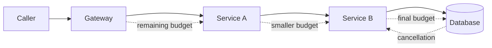

يبدو وضع مهلة لكل استدعاء شبكي تصرفًا مسؤولًا، لكنه لا يمنع مسار الطلب الكامل من الاستمرار مدة أطول بكثير مما يقبل المستخدم أو النظام السابق في السلسلة انتظاره.

تظهر المشكلة عندما تبدأ كل خدمة مؤقتًا جديدًا. تستقبل واجهة برمجية طلبًا هدفه ثانيتان، وتنفق 600 ملي ثانية في العمل المحلي، ثم تمنح خدمة تابعة ثانيتين جديدتين. تكرر الخدمة التابعة الخطأ نفسه. قد يكون الطلب الأصلي قد أُلغي بالفعل، بينما تواصل الطبقات الأدنى استهلاك الاتصالات، وفتحات قاعدة البيانات، والمعالج، وسعة إعادة المحاولة.

يتعامل التصميم الموثوق مع الزمن بوصفه ميزانية واحدة تمتد من بداية الطلب إلى نهايته. تحدد نقطة الدخول مهلة نهائية، ثم تحسب كل قفزة الزمن المتبقي، وتحجز جزءًا كافيًا للتنظيف المحلي وإرجاع الاستجابة، ولا تمرر إلى الأسفل إلا الجزء القابل للاستخدام. ويجب أن يؤدي انتهاء الزمن إلى إلغاء العمل أيضًا، لأن التوقف عن الانتظار من دون إيقاف التنفيذ لا يفعل سوى إخفاء هدر الموارد.

تقدم هذه المقالة هذا التصميم بصفته معمارية مرجعية. وهي تشرح الآليات والاختبارات، ولا تدعي وصف نظام إنتاج بعينه.

## سلسلة من المهلات ليست مهلة نهائية

المهلة المحددة لعملية واحدة هي مدة انتظار محلية. أما المهلة النهائية فهي آخر لحظة تبقى فيها النتيجة الكاملة ذات قيمة. يصبح الفرق جوهريًا بمجرد عبور الطلب أكثر من حد واحد بين الخدمات.

لنفترض أن بوابة الواجهة مطالبة بإرجاع الاستجابة خلال ثانيتين. تستدعي البوابة خدمة الحساب بمهلة مقدارها ثانيتان. تنفذ خدمة الحساب استعلامًا في قاعدة البيانات وتستدعي خدمة السياسات، وتمنح كل عملية ثانيتين أيضًا. تبدو هذه القيم مقبولة إذا نظرنا إلى كل عملية منفردة، لكنها غير متسقة عند النظر إلى المسار الكامل. فقد يتراكم زمن الانتظار في الطوابير، وإنشاء الاتصال، وتفاوض TLS، ومنطق التطبيق، وإعادة المحاولة، والتسلسل عند كل قفزة.

لا يقتصر الفشل هنا على استجابة بطيئة. المشكلة الحقيقية هي استمرار عمل غير محدود بعد زوال قيمة النتيجة. ربما قطع العميل اتصاله، وربما أعادت البوابة خطأ بالفعل، ومع ذلك يظل استعلام قاعدة البيانات واستدعاءان بعيدان قيد التنفيذ لأن مؤقتاتهما المستقلة لم تنته بعد.

يعرّف [دليل المهل النهائية في gRPC](https://grpc.io/docs/guides/deadlines/) المهلة النهائية بأنها النقطة التي لا يعود العميل بعدها راغبًا في انتظار الاستجابة. ويوضح أن الزمن المنقضي يجب أن يُخصم عند تمرير المهلة إلى استدعاء RPC آخر. هذا هو النموذج الصحيح حتى عندما يكون النقل عبر HTTP بدلًا من gRPC.

ينبغي لذلك أن تستقبل الخدمة أحد تمثيلين متكافئين:

1. وقتًا نهائيًا مطلقًا ضمن نطاق ساعة محدد بوضوح.
2. مدة متبقية تُحسب مباشرة قبل إرسال الاستدعاء التالي.

داخل العملية الواحدة، ينبغي استخدام ساعة رتيبة لحساب الزمن المنقضي. أما بين الأجهزة، فلا يصح افتراض تطابق ساعات النظام تطابقًا كاملًا. ويمكن لإطار عمل يحول المهلة النهائية الواردة إلى مدة متناقصة أن يحمي مسار التمرير من انحراف الساعات.

## حدّد الميزانية عند نقطة الدخول

يجب أن تحول أبعد مكوّن موثوق في الخارج توقعات المستدعي إلى مهلة نهائية محدودة على جانب الخادم. قد يكون هذا المكوّن بوابة واجهة برمجية، أو خادم RPC، أو موزع مهام، أو مستهلك رسائل يعمل بعقد إيجار زمني للتنفيذ.

لا ينبغي قبول قيم اعتباطية من المستدعي من دون سياسة. فإذا طلب عميل مهلة مقدارها ثلاثون دقيقة، فلا يجوز أن يحجز موارد الطلب النادرة طوال هذه المدة. وإذا لم يرسل أي حد، فلا ينبغي أن يحصل على زمن غير محدود. تضبط نقطة الدخول الميزانية المطلوبة بين حد أدنى يسمح بعمل مفيد وحد أقصى يحمي الخدمة.

يجب أن تغطي الميزانية الأولية مسار الاستجابة الكامل، لا تنفيذ العمل اللاحق فقط. من الضروري حجز وقت للتسلسل، وإعادة البيانات عبر الشبكة، وتنظيف الموارد، وأي تأكيد يفرضه البروتوكول. فإذا كان لدى مسار HTTP مقدار 1,500 ملي ثانية، فإن منح قاعدة البيانات كامل المدة لا يترك وقتًا لتحويل الخطأ أو دفع الاستجابة إلى الشبكة.



يجب أن يكون الاحتياطي صريحًا وصغيرًا، لا نسبة مبهمة تُنسخ إلى كل خدمة. ويمكن حساب السماح الزمني للاستدعاء الخارج بأخذ أصغر ثلاث قيم: ميزانية الطلب المتبقية بعد طرح الاحتياطي المحلي، والسقف الوقائي الخاص بالخدمة التابعة، ومهلة مشتقة من زمن الاستجابة المرصود لتلك الخدمة. إذا كانت النتيجة أقل من أقصر مدة تسمح بعمل مفيد، فيجب رفض التنفيذ قبل بدء عمل إضافي.

هذا الرفض المبكر ميزة موثوقية، لا مجرد تحسين للأداء. فهو يمنع الطلبات التي يستحيل إنهاؤها في الوقت المتبقي من دخول الطوابير، أو حجز اتصال بقاعدة البيانات، أو توليد حركة إعادة محاولة لا فائدة منها.

## مرّر الزمن المتبقي لا القيمة الأصلية

ينتمي تمرير الميزانية إلى بنية العملاء والخوادم المشتركة، لأن تمريره يدويًا في كل معالج سهل النسيان. يجب أن تحلل برمجية الخادم الوسيطة القيمة الواردة وتتحقق منها، وتنشئ سياق إلغاء، وتوفر دالة رتيبة لحساب الزمن المتبقي. وقبل الإرسال مباشرة، تحسب برمجية العميل الوسيطة الباقي، وتطرح الاحتياطي المضبوط، وترفق النتيجة بالاستدعاء الخارج.

يحدث الحساب في وقت متأخر لسبب مهم. فالقيمة المحسوبة عند بداية المعالج تصبح قديمة بعد الانتظار في الطابور أو تنفيذ الحساب المحلي. يحتاج كل استدعاء لاحق إلى الميزانية المتاحة في لحظة إرساله الفعلية.

يوضح المثال التالي في TypeScript الشكل العام. وهو يستخدم ترويسة تحمل مدة زمنية عمدًا، من دون افتراض بروتوكول عام يصلح لكل الأنظمة. فأسماء الترويسات الداخلية، وحدود الثقة، والقيم القصوى قرارات خاصة بكل نظام.

```ts
const MAX_REQUEST_MS = 5_000
const RESPONSE_RESERVE_MS = 75

async function callDependency(
  request: Request,
  remainingMs: () => number
): Promise<Response> {
  const usableMs = Math.min(
    MAX_REQUEST_MS,
    remainingMs() - RESPONSE_RESERVE_MS
  )

  if (usableMs <= 0) {
    throw new Error("deadline_exceeded_before_dispatch")
  }

  const controller = new AbortController()
  const timer = setTimeout(() => controller.abort(), usableMs)

  try {
    return await fetch(request, {
      signal: controller.signal,
      headers: {
        ...Object.fromEntries(request.headers),
        "x-request-timeout-ms": String(usableMs)
      }
    })
  } finally {
    clearTimeout(timer)
  }
}
```

يربط التنفيذ الملائم للإنتاج إشارة الإيقاف الخارجة بإشارة الإلغاء الواردة أيضًا. فإذا قطع المستدعي الاتصال قبل نهاية المؤقت، ينبغي إلغاء العمل اللاحق فورًا. تختلف السلوكيات الافتراضية بين أطر العمل، ولذلك يجب إثبات التمرير والإلغاء باختبارات تكامل صريحة بدل الاعتماد على الافتراض.

## يجب أن يصل الإلغاء إلى العمل الفعلي

إرجاع خطأ مهلة لا يلغي استعلام SQL، ولا ينهي عملية فرعية، ولا يوقف رفع ملف إلى مخزن كائنات، ولا يوقف استدعاء استدلال لنموذج. إنه يوقف طبقة واحدة عن الانتظار فحسب. يجب أن تدعم العملية الأساسية الإلغاء، أو أن يفحص التطبيق إشارة الإلغاء دوريًا ويخرج بطريقة آمنة.

يفسر هذا الفرق كثيرًا من حالات الانهيار المتسلسل تحت الضغط. يرتفع زمن الاستجابة، وتنتهي مهلة العملاء، لكن الخوادم تواصل تنفيذ العمل الذي فقد قيمته. تصل طلبات جديدة بينما ما زالت الطلبات القديمة تشغل الخيوط، والاتصالات، والذاكرة، ومواضع الطوابير. ثم تضيف إعادة المحاولة حملًا جديدًا. يناقش كتاب Google SRE عن [الأعطال المتسلسلة](https://sre.google/sre-book/addressing-cascading-failures/) الهدر الناتج عندما تنفق الخوادم موارد على طلبات لم يعد في إمكانها بلوغ مهلة عملائها.

ينبغي أن تعبر إشارة الإلغاء كل حد للموارد يستطيع تنفيذها:

1. إلغاء عميل HTTP أو RPC.
2. إلغاء تعليمة قاعدة البيانات نفسها، لا الوعد البرمجي الذي ينتظرها فقط.
3. إيقاف المهام الفرعية التي بدأها الطلب.
4. تحرير الأقفال المنطقية، واتصالات التجمع، والملفات المؤقتة في مسارات `finally`.
5. منع المعالج الملغى من تثبيت أثر، ما لم توجد سياسة واعية تفرض إكمال العملية.

ليست كل عملية قابلة للإيقاف بأمان. ربما تجاوز أمر دفع أو انتقال حالة نقطة التثبيت قبل وصول الإلغاء. في هذه الحالة يعني الإلغاء أن المستدعي توقف عن الانتظار، ولا يعني أن العملية لم تحدث. تحتاج الواجهة إلى مفاتيح تمنع تكرار الأثر، وحالة دائمة للعملية، وآلية تسوية تسمح لطلب لاحق بمعرفة النتيجة الحقيقية.

## تستهلك إعادة المحاولة الميزانية نفسها

لا تعيد محاولة جديدة ضبط المهلة النهائية. فكل محاولة، وتأخير تراجعي، وإنشاء اتصال، وانتظار استجابة يستهلك الجزء نفسه من الميزانية الشاملة.

ينتج عن ذلك شرط قبول بسيط: لا تبدأ محاولة أخرى إلا إذا كان الزمن المتبقي يكفي لتأخير التراجع، ومدة واقعية للمحاولة، واحتياطي الاستجابة. إذا لم يكف، فأعد أفضل خطأ متاح فورًا. إن إطلاق محاولة جديدة مع بقاء 20 ملي ثانية تجاه خدمة يبلغ زمنها الطرفي المعتاد 80 ملي ثانية يضيف حملًا من دون فرصة نجاح معقولة.

يشرح مقال AWS عن [المهل وإعادة المحاولة والتراجع وإضافة العشوائية](https://aws.amazon.com/builders-library/timeouts-retries-and-backoff-with-jitter/) قيدين مهمين. ينبغي اشتقاق المهلة من زمن الاستجابة المقاس للخدمة التابعة ومن النسبة المقبولة للمهلات الخاطئة، كما أن إعادة المحاولة قد تزيد سوء خدمة مثقلة أصلًا. يربط تمرير المهلة النهائية هذه الممارسات المحلية بمسار الطلب الكامل.

يجب كذلك أن تكون ملكية إعادة المحاولة واضحة ومفردة. إذا نفذت البوابة والخدمة ومكتبة SDK ومشغل قاعدة البيانات ثلاث محاولات لكل منها، فقد تتحول عملية مستخدم واحدة إلى عدد كبير من استدعاءات الخلفية. ينبغي اختيار الطبقة التي تملك معلومات كافية عن سلامة العملية وقيمة النتيجة المتبقية، وتعطيل إعادة المحاولة في الطبقات الأخرى أو تقييدها بشدة.

ولا تُعاد إلا العمليات المعروفة بأنها آمنة عند التكرار. انتهاء المهلة نتيجة ملتبسة؛ فقد تكون الخدمة التابعة نفذت العملية بينما ضاعت الاستجابة. لذلك تعد مفاتيح منع التكرار أو قراءة الحالة بعد انتهاء المهلة جزءًا من عقد إعادة المحاولة، وليست إضافة اختيارية.

## اشتق الحدود من القياس ثم أضف سياسة واضحة

لا توجد مهلة واحدة صحيحة لكل الأنظمة. البداية هي الهدف الذي له معنى خارجيًا وتوزيعات زمن الاستجابة المقاسة، ثم تُراجع مكونات المسار كله.

لكل خدمة تابعة، يجب قياس زمن إنشاء الاتصال، وزمن الطلب، وزمن الطابور، والزمن الطرفي بصورة منفصلة. فالمدة الإجمالية الواحدة قد تخفي DNS أو TLS أو انتظار اتصال من التجمع أو الاصطفاف داخل وكيل. ويجب التأكد بدقة مما تغطيه خاصية المهلة في مكتبة العميل. بعض الخيارات يغطي قراءة المقبس فقط، وبعضها يشمل إنشاء الاتصال والتحويلات، وقد يختلف دعم الإلغاء مرة أخرى.

تحدد القياسات سقفًا واقعيًا لكل محاولة، لكن المهلة الشاملة تظل السلطة النهائية. قد تحتاج خدمة سريعة إلى 40 ملي ثانية عادة، لكنها لا تحصل إلا على 15 لأن العمل السابق استهلك الميزانية. لا ينبغي بدء الاستدعاء لمجرد أن مهلة ثابتة في الإعدادات تساوي 100 ملي ثانية.

وتحدد السياسة أيضًا أقل ميزانية تسمح بعمل مفيد. يمكن تخفيض جودة بعض الأعمال: حذف توصية اختيارية، أو تقديم بيانات مخبأة أقدم قليلًا، أو إرجاع نتيجة جزئية. ويجب أن يفشل نوع آخر من العمل بطريقة مغلقة. ينبغي اتخاذ هذا القرار عند حد يفهم دلالة العمل، لا داخل أداة عامة لحساب المهلة.

يتطلب الزمن الطرفي اهتمامًا خاصًا. المهلة المبنية على المتوسط تفشل في الظروف التي نحتاج فيها الحماية تحديدًا. يجب مقارنة الشرائح المئوية حسب المسار، والمنطقة، وحجم الحمولة، وحالة إعادة استخدام الاتصال. كما ينبغي أن تتضمن اختبارات الحمل اتصالات باردة وخدمات تابعة مقيدة، لا الحالة المستقرة الدافئة فقط.

## راقب استهلاك الميزانية على امتداد المسار

المقاييس التي تعد أخطاء المهلة النهائية فقط متأخرة وسطحية. المطلوب هو رصد تغير الميزانية أثناء عبور الطلب للنظام.

تتضمن سمات المقاطع والمقاييس المفيدة ما يلي:

1. الميزانية التي استلمتها كل خدمة.
2. الزمن المتبقي قبل كل استدعاء تابع وبعده.
3. زمن الطابور والمعالجة محليًا.
4. الاحتياطي المضبوط والسقف الخاص بالخدمة التابعة.
5. مصدر الإلغاء: قطع اتصال العميل، أو مهلة محلية، أو إلغاء قادم من الأعلى.
6. العمل الذي اكتمل بعد إطلاق إشارة الإلغاء.
7. محاولات أُلغيت قبل البدء بسبب نقص الميزانية.
8. مرحلة انتهاء المهلة: انتظار التجمع، أو الاتصال، أو TLS، أو الطلب، أو تنفيذ قاعدة البيانات، أو الاستجابة.

لا ينبغي وضع أوقات نهائية مطلقة في تسميات مقاييس عالية التعدد. يسهل تجميع المدد ورموز الأسباب المحدودة. ويمكن للتتبعات الاحتفاظ بتفاصيل كل طلب ضمن ضوابط الخصوصية والاحتفاظ المعتادة.

تميّز لوحة التشغيل الجيدة بين خدمة تابعة بطيئة ومستدعٍ يرسل ميزانيات غير واقعية؛ فهما حادثتان مختلفتان. ويجب أن تكشف أيضًا الخدمات التي تستهلك معظم ميزانيتها قبل أول استدعاء لاحق، لأن تمرير الميزانية لا يستطيع وحده إصلاح الانتظار المحلي المفرط.

## اختبر انتهاء الزمن عند كل حد

التعامل مع المهلة سلوك فشل، ولذلك لا تكفي اختبارات المسار السعيد. يجب أن تستهلك عملية التحقق الميزانية أو تنهيها عمدًا عند نقاط يمكن التحكم فيها.

ينبغي أن تشمل الاختبارات الحالات الآتية على الأقل:

1. لا يرسل المستدعي مهلة: يطبق الخادم حده الافتراضي الأقصى.
2. يرسل المستدعي مهلة مفرطة: يضبطها الخادم عند السقف.
3. تنتهي الميزانية في الطابور المحلي: لا يبدأ أي استدعاء لاحق.
4. تنتهي أثناء RPC: يلغي العميل الاستدعاء ويرى الخادم الإلغاء.
5. تنتهي أثناء استعلام قاعدة البيانات: تُلغى التعليمة ويبقى الاتصال صالحًا لإعادة الاستخدام.
6. يقطع العميل الاتصال مبكرًا: يتوقف العمل الفرعي قبل المهلة المضبوطة.
7. تفشل المحاولة الأولى: لا تبدأ محاولة أخرى إلا إذا كفت الميزانية.
8. تُثبت العملية بالتزامن مع الإلغاء: تكشف التسوية النتيجة الدائمة.
9. تختلف ساعات الخدمات: لا تزداد المدة المتبقية عند تمريرها.
10. يرتفع الحمل بسرعة: ينخفض العمل الذي فقد قيمته بدل أن يتراكم خلف طلبات انتهت مهلتها.

الاختبار الأخير هو البرهان التشغيلي. لا ينجح تصميم المهلة لمجرد أن العملاء يتلقون الأخطاء بسرعة. ينجح عندما تتوقف الطلبات المنتهية عن استهلاك الموارد النادرة، وتظل إعادة المحاولة محدودة، ويتعافى النظام بدل أن يضاعف الضغط على نفسه.

## خلاصة عملية

المهل المحلية لكل قفزة ضرورية، لكنها ليست عقدًا شاملًا لزمن الاستجابة. يبدأ العقد بمهلة نهائية واحدة محدودة، ثم يتحول إلى ميزانية متناقصة كلما تحرك الطلب داخل النظام.

يحدد التصميم الكامل الميزانية عند الحافة الموثوقة، ويخصم الزمن المنقضي قبل كل إرسال، ويحجز وقتًا للاستجابة والتنظيف، ويمرر الإلغاء إلى العمل الحقيقي، ويجعل إعادة المحاولة تستهلك السماح المتبقي نفسه. كما يشتق السقوف من زمن الاستجابة المقاس، مع إبقاء سياسة العمل مسؤولة عن خفض الجودة أو الفشل.

والأهم هو اختبار تحرير الموارد، لا تسليم الخطأ فقط. عندما لا تعود النتيجة ذات قيمة للمستدعي، ينبغي للنظام أن يوقف أكبر قدر ممكن من العمل المرتبط بها من دون الإخلال بالسلامة. عندها فقط تتحول المهلة من استثناء محلي إلى آلية موثوقية حقيقية.
