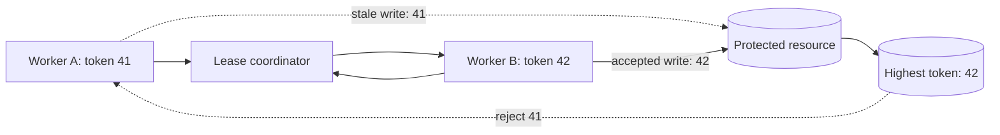

يستطيع القفل الموزع إخبار عاملين بمن يحق له العمل الآن. لكنه لا يستطيع الدخول إلى عملية متوقفة مؤقتًا وسحب عمل بدأ تنفيذه بالفعل.

ينشأ من هذا الفرق فشل خطير. يحصل العامل A على القفل، ثم يتوقف مدة تكفي لانتهاء عقد الإيجار الخاص به. يحصل العامل B على القفل نفسه ويبدأ عملًا صالحًا. يستأنف A التنفيذ لاحقًا ويكتب في المورد المحمي اعتمادًا على صلاحية لم تعد موجودة. من وجهة نظر خدمة القفل، انتقلت الملكية بصورة صحيحة. لكن المورد تلقى آثارًا من مالكين مختلفين.

تحدد مدة الانتهاء مقدار انتظار العاملين الآخرين، لكنها لا تجعل العمليات القديمة آمنة. لذلك يحتاج التصميم الحساس للصحة إلى آلية ثانية: تمنح كل عملية استحواذ ناجحة رمز تسوير متزايدًا بصرامة، ويرفض المورد المحمي أي عملية تحمل رمزًا أقدم من أعلى رمز قبله سابقًا.

تشرح هذه المقالة الآلية بصفتها معمارية مرجعية. وهي تعرض قرارات تصميم واختبارات فشل عامة، ولا تدّعي وصف نظام إنتاج بعينه.

## عقد الإيجار لا يسحب الصلاحية من عميل متوقف

عقد الإيجار ملكية محدودة بالزمن. يجدده المالك ما دام العمل مستمرًا. وإذا توقف التجديد، يستطيع مشارك آخر الحصول على القفل بعد انتهاء المدة. تفيد هذه الآلية في ضمان استمرار التقدم، لأن العامل المتعطل لا يستطيع حجز النظام إلى الأبد.

المشكلة غير المحلولة هي أن المالك القديم قد يكون بطيئًا لا ميتًا. يمكن لتوقف بيئة التشغيل، أو حرمان العملية من وقت المعالج، أو انقسام الشبكة، أو انتظار الإدخال والإخراج، أو ازدحام حلقة الأحداث أن يمنع التجديد مع بقاء العملية قادرة على الاستئناف. كما أن الساعة المحلية لا تثبت الملكية. قد يعتقد العامل أن عقده ما زال صالحًا، بينما يكون المنسق قد أنهى العقد ومنح عقدًا جديدًا.

يتكون مسار الفشل من خطوات واضحة:

1. يحصل العامل A على عقد ويبدأ حساب عملية كتابة.
2. يتوقف A مدة تتجاوز مدة العقد.
3. ينهي المنسق عقد A.
4. يحصل العامل B على القفل ويحفظ نتيجة أحدث.
5. يستأنف A التنفيذ ويحفظ نتيجته الأقدم.

تفوز آخر كتابة رغم أنها صدرت من مالك غير صالح. لا يحل تمديد العقد المشكلة؛ فهو يزيد فقط مدة التوقف اللازمة لظهورها. ولا يمكن ضبط مهلة مثالية، لأن توقف العمليات وتأخير الشبكة لا يملكان حدًا أعلى موثوقًا.

يوضح تحليل Martin Kleppmann حول [distributed locking](https://martin.kleppmann.com/2016/02/08/how-to-do-distributed-locking.html) مشكلة العميل القديم هذه، ويبين أن القفل المستخدم لحماية الصحة يحتاج إلى تسوير عند حدود التخزين. لذلك لا يكفي سؤال «من يملك القفل؟». يجب أيضًا سؤال «هل يستطيع المورد تمييز المالك الأحدث من كل مالك سبقه؟»

## افصل الملكية عن صلاحية الكتابة

لمنسق القفل وللمورد المحمي مسؤوليتان مختلفتان.

يسلسل المنسق عمليات الاستحواذ ويصدر رمزًا متزايدًا رتيبًا. يرسل العامل الرمز مع كل عملية محمية. يحتفظ المورد بأعلى رمز قبله ويرفض القيم الأصغر. تظل الملكية مؤقتة، بينما تصبح صلاحية الكتابة مرتبة.



لنفترض أن A يحمل الرمز 41، ثم حصل B على الرمز 42. إذا وصلت كتابة B أولًا، يسجل المورد القيمة 42. وعندما تصل كتابة A المتأخرة بالرمز 41، يستطيع المورد رفضها حتى لو ظل A يعمل، وحتى لو لم يعرف قط أن عقده انتهى.

هذه الحماية أقوى من فحص قيمة عشوائية للقفل عند تحريره. تمنع القيمة الفريدة عميلًا من حذف قفل Redis يخص عميلًا آخر، ولهذا توصي [وثائق Redis للأقفال الموزعة](https://redis.io/docs/latest/develop/clients/patterns/distributed-locks/) بمقارنة القيمة المخزنة قبل الحذف. لكن التفرد لا يرتب المالكين. لا يستطيع المورد معرفة هل المعرّف العشوائي X أقدم أم أحدث من Y. يحتاج التسوير إلى رمز مرتب.

يجب تطبيق القاعدة في الموضع الذي يصبح فيه الأثر دائمًا. الفحص داخل العامل وحده معرض لمشكلة التوقف نفسها: قد يجتاز العامل الفحص، ثم يتوقف، ويفقد الملكية، ويستأنف الكتابة لاحقًا.

## أنشئ رموز التسوير من حالة مرتبة

يحتاج مولد الرموز إلى خاصية أساسية واحدة: يجب أن تتبع قيم عمليات الاستحواذ الناجحة الترتيب الذي سلسل به المنسق الملكية. الفجوات مقبولة، أما التكرار أو الرجوع إلى قيمة أصغر فغير مقبول.

يمكن لمنسق قائم على الإجماع توفير هذا الترتيب من حالته. تربط [واجهة التزامن في etcd](https://etcd.io/docs/v3.6/dev-guide/api_concurrency_reference_v3/) ملكية Mutex بمفاتيح منشأة تحت عقد إيجار، كما توفر مساحة المفاتيح ذات المراجعات حالة مرتبة يمكن استخدامها بعناية مصدرًا للتسوير. يجب أن يتبع الربط ضمانات العميل المختار، لا أن يفترض أن كل معرّف لعقد الإيجار متزايد تلقائيًا.

ويمكن لمنسق مبني على قاعدة بيانات تخصيص الرموز من Sequence ضمن بروتوكول الاستحواذ نفسه. توثق PostgreSQL أن [`nextval`](https://www.postgresql.org/docs/current/functions-sequence.html) ذرية بين الجلسات المتزامنة، وأن قيم Sequence لا تعاد عند إلغاء المعاملة. تناسب هذه الفجوات التسوير، لأن المطلوب أن تتزايد الرموز لا أن تكون متصلة بلا انقطاع.

يمكن تمثيل سجل الاستحواذ بالشكل التالي:

```sql
CREATE TABLE resource_fence (
  resource_id text PRIMARY KEY,
  highest_token bigint NOT NULL,
  owner_id text NOT NULL,
  lease_expires_at timestamptz NOT NULL,
  updated_at timestamptz NOT NULL DEFAULT now()
);
```

يجب أن يشكل تخصيص الرمز والاستحواذ على العقد بروتوكولًا متماسكًا. لا ينبغي تخصيص رمز ثم فشل الاستحواذ ثم كشف ذلك الرمز بالخطأ على أنه صلاحية سارية. الفجوة في الأرقام لا تضر، لكن صلاحية بلا ملكية تضر.

الطابع الزمني بديل ضعيف. قد تتغير ساعات الحائط أو تختلف بين الأجهزة، وقد تنشئ القيم المتساوية ترتيبًا ملتبسًا. يصلح UUID العشوائي للهوية، لكنه لا يعبر عن الأقدم والأحدث. يجب أن يأتي الرمز من حالة يسلسلها المنسق، لا من ساعة العامل.

## طبّق الرمز عند حدود المورد

لا ينجح التسوير إلا إذا استطاع النظام المستهدف مقارنة ترتيب الرموز وحفظه ذريًا مع الأثر المحمي.

عند تحديث صف في PostgreSQL، يمكن لعملية مشروطة جمع المقارنة والكتابة:

```sql
UPDATE account_projection
SET balance = $1,
    last_fencing_token = $2,
    updated_at = now()
WHERE account_id = $3
  AND last_fencing_token < $2;
```

إذا كان عدد الصفوف المعدلة صفرًا، فعلى العامل تفسير النتيجة بوصفها ملكية قديمة، لا خطأ مؤقتًا في قاعدة البيانات يعاد بلا تفكير. يحتاج الصف الأول إلى حد أدنى معروف للرمز. ويجب أن يستخدم كل مسار يغير الحالة المحمية القاعدة نفسها؛ إذ يكفي سكربت إداري واحد بلا تسوير لكسر الثابت.

في سجل Append-only، يمكن إدخال الرمز في شرط تفاؤلي أو قيد تفرد. وفي Queue، يمكن لعملية Compare-and-set تحديث الرمز المقبول مع حالة المهمة. أما API خارجية لا تستطيع مقارنة الرموز، فلا يمنحها القفل وحده ضمان صحة قويًا. قد تمر العملية عبر بوابة تملك حالة تسوير دائمة، أو تستخدم شروط الإصدار في النظام الهدف، أو يعاد تصميمها بوصفها سير عمل آمنًا عند التكرار وله آلية مطابقة.

تتوقف تصاميم أقفال كثيرة مبكرًا عند هذه النقطة. فهي تثبت أن الاستحواذ حصري داخل Redis أو etcd، لكنها لا توضح كيف سترفض قاعدة البيانات أو Object Store أو الجهاز أو خدمة الطرف الثالث مالكًا متأخرًا. إذا تعذر على المورد فرض الترتيب، فالوصف الدقيق هو تنسيق يقلل التداخل، لا ضمان كامل للصحة.

## التجديد والتحرير وافتراضات الساعة

لا يلغي التسوير الحاجة إلى إدارة سليمة لعقد الإيجار. لكنه يحد من الضرر عندما تخسر إدارة العقد سباقًا زمنيًا.

لا يجدد العقد إلا إذا كان المنسق ما زال يعترف بسجل الملكية نفسه. ويجب ألا يعيد تجديد متأخر إحياء عقد منتهٍ بعد أن حصل مالك آخر على رمز أحدث. أما التحرير فيجب أن يفحص المالك وأن يكون آمنًا عند التكرار. ينبغي للعميل الذي فقد الملكية إيقاف عمله المحلي عندما يستطيع، لكن صحة النظام لا يجوز أن تعتمد على وصول الإلغاء في الوقت المناسب.

مدة العقد مفاضلة تشغيلية. تسرع العقود القصيرة الاستعادة، لكنها تزيد حركة التجديد واحتمال الانتهاء الكاذب أثناء التوقفات. تقلل العقود الطويلة الاضطراب، لكنها تؤخر الاستحواذ بعد التعطل. يجب قياس زمن الاستحواذ، وزمن التجديد، وفقدان العقود، ومدة العمل، ورفض الكتابات القديمة قبل تعديل القيمة.

ويجب توثيق افتراضات الوقت. قد يستخدم المنسق الوقت لتحديد انتهاء العقد، لكن العامل لا يمنح نفسه الصلاحية اعتمادًا على ساعة الحائط المحلية. توضح [كائنات Lease في Kubernetes](https://kubernetes.io/docs/reference/kubernetes-api/coordination/lease-v1/) كيف تمثل الأنظمة الموزعة هوية المالك ووقت التجديد والمدة لأغراض التنسيق. هذه حالة مفيدة، لكنها لا تغني عن بروتوكول واضح عند تأخر الملاحظات.

## صمّم سلوك الفشل بصورة صريحة

رفض كتابة قديمة قرار سلامة ناجح، لكن سير العمل المحيط به يحتاج إلى نتيجة محددة.

لا ينبغي للعامل القديم إعادة العملية نفسها بالرمز نفسه؛ فقد خسر الصلاحية. عليه تسجيل نتيجة منظمة مثل `stale_fencing_token`، وإيقاف العمل التابع، وترك تحديد الحالة النهائية للمالك الحالي أو لعملية مطابقة. أما إعادة الاستحواذ فتنشئ عملية جديدة، ولا تصح إلا إذا سمح منطق العمل بذلك.

يجب أن ينتبه المالك الجديد أيضًا إلى الآثار الجزئية. إذا امتد العمل عبر عدة موارد، فإن كتابة مسورة في قاعدة البيانات لا تسور تلقائيًا رسالة بريد أو تحديث Object Store أو طلبًا بعيدًا. تحتاج كل حدود دائمة إلى فرض إصدار متوافق، أو أمان عند التكرار، أو مطابقة تعويضية. ووصف سير العمل كله بأنه «محمي بقفل» يخفي هذه العقود المنفصلة.

تشمل القياسات المفيدة انتظار الاستحواذ، وعمر العقد، وفشل التجديد، والرمز الحالي، وأعلى رمز رآه المورد، وعدد العمليات القديمة المرفوضة، والعمل الذي اكتمل بعد طلب الإلغاء المحلي. وينبغي أن تتضمن السجلات هوية المورد والمالك والرمز والتتبع من دون كشف حمولة حساسة.

قد يكون التنبيه على كل رفض قديم مزعجًا أثناء اختبارات الفشل المقصودة، لكن الزيادة غير المتوقعة إشارة مهمة. فقد تدل على توقفات طويلة في Runtime، أو منسق مثقل، أو شبكة متأخرة، أو كود يواصل التنفيذ بعد إشعار فقدان العقد.

## اختبر المالك القديم، لا مجرد التنافس

اختبار يتنافس فيه عشرة عمال ويحصل واحد فقط على القفل يثبت المسار السهل وحده. أما الاختبارات الحاسمة فتجعل الزمن والترتيب عدائيين:

1. أوقف A بعد الاستحواذ، واترك عقده ينتهي، ودع B يثبت كتابته، ثم استأنف A واشترط رفضه.
2. أخّر كتابة A على الشبكة حتى تصل كتابة B الأحدث إلى المورد.
3. سلّم رسائل التجديد والتحرير بعد الانتهاء، وتأكد من أنها لا تغير ملكية B.
4. ألغ الاستحواذ بعد تخصيص الرمز، وتأكد من أن الفجوة لا تمنح صلاحية.
5. أعد تشغيل المنسق، وتحقق من بقاء ترتيب الرموز وفق نموذج المتانة الموثق له.
6. أرسل كتابات متزامنة بالرمز نفسه، واختبر سلوك أمان عملية العمل عند التكرار.
7. نفذ كل مسار بديل للكتابة، وتأكد من أن أيًا منها لا يتجاوز فحص الرمز.
8. افصل العامل عن المنسق مع إبقاء اتصاله بالمورد حيًا.

يجب أن تتحقق هذه الاختبارات من الحالة الدائمة للمورد، لا من سجلات خدمة القفل فقط. الثابت المطلوب هو أنه بعد قبول الرمز 42، لا يمكن للرمز 41 تغيير الحالة المحمية أبدًا.

## دليل قرار عملي

استخدم قفلًا بسيطًا منتهي الصلاحية عندما يكون التداخل مشكلة كفاءة، ويكون تكرار العمل غير ضار أو آمنًا عند التكرار أصلًا. قد يشمل ذلك تحديث Cache أو تنظيفًا بأفضل جهد، حيث يستهلك التكرار موارد لكنه لا يفسد الحالة.

أضف التسوير عندما يستطيع التداخل القديم انتهاك الصحة، ويستطيع المورد رفض الرموز الأقدم ذريًا. يتكون التصميم الكامل من خمسة أجزاء:

1. منسق يسلسل الملكية.
2. عقد إيجار قابل للتجديد لضمان التقدم.
3. رمز متزايد لكل استحواذ ناجح.
4. مقارنة عند المورد تحفظ مع الأثر المحمي.
5. اختبارات فشل توقف المالك القديم وتتحقق من رفضه.

إذا كان المورد النهائي عاجزًا عن فرض ترتيب الرموز، فيجب التصريح بذلك. استخدم الأمان عند التكرار، أو الإصدارات التفاؤلية، أو بوابة تسلسل، أو المطابقة وفق طبيعة الأثر. القفل الموزع أداة تنسيق، وليس جهاز تحكم عن بعد في العمليات.

تسمح مدة الانتهاء للنظام بمتابعة العمل. ويمنع التسوير النظام من قبول الماضي بعد أن انتقل إلى مالك أحدث.
