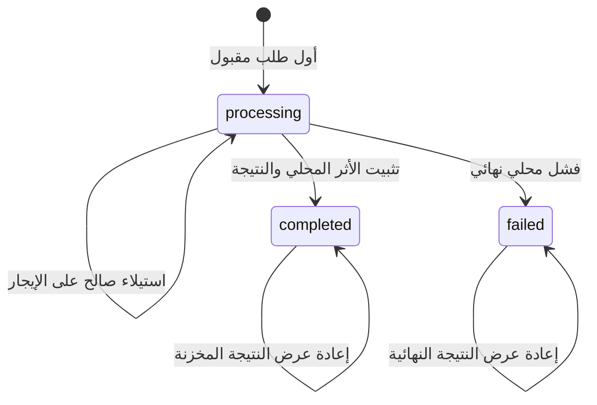

لا يعني انتهاء المهلة للعميل أن العملية فشلت؛ بل يعني فقط أن العميل توقف عن الانتظار.

ربما رفض الخادم الطلب، أو ثبّت التغيير، أو ثبّته ثم فقد الاستجابة. وقد تؤدي إعادة محاولة طلب `POST` خلال نافذة عدم اليقين هذه إلى إنشاء طلب شراء أو عملية تحصيل أو مهمة أو عملية نشر ثانية. أما رفض إعادة المحاولة، فيحوّل عطلًا عابرًا في الشبكة إلى فشل يراه المستخدم.

لا يزيل مفتاح عدم التكرار هذا الغموض إلا حين يعامله الخادم بوصفه هوية عملية منطقية واحدة. فالتصميم الموثوق ليس عملية بحث في ذاكرة تخزين مؤقت تحيط بمعالج الطلب، بل آلة حالات دائمة لها ملكية ذرية، وتحقق من الطلب، ونتيجة مستقرة، وتعافٍ صريح، وعقد للاحتفاظ بالبيانات.

تطوّر هذه المقالة ذلك التصميم المرجعي من دون الادعاء بوجود تنفيذ إنتاجي محدد.

## حدّد الضمان قبل اختيار مخزن البيانات

يصف HTTP الطريقة بأنها آمنة عند التكرار حين يكون للطلبات المتطابقة المتعددة الأثر المقصود نفسه الذي يتركه طلب واحد. وتتمتع `PUT` و`DELETE` بدلالات عدم التكرار، بينما لا يقدم `POST` هذا الضمان افتراضيًا ([RFC 9110، القسم 9.2.2](https://www.rfc-editor.org/rfc/rfc9110.html#name-idempotent-methods)). ويمكن لواجهة API أن تجعل طلب `POST` بعينه آمنًا عند إعادة المحاولة بإضافة دلالات على مستوى التطبيق، لكن العقد يحتاج إلى حدود واضحة.

من العقود المفيدة:

> لكل متصل موثّق وعملية ومفتاح عدم تكرار، تنفذ الخدمة طلبًا منطقيًا مقبولًا واحدًا على الأكثر خلال نافذة الاحتفاظ، وتعيد تمثيلًا مستقرًا لنتيجته عند إعادة المحاولة.

لكل قيد في هذه العبارة أهميته.

- **المتصل:** يستطيع مستأجران إنشاء المفتاح العشوائي نفسه بأمان.
- **العملية:** ينبغي ألا يتعارض المفتاح نفسه في `POST /orders` و`POST /refunds`.
- **الطلب المقبول:** ليس ضروريًا أن يحجز الإدخال غير الصحيح مفتاحًا إلى الأبد.
- **الطلب المنطقي:** يمثّل المفتاح القصد، لا مجرد وحدات بايت متطابقة.
- **نافذة الاحتفاظ:** بعد إزالة السجل، يزول الضمان السابق.
- **التمثيل المستقر:** ينبغي ألا تفاجئ إعادة المحاولة المتصل بأثر ثانٍ أو استجابة لا صلة لها بالطلب.

تصف AWS معرّفات الطلب التي يقدمها المتصل بأنها وسيلة للتعبير عن القصد بدلًا من استنتاج التكرار من تطابق المعاملات ([جعل عمليات إعادة المحاولة آمنة باستخدام واجهات API آمنة عند التكرار](https://aws.amazon.com/builders-library/making-retries-safe-with-idempotent-APIs/)). ويمنع هذا التمييز دمج عمليتين مشروعتين تبدوان متطابقتين عن طريق الخطأ.

## مثّل المفتاح بوصفه حالة

تخزّن ذاكرة التخزين المؤقت عادةً `key -> response` بعد اكتمال العمل. لكن ذلك يفوّت أهم فترة: قد يصل طلبان بالمفتاح نفسه بالتزامن قبل وجود أي استجابة، فيلاحظ كلاهما عدم وجود قيمة وينفذان معًا.

يجب أن يوجد سجل قاعدة البيانات قبل بدء أثر العمل، وأن يكون إنشاؤه ذريًا. وفي ما يلي نموذج موجز في PostgreSQL:

```sql
CREATE TYPE idempotency_state AS ENUM (
  'processing', 'completed', 'failed'
);

CREATE TABLE idempotency_requests (
  tenant_id text NOT NULL,
  operation text NOT NULL,
  idempotency_key text NOT NULL,
  request_hash text NOT NULL,
  state idempotency_state NOT NULL,
  status_code integer,
  response_body jsonb,
  resource_id text,
  owner_token uuid,
  lease_expires_at timestamptz,
  created_at timestamptz NOT NULL DEFAULT now(),
  completed_at timestamptz,
  expires_at timestamptz NOT NULL,
  PRIMARY KEY (tenant_id, operation, idempotency_key)
);
```

المفتاح الأساسي هو أداة التحكم في التزامن. توضح وثائق PostgreSQL أن `INSERT ... ON CONFLICT` يستطيع تنفيذ إجراء بديل عند التعارض مع قيد تفرد ([تعليمة `INSERT` في PostgreSQL](https://www.postgresql.org/docs/current/sql-insert.html)). ولا تكفي آلية «تحقق ثم أدرج» على مستوى التطبيق، لأن معاملة أخرى تستطيع التصرف بين هاتين التعليمتين.

انتقالات الحالة قليلة:



انتقال الإيجار اختياري. وإذا وُجد، فهو يحتاج إلى أكثر من طابع زمني؛ إذ يجب منع العمّال ذوي الملكية القديمة من التثبيت بعد استيلاء مالك جديد.

## اربط المفتاح بالطلب

قد يعيد العميل استخدام مفتاح بمعاملات مختلفة عن طريق الخطأ. وستجعل إعادة النتيجة الأولى الطلب الثاني يبدو ناجحًا، مع أن الخادم تجاهل قصده الجديد.

خزّن مع المفتاح بصمة معيارية للطلب. ويمكن أن تشمل العملية والمستأجر والمتن المطبع وأي ترويسات دلالية تؤثر في النتيجة، مع استبعاد ضجيج النقل مثل ترويسات التتبع. ويجب أن يكون التوحيد المعياري حتميًا؛ وإلا فقد ينتج ترتيب مفاتيح JSON، والقيم الافتراضية المحذوفة، وتمثيل الأرقام، والتعامل مع Unicode حالات عدم تطابق زائفة.

عند كل إعادة محاولة:

1. أعد حساب البصمة.
2. حمّل سجل عدم التكرار.
3. ارفض الطلب إذا اختلفت البصمة المخزنة.
4. إذا تطابقتا، فتابع وفق الحالة المخزنة.

توثّق Stripe قاعدة السلامة نفسها؛ إذ تقارن المعاملات الواردة بالطلب الأصلي وتعيد خطأً عند استخدام المفتاح نفسه مع معاملات مختلفة ([الطلبات الآمنة عند التكرار](https://docs.stripe.com/api/idempotent_requests)). وينبغي أن يكون المفتاح نفسه معتمًا وعالي الإنتروبيا. لا تضمّن عنوان بريد إلكتروني أو رقم حساب أو قيمة حساسة أخرى في السجلات والفهارس.

## أبقِ الأثر المحلي في المعاملة نفسها

يتاح أقوى تنفيذ حين يوجد سجل عدم التكرار وحالة العمل في قاعدة البيانات المعاملية نفسها.

```ts
await db.transaction(async (tx) => {
  const claim = await tx.claimIdempotencyKey({
    tenantId,
    operation: "create-order",
    key,
    requestHash,
    expiresAt
  })

  if (claim.kind === "mismatch") throw new KeyReuseError()
  if (claim.kind === "completed") return claim.storedResponse
  if (claim.kind === "processing") throw new RequestInProgressError()

  const order = await tx.orders.create(command)
  const response = { orderId: order.id, state: order.state }

  await tx.completeIdempotencyKey({
    tenantId,
    operation: "create-order",
    key,
    requestHash,
    statusCode: 201,
    response,
    resourceId: order.id
  })

  return response
})
```

تخفي الشيفرة الكاذبة تفاصيل قاعدة البيانات، لكن الحد واضح: تُثبّت المطالبة بالمفتاح، وتغيير حالة العمل، وتخزين النتيجة المستقرة معًا. ولا يترك التعطل قبل التثبيت أيًا منها، بينما يتركها التعطل بعده كلها، فتستطيع إعادة المحاولة عرض النتيجة مجددًا.

لا تُبقِ المعاملة مفتوحة خلال استدعاء بطيء لواجهة API خارجية. فحينها تصبح أقفال قاعدة البيانات واتصالاتها وإعادات المحاولة مرتبطة بزمن استجابة نظام آخر. وإذا كانت العملية المنطقية تشمل أثرًا خارجيًا، فاستخدم آلية عدم التكرار في النظام اللاحق مع هوية العملية المستقرة نفسها، أو ثبّت نية دائمة لسير العمل وأكملها بصورة غير متزامنة. لا يستطيع مفتاح محلي أن يجعل مزود بريد إلكتروني أو بوابة دفع أو قاعدة بيانات ثانية جزءًا من معاملة ذرية.

## قرر ما الذي تتلقاه إعادات المحاولة المتزامنة

عندما تصل نسخة مكررة فيما لا يزال الطلب الأول في حالة `processing`، فللخدمة خيارات عدة يمكن الدفاع عنها:

- **الفشل السريع** باستجابة تدل على تعارض أو قابلة لإعادة المحاولة، مع توجيه إلى المحاولة لاحقًا.
- **الانتظار لفترة قصيرة** حتى ينتهي الطلب الأول، ضمن المهلة المتبقية لدى المتصل.
- **إعادة مورد للعملية** يستطيع المتصل استطلاع حالته.

لا يوجد خيار صحيح في كل الحالات. فقد يؤدي إبقاء كل اتصال مكرر مفتوحًا إلى استهلاك السعة أثناء حادثة. وإعادة نجاح عادي قبل تثبيت الأثر تضليل. أما تشغيل المعالج مرة أخرى فيهزم الضمان.

تكون العمليات الطويلة أوضح عادةً عند تمثيلها بموارد غير متزامنة: يعيد الطلب الأول معرّف عملية، وتعيد الطلبات اللاحقة بالمفتاح نفسه المعرّف ذاته. وتصبح للعملية بعد ذلك حالة قابلة للمراقبة. ويفصل هذا بين إعادات المحاولة على مستوى النقل وتقدم سير العمل.

## يحتاج التعافي إلى ملكية، لا إلى مهلة فقط

قد يبقى صف `processing` بعد تعطل عامل حين يكون أثر العمل خارج المعاملة نفسها أو حين يحجز التنفيذ المفاتيح بصورة منفصلة. وقد تضع عملية تنظيف علامة قابلية إعادة المحاولة على الصفوف القديمة، لكن مرور الوقت لا يثبت موت العامل الأصلي. فقد يستأنف عامل متوقف مؤقتًا بعد انتقال الملكية إلى عامل جديد.

إذا كان الاستيلاء مطلوبًا، فأصدر جيلًا جديدًا متزايدًا رتيبًا أو رمز مالك فريدًا، واشترط وجوده عند الإكمال:

```sql
UPDATE idempotency_requests
SET state = 'completed',
    status_code = $1,
    response_body = $2,
    completed_at = now()
WHERE tenant_id = $3
  AND operation = $4
  AND idempotency_key = $5
  AND state = 'processing'
  AND owner_token = $6;
```

يعني تحديث صفر صفوف أن العامل لم يعد يملك العملية، وعليه ألا ينشر نتيجته. هذا فحص تسييج. وهو يحمي سجل الحالة، لكن الآثار الخارجية لا تزال تحتاج إلى حد مستقل لعدم التكرار أو التسوية.

فضّل التصاميم التي تتجنب الاستيلاء تمامًا في المعاملات المحلية القصيرة. ولا تضف الإيجارات إلا حين يتجاوز سير العمل فعلًا عمر معاملة واحدة، ثم اختبر سلوك المالك القديم صراحةً.

## إعادة عرض الاستجابة جزء من عقد واجهة API

يجب أن يقرر الخادم أي النتائج تصبح نتائج دائمة. تخزّن Stripe رمز الحالة ومتن الاستجابة بعد بدء تنفيذ نقطة النهاية، بما في ذلك حالات الفشل، بينما يمكن إعادة محاولة إخفاقات التحقق وتعارضات التزامن لأن التنفيذ لم يبدأ ([طلبات Stripe الآمنة عند التكرار](https://docs.stripe.com/api/idempotent_requests)). وهذه سياسة متسقة، لكنها ليست الوحيدة.

صنّف النتائج في واجهة API لديك:

- **فشل التحقق قبل التنفيذ:** لا تحجز المفتاح ولا تثبّته نهائيًا في العادة.
- **نجاح مثبت:** خزّن رمز الحالة واستجابة مستقرة، أو هوية كافية لإعادة بنائها.
- **رفض عمل مثبت:** خزّنه إذا كانت إعادة الطلب لا تستطيع تغيير القرار.
- **فشل عابر في تبعية خارجية قبل وقوع أي أثر:** حرّر المفتاح أو ضع عليه علامة قابلية إعادة المحاولة وفق سياسة محددة.
- **نتيجة خارجية مجهولة:** لا تدّعِ الفشل؛ اعرض `pending` أو `uncertain` وأجرِ التسوية.

إعادة عرض متن الاستجابة كاملًا مريحة، لكنها تربط الاحتفاظ بحجم الحمولة ومخططها. أما تخزين معرّف مورد فهو أصغر، لكن إعادة بناء الاستجابة لاحقًا قد تكشف بيانات تغيّرت. اختر عن قصد، وأصدر نسخًا من التمثيل المخزن إذا كان العملاء يحتاجون إلى إعادة عرض مطابقة تمامًا.

## يغيّر الاحتفاظ بالبيانات صحة الضمان

لا يمكن تذكر المفتاح إلى الأبد بلا تكلفة، ولا يمكن حذفه بلا اكتراث. فبعد الحذف، قد تُنفذ إعادة محاولة قديمة بوصفها طلبًا جديدًا.

اضبط مدة الاحتفاظ وفق أطول أفق معقول لإعادة المحاولة: مكتبات العملاء، والأجهزة غير المتصلة، وإعادة تسليم الرسائل، وإعادة التشغيل بيد المشغل، وتعافي المهام السابقة. وانشر هذه النافذة في عقد واجهة API. فمثلًا، توثّق Stripe الإزالة التلقائية للمفاتيح بعد بلوغ عمرها 24 ساعة على الأقل؛ وهذه سياسة Stripe وليست قيمة افتراضية عامة.

تحتاج عملية التنظيف إلى أدلة تشغيلية. تتبع عدد السجلات، وحجم التخزين، وأقدم مفتاح غير منتهي الصلاحية، وتأخر التنظيف، وتعارضات المفاتيح، وحالات عدم تطابق الحمولة، وعمر حالة المعالجة، وعمليات الاستيلاء، ومعدل إعادة العرض، والنتائج المجهولة. وأطلق تنبيهًا بشأن سجلات `processing` القديمة بدلًا من حذفها بصمت.

## اختبر نوافذ الغموض

تفرض حزمة اختبارات مفيدة حالات الفشل التي صُمم المفتاح للتحكم فيها:

1. أرسل المفتاح نفسه بالتزامن وتحقق من وقوع أثر عمل واحد.
2. أعد استخدام المفتاح مع حمولة مختلفة واشترط الرفض.
3. ثبّت المعاملة وأسقط الاستجابة، ثم أعد المحاولة وتحقق من إعادة عرضها.
4. عطّل العملية قبل التثبيت وتحقق من بقاء إعادة المحاولة آمنة.
5. دع الطلب يتجاوز مهلة العميل بينما يكمله الخادم.
6. أنشئ مالكًا قديمًا، وانقل الملكية، وارفض الإكمال من المالك القديم.
7. اجعل خدمة خارجية تفشل بعد نتيجة غير مؤكدة وتحقق من التسوية.
8. أنهِ صلاحية مفتاح، وأعد محاولة استخدامه، وتحقق من السلوك الموثق بعد مدة الاحتفاظ.
9. أعد عرض نجاح مخزن بعد تغير المورد الأساسي أو حذفه.
10. اختبر الحمل أثناء حادثة في خدمة تابعة، وتأكد من أن إعادات المحاولة تستخدم تراجعًا محدودًا وتشويشًا بدلًا من تضخيم الفشل. تحذّر AWS من أن إعادات المحاولة قد تضاعف الحمل عبر طبقات الخدمات، وتوصي بتقييدها والتراجع وإضافة التشويش ([المهل، وإعادات المحاولة، والتراجع مع التشويش](https://aws.amazon.com/builders-library/timeouts-retries-and-backoff-with-jitter/)).

تحدد هذه الاختبارات الادعاء. ولا يكفي وجود ترويسة أو سجل في Redis أو فهرس فريد وحده.

## خلاصة عملية

عامل مفتاح عدم التكرار بوصفه هوية عملية واحدة، محددة النطاق بالمتصل ونقطة النهاية. واربطه ببصمة معيارية للطلب، وطالب به ذريًا قبل التنفيذ. وحين يكون ذلك ممكنًا، ثبّت أثر العمل والنتيجة الدائمة في المعاملة نفسها. وقدّم لإعادات المحاولة المتزامنة استجابة صريحة. وسيّج المالكين القدامى إذا أمكن الاستيلاء على العمل. واحمل الهوية إلى الأنظمة اللاحقة أو مسارات العمل الدائمة بدلًا من افتراض أن سجلًا محليًا يتحكم في الآثار الخارجية. واحتفظ بالمفاتيح لأفق زمني موثق، واختبر نوافذ التعطل المحددة المحيطة بالتثبيت وتسليم الاستجابة.

المفتاح صغير، أما الضمان فيأتي من آلة الحالات المحيطة به.
