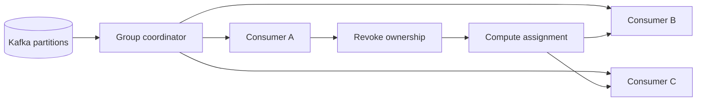

يسهل شرح مجموعة مستهلكي Kafka نظريًا: توزّع الأقسام على المستهلكين، ويكون لكل قسم مالك نشط واحد داخل المجموعة. تبدأ الصعوبة الفعلية عندما تتغير العضوية.

يعيد النشر تشغيل المستهلكين، وتضيف آلية التوسّع التلقائي نسخًا أو تزيلها، وقد تؤخر خطوة معالجة طويلة استدعاء `poll()`، أو يجعل انقطاع الشبكة أحد الأعضاء غير مرئي لمنسق المجموعة. عندها يجب على Kafka تحديد الأعضاء الأحياء، وسحب الملكية القديمة، وحساب توزيع جديد، وتحديد من يحق له متابعة المعالجة.

هذه السلسلة بروتوكول تنسيق موزع. اختزالها في قيمة مهلة واحدة يؤدي غالبًا إلى نتيجتين سيئتين: كشف شديد الحساسية يسبب اضطرابًا يمكن تجنبه، أو كشف بطيء يترك الأقسام بلا معالجة مدة أطول من المقبول.

هذه المقالة معمارية مرجعية وليست تقريرًا عن نظام إنتاجي جرى قياسه. يجب اختبار الخيارات المقترحة وفق إصدار العميل، وبروتوكول المجموعة، وطبيعة الحمل، وميزانية الفشل في النظام الذي سيطبقها.

## لماذا تكون إعادة التوازن مكلفة

إعادة التوازن ليست عيبًا بذاتها، بل هي الآلية التي تسمح للمجموعة بالتعافي وإعادة توزيع العمل. تأتي التكلفة من تكرارها، ومن حجم الملكية التي تُسحب، ومن الحالة التي يجب على المستهلكين إعادة بنائها بعدها.

في إعادة التوازن الشاملة قد يتوقف الأعضاء مؤقتًا عن المعالجة بينما تعتمد المجموعة جيلًا جديدًا وتوزيعًا جديدًا. قد يحتاج المستهلك إلى تفريغ المخازن المؤقتة، وتثبيت الإزاحات، وإغلاق موارد مرتبطة بأقسام محددة، ثم إعادة بناء ذاكرة مخبأة أو حالة محلية. لذلك تكون الكلفة على معالج تدفقات ذي حالة أعلى بكثير من كلفتها على معالج أحداث عديم الحالة.

يمتد الأثر التشغيلي إلى ما بعد التوقف نفسه:

- يرتفع تأخر المستهلك عندما يبقى قسم بلا معالج نشط.
- قد تعالج السجلات الجارية مرة أخرى إذا لم تتطابق حدود تثبيت الإزاحة مع حدود الأثر الخارجي.
- قد تُهدم ذاكرة محلية واتصالات مرتبطة بالأقسام من دون حاجة.
- قد يؤدي بطء إعادة التشغيل إلى تغير جديد في العضوية قبل استقرار التعافي الأول.
- قد يتحول النشر التدريجي إلى سلسلة من الانقطاعات على مستوى المجموعة كلها.

لذلك لا يكون السؤال المفيد: «كيف نمنع إعادة التوازن؟» فالمجموعة تحتاج إليها. السؤال الصحيح هو: «كيف نجعل انتقال الملكية مقصودًا ومحدودًا وقابلًا للرصد؟»

## نموذج التنسيق

هناك ثلاث ساعات منطقية يكثر الخلط بينها.

مسار **النبض والجلسة** يكتشف بقاء العضو متصلًا بالمجموعة. ومسار **فاصل الاستطلاع** يكتشف استمرار التطبيق في استدعاء `poll()` بالوتيرة المطلوبة. أما **زمن معالجة السجلات** فهو ساعة الحمل داخل التطبيق. تتفاعل هذه الأزمنة، لكنها لا تصف نوع الفشل نفسه.

توضح مرجعية إعدادات مستهلك Kafka الحالية أن `max.poll.interval.ms` يضع حدًا أعلى للزمن بين استدعاءي `poll()` عند استخدام إدارة المجموعة. إذا تجاوز المستهلك هذا الحد فقد تعدّه المجموعة متعطلًا وتعيد إسناد أقسامه. يعتمد سلوك الجلسة والنبض على بروتوكول المجموعة المختار وإعدادات العميل، ولذلك لا يصح نقل نصيحة كتبت للبروتوكول الكلاسيكي مباشرة إلى مستهلك يعمل بالبروتوكول الأحدث.

ملكية القسم حد من حدود الصحة أيضًا. إذا فقد المستهلك ملكيته، فلا يجوز له تثبيت الإزاحات كما لو كان جيله ما يزال صالحًا. يجب أن يتعامل التطبيق مع سحب الملكية بوصفه انتقال حالة حقيقيًا، لا مجرد callback يكتب سطرًا في السجل.

يدير المنسق العضوية والتوزيع. ويبقى التطبيق مسؤولًا عن إنهاء العمل الجاري أو إلغائه، وتثبيت الإزاحات الآمنة فقط، وتحرير الموارد الخاصة بالقسم عند انتقال الملكية.

## ما الذي يطلق إعادة التوازن

الأسباب الواضحة هي انضمام مستهلك أو خروجه، أو إضافة أقسام إلى موضوع مشترك. أما الأسباب الأقل وضوحًا فقد تكون أكثر ضررًا لأنها تبدو كأنها عدم استقرار عشوائي في البنية التحتية.

قد يفوّت المستهلك موعد الاستطلاع لأن المعالجة تجري داخل خيط الاستطلاع، أو لأن خدمة تابعة تباطأت، أو لأن جامع الذاكرة أوقف العملية، أو لأن الدفعة أكبر من الميزانية الزمنية. وقد يستقبل الحاوي إشارة إنهاء من دون أن يغادر المجموعة بانتظام قبل قتله. كما قد تعيد إشارة liveness تشغيل مستهلك سليم لكنه مشغول مؤقتًا، فتحول ضغط العمل إلى اضطراب في العضوية.

يجب فصل فئات الأسباب قبل تعديل الإعدادات:

1. **تغير متوقع في الطوبولوجيا:** نشر أو توسيع مخطط أو زيادة عدد الأقسام.
2. **توقف داخل التطبيق:** المعالجة تحجب حلقة الاستطلاع أو تتجاوز ميزانيتها.
3. **انقطاع في البنية التحتية:** انهيار عملية أو عقدة أو اتصال شبكي.
4. **اضطراب في المنسق أو البروتوكول:** استراتيجيات توزيع غير متوافقة، أو فشل متكرر في الانضمام، أو هوية عضوية غير مستقرة.

لكل فئة علاج مختلف. زيادة جميع المهل قد تخفي توقف التطبيق، لكنها تبطئ التعافي من الفشل الحقيقي. وتقليلها جميعًا قد يكتشف الانهيار بسرعة، لكنه يحول أي توقف قصير إلى عمليات إعادة توازن متكررة.

## العضوية الديناميكية والثابتة

يحصل العضو الديناميكي على هوية جديدة عند انضمامه. يناسب ذلك النسخ القابلة للاستبدال، لكن إعادة تشغيل قصيرة قد تبدو كأنها عضو جديد تمامًا وتفرض إعادة توزيع العمل.

تدعم Kafka العضوية الثابتة عبر `group.instance.id`. تمنح القيمة الفريدة وغير الفارغة النسخة هوية مستقرة داخل المجموعة. وتصف المرجعية الرسمية استخدام هذه الهوية مع مهلة جلسة مناسبة لتقليل إعادة التوازن الناتجة عن انقطاع مؤقت مثل إعادة تشغيل العملية. يعرّف KIP-345 هذا التغيير في البروتوكول وسلوك fencing المصاحب له.

العضوية الثابتة ليست مفتاح موثوقية مجانيًا. تحتاج كل نسخة حية إلى هوية فريدة ومستقرة. تشغيل عمليتين بالهوية نفسها يخلق تعارض fencing. وإذا اختفت نسخة من دون مغادرة المجموعة فقد تحتفظ بمكانها حتى انتهاء مهلة الجلسة، فيتأخر نقل أقسامها. وفي بيئة أوركسترا يجب اشتقاق الهوية من رقم ترتيبي ثابت أو ربط مقصود، لا من معرف Pod عشوائي يتغير عند كل تشغيل.

استخدم العضوية الثابتة عندما تكون استمرارية التوزيع عبر إعادة التشغيل مهمة ويمكن إدارة الهويات بأمان. واحتفظ بالعضوية الديناميكية عندما تكون النسخ مجهولة الهوية عمدًا ويكون الاستبدال السريع أهم من حفظ التوزيع السابق.

## التوزيع التعاوني يقلل نطاق التعطيل

تسحب إعادة التوازن التقليدية الملكية على نطاق واسع قبل تثبيت التوزيع الجديد. أما إعادة التوازن التعاونية فتحول العملية إلى نقل تدريجي: يحتفظ الأعضاء بالأقسام غير المتأثرة، ولا تُسحب سوى الأقسام التي يجب نقلها فعلًا.

قدم KIP-429 البروتوكول التدريجي وCooperative Sticky Assignor. قيمته العملية هي تقليل الانقطاع أثناء التغييرات المتدرجة، وليست إلغاء التنسيق. ما يزال التطبيق بحاجة إلى معالجة صحيحة لسحب الملكية، ويجب أن يتفاوض كل الأعضاء على استراتيجيات متوافقة.

تحتاج الهجرة إلى حذر. تسمح إعدادات المستهلك بقائمة مرتبة من استراتيجيات التوزيع. ينبغي نقل المجموعة عبر نشر متوافق، بدل خلط عملاء فجأة لا يستطيعون الاتفاق على البروتوكول. يجب مراجعة وثائق العميل وإصدار السلوك بدقة قبل تغيير القائمة.

يكون التوزيع التعاوني مهمًا خصوصًا عندما تكون إعادة بناء الحالة المحلية للقسم مكلفة. وتقل فائدته إذا لم يحتفظ المستهلكون بحالة محلية وكانت توقفات المعالجة ضئيلة أصلًا. المعيار هو مدة إعادة التوازن وعدد الأقسام المسحوبة كما يظهران في القياس، لا كون الأسلوب أحدث فقط.

## اجعل حلقة الاستطلاع بسيطة ومحدودة

يجب أن ينسق خيط الاستطلاع الجلب والملكية، لا أن ينفذ عملًا بلا حد. إذا أمكن أن تتجاوز معالجة السجل ميزانية الاستطلاع، فانقلها إلى عمال ذوي سعة محدودة مع الحفاظ على ترتيب كل قسم وسلامة التثبيت.

تحتاج هذه البنية إلى حدود صريحة. المنفذ غير المحدود لا يحل التوقف، بل ينقله من Kafka إلى الذاكرة. أوقف الأقسام مؤقتًا عندما تبلغ قائمة العمل الداخلية حدها الأعلى، وأعد تشغيلها عندما تتوافر السعة، مع الاستمرار في الاستطلاع وفق عقد العميل. اضبط عدد السجلات المعادة في كل استطلاع وفق زمن المعالجة واستهلاك الذاكرة المقاسين، مع الانتباه إلى أن `max.poll.records` يحدد ما يعيده `poll()` ولا يحدد آلية الجلب الداخلية نفسها.

يجب أن تتبع إدارة الإزاحات اكتمال العمل، لا لحظة إرساله إلى عامل. إذا كان السجل عند الإزاحة 42 ما يزال قيد المعالجة بينما اكتمل 43، فقد يؤدي تثبيت 44 ثم الانهيار إلى فقدان 42. من الحلول المعتادة تنفيذ العمل بالتتابع داخل كل قسم، أو استخدام متعقب اكتمال خاص بكل قسم، أو تصميم آثار تابعة idempotent بحيث تكون الإعادة آمنة.

الهدف هو invariant بسيط: الإزاحة المثبتة تعني أن كل أثر مطلوب قبلها اكتمل بصورة دائمة.

## صمّم النشر بوصفه حدثًا للمجموعة

النشر التدريجي ليس عملية حاويات فقط، بل سلسلة مخططة من تغيرات العضوية.

عند الإنهاء، يوقف المستهلك استقبال عمل جديد، ويحافظ على عقد الاستطلاع والنبض أثناء تفريغ مقدار محدود من العمل، ويثبت الإزاحات المكتملة فقط، ثم يغلق العميل كي يغادر المجموعة بانتظام، وينهي كل ذلك قبل مهلة الإنهاء لدى الأوركسترا. إذا كان التفريغ قد يتجاوز المهلة، فيجب خفض حجم الدفعة أو التوازي قبل الإنهاء بدل افتراض أن العملية ستحصل على وقت إضافي.

البداية مهمة أيضًا. لا ينبغي لإشارة readiness إعلان النسخة جاهزة قبل قدرتها على معالجة الأقسام المسندة بأمان. ويجب أن تكتشف إشارة liveness حالة لا يمكن للتطبيق التعافي منها، لا أن تعيد تشغيل عملية لمجرد أن خدمة تابعة بطيئة.

يساعد توزيع أوقات إعادة التشغيل على تقليل تغيرات العضوية المتزامنة. وقد تقلل العضوية الثابتة والتوزيع التعاوني التعطيل أكثر، لكنهما لا يعوضان مهلة إنهاء أقصر من ميزانية تفريغ التطبيق.

## راقب الأسباب والانتقالات والأثر

لا يكفي عداد واحد لإعادة التوازن. فهو يثبت حدوث التنسيق، لكنه لا يشرح سببه ولا أثره على المستخدم.

يجب رصد ما يأتي على الأقل:

- عدد عمليات إعادة التوازن ومعدلها لكل مجموعة.
- مدة إعادة التوازن وزمن إتمام التوزيع.
- عدد الأقسام المسحوبة والمسندة والمحتفظ بها في كل حدث.
- تأخر المستهلك لكل قسم، وعمر أقدم سجل غير معالج عند توافره.
- الزمن بين استدعاءات `poll()` وعدد السجلات في كل استطلاع.
- العمل الجاري، وعمق القائمة الداخلية، والأقسام المتوقفة، وزمن التفريغ.
- أخطاء الانضمام والخروج والمهلة وfencing والتوزيع.
- إصدار النشر وهوية النسخة المرتبطان بكل إعادة توازن.

يجب أن تنبه المراقبة على الأثر والاستمرار، لا على كل انتقال متوقع. قد تكون عملية قصيرة أثناء نشر مضبوط طبيعية. أما التكرار مع ارتفاع التأخر، أو غياب جيل مستقر، أو تذبذب العضوية فهو حادث تنسيق.

ينبغي أن تتضمن السجلات معرف المجموعة، ومعرف العضو أو النسخة، والجيل، والأقسام المسندة، والسبب، والمدة، من دون محتوى الرسائل أو بيانات الاعتماد. تستطيع التتبعات ربط نداء تابع بطيء بضغط حلقة الاستطلاع، لكن مقاييس المجموعة تبقى ضرورية لأن انتقال الملكية يعبر حدود العمليات.

## اختبر حدود الفشل

مراجعة الإعدادات لا تثبت سلوك إعادة التوازن. يجب تشغيل البروتوكول تحت أعطال مضبوطة.

1. أعد تشغيل مستهلك واحد بانتظام، وسجل هل تواصل الأقسام غير المتأثرة العمل.
2. اقتل مستهلكًا بلا cleanup، وقس زمن الاكتشاف وإعادة الإسناد.
3. أخّر المعالجة إلى ما بعد فاصل الاستطلاع، وتحقق من أن التطبيق لا يثبت إزاحة بعد فقدان الملكية.
4. شغّل نسختين بالهوية الثابتة نفسها، وتحقق من ظهور إشارة fencing بوضوح.
5. انشر المجموعة كاملة مع استمرار إنتاج الأحداث، وقس التأخر ومعالجة التكرار وزمن التعافي.
6. عطّل خدمة تابعة، واملأ قائمة العمال، وتحقق من أن pause وresume يعملان ضمن حدود معروفة.
7. أضف أقسامًا إلى موضوع مشترك، واختبر التوزيع والتهيئة المحلية للقسم.
8. أدخل عميلًا باستراتيجية توزيع غير متوافقة في بيئة غير إنتاجية، وتأكد من أن الفشل قابل للتشخيص والعمل.

عرّف النجاح قبل الاختبار: أقصى عمر مقبول للتأخر، وزمن التعافي، وحدود التكرار، وهل يجب أن تستمر الأقسام غير المتأثرة. من دون هذه الحدود قد ينتهي الاختبار بنجاح شكلي بينما يخفي توقفًا غير مقبول.

## تسلسل عملي للتصميم

ابدأ بالدليل، لا بوصفات المهل المتوارثة.

أولًا، حدد أسباب إعادة التوازن من سجلات المنسق، ومقاييس العميل، وأحداث النشر، وأزمنة الاستطلاع. ثانيًا، اجعل المعالجة محدودة كي يحترم المستهلك البروتوكول. ثالثًا، طابق تثبيت الإزاحة مع الاكتمال الدائم. رابعًا، صمّم الإغلاق والبداية بوصفهما انتقال ملكية. خامسًا، قرر ما إذا كانت الهوية المستقرة والتوزيع التعاوني يقللان كلفة مقاسة. وأخيرًا، اختبر الانهيار والتوقف والنشر التدريجي مع مراقبة التأخر وحالة التوزيع.

لا تتجنب مجموعة المستهلكين الجيدة التغيير، بل تغيّر الملكية بصورة متوقعة، وتمنع المالك القديم من التصرف، وتحد من السحب غير الضروري، وتكشف حالة كافية لشرح كل انقطاع.

## المصادر

- [إعدادات مستهلك Apache Kafka](https://kafka.apache.org/42/configuration/consumer-configs/)
- [KIP-345: العضوية الثابتة](https://cwiki.apache.org/confluence/display/KAFKA/KIP-345%3A+Introduce+static+membership+protocol+to+reduce+consumer+rebalances)
- [KIP-429: إعادة التوازن التعاونية التدريجية](https://cwiki.apache.org/confluence/display/KAFKA/KIP-429%3A+Kafka+Consumer+Incremental+Rebalance+Protocol)
- [وثائق Confluent عن مجموعات المستهلكين](https://docs.confluent.io/platform/current/clients/consumer.html#consumer-groups)
