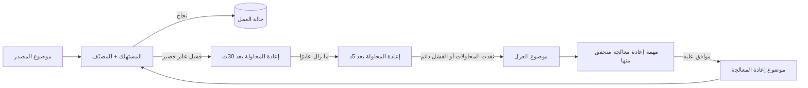

ينبغي لتصميم إعادة المحاولة في Kafka أن يجيب عن خمسة أسئلة قبل إضافة أي موضوع لإعادة المحاولة: **ما الذي فشل؟ هل ستكون محاولة أخرى مفيدة؟ ماذا سيحدث للترتيب؟ متى تُثبّت إزاحة المصدر؟ كيف يمكن إعادة معالجة السجل من دون تكرار أثر العمل؟**

موضوع الرسائل غير القابلة للتسليم ليس سوى موقف مؤقت. فهو لا يصنّف حالات الفشل، ولا يجعل المستهلكين آمنين عند التكرار، ولا يحافظ على الترتيب بين موضوعات إعادة المحاولة، ولا يثبت أمان إعادة المعالجة. التصميم الموثوق هو آلة حالات صغيرة للفشل تحيط بالمستهلك: تحقّق، وصنّف، وأعد المحاولة ضمن ميزانية، ثم اعزل بالسياق الكامل، وأعد المعالجة عبر مسار مضبوط.

تطوّر هذه المقالة تلك المعمارية المرجعية من دون الادعاء بوجود نشر إنتاجي محدد.

## ابدأ بعقد المستهلك

يخزّن Kafka السجلات في أقسام مرتبة من الموضوعات. ويمكن توجيه السجلات ذات المفتاح نفسه إلى القسم نفسه، ويضمن Kafka أن يقرأ المستهلك قسمًا معينًا بترتيب الكتابة ([وثائق Apache Kafka](https://kafka.apache.org/documentation/)). وتتتبع مجموعة المستهلكين التقدم باستخدام الإزاحات.

لكن هذه الآلية لا تحدد نجاح التطبيق. فقد يقرأ المعالج سجلًا ثم يفشل أثناء تحليله، أو تحديث قاعدة بيانات، أو استدعاء واجهة API، أو إنتاج حدث آخر. ويجب أن يقرر التطبيق ما إذا كان سيوقف القسم، أو يعيد محاولة العمل، أو يتجاوز السجل.

اكتب هذا القرار في صورة عقد:

1. لا يُقرّ باستلام سجل إلا بعد وصوله إلى حالة حاسمة.
2. الحالة الحاسمة إما `processed` وإما `quarantined`.
3. تُقيّد إعادة المحاولة بعدد المحاولات والوقت المنقضي.
4. يجب ألا يكرر التسليم المكرر أثر العمل.
5. إعادة المعالجة عملية جديدة مضبوطة، لا حلقة تلقائية تعيد السجل إلى المصدر.

هذا أشد صرامة عن قصد من عبارة «التقط الاستثناء وانشره في قائمة الرسائل غير القابلة للتسليم».

## صنّف الفشل قبل اختيار إعادة المحاولة

تؤدي معاملة كل استثناء بوصفه عابرًا إلى عواصف من إعادات المحاولة. أما معاملة كل استثناء بوصفه دائمًا فترسل أعمالًا قابلة للتعافي إلى المراجعة اليدوية. والتقسيم المفيد يتألف من أربع فئات.

### إدخال غير صالح

لن تتحسن وحدات البايت المشوهة، أو نسخة مخطط غير مدعومة، أو حقل مطلوب مفقود بمرور الوقت. اعزلها فورًا. واحتفظ بوحدات البايت الأصلية حيث تسمح السياسة، إلى جانب الموضوع والقسم والإزاحة والطابع الزمني والمفتاح وهوية المخطط ورمز خطأ ثابت.

### رفض دائم من منطق العمل

قد يخالف سجل صالح قاعدةً ما: انتقال حالة مستحيل، أو مستأجر مجهول، أو طلب يرفضه النظام اللاحق نهائيًا. وينبغي ألا يدخل هذا أيضًا في حلقة إعادة محاولة عمياء. وقد تكون الحالة النهائية حدث رفض في مجال العمل بدلًا من قائمة رسائل تقنية غير قابلة للتسليم، بحسب المجال.

### فشل عابر في خدمة تابعة

قد تبرر المهل، وحدود المعدل، وتغييرات القائد، أو انقطاع قصير لقاعدة البيانات إعادة المحاولة. وينبغي ربط ميزانيتها بسلوك تعافي الخدمة التابعة وهدف زمن الاستجابة لسير العمل، لا نسخها من قيمة افتراضية لإطار عمل.

### فشل مجهول

الاستثناء غير المتوقع ليس عابرًا بصورة آمنة ولا دائمًا بصورة آمنة. امنحه ميزانية صغيرة ومحدودة لإعادة المحاولة، واجمع ما يكفي من بيانات التشخيص لتجميع حالات الفشل المتشابهة، ثم اعزله. إعادة المحاولة إلى ما لا نهاية ليست حذرًا؛ بل انقطاع غير محدود.

ينبغي للمصنّف إنتاج بيانات بدلًا من طرح استثناء عام آخر:

```ts
type FailureDecision =
  | { kind: "quarantine"; code: string }
  | { kind: "retry"; code: string; delayMs: number }
  | { kind: "reject"; code: string };

function classify(error: unknown, attempt: number): FailureDecision {
  if (error instanceof UnsupportedSchema) {
    return { kind: "quarantine", code: "SCHEMA_UNSUPPORTED" };
  }
  if (error instanceof RateLimited && attempt < 4) {
    return { kind: "retry", code: "RATE_LIMITED", delayMs: backoff(attempt) };
  }
  if (error instanceof InvalidTransition) {
    return { kind: "reject", code: "INVALID_TRANSITION" };
  }
  return attempt < 2
    ? { kind: "retry", code: "UNCLASSIFIED", delayMs: backoff(attempt) }
    : { kind: "quarantine", code: "UNCLASSIFIED_EXHAUSTED" };
}
```

الأرقام توضيحية، أما قيم الإنتاج فتحتاج إلى سلوك مقيس للخدمة التابعة وأهداف للخدمة.

## اختر إعادة المحاولة الحاجبة أو غير الحاجبة عن قصد

توقف إعادة المحاولة الحاجبة العمل على السجل الفاشل، باستخدام تراجع محلي في العادة. وهي تبقي السجل في مسار المعالجة الحالي وقد تحافظ على ترتيب القسم. وتكون معقولة لمحاولة أو محاولتين قصيرتين حين يكون وقت التعافي المتوقع أقل من ميزانية معالجة المستهلك.

لكن لها حدود حادة أيضًا. فالنوم داخل حلقة الاستطلاع يؤخر كل سجل لاحق في القسم. وقد تتفاعل المعالجة الطويلة بصورة سيئة مع حيوية مجموعة المستهلكين وإعادة الموازنة. ويمكن لانقطاع خدمة تابعة أن يحول كل مثيل للمستهلك إلى محرك متزامن لإعادة المحاولة.

تنشر إعادة المحاولة غير الحاجبة السجل الفاشل في موضوع لإعادة المحاولة، وتثبّت التقدم في المصدر، ثم تواصل. وتعالج مستهلكات منفصلة طبقات إعادة المحاولة بعد فترات تأخير متزايدة:



يحرر هذا قسم المصدر، لكنه يغير الترتيب. فقد ينجح السجل `A2` بينما ينتظر السجل الأسبق `A1` في موضوع لإعادة المحاولة. ولا تعيد إعادة النشر بالمفتاح نفسه التسلسل الأصلي، لأن السجلات تنتقل الآن عبر موضوعات ومجموعات مستهلكين مختلفة.

لا تختر إعادة المحاولة غير الحاجبة إلا عندما تتحقق إحدى الحالات الآتية:

- ترتيب المعالجة غير مهم؛
- يستخدم المستهلك أرقام الإصدارات ويرفض التحديثات القديمة؛
- يمكن قفل الكيان المجمّع أو تأجيله بينما يُعاد تنفيذ أحد أحداثه؛
- تستطيع التسوية إصلاح الآثار الخارجة عن الترتيب.

إذا كان الترتيب الصارم لكل مفتاح ثابتًا من ثوابت العمل، فأبقِ المفتاح محجوبًا، أو اعزله خلف مجدول عمل قائم على المفاتيح، أو أعد تصميم انتقال الحالة. لا تُخفِ المقايضة خلف وصف «متحمّل للأعطال».

## اجعل انتقال الإزاحة صريحًا

ليس الحد الخطر معالجة السجل فحسب، بل الانتقال من موضوع المصدر إلى حالة دائمة أخرى.

عند نجاح الكتابة إلى قاعدة البيانات، يكون تثبيت معاملة قاعدة البيانات وتثبيت إزاحة Kafka عمليتين مستقلتين. وقد يتسبب التعطل بينهما في معالجة مكررة. يعالج [نمط المستهلك الآمن عند التكرار](https://microservices.io/patterns/communication-style/idempotent-consumer.html) ذلك بتخزين هوية ثابتة للرسالة مع تغيير العمل في معاملة واحدة في قاعدة البيانات.

وتظهر مشكلة الكتابة المزدوجة نفسها عند العزل:

1. انشر السجل الفاشل في موضوع العزل؛
2. ثبّت إزاحة المصدر.

إذا تعطلت العملية بين الخطوتين، فقد يُقرأ سجل المصدر مرة أخرى ويُعزل مرتين. وإذا ثبّتت الإزاحة أولًا ثم فشلت في النشر، فقد يختفي السجل من مسار المعالجة.

يوجد نهجان صريحان:

- استخدم معاملات Kafka حين يبقى السجل المستهلك، وسجل إعادة المحاولة أو العزل المنتج، وإزاحات المصدر كلها داخل Kafka، وحين يدعم العميل أو إطار العمل معاملة الاستهلاك والتحويل والإنتاج المطلوبة.
- وإلا فافترض انتقالًا وفق دلالات «مرة واحدة على الأقل»، وانشر قبل تثبيت إزاحة المصدر، وامنح كل غلاف فشل هوية حتمية مثل `source-topic/source-partition/source-offset` كي يمكن التعرف على النسخ المكررة.

ينبغي لسجل العزل الاحتفاظ بإحداثيات المصدر حتى لو حصل على إزاحة Kafka جديدة:

```json
{
  "failureId": "orders/12/884193",
  "source": { "topic": "orders", "partition": 12, "offset": 884193 },
  "attempt": 4,
  "firstFailedAt": "2026-07-31T09:10:00Z",
  "lastFailedAt": "2026-07-31T09:16:42Z",
  "errorCode": "RATE_LIMITED_EXHAUSTED",
  "payloadSchema": "order-created.v3",
  "traceId": "..."
}
```

لا تسلسل تتبعات مكدس غير مقيدة أو بيانات اعتماد أو بيانات شخصية داخل الترويسات. خزّن رمز خطأ محدودًا ومعرّف ارتباط، واحتفظ بالتشخيصات الحساسة في سجلات مضبوطة الوصول.

## يجب أن يغطي عدم التكرار أثر العمل

ليست مجموعة إزاحات معالجة في الذاكرة آلية لعدم التكرار؛ فهي تزول عند إعادة التشغيل ولا تنسق بين عدة مثيلات للمستهلك.

لأثر في قاعدة البيانات، أدرج هوية الرسالة وطبّق تغيير العمل في المعاملة نفسها. ويحوّل قيد تفرد على `(consumer_name, message_id)` إعادة التسليم إلى عملية لا أثر لها. وهذه هي الآلية الأساسية نفسها التي تصفها Microservices.io.

تحتاج الآثار الخارجية إلى حمايتها الخاصة. مرّر مفتاحًا ثابتًا لعدم التكرار إلى واجهة API تدعمه. وبالنسبة إلى أنظمة البريد الإلكتروني أو الدفع أو خطافات الويب التي لا تملك حدًا ذريًا مناسبًا، مثّل الإجراء في صورة حالة دائمة ذات نتائج صريحة `pending` و`sent` و`uncertain` مع التسوية. لا يستطيع زر إعادة المعالجة إنشاء سلوك «مرة واحدة فقط» بأثر رجعي.

## عامل العزل بوصفه طابورًا تشغيليًا، لا أرشيفًا

قائمة الرسائل غير القابلة للتسليم التي لا يملكها أحد ليست سوى فقد مؤجل للبيانات. يحتاج كل موضوع عزل إلى:

- خدمة وفريق مالكين له؛
- مدة احتفاظ تكفي لهدف الاستجابة؛
- عدد حالات الفشل ومعدلها حسب رمز الخطأ؛
- عمر أقدم سجل لم يُحل؛
- عدد المحاولات والوقت المنقضي عبر طبقات إعادة المحاولة؛
- أعداد نجاح إعادة المعالجة وفشلها المتكرر؛
- عتبة تنبيه مرتبطة بإلحاح العمل؛
- دليل تشغيل للفحص والإصلاح وإعادة المعالجة والتحقق.

توصي نظرة Confluent العامة بإعادات محاولة محدودة، ومراقبة السلامة، والتحقيق، وإعادة معالجة مضبوطة. والتحسين المفيد هو مراقبة العمر إلى جانب العمق. فقد تكون دفعة واحدة فاشلة وقديمة أهم من آلاف السجلات التحليلية الجديدة ومنخفضة الأولوية.

اجعل العزل نهائيًا افتراضيًا. فالحلقة التلقائية من قائمة الرسائل غير القابلة للتسليم إلى المصدر قد تطلق الأثر الجانبي نفسه مرارًا، وتفقد سياق التشخيص، وتنشئ حركة مرور تبدو كأنها إنتاجية سليمة.

## إعادة المعالجة عملية نشر لها نطاق أثر

ينبغي أن تكون إعادة المعالجة سير عمل مستقلًا وقابلًا للمراقبة:

1. اختر السجلات حسب معرّف فشل ثابت وسبب صريح؛
2. تأكد من وجود إصلاح للمستهلك أو تعافٍ للخدمة التابعة؛
3. تحقق من توافق المخطط؛
4. قدّر الحجم وسعة الأنظمة اللاحقة؛
5. انشر في موضوع مخصص لإعادة المعالجة بمعدل محدود؛
6. احتفظ بالهوية الأصلية وزِد بيانات إعادة المعالجة الوصفية؛
7. تحقق من حالة العمل، لا من التسليم عبر Kafka وحده؛
8. أغلق سجل العزل أو أضف إليه تعليقًا.

يجعل موضوع مخصص لإعادة المعالجة الأذونات وحدود المعدل ولوحات المتابعة وسجل التدقيق أوضح من الكتابة مباشرة إلى المصدر. كما يتيح للمستهلك تمييز السجل الحي من السجل المعاد معالجته من دون تغيير هوية العمل.

عند إعادة المعالجة بالجملة، اختبر أولًا على عينة صغيرة وحتمية. وينبغي أن تشمل شروط الإيقاف تجدد معدل الفشل، واكتشاف تكرارات غير متوقعة، وتشبع الخدمات التابعة، وتنامي تأخر المستهلك.

## اختبر آلة حالات الفشل

لا تثبت اختبارات المسار السعيد إلا القليل عن أمان إعادة المحاولة. اختبر الحدود:

1. ارفض الإدخال المشوه من دون إعادة محاولة؛
2. تعافَ من فشل عابر ضمن ميزانية إعادة المحاولة الحاجبة؛
3. استنفد إعادة المحاولة الحاجبة وانقل السجل مرة واحدة إلى موضوع لإعادة المحاولة؛
4. عطّل العملية بعد النشر في موضوع إعادة المحاولة وقبل تثبيت إزاحة المصدر؛
5. سلّم السجل نفسه بالتزامن وأنتج أثر عمل واحدًا؛
6. عالج سجلًا لاحقًا بالمفتاح نفسه بينما ينتظر السجل الأسبق، ثم تحقق من سياسة الترتيب؛
7. اجعل نشر العزل يفشل وأثبت أن سجل المصدر يظل قابلًا للتعافي؛
8. أعد معالجة عينة ثابتة مرتين وتحقق من عدم التكرار؛
9. أبقِ خدمة تابعة منقطعة بما يكفي لمراقبة التراجع والتأخر وسلوك التنبيه؛
10. أدخل بيانات خطأ حساسة وتحقق من تنقيحها في الغلاف.

تحوّل هذه الاختبارات سياسة إعادة المحاولة من إعدادات إلى أدلة.

## خلاصة عملية

لا تتحدد موثوقية مستهلك Kafka بوجود موضوع للرسائل غير القابلة للتسليم، بل تأتي من انتقالات صريحة وادعاءات محدودة.

صنّف حالات الفشل قبل إعادة المحاولة. واستخدم إعادات محاولة حاجبة وقصيرة فقط حين تلائم ميزانية الاستطلاع وزمن الاستجابة. واستخدم موضوعات إعادة المحاولة حين يكون التقدم أهم من الترتيب الصارم، مع توضيح مقايضة الترتيب. وانشر سجلات الفشل قبل تثبيت التقدم في المصدر ما لم تغطِّ معاملة Kafka كليهما. واجعل آثار العمل آمنة عند التكرار. وأبقِ العزل قابلًا للمراقبة ونهائيًا. وأعد التشغيل عبر مسار محدود المعدل وقابل للتدقيق، ثم تحقق من الحالة الناتجة.

الهدف ليس إنجاح كل سجل تلقائيًا، بل ضمان وصول كل سجل إلى حالة معلومة من دون إخفاء الفقد أو التكرار أو الدين التشغيلي.

---
