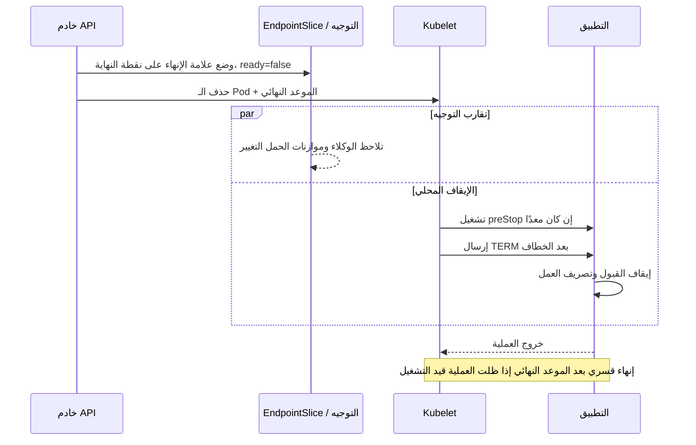

غالبًا ما يُختزل الإيقاف السلس في Kubernetes في تعليمة واحدة: التقط `SIGTERM`. وهذا ضروري، لكنه ليس النظام كاملًا.

يقع الـ Pod خلف عدة مكونات تتحرك كل منها بصورة مستقلة: خادم API، وEndpointSlices، وkube-proxy أو وكيل خدمة، ووحدة تحكم للدخول، وربما موازن حمل خارجي، وعملية التطبيق نفسها. أثناء الإنهاء، تبدأ تغييرات التوجيه وإيقاف العملية المحلية من دون معاملة شاملة تربط بينهما. وقد تتوقف عملية عن الاستماع قبل تقارب كل المسارات، أو يصبح البديل جاهزًا داخل Kubernetes بينما لا يزال موازن الحمل الخارجي يراه غير سليم.

النموذج الأكثر أمانًا بروتوكول موقّت له ثلاث مسؤوليات: **سحب نقطة النهاية، وتصريف العمل المقبول، والخروج قبل انتهاء فترة السماح**. تطوّر هذه المقالة تلك المعمارية المرجعية من دون الادعاء بوجود نشر إنتاجي محدد.

## السباق بين التوجيه وعمر العملية

عند حذف Pod، يسجل Kubernetes موعدًا نهائيًا للحذف ويبدأ kubelet الإيقاف المحلي. وإذا عرّفت حاوية خطاف `preStop`، شغّله kubelet قبل أن يطلب من وقت التشغيل إرسال إشارة الإيقاف إلى الحاوية. وإشارة الإيقاف الافتراضية هي `SIGTERM`، وتُنهى العملية بالقوة إن ظلت قيد التشغيل عند انتهاء فترة السماح. توثّق Kubernetes فترة سماح افتراضية قدرها 30 ثانية، وتشير إلى أن ساعة هذه الفترة تشمل خطاف `preStop` ([دورة حياة الـ Pod](https://kubernetes.io/docs/concepts/workloads/pods/pod-lifecycle/#pod-termination)).

تتغير نقطة النهاية أيضًا عند حد الخدمة. يوضح الدليل التعليمي لإنهاء نقطة النهاية في Kubernetes إدخالًا قيد الإنهاء في EndpointSlice بالحالة الآتية:

```yaml
conditions:
  ready: false
  serving: true
  terminating: true
```

تمنع `ready: false` موازنات الحمل الموجودة من اختيار نقطة النهاية لحركة المرور الجديدة المعتادة. ويمكن أن تشير `serving: true` إلى أن نقطة النهاية لا تزال تخدم الاتصالات القائمة أثناء إنهائها ([تدفق إنهاء نقطة النهاية](https://kubernetes.io/docs/tutorials/services/pods-and-endpoint-termination-flow/)).

التفصيل المهم هو أن نشر حالة نقطة النهاية وإيقاف kubelet يُنسّقان بالحالة، لا بإقرار شامل من كل قفزة شبكية. ولا يتلقى تطبيقك دليلًا على توقف كل الوكلاء عن التوجيه قبل تلقيه إشارة الإنهاء.



يحتوي أي تصميم يفترض انتهاء هذين الفرعين بترتيب ثابت على حالة سباق.

## عرّف الإيقاف في ثلاث مراحل

### 1. السحب

الهدف الأول هو التوقف عن قبول عمل جديد. يضع Kubernetes علامة عدم الجاهزية على نقطة النهاية قيد الإنهاء، لكن نشر التغيير عبر مسار الطلب الفعلي يستغرق وقتًا. وقد يشمل المسار مراقبي EndpointSlice، وقواعد على مستوى العقدة، ووكيل شبكة خدمة، ووحدة دخول، وموازن حمل سحابيًا له آلياته الخاصة لفحوص السلامة وإلغاء التسجيل.

يمكن لتأخير `preStop` إنشاء نافذة سحب قبل تلقي التطبيق `SIGTERM`. لكنه أداة تقريبية، لا دليل صحة. وينبغي اشتقاق التأخير من تقارب التوجيه المرصود في البيئة الفعلية، لا من تعليمة `sleep 10` منسوخة.

نقطة نهاية للتصريف يتحكم فيها التطبيق خيار آخر: يطلب خطاف `preStop` من العملية رفض الجاهزية ثم ينتظر السحب. يمنح هذا التطبيق حالة صريحة، لكنه ينشئ أيضًا نقطة نهاية تحكم أخرى يجب حمايتها بالمصادقة واختبارها وقصرها على الوصول المحلي. تشير Kubernetes إلى أن الحذف يجعل نقطة نهاية EndpointSlice غير جاهزة أصلًا؛ لذلك لا يكون الانتقال المخصص للجاهزية إلزاميًا لمجرد تصريف Pod محذوف ([وثائق المجسات](https://kubernetes.io/docs/concepts/configuration/liveness-readiness-startup-probes/#readiness-probe)).

### 2. التصريف

بعد بدء السحب، يجب أن تكمل العملية العمل الذي قبلته. ويختلف معنى «العمل» باختلاف البروتوكول:

- تحتاج طلبات HTTP إلى خادم يتوقف عن قبول اتصالات جديدة مع السماح للمعالجات النشطة بالإكمال.
- تحتاج WebSockets واستدعاءات RPC المتدفقة إلى سياسة: الإكمال، أو الإخطار وإعادة الاتصال، أو فرض إغلاق محدود.
- ينبغي لمستهلكات الطوابير التوقف عن جلب رسائل جديدة قبل انتظار المعالجات الحالية.
- يحتاج عمّال الخلفية إلى نقاط تحقق دائمة بدلًا من وعد غير محدود بإكمال كل شيء.

ليس الإيقاف وقت بدء مهام تنظيف كبيرة. ثبّت الحالة اللازمة للتعافي أثناء المعالجة العادية. وينبغي أن يكون معالج التصريف محدودًا وآمنًا عند التكرار وقابلًا للمراقبة وآمنًا إذا استُدعي أكثر من مرة.

### 3. الخروج

أغلق أخيرًا مجمعات الاتصالات ومصدّرات القياس عن بُعد، وسجل نتيجة الإيقاف، واخرج طوعًا قبل بلوغ Kubernetes الموعد النهائي. وإذا انتظرت العملية إلى الأبد، تصبح `SIGKILL` الحالة النهائية، لا الإيقاف السلس.

استخدم ميزانية بسيطة:

```text
termination grace >= routing withdrawal + maximum admitted work + cleanup + safety margin
```

يحتاج كل حد إلى دليل. فأطول مهلة للطلب ليست تلقائيًا أقصى مدة للعمل المقبول؛ إذ قد تنشئ التدفقات وإعادات المحاولة والاستدعاءات الخارجية ومهل رؤية الطوابير أعمارًا أطول. وفي المقابل، قد يؤدي تضخيم فترة السماح من دون التحكم في القبول إلى إبطاء عمليات النشر وتصريف العقد بلا داعٍ.

## عقد للتطبيق بلغة TypeScript

ينبغي للتطبيق امتلاك الجزء المحلي من البروتوكول. يفصل هذا المثال المبسط في Node.js الجاهزية عن الحيوية، ويتوقف عن قبول الاتصالات عند الإنهاء، ويمنح العمل النشط نافذة تصريف محدودة:

```ts
import http from "node:http";

let accepting = true;
let active = 0;

const server = http.createServer(async (req, res) => {
  if (req.url === "/live") return void res.end("ok");
  if (req.url === "/ready") {
    res.statusCode = accepting ? 200 : 503;
    return void res.end(accepting ? "ready" : "draining");
  }

  if (!accepting) {
    res.statusCode = 503;
    res.setHeader("connection", "close");
    return void res.end("draining");
  }

  active++;
  try {
    await handle(req, res);
  } finally {
    active--;
  }
});

process.on("SIGTERM", () => {
  accepting = false;
  server.close(); // stop new connections; existing work may finish

  const deadline = setTimeout(() => process.exit(1), 20_000);
  deadline.unref();

  const check = setInterval(async () => {
    if (active !== 0) return;
    clearInterval(check);
    await closeDependencies();
    process.exit(0);
  }, 100);
});
```

يمثل `handle` و`closeDependencies` موضعي شيفرة مؤقتين. وحد العشرين ثانية توضيحي، لا قيمة موصى بها للإنتاج. كما تحتاج الشيفرة الفعلية إلى مراعاة الاتصالات التي رُقّيت، وسلوك إبقاء الاتصال، والطلبات المرفوضة، والإبلاغ عن الأخطاء، وإشارة إنهاء ثانية.

ينبغي عادةً إبقاء الحيوية مستقلة عن التصريف. فقد يؤدي جعل الحيوية سالبة أثناء إيقاف مقصود إلى إطلاق آلية موجهة لإعادة التشغيل فيما يكون الـ Pod قيد الإنهاء أصلًا. تجيب الجاهزية عن سؤال «هل ينبغي أن يتلقى هذا المثيل حركة مرور؟»، بينما تجيب الحيوية عن «هل إعادة تشغيل هذه العملية هي إجراء التعافي؟».

## اجعل ميزانية الـ Pod صريحة

يمكن لقالب النشر التعبير عن العقد نفسه:

```yaml
spec:
  strategy:
    type: RollingUpdate
    rollingUpdate:
      maxUnavailable: 0
      maxSurge: 1
  template:
    spec:
      terminationGracePeriodSeconds: 45
      containers:
        - name: api
          image: example/api:sha-immutable
          ports:
            - containerPort: 8080
          readinessProbe:
            httpGet:
              path: /ready
              port: 8080
            periodSeconds: 2
            failureThreshold: 2
          livenessProbe:
            httpGet:
              path: /live
              port: 8080
            periodSeconds: 10
          lifecycle:
            preStop:
              sleep:
                seconds: 8
```

كل القيم الزمنية أمثلة. تستخدم وحدة التحكم في Deployment لدى Kubernetes الخاصيتين `maxUnavailable` و`maxSurge` للتحكم في معدل الاستبدال أثناء التحديث المتدرج ([وثائق Deployment](https://kubernetes.io/docs/concepts/workloads/controllers/deployment/)). وتحمي هذه الإعدادات توافر النسخ المتماثلة داخل عملية النشر، لكنها لا تثبت أن موازن الحمل الخارجي قبل الواجهة الخلفية الجديدة أو صرّف القديمة.

هذا التمييز مهم. ففي بيئة لها بوابة خارجية لسلامة الأهداف، ينبغي أن تراعي عملية النشر تلك البوابة قبل إزالة نسخة متماثلة قديمة أخرى. وفي خدمة ذات نسخة متماثلة واحدة، تتطلب `maxUnavailable: 0` عادةً سعة إضافية؛ إذ لا يمكنها إنشاء سعة عندما تمنع قيود الجدولة أو الحصة أو البنية التحتية البديل من أن يصبح صالحًا للاستخدام.

يتجنب إجراء دورة الحياة `preStop.sleep` اشتراط وجود shell في الصورة على إصدارات Kubernetes التي تدعم معالج النوم. وقد يلزم خطاف تنفيذ أو تأخير على مستوى التطبيق في بيئات أخرى. وفي كل الحالات، يستهلك وقت الخطاف من ميزانية الإنهاء نفسها المخصصة لتصريف التطبيق.

## اختبر البروتوكول، لا ملف البيان

يثبت ملف YAML صالح صحة البنية. أما اختبار الإيقاف، فيجب أن ينشئ حالة السباق عمدًا.

1. أرسل طلبات قصيرة باستمرار مع إجراء تحديثات متدرجة متكررة بين صورتين ثابتتين.
2. أبقِ طلبات مختارة مفتوحة قرب أقصى مدة مدعومة، ثم احذف الـ Pod الذي يستضيفها.
3. راقب حالات EndpointSlice إلى جانب سجلات التطبيق وحالة الهدف في الوكيل أو موازن الحمل.
4. تأكد من توقف وصول الطلبات الجديدة إلى المثيل قيد الإنهاء مع اكتمال الطلبات المقبولة.
5. اجعل التصريف يتجاوز فترة السماح وتحقق من ظهور الإنهاء القسري بوصفه فشلًا.
6. عطّل خطاف `preStop` وتأكد من أن التطبيق لا يزال يتعامل مع `SIGTERM` بأمان.
7. أنهِ عدة نسخ متماثلة أثناء تصريف عقدة وتحقق من الحد الأدنى الفعلي للتوافر.
8. اختبر الاتصالات طويلة العمر ومستهلكات الطوابير بصورة منفصلة؛ فنجاح HTTP لا يغطيها.
9. قِس مدة النشر، وإخفاقات الطلبات، وإعادة ضبط الاتصالات، ووقت التصريف، والخروج القسري، والعمل النشط عند الخروج.
10. كرر الاختبار عبر وحدة الدخول وموازن الحمل الخارجي الفعليين، لا عبر `kubectl port-forward` وحده.

تُعد دراسة حالة Glasskube على EKS مفيدة لأنها تتتبع تأخير تسجيل الهدف الخارجي وإلغاء تسجيله بدلًا من التوقف عند جاهزية الـ Pod. ويقدم DevOpsCube شرحًا عمليًا للتعامل مع الإشارات. ويغطي OneUptime تنسيق ما قبل الإيقاف بين موازنات الحمل وجاهزية التطبيق. والفجوة التي يسدها هذا البروتوكول هي جعل افتراضات التوقيت وحالات الفشل وأدلة الاختبار صريحة عبر كل الطبقات.

## حالات فشل جديرة بالتصميم لها

تكشف بعض حالات الفشل عقود الإيقاف الضعيفة سريعًا:

- **يستخدم الخطاف shell أو ملفًا ثنائيًا غير موجود.** فلا يحدث التأخير المفترض.
- **يستهلك الخطاف فترة السماح كلها.** فلا تحصل العملية إلا على وقت ضئيل مفيد للتصريف.
- **لا تتلقى العملية إشارة الإيقاف المقصودة.** فقد لا يمررها برنامج تغليف، أو تعرّف الصورة إشارة إيقاف غير متوقعة.
- **تعني الجاهزية «العملية قيد التشغيل».** فتتلقى وحدات Pod الجديدة حركة المرور قبل أن تصبح ذاكرات التخزين المؤقت أو الاتصالات أو التسجيل الخارجي جاهزة فعليًا.
- **يستغرق موازن الحمل في التصريف وقتًا أطول من المتوقع.** فتخرج العملية القديمة بينما لا يزال مسار قديم موجودًا.
- **لا حد لأقصى عمر للتدفق.** فيستطيع اتصال واحد إبقاء الإنهاء مفتوحًا حتى الخروج القسري.
- **تُعامل عملية التنظيف بوصفها ذرية.** فينشئ إفراغ أو إقرار نصف مكتمل عملًا مكررًا أو مفقودًا بعد إعادة التشغيل.
- **لا تُختبر إلا التحديثات المتدرجة.** إذ تختبر عمليات تصريف العقد والتحجيم التلقائي والحذف المباشر والإخلاء مسارات تشغيلية مختلفة.

لا تصلح زيادة `terminationGracePeriodSeconds` وحدها أيًا من هذه الحالات.

## خلاصة عملية

الإيقاف السلس في Kubernetes مشكلة توقيت موزعة لها موعد نهائي محلي.

صمّمه بوصفه بروتوكولًا. اسحب نقطة النهاية واسمح لمسار التوجيه الفعلي بالتقارب. وأوقف قبول العمل في التطبيق. وصرّف الطلبات أو التدفقات أو الرسائل قيد التنفيذ ضمن حد مقيس. وأغلق الاتصالات بالخدمات التابعة واخرج قبل فترة السماح. ونسّق توافر النشر مع إشارة السلامة التي يعتمد عليها المستخدمون فعليًا، لا الإشارة التي تراها وحدة التحكم في Deployment وحدها.

ثم اختبر النوافذ الحرجة: المسارات القديمة، والطلبات البطيئة، والخطافات الفاشلة، والخروج القسري، وسلامة الأهداف الخارجية، والتعطيل المتزامن. ينبغي أن يكون «انعدام وقت التوقف» نتيجة مقيسة لنموذج حركة مرور وبيئة محددين، لا خاصية مستنتجة من وجود مجس جاهزية.

---
