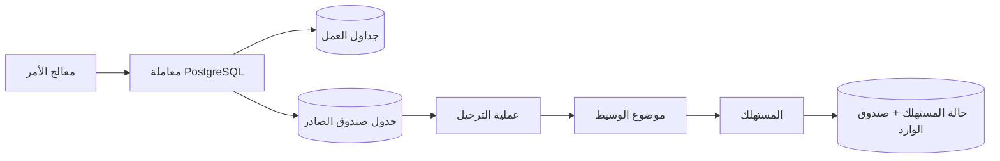

يحل نمط صندوق الصادر المعاملي مشكلة محددة بدقة: تثبيت حالة العمل ونية نشر حدث من دون معاملة موزعة. لكنه **لا** يضمن معالجة كل حدث مرة واحدة فقط، ولا ترتيبًا شاملًا، ولا تعافيًا تلقائيًا من كل حالة فشل.

لذلك يحتاج التصميم الموجّه إلى بيئات الإنتاج إلى نصفين. يكتب المنتج بيانات العمل وسجلًا في صندوق الصادر بصورة ذرية. وتنشر عملية الترحيل بدلالات «مرة واحدة على الأقل»، بينما يجعل كل مستهلك تغيير حالته آمنًا عند التكرار. أما العمل الهندسي الأصعب فيقع في الفجوة بين هذين النصفين: التسليم المكرر، ونطاق الترتيب، والأحداث المعيبة، وتنامي الأعمال المتراكمة، وتطور المخططات، والرؤية التشغيلية.

تقدم هذه المقالة معمارية مرجعية لهذا المسار المتكامل.

## حالة الفشل التي أدت إلى ظهور النمط

لنفترض وجود خدمة طلبات يجب أن تحدّث PostgreSQL وتنشر `OrderCreated` إلى Kafka أو وسيط رسائل آخر. ينفذ الحل البديهي عمليتي كتابة مستقلتين:

```ts
await orders.insert(order)
await broker.publish("order.created", event)
```

لا يوجد ترتيب آمن لهذين الاستدعاءين.

إذا ثُبّتت معاملة قاعدة البيانات أولًا وتعطلت العملية قبل النشر، فسيكون الطلب موجودًا من دون أن تعرف به الأنظمة اللاحقة. وإذا نُشر الحدث أولًا ثم أُعيدت معاملة قاعدة البيانات إلى حالتها السابقة، فسيتفاعل المستهلكون مع طلب غير موجود. وقد تؤدي إعادة محاولة الطلب بأكمله إلى مشكلة ثالثة: تكرار آثار العمل.

يستبدل صندوق الصادر المعاملي عمليتي الكتابة هاتين بمعاملة محلية واحدة في قاعدة البيانات. تكتب الخدمة سجل العمل وغلافًا دائمًا للحدث في آن واحد. ثم تتولى عملية ترحيل مستقلة نشر صفوف صندوق الصادر المثبتة لاحقًا. هذا هو جوهر النمط الذي تشرحه [Microservices.io](https://microservices.io/patterns/data/transactional-outbox.html) و[AWS Prescriptive Guidance](https://docs.aws.amazon.com/prescriptive-guidance/latest/cloud-design-patterns/transactional-outbox.html).



تُرسّخ معاملة قاعدة البيانات ثابتة مفيدة:

> إذا ثُبّت تغيير العمل، فستكون نية النشر موجودة. وإذا أُعيدت المعاملة، فلن يوجد أي من السجلين.

هذا الضمان أقوى من النشر القائم على بذل أفضل جهد، لكنه أضيق أيضًا من ضمان «مرة واحدة فقط».

## صمّم غلاف الحدث قبل عملية الترحيل

ينبغي ألا يكون صف صندوق الصادر مجرد حمولة JSON اعتباطية؛ فهو عقد دائم وسجل تشغيلي. وقد يتضمن جدول عملي في PostgreSQL ما يلي:

```sql
CREATE TABLE outbox_events (
  id uuid PRIMARY KEY,
  aggregate_type text NOT NULL,
  aggregate_id text NOT NULL,
  aggregate_version bigint NOT NULL,
  event_type text NOT NULL,
  schema_version integer NOT NULL,
  payload jsonb NOT NULL,
  trace_id text,
  created_at timestamptz NOT NULL DEFAULT now(),
  published_at timestamptz,
  attempt_count integer NOT NULL DEFAULT 0,
  next_attempt_at timestamptz NOT NULL DEFAULT now(),
  last_error text
);

CREATE INDEX outbox_pending_idx
  ON outbox_events (next_attempt_at, created_at)
  WHERE published_at IS NULL;
```

يمثل معرّف الحدث هوية إزالة التكرار. ويحدد `aggregate_id` و`aggregate_version` نطاق الترتيب. أما `schema_version` فيجعل تطور الحمولة صريحًا. وتجعل الطوابع الزمنية وبيانات المحاولات عملية الترحيل قابلة للمراقبة بدلًا من أن تكون صندوقًا مغلقًا.

أدرج الحدث في المعاملة نفسها التي تحتوي على تحديث العمل:

```ts
await db.transaction(async (tx) => {
  const order = await tx.orders.create(command)

  await tx.outboxEvents.insert({
    id: crypto.randomUUID(),
    aggregateType: "order",
    aggregateId: order.id,
    aggregateVersion: order.version,
    eventType: "order.created",
    schemaVersion: 1,
    payload: { orderId: order.id, customerId: order.customerId },
    traceId: currentTraceId()
  })
})
```

حد المعاملة غير قابل للتفاوض. فقد يعيد مساعد في طبقة المستودع يفتح اتصالًا خاصًا به، أو خطاف ORM يعمل بعد التثبيت، أو باعث أحداث غير متزامن داخل مسار الطلب، إدخال مشكلة الكتابة المزدوجة بصمت.

## لا تستطيع عملية الترحيل سد آخر فجوة ذرية

تقرأ عملية الترحيل الصفوف المعلقة، وتنشرها، ثم تضع عليها علامة النشر. ومع ذلك، فهي لا تزال تتعامل مع نظامين: وسيط الرسائل وPostgreSQL. ولا يمكن لأي معاملة محلية أن تغطيهما معًا بصورة ذرية.

التسلسل الحرج هو:

1. نشر الحدث.
2. يرسل وسيط الرسائل إقرار الاستلام.
3. تتعطل عملية الترحيل قبل تعيين `published_at`.
4. تُعاد عملية الترحيل وتنشر الحدث نفسه مرة أخرى.

تشير Microservices.io صراحةً إلى نافذة النشر المكرر هذه. وتوصي AWS كذلك بأن يكون المستهلكون آمنين عند التكرار، لأن عملية ترحيل صندوق الصادر أو وسيط الرسائل قد يسلّمان الحدث أكثر من مرة. لذلك يكون عقد التسليم الصادق عادةً **مرة واحدة على الأقل**.

لهذه الصياغة أهميتها. فكثيرًا ما يُستخدم تعبير «مرة واحدة فقط» على نطاق أوسع مما ينبغي. قد يزيل وسيط الرسائل تكرار عملية نشر ضمن نطاق محدود، لكنه لا يستطيع ضمان وقوع أثر جانبي خارجي، مثل تحصيل دفعة من بطاقة أو إرسال بريد إلكتروني أو تغيير قاعدة بيانات أخرى، مرة واحدة فقط ما لم يشارك المستهلك في بروتوكول ذري مناسب أو بروتوكول يضمن عدم تكرار الأثر.

## اجمع حالة المستهلك وإزالة التكرار في معاملة واحدة

يمنح جدول منفصل باسم `processed_events`، أو جدول صندوق وارد، المستهلك ذاكرة دائمة:

```sql
CREATE TABLE processed_events (
  consumer_name text NOT NULL,
  event_id uuid NOT NULL,
  processed_at timestamptz NOT NULL DEFAULT now(),
  PRIMARY KEY (consumer_name, event_id)
);
```

يبدأ المستهلك معاملة في قاعدة البيانات، ويدرج هوية الحدث، ويطبق تغيير العمل ضمن المعاملة نفسها. ويرفض المفتاح الأساسي الأحداث المكررة. تصف Microservices.io هذا النهج باسم [نمط المستهلك الآمن عند التكرار](https://microservices.io/patterns/communication-style/idempotent-consumer.html).

```ts
await consumerDb.transaction(async (tx) => {
  const accepted = await tx.processedEvents.insertIfAbsent({
    consumerName: "inventory-reserver",
    eventId: message.id
  })

  if (!accepted) return

  await tx.inventory.reserve({
    orderId: message.payload.orderId,
    items: message.payload.items
  })
})
```

لا تقرّ باستلام رسالة الوسيط إلا بعد تثبيت المعاملة. فإذا تعطلت العملية قبل التثبيت، يعيد الوسيط التسليم ويُنفذ العمل مرة أخرى. وإذا تعطلت بعد التثبيت وقبل الإقرار، فسيصطدم التسليم المتكرر بقيد التفرد ويتحول إلى عملية لا أثر لها.

ثمة قيد مهم: يحمي هذا الأسلوب آثار قاعدة البيانات الواقعة داخل المعاملة. أما استدعاء HTTP أو إرسال بريد إلكتروني أو طلب دفع، فيظل خارجها. بالنسبة إلى هذه الآثار، مرّر مفتاحًا ثابتًا لعدم التكرار إلى النظام اللاحق متى كان ذلك مدعومًا. وإلا فمثّل الأثر الجانبي في صورة تدفق عمل دائم آخر له حالته الخاصة، وعملية تسوية، ودرجة عدم يقين موضحة صراحةً.

## الترتيب متطلب محدد النطاق، لا وعد شامل

تقول شروحات كثيرة إن صندوق الصادر «يحافظ على الترتيب» من دون تحديد ما يجب ترتيبه. فالترتيب الشامل لكل الأحداث مكلف ونادرًا ما يكون ضروريًا. والمتطلب المفيد يكون عادةً على مستوى كل كيان مجمّع: يجب أن تصل تحديثات الطلب `A` بترتيب الإصدارات، بينما يستطيع الطلب `B` التقدم بصورة مستقلة.

استخدم `aggregate_id` مفتاحًا لقسم وسيط الرسائل، وضمّن `aggregate_version` متزايدًا رتيبًا. عندها يستطيع المستهلك رفض الإصدارات القديمة، أو تخزين الفجوات مؤقتًا، أو تشغيل عملية تسوية. لا تعتمد على `created_at` وحده؛ إذ قد تنتج المعاملات المتزامنة طوابع زمنية لا تعكس تسلسل العمل، وقد تنشر عدة عمليات ترحيل كيانات مجمّعة مختلفة بالتوازي.

يمكن لعملية الترحيل استخدام `FOR UPDATE SKIP LOCKED` كي يتولى العمّال صفوفًا معلقة مختلفة. توضح [وثائق PostgreSQL](https://www.postgresql.org/docs/current/sql-select.html) أن `SKIP LOCKED` يقدم رؤية غير متسقة ولا يناسب الاستعلامات العامة، لكنه مفيد لتجنب التنازع بين عدة مستهلكين لجدول يشبه الطابور. وهذا يجعله مناسبًا للمطالبة بالعمل، لا لإثبات ترتيب العمل. أما التقسيم حسب مفتاح الكيان المجمّع أو إجراء تسلسل لأحداث كل كيان معلقة، فلا يزال يتطلب تصميمًا مقصودًا.

## يحل الاستطلاع وCDC مشكلات تشغيلية مختلفة

تُعد عملية الترحيل بالاستطلاع خيارًا افتراضيًا جيدًا عندما تكون متطلبات الإنتاجية وزمن الاستجابة متوسطة. فهي سهلة الفهم والنشر وتصحيح الأخطاء. كما يظل حجم الدفعة، وفاصل الاستطلاع، وأقفال الصفوف، والتراجع بين محاولات إعادة التنفيذ، وسياسة الاحتفاظ، قرارات واضحة في التطبيق.

ينقل التقاط تغييرات البيانات النشر إلى موضع أقرب من سجل قاعدة البيانات. يلتقط [Outbox Event Router](https://debezium.io/documentation/reference/stable/transformations/outbox-event-router.html) في Debezium تغييرات جدول صندوق الصادر، ويستطيع توجيه الرسائل باستخدام حقول الكيان المجمّع والحدث. ويمكن لـCDC خفض حمل الاستطلاع وتقليل زمن النشر، لكنه يضيف إعدادات الموصل، وفتحات النسخ المتماثل، وافتراضات المخطط، ونطاق فشل جديدًا.

اختر بناءً على قيود مقيسة:

- **الاستطلاع** عندما تكون البساطة مهمة ويكون تأخر بسيط في النشر مقبولًا.
- **CDC** عندما يبرر الحجم المستمر أو زمن الاستجابة الأقل أو وجود عمليات Kafka Connect بالفعل توسيع نطاق المنصة.

لا تعتمد CDC لمجرد تجنب كتابة عملية استطلاع قصيرة. فما زال الموصل بحاجة إلى المراقبة والترقية والتأمين والاستعادة.

## شغّل صندوق الصادر بوصفه نظامًا فرعيًا للموثوقية

يوضح العرض التجريبي الناجح أن الأحداث تتحرك. أما النظام القابل للتشغيل فيوضح متى تتوقف عن الحركة.

اكشف، في الحد الأدنى، عن المقاييس التالية:

- عمر أقدم حدث غير منشور.
- عدد الأحداث المعلقة.
- محاولات النشر ومعدل الفشل.
- إنتاجية عملية الترحيل ومدة الدفعة.
- عدد أحداث قائمة الرسائل غير القابلة للتسليم أو حالات الفشل النهائية.
- تأخر المستهلك وعدد الأحداث المكررة.
- ربط التتبع لكل حدث من الأمر إلى المستهلك.
- نمو الجدول وسلامة الفهارس وتقدم التنظيف.

أطلق التنبيه بناءً على عمر التأخر، لا على عمق الطابور وحده. فقد تكون عشرة أحداث قديمة ضمن تدفق عمل حرج أهم من عشرة آلاف حدث تحليلي جديد. أبقِ السجلات الفاشلة قابلة للفحص، مع تنقيح الحمولات الحساسة أو تجنبها. وينبغي لأداة إعادة التشغيل أن تحدد معرّفات أحداث ثابتة، وتحافظ على قابلية التتبع، وتتطلب تسجيل سبب، بدلًا من تنفيذ أمر «أعد محاولة الكل» بلا حدود.

تحتاج الأحداث المعيبة إلى سياسة محدودة. يمنع التراجع الأسي اعتمادًا معطلًا من إنشاء حلقة محاولات ساخنة. ويمكن لحد أقصى للمحاولات أن ينقل الحدث إلى حالة فشل قابلة للمراجعة، لكن يجب ألا يحوّل نية النشر المضمونة بهدوء إلى فقد دائم. وينبغي لدليل التشغيل أن يحدد مالك الحدث، وكيفية إصلاحه، وطريقة التحقق من الحالة اللاحقة بعد إعادة التشغيل.

الاحتفاظ بالبيانات قرار تصميمي أيضًا. يؤدي حذف الصفوف المنشورة إلى ضبط نمو الجدول، لكن حذفها فورًا يضعف التدقيق والتسوية. لذا أرشف أو احتفظ بقدر كافٍ من بيانات الهوية والتوقيت للتحقيق في نوافذ الفشل التي يدّعي النظام قدرته على التعامل معها.

## اختبر الحدود، لا المسار السعيد وحده

توقف أكثر الاختبارات قيمة العملية في لحظات حرجة:

1. أعد معاملة العمل إلى حالتها السابقة وتحقق من عدم وجود صف في صندوق الصادر.
2. ثبّت كلا الصفين، وأبقِ وسيط الرسائل غير متاح، ثم تحقق من النشر لاحقًا.
3. انشر بنجاح، وعطّل العملية قبل تعيين `published_at`، وتحقق من التسليم المكرر.
4. سلّم النسخة المكررة بالتزامن إلى مثيلين من المستهلك وتحقق من وقوع أثر عمل واحد.
5. انشر الإصدارات بترتيب مخالف وتحقق من السياسة التي اختارها المستهلك.
6. مرّر إصدار مخطط غير صالح وتحقق من عزله وإصدار إشارة قابلة للتنفيذ.
7. أبقِ حدثًا معيبًا قيد إعادة المحاولة وتأكد من استمرار الكيانات المجمّعة الأحدث والمستقلة.
8. أنشئ أعمالًا متراكمة بحجم يكفي لاختبار الفهارس، ومدة الدفعة، ومعدل التعافي.

تحدد هذه الاختبارات ادعاء الموثوقية. ومن دونها، تحتوي المعمارية على آليات مفيدة، لكن لا يوجد دليل على صحة سلوكها عند الفشل.

## خلاصة عملية

استخدم صندوق الصادر المعاملي عندما تحتاج خدمة إلى تثبيت حالة محلية والإعلان عن ذلك التغيير بموثوقية من دون ربط معاملتها بوسيط رسائل. ثم كن دقيقًا بشأن ما لا يحله هذا النمط.

يتكون التصميم الكامل مما يلي:

1. تثبيت حالة العمل ونية الحدث في معاملة واحدة في قاعدة البيانات.
2. عملية ترحيل تفترض أنها قد تنشر أكثر من مرة.
3. هويات ثابتة للأحداث ونطاق ترتيب محدد.
4. مستهلكون يثبتون إزالة التكرار وآثار العمل معًا.
5. آلية مستقلة لعدم تكرار الآثار الجانبية الخارجية أو تسويتها.
6. التعامل مع التأخر، وإعادة المحاولة، وحالات الفشل، والاحتفاظ بالبيانات بوصفها حالة تشغيلية.
7. اختبارات لحقن حالات الفشل تثبت صحة العقد.

يزيل صندوق الصادر إحدى عمليات الكتابة المزدوجة الخطرة. أما الموثوقية، فتأتي من تصميم بقية المسار بالقدر نفسه من العناية.
