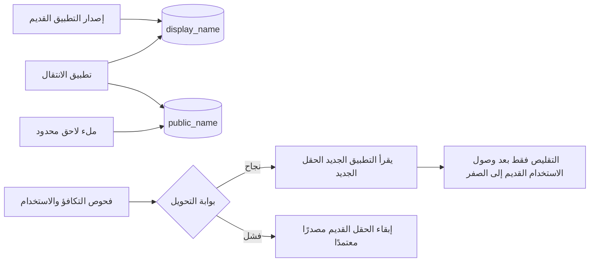

تستطيع معاملة قاعدة بيانات جعل عملية واحدة على المخطط ذرية، لكنها لا تستطيع جعل نشر متدرج ذريًا عبر مثيلات التطبيق ومجمعات الاتصالات وعمّال الخلفية والمخططات المخزنة مؤقتًا وعملية ملء لاحق جارية.

لذلك من الأفضل معاملة الترحيل الآمن أثناء التشغيل بوصفه **بروتوكول توافق**. يجب أن تدعم قاعدة البيانات، لفترة محدودة، الشيفرة القديمة والجديدة معًا. ويحتاج الانتقال إلى شروط دخول صريحة، وثوابت قابلة للمراقبة، واتجاه للتراجع، وخطوة تدميرية مؤجلة.

النمط العملي هو التوسيع، والترحيل، والتحقق، والتحويل، ثم التقليص. والجزء الصعب ليس كتابة المخطط النهائي، بل إثبات أن المخطط القديم لم يعد جزءًا من عقد وقت التشغيل.

## تداخل عمليات النشر هو القيد الحقيقي

يشغّل الإصدار المتدرج عمدًا أكثر من نسخة واحدة من التطبيق في الوقت نفسه. وحتى بعد أن تعلن وحدة التحكم في النشر النجاح، قد تظل عمليات قديمة أو مهام مجدولة أو عمليات طويلة العمر موجودة. ويغير إعادة تسمية مباشرة كهذه عقد قاعدة البيانات فورًا:

```sql
ALTER TABLE accounts RENAME COLUMN display_name TO public_name;
```

يمكن أن يفشل الآن كل استعلام لا يزال قيد التشغيل ويشير إلى `display_name`. ولا يحدد تغليف إعادة التسمية بمعاملة سوى ما إذا كانت ستُثبّت؛ فهو لا يحدّث هؤلاء المتصلين في اللحظة نفسها.

يعالج التغيير المتوازي، المعروف أيضًا بالتوسيع والتقليص، ذلك عبر دعم الواجهتين القديمة والجديدة خلال مرحلة الترحيل. يقسم وصف Martin Fowler النمط إلى التوسيع والترحيل والتقليص، مع التكلفة الصريحة المتمثلة في وجوب تعايش واجهتين مؤقتًا ([التغيير المتوازي](https://martinfowler.com/bliki/ParallelChange.html)). وتوضح إرشادات الترحيل لدى GitLab الواقع التشغيلي نفسه: تُفصل إزالة الأعمدة التدميرية عبر إصدارات متعددة، لأن العمليات قيد التشغيل وذاكرات المخطط المؤقتة قد تظل تتوقع وجود العمود ([تجنب التوقف أثناء الترحيلات](https://docs.gitlab.com/development/database/avoiding_downtime_in_migrations/)).

ينبغي تصميم نافذة التوافق، لا اكتشافها أثناء النشر.



## المرحلة 1: وسّع من دون تغيير السلوك القائم

يضيف الإصدار الأول البنية المستهدفة مع الحفاظ على كل ما يحتاج إليه التطبيق الحالي:

```sql
SET lock_timeout = '1s';
SET statement_timeout = '10s';

ALTER TABLE accounts
  ADD COLUMN public_name text;
```

القيم توضيحية وليست توصيات عامة. تعرّف PostgreSQL `lock_timeout` بأنه أقصى وقت تنتظره تعليمة للحصول على قفل، بينما يحد `statement_timeout` إجمالي وقت تنفيذ التعليمة ([إعدادات اتصال العميل الافتراضية](https://www.postgresql.org/docs/current/runtime-config-client.html#GUC-LOCK-TIMEOUT)). وتجعل مهلة القفل القصيرة الترحيل يفشل بدلًا من الانتظار خلف معاملة طويلة فيما تصطف الاستعلامات اللاحقة وراءه. وتعتمد الحدود الصحيحة على حركة المرور ومدة المعاملات وحجم الجدول وسياسة إعادة المحاولة.

ينبغي أن يكون التوسيع إضافيًا. يبدأ العمود الجديد بالسماح بقيمة NULL لأن المثيلات القديمة لا تعرف عنه شيئًا. ولو أُضيف `NOT NULL` فورًا لفشلت كتاباتها الصالحة. وقد تكون القيمة الافتراضية مناسبة، لكن يجب أن تمثّل المجال الحقيقي بدلًا من إخفاء حالة ترحيل غير مكتملة.

قبل الإنتاج، افحص تعليمة DDL الدقيقة على إصدار PostgreSQL المنشور. تختلف مستويات أقفال `ALTER TABLE` باختلاف الأمر الفرعي، وتذكر PostgreSQL أن قفل `ACCESS EXCLUSIVE` يُحصل عليه ما لم يوثق شكل فرعي خلاف ذلك ([ALTER TABLE](https://www.postgresql.org/docs/current/sql-altertable.html)). وقد تسبب عملية بيانات وصفية سريعة انقطاعًا إذا انتظرت في طابور الأقفال في اللحظة الخطأ.

## المرحلة 2: اجعل الكتابات الجديدة متوافقة

يكتب تطبيق الانتقال التمثيلين معًا بينما تظل القراءات على القديم. ولعمودين في الصف نفسه، أبقِ التحديث في تعليمة واحدة أو معاملة واحدة في قاعدة البيانات:

```sql
UPDATE accounts
SET display_name = $1,
    public_name = $1,
    updated_at = now()
WHERE id = $2;
```

يزيل هذا فئة من انحراف الكتابة الجزئية، لكن الكتابة المزدوجة تظل عبئًا مؤقتًا. يجب أن يشارك كل مسار للتغيير: تحديثات واجهة API، وعمليات الاستيراد، والنصوص البرمجية الإدارية، ومستهلكات الأحداث، ومهام الإصلاح، والإجراءات داخل قاعدة البيانات. فإذا حدّث مسار واحد العمود القديم فقط، يتراجع التكافؤ. وإذا امتلكت خدمات مستقلة هذه المسارات، فقد لا تعود معاملة محلية واحدة قادرة على تغطية الأثرين.

أضف أدوات القياس إلى الانتقال قبل الملء اللاحق:

- احسب الصفوف التي تكون فيها إحدى القيمتين NULL والأخرى ليست NULL؛
- احسب الصفوف التي تختلف فيها القيم بعد التطبيع؛
- ضع وسم إصدار التطبيق على الكتابات؛
- سجل إخفاقات الكتابة المزدوجة وإعادات محاولة الترحيل؛
- حدد الاستعلامات التي ما زالت تقرأ العمود القديم.

لا تحوّل القراءات لمجرد اكتمال النشر. حوّلها عندما تستوفي البيانات والجهات المتصلة شرطًا صريحًا وثابتًا.

## المرحلة 3: عامل الملء اللاحق بوصفه حركة مرور إنتاجية مضبوطة

قد ينشئ `UPDATE` واحد غير محدود معاملة طويلة، ويولد قدرًا كبيرًا من سجل الكتابة المسبقة، ويحتفظ بصفوف ميتة، ويزيد تأخر النسخ المتماثلة، وينازع كتابات التطبيق، ويجعل الإلغاء مكلفًا. عامل الملء اللاحق بوصفه حمل عمل له معدل وتقدم وآليات إيقاف مؤقت.

في ما يلي شكل بسيط في PostgreSQL لدفعة صغيرة قابلة للتكرار:

```sql
WITH batch AS (
  SELECT id
  FROM accounts
  WHERE public_name IS NULL
  ORDER BY id
  LIMIT 1000
  FOR UPDATE SKIP LOCKED
)
UPDATE accounts AS a
SET public_name = a.display_name
FROM batch
WHERE a.id = batch.id
  AND a.public_name IS NULL;
```

حجم الدفعة توضيحي. ويجعل فحص NULL الثاني إعادات المحاولة أكثر أمانًا ويمنع الملء اللاحق من استبدال قيمة أنشأتها شيفرة الانتقال بالتزامن. ويمكن لـ`SKIP LOCKED` مساعدة عدة عمّال على تجنب انتظار الصفوف المختارة نفسها، لكنه لا يضمن الإنصاف ولا يثبت زيارة كل صف في النهاية. ويظل الإكمال بحاجة إلى فحص نهائي شامل.

اضبط المعدل باستخدام سلوك قاعدة البيانات المرصود، لا مدة نوم ثابتة منسوخة من نظام آخر. راقب زمن الدفعة، وانتظار الأقفال، وتأخر النسخ المتماثلة، ووحدة المعالجة المركزية، والإدخال والإخراج، والصفوف الميتة، ونشاط التفريغ التلقائي، ومعدل الخطأ، وزمن استجابة التطبيق. أوقف مؤقتًا تلقائيًا عند تجاوز عتبة سلامة محددة. وسجل مؤشرًا دائمًا أو صمّم كل دفعة لتكون قابلة للاكتشاف بأمان من جديد بعد إعادة التشغيل.

والأهم هو تحديد التكافؤ الدلالي. فنسخ سلسلة نصية مباشر، لكن تحويل نوع أو تقسيم حقل أو إزالة التكرار أو التطبيع قد لا يكون قابلًا للعكس. يستخدم دليل التوسيع والتقليص في Prisma تقسيم الاسم لتوضيح سبب إمكان غموض تحولات البيانات التي تبدو بسيطة ([استخدام نمط التوسيع والتقليص](https://www.prisma.io/dataguide/types/relational/expand-and-contract-pattern)). يجب أن يحدد الترحيل كيفية التعامل مع الصفوف الاستثنائية بدلًا من التخمين بصمت.

## المرحلة 4: تحقّق قبل تغيير مسار القراءة

ينبغي أن تجيب بوابة التحويل عن أربعة أسئلة:

1. **التغطية:** هل مُلئت كل الصفوف المؤهلة في البنية الجديدة؟
2. **التكافؤ:** هل يتفق التمثيلان القديم والجديد وفق التحويل الموثق؟
3. **الحداثة:** هل تحافظ الكتابات الحالية على التكافؤ، لا الملء اللاحق التاريخي وحده؟
4. **التوافق:** هل تستطيع كل إصدارات التطبيق المنشورة والمؤهلة للتراجع العمل مع المخطط الموسع؟

شغّل قراءات ظل أو مقارنات على عينات قبل أن يصبح الحقل الجديد مصدرًا معتمدًا. ثم انقل القراءات خلف إصدار مضبوط أو علامة ميزة مع استمرار الكتابة المزدوجة. وراقب أخطاء قاعدة البيانات، وقراءات الرجوع، وانحراف التكافؤ، وزمن الاستعلام، وإخفاقات التحقق على مستوى العمل.

يعني التراجع في هذه المرحلة إعادة القراءات إلى التمثيل القديم. ولا يكون ذلك آمنًا إلا ما دام التمثيل القديم يتلقى كل الكتابات التي يحتاج إليها. وحين يبدأ النموذج الجديد بقبول معلومات لا يمكن تمثيلها في القديم، يصبح التراجع ترحيل بيانات مستقلًا. لا يكفي القول «لا يزال العمود القديم موجودًا».

## تقلل عمليات DDL أثناء التشغيل في PostgreSQL الحجب، لكنها لا تنشئ التوافق

تحتاج انتقالات المخطط غالبًا إلى فهارس وقيود. وتقدم PostgreSQL آليات مفيدة، لكل منها محاذير.

يحجب بناء الفهرس العادي الكتابات. ويسمح `CREATE INDEX CONCURRENTLY` بعمليات الإدراج والتحديث والحذف المتزامنة، لكن PostgreSQL توثّق عمليات مسح وانتظار وقيودًا إضافية، واحتمال بقاء فهرس غير صالح بعد الفشل ([CREATE INDEX](https://www.postgresql.org/docs/current/sql-createindex.html#SQL-CREATEINDEX-CONCURRENTLY)). ويجب مراقبته والتحقق من نتيجته:

```sql
CREATE INDEX CONCURRENTLY idx_accounts_public_name
  ON accounts (public_name);
```

بالنسبة إلى مفتاح خارجي أو قيد تحقق على بيانات موجودة، أضف فرض القيد على التغييرات الجديدة أولًا، ثم تحقق من الصفوف التاريخية بصورة منفصلة:

```sql
ALTER TABLE account_profiles
  ADD CONSTRAINT account_profiles_account_fk
  FOREIGN KEY (account_id)
  REFERENCES accounts(id)
  NOT VALID;

ALTER TABLE account_profiles
  VALIDATE CONSTRAINT account_profiles_account_fk;
```

تقدم PostgreSQL هذا بوصفه المسار الأقل أثرًا لإضافة مفتاح خارجي، ويشرح Squawk كيف يؤدي فصل `NOT VALID` عن `VALIDATE CONSTRAINT` إلى تجنب الاحتفاظ بقفل التحقق الحاجب للكتابة طوال عملية مسح الجدول ([أمثلة ALTER TABLE](https://www.postgresql.org/docs/current/sql-altertable.html)، [إرشادات Squawk للمفاتيح الخارجية](https://squawkhq.com/docs/adding-foreign-key-constraint)). ويظل تغيير البيانات الوصفية الأولي بحاجة إلى قفل، لذلك تظل مهلة القفل واستراتيجية إعادة المحاولة ضروريتين.

تحل هذه الميزات مشكلات التزامن على مستوى قاعدة البيانات. لكنها لا تثبت أن الشيفرة القديمة تتحمل قيدًا جديدًا، أو أن الملء اللاحق صحيح دلاليًا، أو أن التراجع ما زال ممكنًا.

## المرحلة 5: لا تقلّص إلا بالدليل

التنظيف التدميري عملية نشر منفصلة، لا السطر الأخير من ترحيل التوسيع. وقبل إسقاط `display_name`، اشترط دليلًا على أن:

- لا يقرأه أو يكتبه أي ملف ثنائي منشور؛
- لا يشير إليه أي عامل مؤجل أو تقرير أو عرض أو مشغّل أو دالة أو عملية تصدير أو تكامل مخصص؛
- لم تعد سياسة التراجع تتطلب إصدار التطبيق القديم؛
- ظل التكافؤ مستقرًا خلال نافذة مراقبة متفق عليها؛
- تغطي النسخ الاحتياطية وإجراءات التعافي الخطوة التدميرية؛
- للإزالة تحليل مستقل للأقفال ووقت التشغيل.

أوقف بعد ذلك الكتابة المزدوجة، وراقب مجددًا، وأزل البنية القديمة في تغيير مضبوط لاحق. توزّع إرشادات GitLab عمدًا بعض التغييرات التدميرية على عدة إصدارات، كي لا يُجمع سلوك التطبيق وذاكرات المخطط المؤقتة في إصدار واحد عالي المخاطر ([تجنب التوقف أثناء الترحيلات](https://docs.gitlab.com/development/database/avoiding_downtime_in_migrations/)).

الفشل الشائع هو عدم إكمال مرحلة التقليص. إذ تتحول الأعمدة والعلامات والمشغّلات وفروع التوافق المؤقتة إلى تعقيد دائم. امنح الترحيل مالكًا وسجل حالة ومهمة تنظيف وشرط انتهاء عند بدء التوسيع.

## اختبر الانتقال، لا الوجهة وحدها

يفوّت اختبار الترحيل الذي يبدأ بالمخطط القديم، ويطبق كل تعليمات DDL، ثم يشغّل التطبيق الجديد وحده فترة التداخل الخطرة. وينبغي لتمرين مفيد أن:

1. يشغّل إصداري التطبيق القديم والجديد بالتزامن مع المخطط الموسع؛
2. يولّد كتابات عبر كل مسار تغيير معروف أثناء الملء اللاحق؛
3. يوقف الملء اللاحق ويعيد تشغيله عند دفعات اعتباطية؛
4. يفرض إخفاقات مهلة القفل ومهلة التعليمة؛
5. ينشئ انحرافًا في التكافؤ ويتحقق من أن بوابة التحويل تحجبه؛
6. يحوّل القراءات إلى الأمام ثم يتراجع بها مع بقاء الكتابة المزدوجة نشطة؛
7. يجعل بناء فهرس متزامن يفشل ويتحقق من معالجة الفهرس غير الصالح؛
8. يقيس انتظار الأقفال، وتأخر النسخ المتماثلة، وإنتاجية الدفعات، وزمن استجابة التطبيق، ومعدلات الخطأ؛
9. يثبت رفض التقليص ما دام أي متصل قديم موجودًا؛
10. يتمرن على التعافي من العملية التدميرية النهائية.

«انعدام وقت التوقف» ليس خاصية لإطار ترحيل أو كلمة محجوزة في SQL. بل هو نتيجة مقيسة لنموذج حركة مرور، وطوبولوجيا نشر، وإصدار قاعدة بيانات، ونطاق فشل محددين.

## خلاصة عملية

يبدأ التطوير الآمن للمخطط بسؤال واحد: **أي إصدارات التطبيق وتمثيلات البيانات يجب أن تتعايش في كل خطوة؟**

وسّع بصورة إضافية. واجعل كتابات الانتقال ذرية حيثما أمكن. ونفّذ الملء اللاحق في دفعات محدودة وقابلة للمراقبة وإعادة التشغيل. وتحقق من التغطية والتكافؤ والحداثة وتوافق التراجع قبل نقل القراءات. واستخدم آليات PostgreSQL لبناء الفهارس بالتزامن والتحقق المؤجل مع سلوك الأقفال الموثق لها، لا بوصفها تسميات سحرية. ولا تقلّص إلا بعد أن تظهر أدلة وقت التشغيل توقف استخدام الواجهة القديمة.

تظل المعاملات مهمة؛ فهي تحمي انتقالات الحالة المحلية. أما نجاح الترحيل الأكبر، فيأتي من تصميم الفريق للتوافق عبر الزمن.

---
