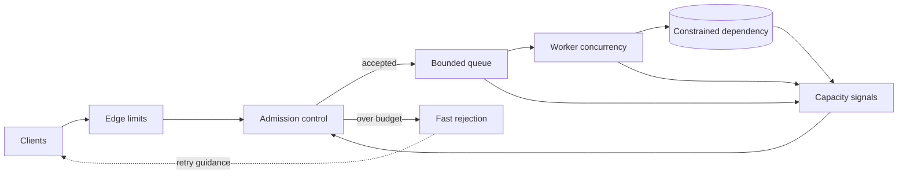

Ein Dienst fällt selten genau in dem Moment aus, in dem die Nachfrage seine Kapazität übersteigt. Meist scheitert er später, nachdem sich überschüssige Arbeit in Queues, Thread-Pools, Connection-Pools und den Retry-Schleifen der Clients angesammelt hat.

Diese Verzögerung macht Überlastung tückisch. Der Dienst kann bereits nicht mehr mithalten, nimmt aber weiterhin Requests an. Die Latenz steigt, Deadlines laufen ab, Clients wiederholen ihre Aufrufe, und diese Retries verbrauchen ausgerechnet die Kapazität, die zum Abschluss nützlicher Arbeit fehlt. Aus einer kurzen Lastspitze wird ein selbsttragender Rückstau.

Ein belastbarer Entwurf braucht deshalb einen gemeinsamen Vertrag über den gesamten Request-Pfad. Backpressure fordert Produzenten zum Drosseln auf. Admission Control entscheidet, ob neue Arbeit eintreten darf. Load Shedding weist Arbeit ab, die sich innerhalb des verfügbaren Budgets nicht mehr abschließen lässt. Begrenzte Queues machen das Limit sichtbar. Die Retry-Policy verhindert, dass eine Abweisung sofort noch mehr Last erzeugt.

Dieser Artikel beschreibt diesen Vertrag als Referenzarchitektur. Er erläutert allgemeine Mechanismen und Tests, nicht ein bestimmtes produktiv eingesetztes oder vermessenes System.

## Überlastung beginnt mit Wartezeit, nicht mit CPU

Eine hohe CPU-Auslastung kann ein hilfreiches Signal sein, doch Überlastung ist umfassender. Ein Dienst kann an Datenbankverbindungen, Arbeitsspeicher, File Descriptors, Downstream-Concurrency, einer einzelnen heißen Partition oder einem externen Rate Limit scheitern. Auch bei moderater Durchschnittsauslastung kann eine teure Request-Klasse sämtliche günstigen Requests blockieren.

Das früheste brauchbare Symptom ist häufig wachsende wartende Arbeit. Die Queue wird länger. Die Wartezeit auf einen Worker übersteigt die Ausführungszeit. Der Erwerb einer Verbindung verlangsamt sich. Requests nähern sich ihrer Deadline, bevor die Geschäftslogik überhaupt beginnt. Der Durchsatz steigt nicht mehr, obwohl weiterhin neue Arbeit eintrifft.

Eine unbegrenzte Queue verbirgt diesen Zustand. Sie ersetzt eine sofort sichtbare Abweisung durch spätere Timeouts und Speicherdruck. Außerdem erschwert sie die Erholung: Selbst nachdem die Nachfrage wieder normal ist, verarbeitet der Dienst alte Arbeit, die ein Client möglicherweise längst nicht mehr benötigt.

Die Spezifikation von [Reactive Streams](https://www.reactive-streams.org/) beschreibt das Kernproblem präzise: Ein asynchroner Empfänger darf nicht gezwungen sein, beliebig viele Daten eines schnelleren Produzenten zu puffern. Die Antwort ist nicht blockierende Backpressure über die asynchrone Grenze. Innerhalb eines Streams ist das notwendig. Ein vollständiger Dienst braucht darüber hinaus eine Regel für Traffic, der weder warten noch gedrosselt werden kann.

## Backpressure, Admission Control und Shedding wirken an verschiedenen Stellen

Die Mechanismen gehören zusammen, sind aber nicht austauschbar.

**Backpressure** übermittelt verfügbare Nachfrage an den Upstream. Ein Consumer fordert nur so viel an, wie er verarbeiten kann. Ein Streaming-Transport verzögert Writes. Ein Worker zieht keine weiteren Messages, solange sein Concurrency-Budget ausgeschöpft ist. Der Mechanismus ist kooperativ: Der Produzent muss auf das Signal reagieren.

**Admission Control** bewertet eine neue Arbeitseinheit, bevor sie knappe Ressourcen belegt. Die Prüfung kann aktuelle Concurrency, geschätzte Kosten, Tenant-Quota, Priorität, Deadline oder Downstream-Zustand berücksichtigen. Das Ergebnis lautet annehmen, vereinfacht bedienen, aufschieben oder ablehnen.

**Load Shedding** ist die bewusste Abweisung von Arbeit während einer Überlastung. So bleibt Kapazität für Aufgaben erhalten, die das System noch abschließen kann. Shedding ist kein außergewöhnlicher Crash-Pfad, sondern eine normale Kontrollaktion mit eigener Response, Metrik und Client-Regel.

**Begrenzte Queues** verbinden diese Stufen. Ihre Kapazität sollte durch Durchsatz und akzeptable Wartezeit begründet sein, nicht durch die größte von der Library unterstützte Ganzzahl. Ist das Limit erreicht, braucht das System eine definierte Reaktion, statt still weiteren Speicher zu reservieren.

Der [gRPC-Leitfaden zur Flow Control](https://grpc.io/docs/guides/flow-control/) erklärt, wie Streaming-RPCs verhindern, dass ein schneller Sender einen Empfänger überfordert. Er weist außerdem darauf hin, dass ein erfolgreicher Write lediglich bedeuten kann, dass die Daten an das Framework übergeben wurden und noch nicht im Netzwerk sind. Transport-Flow-Control schützt Buffer. Sie entscheidet nicht, ob die Geschäftsoperation überhaupt angenommen werden sollte.

## Den Regelkreis vor der knappen Ressource platzieren

Die Überlastungsgrenze muss vor der Ressource liegen, die sättigt. Wenn der Datenbank-Connection-Pool der Engpass ist, kommt eine Abweisung nach dem Erwerb einer Verbindung zu spät. Wenn CPU-intensives Parsing begrenzt, verschwendet eine vollständige Deserialisierung vor der Admission genau die Ressource, die geschützt werden soll.

Am Edge greifen günstige Schutzmechanismen wie Limits für Request-Größe, Authentifizierung, Tenant-Quotas und grobe Rate Limits. Danach entscheidet die Admission Control anhand lokaler Kapazitätssignale. Angenommene Arbeit gelangt in eine begrenzte Queue und einen limitierten Worker-Pool. Abgewiesene Arbeit erhält eine Response, aus der hervorgeht, ob ein Retry sinnvoll ist.

Damit bleibt die Entscheidung in der Nähe des Engpasses. Ein globaler Controller kann langfristige Quotas oder gewünschte Concurrency verteilen. Jede Instanz benötigt trotzdem einen schnellen lokalen Schutz. Eine zentrale Entscheidung, die erst nach Erschöpfung des lokalen Pools eintrifft, kann den Prozess nicht retten.

Der Kontrollpfad muss außerdem billiger als die abgewiesene Arbeit sein. Komplexe entfernte Policy-Aufrufe, vollständige Payload-Deserialisierung oder teure Authentifizierung nach der Sättigung können eine Abweisung fast so kostspielig wie die erfolgreiche Ausführung machen. Stabile Policy-Daten sollten lokal vorliegen, und die günstigste sichere Prüfung sollte zuerst erfolgen.

## Signale nach verbleibender Kapazität auswählen

Die Request-Rate allein ist ein schwaches Überlastungssignal, weil Requests sehr unterschiedliche Kosten haben können. Einer führt nur einen Cache-Lookup aus, ein anderer erzeugt Fan-out über mehrere Dienste und scannt eine große Ergebnismenge. Das Google-SRE-Kapitel zum [Umgang mit Überlastung](https://sre.google/sre-book/handling-overload/) beschreibt diese Einschränkung und empfiehlt, Ressourcenverbrauch direkt zu betrachten, statt Queries pro Sekunde mit Kapazität gleichzusetzen.

Brauchbare lokale Signale sind unter anderem:

1. In-flight-Arbeit im Verhältnis zu einem getesteten Concurrency-Limit.
2. Queue-Tiefe und Alter des ältesten wartenden Eintrags.
3. Worker-Auslastung und Event-Loop-Verzögerung.
4. Wartezeit auf Verbindungen zu Datenbank oder Downstream.
5. Verbleibendes Deadline-Budget bei der Admission.
6. Speicherdruck und Zeit in der Garbage Collection.
7. Aktuelle Latenz und Fehlerrate abhängiger Dienste.

Kein einzelnes Signal passt überall. Für rechenintensive Arbeit kann CPU sinnvoll sein, bei einer datenbankgebundenen API ist die Connection-Wartezeit direkter. Das Queue-Alter ist oft aussagekräftiger als die Tiefe, weil es den Rückstau mit der sichtbaren Latenz verbindet.

Ein Controller sollte nicht an exakt einem Schwellwert umschalten. Kleine Schwankungen können sonst schnelles Pendeln zwischen Annahme und Abweisung auslösen. Getrennte Öffnungs- und Schließwerte, geglättete Messungen oder ein adaptiver Concurrency-Algorithmus mit festen Minimal- und Maximalwerten sind stabiler. Auch ein adaptiver Regler braucht eine harte Sicherheitsgrenze.

Priorität muss ebenfalls begrenzt sein. Wenn jeder Caller seinen Request als kritisch markiert, hat die Einstufung keinen Wert. Sinnvoll ist eine kleine, geprüfte Anzahl von Klassen mit bewusst reservierter Kapazität. Administrative Health Checks sollten so günstig und unabhängig sein, dass sie Überlastung melden, statt selbst in derselben Queue zu hängen.

## Queues anhand des Wartebudgets begrenzen

Eine Queue ist sinnvoll, wenn sie normale Schwankungen in der Einplanung auffängt. Gefährlich wird sie, wenn sie mehr Arbeit speichert, als bis zur jeweiligen Deadline abgeschlossen werden kann.

Ein praktisches Limit beginnt mit Service-Rate und akzeptabler Queue-Wartezeit. Schließen Worker ungefähr 200 Operationen pro Sekunde ab und sind maximal 250 Millisekunden Wartezeit zulässig, ergeben 50 wartende Operationen einen groben Ausgangspunkt. Das ist nur eine Illustration zur Dimensionierung. Reale Workloads benötigen gemessene Verteilungen der Bearbeitungszeit und Fehlertests.

Das Alter sollte sowohl bei der Annahme als auch vor der Ausführung geprüft werden. Ein Request kann beim Eintritt noch gültig, beim Erreichen eines Workers aber bereits bedeutungslos sein. Das Verwerfen abgelaufener Arbeit vor teurer Verarbeitung bewahrt Kapazität und verhindert eine Response, nachdem der Caller aufgegeben hat.

Getrennte Queues können latenzkritische Arbeit vor Bulk-Work schützen. Jede Queue braucht trotzdem ein Limit und eine Scheduling-Regel. Eine Priority Queue ohne Schutz vor Starvation kann Arbeit niedriger Priorität unbegrenzt verschieben. Eine einzelne FIFO-Queue kann Head-of-line Blocking erzeugen, wenn ein teurer Eintrag viele günstige verzögert.

Bei dauerhafter asynchroner Arbeit kann Abweisung bedeuten, vor dem Erstellen eines Jobs eine Overload-Response zu liefern. Sobald ein Job dauerhaft angenommen wurde, hat der Dienst ein anderes Versprechen gegeben und benötigt Aufbewahrungs-, Retry- und Abschlusssemantik. Dauerhafte Annahme zu bestätigen und den Job später wegen einer vollen In-Memory-Queue zu verlieren, ist kein Load Shedding.

## Abweisung als Teil des Client-Protokolls behandeln

Eine schnelle Abweisung hilft nur, wenn Caller sie korrekt auswerten. Ein überlasteter Dienst sollte einen spezifischen Status, einen stabilen maschinenlesbaren Grund und gegebenenfalls Retry-Hinweise liefern. HTTP-Dienste unterscheiden üblicherweise Überlastung oder temporäre Nichtverfügbarkeit von Validierungs- und Berechtigungsfehlern. Streaming- und Messaging-Systeme benötigen gleichwertige typisierte Ergebnisse.

Retries brauchen exponentiellen Backoff, Jitter, eine begrenzte Anzahl von Versuchen und die ursprüngliche End-to-End-Deadline. Ein Retry nach Ablauf dieser Deadline kann keinen Nutzen mehr liefern. Sofortige Wiederholungen von Tausenden Clients können sich zu einem Retry Storm synchronisieren und den Backend-Dienst auch nach dem ursprünglichen Peak überlastet halten.

Retry-Budgets begrenzen das Verhältnis wiederholter zu ursprünglichen Requests. Damit kann ein Client nicht jeden Fehler als Erlaubnis für zusätzliche Last behandeln. Lokales clientseitiges Throttling kann Aufrufe sogar verwerfen, bevor sie einen Backend-Dienst erreichen, der bereits Traffic ablehnt.

Nur Operationen mit geeigneter Semantik dürfen wiederholt werden. Reads sind häufig unkritisch. Writes benötigen möglicherweise einen Idempotency Key oder eine Abfrage des Operation-Status. Überlastungsschutz beseitigt das Risiko doppelter Effekte nicht.

Eine degradierte Response ist möglich, wenn günstigere Arbeit weiterhin Wert liefert. Ein Dienst kann teure Anreicherung weglassen, Cache-Daten mit ausgewiesener Aktualität liefern oder Fan-out reduzieren. Die Variante muss tatsächlich weniger von der gesättigten Ressource benötigen. Eine kleinere Response hilft nicht, wenn die teure Datenbankabfrage bereits ausgeführt wurde.

## Angenommene und abgewiesene Arbeit gemeinsam beobachten

Ein Dashboard mit ausschließlich erfolgreichem Durchsatz kann Shedding wie Erholung aussehen lassen. Der Dienst bedient die angenommenen Requests schnell und weist gleichzeitig die Hälfte der Nachfrage ab.

Ankünfte, Annahmen, Abweisungen, Abschlüsse, Retries, Queue-Tiefe, Queue-Alter, In-flight-Arbeit und Downstream-Sättigung gehören auf dieselbe Zeitachse. Abweisungen sollten nach Grund, Tenant, Route und Priorität aufgeschlüsselt sein, ohne sensible Identitäten offenzulegen. Die Latenz beginnt beim Eintreffen am Client-Pfad und nicht erst mit dem Start eines Workers.

Entscheidend ist das Verhältnis von angebotener Last zu abgeschlossener nützlicher Arbeit. Die Zahl angenommener Requests reicht nicht, wenn viele später ablaufen. Ein Abschluss nach der Caller-Deadline kann Ressourcen verbrauchen, ohne Wert zu erzeugen.

Alerts müssen kontrolliertes Shedding von unkontrolliertem Kollaps unterscheiden. Eine kleine Abweisungsrate während eines bekannten Peaks kann die korrekte Funktion des Schutzes zeigen. Dauerhaftes Shedding, erschöpfte Reserve, wachsendes Queue-Alter oder sinkender Abschlussdurchsatz erfordern Eingriffe. Aktuelle Reglergrenzen und Messsignale sollten sichtbar sein, damit jede Entscheidung erklärbar bleibt.

## Erholung, Fairness und Retry-Verstärkung testen

Ein Lasttest, der beim ersten Latenzanstieg endet, verfehlt das wichtigste Verhalten. Der Dienst muss über seine Kapazität getrieben, dort gehalten und anschließend durch reduzierte Ankünfte zur Erholung gebracht werden, ohne dass ein Neustart nötig ist.

Eine sinnvolle Testsuite prüft:

1. Queue-Tiefe und Speicher bleiben oberhalb der nachhaltigen Arrival Rate begrenzt.
2. Angenommene Arbeit endet während kontrollierten Sheddings innerhalb ihrer Deadline.
3. Die Abweisung ist schnell und deutlich günstiger als normale Ausführung.
4. Client-Retries bleiben im Retry-Budget und verwenden Jitter.
5. Hoch priorisierter Traffic behält reservierte Kapazität, ohne andere Klassen dauerhaft verhungern zu lassen.
6. Abgelaufene Queue-Einträge erreichen die knappe Abhängigkeit nicht.
7. Der Dienst erholt sich nach sinkender Last zügig, statt einen großen alten Rückstau abzuarbeiten.
8. Eine überlastete Abhängigkeit verbraucht nicht über gemeinsame Concurrency fremde Pools.
9. Der Controller oszilliert nicht bei Traffic nahe der Grenze.
10. Metriken erfassen angebotene, angenommene, abgewiesene, abgelaufene und abgeschlossene Arbeit.

Dieselben Tests müssen mit einer langsamen Abhängigkeit laufen, nicht nur mit hoher Request-Zahl. Steigende Latenz senkt die effektive Kapazität bei unveränderter Arrival Rate. Auch Teilausfälle sind wichtig, wenn nur eine Instanz oder Partition langsam ist und ein naiver Load Balancer sie weiterhin bedient.

Die Invariante ist klar: Das System darf nicht mehr Arbeit annehmen, als es unter seiner veröffentlichten Policy halten und rechtzeitig abschließen kann. Bei Überlastung sollte es optionale Arbeit bewusst verlieren, statt unbeabsichtigt die Kontrolle über sämtliche Arbeit zu verlieren.

## Ein praktischer Überlastungsvertrag

Ein vollständiger Entwurf beschreibt jede Grenze:

1. Produzenten wissen, wie Kapazität signalisiert wird.
2. Admission findet vor der knappen Ressource statt.
3. Queues und Concurrency-Pools besitzen explizite Grenzen.
4. Eine Abweisung hat eine typisierte, beobachtbare Client-Response.
5. Retries bewahren Deadlines und verbrauchen ein begrenztes Budget.
6. Prioritäts- und Degradationsregeln sind begrenzt und getestet.
7. Die Erholung nach anhaltender Überlastung ist verifiziert.

Backpressure wirkt am stärksten, wenn der Produzent langsamer werden kann. Load Shedding wird notwendig, wenn das nicht möglich ist, wenn die Arbeit bereits zu spät kommt oder wenn ihre Annahme wertvollere Arbeit bedrohen würde. Admission Control verbindet beide Entscheidungen an einem Punkt, an dem noch Kapazität zum Schutz vorhanden ist.

Das Ziel besteht nicht darin, jede Abweisung zu vermeiden. Überlastung soll begrenzt, sichtbar und beherrschbar bleiben.