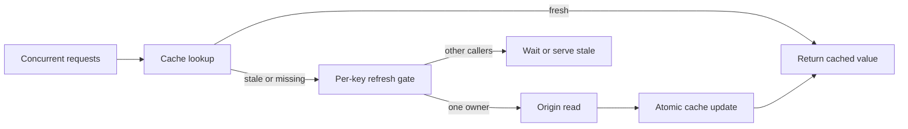

Ein Cache vermeidet wiederholte Arbeit nur, solange sein Wert nutzbar ist. Läuft ein populärer Eintrag ab, können Hunderte Requests nahezu gleichzeitig denselben Miss erkennen. Fragt jeder Request das Ursprungssystem selbstständig ab, wird aus einem einzelnen Ablaufzeitpunkt ein synchronisierter Lasttest für Datenbank oder Downstream-API.

Dieses Verhalten heißt Cache Stampede. Gefährlich ist nicht nur eine niedrige Hit Rate, sondern die koordinierte Parallelität gegen dieselbe Abhängigkeit, häufig genau dann, wenn diese bereits langsam ist. Eine längere Time-to-Live verschiebt den Ablaufzeitpunkt. Sie kontrolliert jedoch nicht, was an dieser Grenze geschieht.

Ein belastbares Design braucht deshalb einen begrenzten Refresh-Vertrag: Ein Request erneuert den Key, parallele Requests verwenden dieselbe laufende Arbeit oder erhalten einen zulässigen veralteten Wert, und das Ursprungssystem bleibt durch Admission Limits geschützt. Dieser Artikel beschreibt den Vertrag als Referenzarchitektur, nicht als Behauptung über ein bestimmtes produktives oder vermessenes System.

## Ablauf verwandelt unabhängige Requests in koordinierte Last

Nehmen wir eine Produktseite mit stetigem Traffic und einem Cache-Eintrag, der alle fünf Minuten abläuft. Bei einem normalen Cache Hit sind die Requests günstig und weitgehend unabhängig. Nach Ablauf sehen alle Requests bis zum Abschluss des ersten Refreshs denselben fehlenden Key. Sie werden gemeinsam zu Origin Reads.

Die Verstärkung entspricht grob der Ankunftsrate multipliziert mit der Refresh-Latenz. Bei 500 Requests pro Sekunde und 200 Millisekunden für den Origin Read können etwa 100 Requests um denselben Neuaufbau konkurrieren. Wird das Ursprungssystem unter Druck auf zwei Sekunden langsamer, kann der Wettlauf in Richtung 1.000 Requests wachsen. Die genauen Zahlen hängen vom Ankunftsmuster ab. Entscheidend ist die Rückkopplung: Langsamere Refreshes erzeugen mehr parallele Refresher, die das Ursprungssystem weiter verlangsamen.

Eine längere TTL verschiebt dieses Ereignis. Zufälliger Jitter kann die Ablaufzeiten vieler unterschiedlicher Keys verteilen. Beides garantiert keine Kontrolle für einen einzelnen Hot Key. Er kann weiterhin einmal ablaufen und eine große Lastspitze freigeben.

Die richtige Frage lautet daher nicht nur: „Wie lange soll dieser Wert leben?“ Sie lautet: „Wenn der Wert erneuert werden muss, wie viele Aufrufer dürfen das tun, was erhalten die übrigen, und wie wird das Ursprungssystem geschützt?“

## Freshness, Verfügbarkeit und Parallelität getrennt definieren

Eine Cache-Policy sollte drei Anliegen unterscheiden, die häufig in einer einzigen TTL verschwinden.

**Freshness** legt fest, ab welchem Alter ein Wert erneuert werden soll. Das ist eine Produkt- und Korrektheitsentscheidung. Eine Autorisierungsentscheidung verträgt fast keine Veralterung. Eine öffentliche Katalogbeschreibung kann möglicherweise einige Minuten alt sein.

**Verfügbarkeit** bestimmt, ob während eines langsamen oder fehlgeschlagenen Refreshs ein älterer Wert ausgeliefert werden darf. [RFC 5861](https://www.rfc-editor.org/rfc/rfc5861) definiert dafür im HTTP-Kontext `stale-while-revalidate` und `stale-if-error`. Dieselben Konzepte lassen sich innerhalb eines Services anwenden, aber nur, wenn die Datensemantik es erlaubt.

**Refresh-Parallelität** bestimmt, wie viele Worker einen Key neu aufbauen dürfen. Die übliche Antwort ist ein aktiver Refresher pro Key, nicht ein Refresher pro Request. Dieses Muster heißt Request Coalescing, Duplicate Suppression oder Single Flight.

Die Budgets sind unabhängig. Ein Wert kann 60 Sekunden frisch sein, weitere 30 Sekunden als stale ausgeliefert werden und durch eine Refresh-Lease von fünf Sekunden geschützt sein. Wer alles als „TTL = 60“ modelliert, versteckt das Fehlerverhalten.

## Parallele Misses um einen Refresh bündeln

Request Coalescing verwaltet laufende Operationen nach dem kanonischen Cache-Key. Der erste Aufrufer startet den Origin Fetch. Weitere Aufrufer für denselben Key warten auf dasselbe Promise, statt neue Arbeit zu beginnen. Das [singleflight-Paket](https://pkg.go.dev/golang.org/x/sync/singleflight) von Go beschreibt diesen Mechanismus als Unterdrückung doppelter Funktionsaufrufe.

```ts
const inFlight = new Map<string, Promise<CacheValue>>()

async function getOrRefresh(key: string): Promise<CacheValue> {
  const cached = await cache.get(key)
  if (cached?.fresh) return cached.value

  const existing = inFlight.get(key)
  if (existing) return existing

  const refresh = loadOrigin(key)
    .then((value) => cache.set(key, value).then(() => value))
    .finally(() => inFlight.delete(key))

  inFlight.set(key, refresh)
  return refresh
}
```

Die Registry muss erfolgreiche und fehlgeschlagene Promises entfernen. Sonst kann ein Fehler zu einer dauerhaft gespeicherten Ablehnung werden. Aufrufer brauchen außerdem Deadlines. Ein Request mit noch 50 Millisekunden Budget darf nicht zwangsweise auf einen Refresh warten, der voraussichtlich eine Sekunde dauert.

Eine In-Process-Registry schützt genau eine Anwendungsinstanz. Zehn Replikate können weiterhin zehn Refreshes erzeugen. Das kann zulässig sein, wenn das Origin Budget ausreicht. Ist genau ein Refresher im gesamten Fleet erforderlich, braucht es eine verteilte Lease oder einen atomaren Claim im Cache. Verteilte Koordination sollte erst eingeführt werden, nachdem die zulässige Parallelität explizit feststeht.



## Veraltete Daten nur in expliziten Fenstern ausliefern

Auf den Refresh zu warten ist nicht immer die beste Antwort. Enthält der Cache einen erst kürzlich abgelaufenen Wert, können Aufrufer ihn sofort erhalten, während ein einzelner Worker im Hintergrund aktualisiert. Das stabilisiert die Latenz und puffert einen vorübergehenden Origin-Fehler.

Stale Serving muss begrenzt und sichtbar sein. Freshness-Metadaten gehören zum Wert; die Policy sollte nicht allein aus der Existenz des Keys abgeleitet werden. Ein brauchbarer Datensatz enthält Payload, Erstellungszeit, `fresh_until`, `stale_until`, Schema-Version und, soweit verfügbar, die Quellversion.

Dann ist die Entscheidung präzise: Vor `fresh_until` wird der Wert direkt ausgeliefert. Zwischen `fresh_until` und `stale_until` wird der alte Wert ausgeliefert und genau ein Owner aktualisiert. Nach `stale_until` wartet der Request nur begrenzt oder schlägt gemäß Endpoint-Vertrag fehl. Bei einem Origin-Fehler darf stale nur ausgeliefert werden, wenn die Datenklasse das ausdrücklich erlaubt.

Für Daten, bei denen „alt“ zugleich unautorisiert, finanziell falsch oder unsicher bedeutet, ist Stale Serving ungeeignet. Die Cache-Policy gehört in den Datenvertrag, nicht ausschließlich in Infrastrukturkonfiguration.

## Das Ursprungssystem schützen, auch wenn Coalescing versagt

Coalescing reduziert doppelte Arbeit, ist aber nicht die letzte Verteidigung. Ein Prozessneustart leert die In-Flight-Map. Eine Netzwerkpartition kann eine Lease ablaufen lassen, obwohl der alte Owner noch arbeitet. Nach Cache Flush oder Deployment können viele verschiedene Keys zugleich fehlen. Das Ursprungssystem braucht deshalb eigene Grenzen für Parallelität und Deadlines.

Admission Control muss vor der knappen Ressource liegen. Die Refresh-Parallelität wird global und gegebenenfalls pro Tenant oder Abhängigkeit begrenzt. Refresh Calls erhalten kürzere Deadlines als das Gesamtbudget des Requests. Ist keine Refresh-Kapazität frei, wird abgelehnt oder ein zulässiger stale Wert geliefert. Ein Cache-Rebuild darf nicht alle Datenbankverbindungen verbrauchen, die ungecachte Requests benötigen.

Eine Fleet-weite Lease braucht einen atomaren Claim, einen eindeutigen Owner Token und eine kurze Ablaufzeit. Nur der aktuelle Owner darf das Ergebnis veröffentlichen. Kann nach Lease-Ablauf ein neuer Owner starten, muss ein monotoner Versions- oder Fencing-Check die Aktualisierung schützen. Ein zeitbasierter Lock beweist nicht, dass ein alter Worker aufgehört hat.

Das Cache Update selbst muss atomar sein: vollständiger Payload und Metadaten werden gemeinsam geschrieben, idealerweise unter einem versionierten Key oder einer Compare-and-Set-Bedingung. Leser dürfen keinen neuen Freshness-Zeitstempel mit altem Payload sehen.

## Invalidation und Key-Versionen explizit machen

Stampede-Schutz repariert keinen mehrdeutigen Cache-Key. Jeder Input, der die Response ändern kann, gehört in den Key oder die Validierungsmetadaten: Tenant, Locale, Autorisierungsscope, Query-Form, Schema-Version und relevante Feature-Konfiguration.

Für inkompatible Schema- oder Policy-Änderungen sind versionierte Keys sinnvoll. Reader und Writer verwenden nach dem Deployment `product:v3:<id>`, statt eine frühere Repräsentation als aktuell zu behandeln. Alte Versionen können nach dem Deployment-Fenster natürlich ablaufen.

Invalidation Events sollten eine stabile Entity-ID und möglichst eine monotone Quellversion tragen. Eine verspätete Invalidation für Version 41 darf keinen Wert löschen, der bereits aus Version 42 erneuert wurde. Metas Bericht über [Cache-Consistency-Engineering](https://engineering.fb.com/2022/06/08/core-infra/cache-made-consistent/) zeigt, weshalb Cache-Korrektheit von Reihenfolge und Versionsinformation abhängt, nicht nur von schneller Löschung.

Expiry bleibt als Sicherheitsgrenze wertvoll. Es begrenzt, wie lange eine verpasste Invalidation überlebt. Expiry, Invalidation und Refresh-Koordination lösen jedoch unterschiedliche Probleme und müssen unabhängig getestet werden.

## Die Fehlergrenze beobachten und testen

Eine hohe globale Hit Rate kann einen gefährlichen Hot-Key-Miss verbergen. Messungen sollten nach Key-Klasse und Ergebnis unterscheiden, statt nur einen aggregierten Prozentsatz zu zeigen.

Wichtige Signale sind Fresh Hits, Stale Hits, blockierende Misses, gewonnene Refresh Claims, gebündelte Waiter, Refresh-Dauer, Refresh-Fehler, Lease-Abläufe, abgelehnte Refreshes, Origin-Parallelität und das Alter des ältesten ausgelieferten Werts. Der Owner Refresh erhält einen Trace; wartende Aufrufer werden damit verknüpft, ohne für jeden Waiter einen eigenen Origin Span zu erzeugen.

Fehlertests müssen den Wettlauf gezielt herstellen:

1. Einen Hot Key ablaufen lassen und Hunderte parallele Aufrufer freigeben; die zulässige Anzahl Origin Reads prüfen.
2. Das Ursprungssystem über die Caller Deadlines hinaus verlangsamen; begrenztes Warten und Stale Policy prüfen.
3. Den Owner Refresh scheitern lassen; sicherstellen, dass Cleanup einen späteren Retry erlaubt.
4. Ein Replikat während des Refreshs neu starten; das Fleet-weite Origin Limit prüfen.
5. Eine Lease ablaufen lassen, während der alte Owner weiterläuft; einen stale Owner Write verhindern.
6. Viele Keys gemeinsam leeren; globales Admission Control gegen Origin-Überlastung testen.
7. Invalidations in falscher Reihenfolge zustellen; Regression durch Quellversionen verhindern.
8. Das Stale-Fenster überschreiten; sicherstellen, dass der Service fehlschlägt statt unbegrenzt alte Daten zu liefern.

Diese Tests definieren die Zuverlässigkeitsaussage. Ein Mutex im Code belegt Konfiguration. Ein Concurrency Test mit genau der erlaubten Zahl von Origin Reads belegt Verhalten.

## Praktische Design-Checkliste

Die kleinste Mechanik, die die benötigte Grenze durchsetzt, ist der richtige Startpunkt.

1. Fresh-, Stale- und Unavailable-Zustände für jede Datenklasse definieren.
2. Einen kanonischen, versionierten Cache-Key mit allen Response-relevanten Inputs verwenden.
3. Refreshes pro Key innerhalb jedes Prozesses bündeln.
4. Fleet-weite Leases nur ergänzen, wenn Duplikate zwischen Instanzen das Origin Budget überschreiten.
5. Globale Refresh-Parallelität begrenzen und Deadlines vor knappen Ressourcen setzen.
6. Payload und Freshness-Metadaten atomar veröffentlichen.
7. Veraltete Refreshes und Invalidation Events mit Quellversionen ablehnen.
8. Stale-Alter, Waiter, Owner Count, Refresh-Fehler und Origin-Druck messen.
9. Ablauf-Races, Owner-Crashes, Cache Flushes und stale Owner Writes testen.

Längere TTLs können die Refresh-Häufigkeit senken. Jitter kann verhindern, dass viele unabhängige Keys gleichzeitig ablaufen. Beides ist kein Parallelitätsprotokoll. Die belastbare Grenze ist explizit: ein begrenzter Refresh-Pfad, eine dokumentierte Stale Policy und ein Ursprungssystem, das geschützt bleibt, wenn der Cache nicht mehr hilft.
