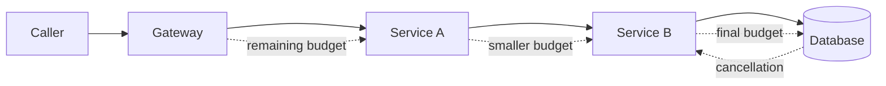

Ein Timeout für jeden Netzwerkaufruf wirkt zunächst verantwortungsvoll. Trotzdem kann daraus ein Request-Pfad entstehen, der deutlich länger läuft, als ein Benutzer oder ein vorgelagertes System auf das Ergebnis warten will.

Das Problem beginnt, wenn jeder Service einen neuen Timer startet. Eine API erhält eine Anfrage mit einem Ziel von zwei Sekunden, verwendet 600 Millisekunden für lokale Arbeit und gibt einer Abhängigkeit anschließend erneut zwei Sekunden. Die Abhängigkeit wiederholt denselben Fehler. Die ursprüngliche Anfrage kann längst aufgegeben worden sein, während tiefere Schichten weiterhin Verbindungen, Datenbank-Slots, CPU und Retry-Kapazität belegen.

Ein belastbarer Entwurf behandelt Zeit als ein einziges durchgängiges Budget. Der Einstiegspunkt legt eine Deadline fest. Jeder Hop berechnet die verbleibende Zeit, reserviert einen Anteil für lokales Aufräumen und die Rückgabe der Antwort und reicht nur den tatsächlich nutzbaren Rest weiter. Der Ablauf muss außerdem einen Abbruch auslösen. Nur das Warten zu beenden, ohne die Arbeit zu stoppen, verdeckt die Ressourcenverschwendung.

Dieser Artikel beschreibt das Muster als Referenzarchitektur. Er erläutert Mechanismen und Tests, nicht die Implementierung eines bestimmten produktiven Systems.

## Eine Kette von Timeouts ist keine Deadline

Ein Timeout ist eine Dauer für eine einzelne Operation. Eine Deadline ist der späteste Zeitpunkt, zu dem das Gesamtergebnis noch einen Wert hat. Sobald eine Anfrage mehr als eine Grenze überschreitet, ist dieser Unterschied entscheidend.

Angenommen, ein Gateway hat ein Antwortziel von zwei Sekunden. Es ruft einen Account-Service mit einem Timeout von zwei Sekunden auf. Der Account-Service führt eine Datenbankabfrage aus und ruft einen Policy-Service auf, wiederum mit Timeouts von zwei Sekunden. Lokal wirken diese Werte plausibel, global widersprechen sie sich. Warteschlangen, Verbindungsaufbau, TLS-Aushandlung, Anwendungslogik, Wiederholungsversuche und Serialisierung summieren sich an jedem Hop.

Der Fehler ist nicht nur eine langsame Antwort. Es entsteht unbegrenzte Arbeit, nachdem das Ergebnis seinen Wert verloren hat. Der Client hat möglicherweise die Verbindung getrennt. Das Gateway hat vielleicht bereits einen Fehler zurückgegeben. Trotzdem können eine Datenbankabfrage und zwei Remote-Aufrufe weiterlaufen, weil ihre unabhängigen Timer noch nicht abgelaufen sind.

Der [gRPC-Leitfaden zu Deadlines](https://grpc.io/docs/guides/deadlines/) definiert die Deadline als den Zeitpunkt, ab dem ein Client nicht mehr warten will. Er erklärt außerdem, dass beim Weiterreichen an einen anderen RPC die bereits verstrichene Zeit abgezogen werden muss. Dieses Modell gilt auch dann, wenn HTTP statt gRPC als Transport verwendet wird.

Ein Service sollte deshalb eine von zwei gleichwertigen Darstellungen erhalten:

1. Eine absolute Deadline in einem eindeutig definierten Zeitmodell.
2. Eine verbleibende Dauer, die unmittelbar vor dem ausgehenden Aufruf berechnet wird.

Innerhalb eines Prozesses eignet sich eine monotone Uhr für die Messung verstrichener Zeit. Zwischen Maschinen darf der Entwurf nicht von perfekt synchronisierten Systemuhren ausgehen. Ein Transport oder Framework, das eine eingehende Deadline in einen sinkenden Timeout umwandelt, schützt den Pfad vor Clock Skew.

## Das Budget am Einstiegspunkt festlegen

Die äußerste vertrauenswürdige Komponente sollte die Erwartung des Aufrufers in eine begrenzte serverseitige Deadline umwandeln. Das kann ein API-Gateway, ein RPC-Server, ein Job-Dispatcher oder ein Message-Consumer mit Ausführungs-Lease sein.

Beliebige Werte dürfen nicht ungeprüft übernommen werden. Ein Client, der 30 Minuten verlangt, darf knappe Request-Ressourcen nicht ebenso lange binden. Fehlt eine Grenze, darf daraus keine unendliche Laufzeit entstehen. Das angeforderte Budget wird zwischen einem Minimum für sinnvolle Arbeit und einem Maximum zum Schutz des Services begrenzt.

Das Startbudget muss den vollständigen Antwortpfad abdecken, nicht nur die Ausführung nachgelagerter Arbeit. Es braucht eine Reserve für Serialisierung, Rücktransport, Aufräumen und protokollspezifische Bestätigungen. Wenn einem HTTP-Endpunkt 1.500 Millisekunden zur Verfügung stehen, darf er nicht alle 1.500 Millisekunden an die Datenbank vergeben. Sonst bleibt keine Zeit, einen Fehler abzubilden oder die Antwort auszuliefern.



Die Reserve sollte explizit und klein sein, nicht ein unerklärter Prozentsatz, der in jeden Service kopiert wird. Eine sinnvolle Erlaubnis für den ausgehenden Aufruf ist das Minimum aus drei Werten: verbleibendes Request-Budget abzüglich lokaler Reserve, eigene Sicherheitsobergrenze der Abhängigkeit und ein aus beobachteter Abhängigkeitslatenz abgeleiteter Timeout. Liegt das Ergebnis bereits unter der kleinsten sinnvollen Dauer, sollte der Service scheitern, bevor er weitere Arbeit startet.

Diese frühe Ablehnung ist eine Zuverlässigkeitsfunktion. Sie verhindert, dass nicht mehr rechtzeitig abschließbare Requests Warteschlangen betreten, Datenbankverbindungen belegen oder Retry-Traffic erzeugen.

## Den Rest weitergeben, nicht den ursprünglichen Wert

Die Budgetweitergabe gehört in gemeinsam genutzte Client- und Server-Infrastruktur, weil manuelle Weitergabe leicht vergessen wird. Server-Middleware sollte den eingehenden Wert parsen und validieren, einen Cancellation-Kontext erzeugen und eine monotone Funktion für die Restzeit bereitstellen. Client-Middleware berechnet unmittelbar vor dem Versand den Rest, zieht die konfigurierte Reserve ab und hängt das Ergebnis an den ausgehenden Aufruf.

Die späte Berechnung ist bewusst gewählt. Ein beim Start des Handlers gespeicherter Wert ist nach Warteschlangenzeit oder lokaler Berechnung veraltet. Jeder Downstream-Aufruf benötigt das Budget, das in genau diesem Moment verfügbar ist.

Die folgende TypeScript-Skizze zeigt die Struktur. Sie verwendet absichtlich einen Duration-Header, ohne ein universelles öffentliches Protokoll zu behaupten. Interne Header-Namen, Vertrauensgrenzen und Maximalwerte sind systemspezifisch.

```ts
const MAX_REQUEST_MS = 5_000
const RESPONSE_RESERVE_MS = 75

async function callDependency(
  request: Request,
  remainingMs: () => number
): Promise<Response> {
  const usableMs = Math.min(
    MAX_REQUEST_MS,
    remainingMs() - RESPONSE_RESERVE_MS
  )

  if (usableMs <= 0) {
    throw new Error("deadline_exceeded_before_dispatch")
  }

  const controller = new AbortController()
  const timer = setTimeout(() => controller.abort(), usableMs)

  try {
    return await fetch(request, {
      signal: controller.signal,
      headers: {
        ...Object.fromEntries(request.headers),
        "x-request-timeout-ms": String(usableMs)
      }
    })
  } finally {
    clearTimeout(timer)
  }
}
```

Eine produktionsreife Implementierung verbindet außerdem das ausgehende Abort-Signal mit dem eingehenden Cancellation-Signal. Trennt der Aufrufer die Verbindung vor Ablauf des Timers, sollte die nachgelagerte Arbeit sofort abgebrochen werden. Framework-Defaults unterscheiden sich. Deshalb brauchen Weitergabe und Abbruch explizite Integrationstests statt bloßer Annahmen.

## Der Abbruch muss die tatsächliche Arbeit erreichen

Die Rückgabe eines Timeout-Fehlers beendet keine SQL-Abfrage, keinen Unterprozess, keinen Object-Store-Upload und keinen Inference-Aufruf. Sie stoppt lediglich das Warten einer Schicht. Die zugrunde liegende Operation muss Cancellation unterstützen, oder die Anwendung muss den Abbruch regelmäßig prüfen und sicher beenden.

Dieser Unterschied erklärt viele Überlastungskaskaden. Die Latenz steigt, Clients laufen in Timeouts, aber Server bearbeiten weiterhin überholte Requests. Neue Anfragen treffen ein, während alte Arbeit noch Threads, Verbindungen, Speicher und Queue-Slots belegt. Wiederholte Anfragen erhöhen die Last zusätzlich. Die Google-SRE-Darstellung zu [kaskadierenden Fehlern](https://sre.google/sre-book/addressing-cascading-failures/) beschreibt die Verschwendung, die entsteht, wenn Server Requests bearbeiten, welche ihre Client-Deadline nicht mehr erreichen können.

Cancellation sollte jede Ressourcengrenze durchlaufen, die sie umsetzen kann:

1. HTTP- oder RPC-Client abbrechen.
2. Das Datenbankstatement abbrechen, nicht nur das Promise, das darauf wartet.
3. Für den Request gestartete Child Tasks stoppen.
4. Semaphore, Connection-Pool-Einträge und temporäre Dateien in `finally`-Pfaden freigeben.
5. Verhindern, dass ein abgebrochener Handler einen Effekt committet, sofern keine bewusste Abschlussrichtlinie besteht.

Nicht jede Operation lässt sich sicher unterbrechen. Eine Zahlungsanweisung oder Zustandsänderung kann ihren Commit-Punkt überschritten haben, bevor das Cancellation-Signal eintrifft. Dann bedeutet der Abbruch nur, dass der Aufrufer nicht mehr wartet, und nicht, dass nichts geschehen ist. Die API benötigt Idempotenz, dauerhaften Operationszustand und Reconciliation, damit eine spätere Anfrage das Ergebnis feststellen kann.

## Wiederholungsversuche verbrauchen dasselbe Budget

Ein Retry setzt die Deadline nicht zurück. Jeder Versuch, jedes Backoff-Intervall, jeder Verbindungsaufbau und jede Antwort verbraucht dieselbe durchgängige Zeitspanne.

Daraus folgt eine einfache Zulassungsregel: Ein weiterer Versuch startet nur, wenn das verbleibende Budget Backoff, eine realistische Versuchsdauer und die Antwortreserve abdecken kann. Andernfalls sollte sofort der beste verfügbare Fehler zurückgegeben werden. Ein Retry mit 20 verbleibenden Millisekunden gegen eine Abhängigkeit mit 80 Millisekunden normaler Tail-Latenz erzeugt Last ohne glaubwürdige Erfolgschance.

Der AWS-Artikel über [Timeouts, Retries, Backoff und Jitter](https://aws.amazon.com/builders-library/timeouts-retries-and-backoff-with-jitter/) beschreibt zwei wichtige Grenzen. Timeouts sollten aus gemessener Downstream-Latenz und einer akzeptablen Rate falscher Timeouts abgeleitet werden. Außerdem können Retries eine bereits überlastete Abhängigkeit weiter verschlechtern. Deadline-Weitergabe verbindet diese lokalen Praktiken mit dem vollständigen Request-Pfad.

Auch die Verantwortung für Retries sollte eindeutig sein. Wenn Gateway, Service, SDK und Datenbanktreiber jeweils drei Versuche durchführen, kann eine Benutzeroperation viele Backend-Aufrufe auslösen. Gewählt wird die Schicht, die Sicherheit und verbleibenden Nutzen beurteilen kann. Wiederholungen in anderen Schichten werden deaktiviert oder eng begrenzt.

Nur Operationen mit bekannter Retry-Sicherheit dürfen wiederholt werden. Ein Timeout ist mehrdeutig: Die Abhängigkeit kann die Operation abgeschlossen haben, während die Antwort verloren ging. Idempotency Keys oder Reconciliation nach einem Timeout gehören zum Retry-Vertrag und sind keine optionalen Ergänzungen.

## Grenzen aus Messwerten und Richtlinien ableiten

Es gibt keinen universell korrekten Timeout. Ausgangspunkt sind das extern sinnvolle Ziel und gemessene Latenzverteilungen. Danach wird der vollständige Pfad berücksichtigt.

Für jede Abhängigkeit sollten Verbindungszeit, Request-Zeit, Queue-Zeit und Tail-Latenz getrennt betrachtet werden. Eine einzige Gesamtdauer kann DNS, TLS, Pool-Akquise oder Proxy-Queueing verbergen. Außerdem muss exakt geklärt werden, was die Timeout-Option einer Client-Bibliothek umfasst. Manche Optionen decken nur Socket Reads ab, andere auch Verbindungsaufbau und Redirects; Cancellation kann sich nochmals anders verhalten.

Messwerte bestimmen eine realistische Obergrenze pro Versuch, doch die durchgängige Deadline bleibt maßgeblich. Eine schnelle Abhängigkeit benötigt üblicherweise vielleicht 40 Millisekunden, erhält aber nur 15, weil frühere Arbeit das Budget verbraucht hat. Sie sollte nicht allein deshalb starten, weil ihr statischer Timeout 100 Millisekunden beträgt.

Die Richtlinie definiert auch das kleinste sinnvolle Budget. Manche Arbeit kann degradiert werden: optionale Empfehlungen auslassen, leicht veraltete Cache-Daten liefern oder eine Teilantwort zurückgeben. Andere Arbeit muss geschlossen fehlschlagen. Diese Entscheidung gehört an eine Grenze, an der die Geschäftssemantik bekannt ist, nicht in einen generischen Timeout-Helper.

Tail-Latenz braucht besondere Aufmerksamkeit. Ein auf Durchschnittswerten basierender Timeout versagt genau unter den Bedingungen, unter denen Schutz erforderlich ist. Perzentile sollten nach Route, Region, Payload-Klasse und Connection Reuse verglichen werden. Lasttests müssen kalte Verbindungen und eingeschränkte Abhängigkeiten enthalten, nicht nur den warmen stationären Zustand.

## Budgetverbrauch als zusammenhängenden Pfad beobachten

Timeout-Metriken, die nur abschließende Fehler zählen, kommen zu spät und bleiben zu oberflächlich. Instrumentiert werden sollte, wie sich das Budget entlang des Requests verändert.

Nützliche Span-Attribute und Metriken sind:

1. An jedem Service empfangenes Budget.
2. Restbudget vor und nach jedem Aufruf einer Abhängigkeit.
3. Lokale Queue- und Verarbeitungszeit.
4. Konfigurierte Reserve und Obergrenze der Abhängigkeit.
5. Cancellation-Ursache: Client-Abbruch, lokale Deadline oder Upstream-Cancellation.
6. Arbeit, die nach dem Cancellation-Signal abgeschlossen wurde.
7. Wegen unzureichenden Restbudgets ausgelassene Retries.
8. Timeout-Phase: Pool-Akquise, Connect, TLS, Request, Datenbankausführung oder Antwort.

Absolute Wall-Clock-Deadlines gehören nicht in hochkardinale Metrik-Labels. Dauern und grobe Ursachencodes lassen sich besser aggregieren. Traces können Request-Details unter den üblichen Datenschutz- und Aufbewahrungsregeln enthalten.

Ein gutes Dashboard unterscheidet zwischen einer langsamen Abhängigkeit und einem Aufrufer mit unrealistischen Budgets. Das sind verschiedene Vorfälle. Es sollte außerdem Services sichtbar machen, die den Großteil des Budgets vor ihrem ersten Downstream-Aufruf verbrauchen. Weitergabe allein kann übermäßiges lokales Queueing nicht reparieren.

## Den Ablauf an jeder Grenze testen

Deadline-Behandlung ist Fehlerverhalten. Happy-Path-Unit-Tests reichen deshalb nicht aus. Die Verifikation sollte das Budget an kontrollierten Punkten gezielt verbrauchen oder ablaufen lassen.

Mindestens folgende Fälle gehören in den Testplan:

1. Keine Caller-Deadline: Der Server wendet sein Standardmaximum an.
2. Übermäßige Caller-Deadline: Der Server begrenzt sie.
3. Budget läuft beim lokalen Queueing ab: Kein Downstream-Aufruf startet.
4. Budget läuft während eines RPC ab: Der Client bricht ab und der Server erkennt Cancellation.
5. Budget läuft während einer Datenbankabfrage ab: Das Statement wird abgebrochen und die Verbindung bleibt wiederverwendbar.
6. Caller trennt die Verbindung früh: Child Work stoppt vor der konfigurierten Deadline.
7. Erster Versuch schlägt fehl: Ein Retry startet nur bei ausreichendem Restbudget.
8. Operation committet beim Eintreffen des Abbruchs: Reconciliation liefert das dauerhafte Ergebnis.
9. Uhren der Services unterscheiden sich: Die weitergegebene Restdauer wächst nicht.
10. Last steigt stark: Überholte Arbeit nimmt ab, statt sich hinter Requests mit Timeout anzusammeln.

Der letzte Test liefert den betrieblichen Nachweis. Ein Timeout-Entwurf ist nicht erfolgreich, nur weil Clients schnell Fehler erhalten. Erfolgreich ist er, wenn abgelaufene Requests keine knappen Ressourcen weiter verbrauchen, Retries begrenzt bleiben und das System sich erholt, statt Überlastung zu verstärken.

## Praktisches Fazit

Per-Hop-Timeouts sind notwendig, aber kein durchgängiger Latenzvertrag. Der Vertrag beginnt mit einer begrenzten Deadline und wird zu einem sinkenden Budget, während der Request das System durchläuft.

Ein vollständiger Entwurf legt das Budget am vertrauenswürdigen Rand fest, zieht vor jedem Versand verstrichene Zeit ab, reserviert Zeit für Antwort und Aufräumen, leitet Cancellation bis in die tatsächliche Arbeit weiter und lässt Retries dieselbe Restzeit verbrauchen. Obergrenzen werden aus gemessener Latenz abgeleitet, während Geschäftsregeln für Degradation und Fehler erhalten bleiben.

Entscheidend ist, die Freigabe von Ressourcen zu testen und nicht nur die Fehlerausgabe. Sobald der Aufrufer das Ergebnis nicht mehr benötigt, sollte das System so viel zugehörige Arbeit wie sicher möglich stoppen. Erst dadurch wird ein Timeout von einer lokalen Exception zu einem Zuverlässigkeitsmechanismus.
