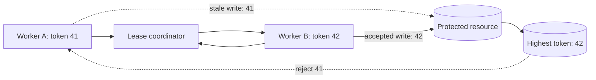

Ein verteilter Lock kann zwei Workern mitteilen, wer jetzt arbeiten soll. Er kann jedoch nicht in einen pausierten Prozess eingreifen und bereits begonnene Arbeit widerrufen.

Aus dieser Einschränkung entsteht ein gefährlicher Fehlerfall. Worker A übernimmt einen Lock und pausiert anschließend so lange, dass seine Lease abläuft. Worker B erhält denselben Lock und beginnt mit gültiger Arbeit. Später läuft A weiter und schreibt mit einer Berechtigung auf die geschützte Ressource, die längst nicht mehr besteht. Für den Lock-Service wurde der Besitzer korrekt gewechselt. An der Ressource haben trotzdem zwei Besitzer Effekte erzeugt.

Eine Ablaufzeit begrenzt, wie lange andere Worker warten. Sie macht veraltete Operationen nicht harmlos. Ein korrektheitskritischer Entwurf braucht deshalb einen zweiten Mechanismus: Jede erfolgreiche Übernahme erhält ein streng ansteigendes Fencing Token. Die geschützte Ressource weist jede Operation mit einem Token zurück, das älter als das zuletzt akzeptierte Token ist.

Dieser Artikel beschreibt den Mechanismus als Referenzarchitektur. Er erläutert allgemeine Entwurfsentscheidungen und Fehlertests, nicht ein bestimmtes produktiv eingesetztes System.

## Eine Lease widerruft keinen pausierten Client

Eine Lease ist zeitlich begrenzter Besitz. Der Besitzer erneuert sie während der Arbeit. Bleibt die Erneuerung aus, kann ein anderer Teilnehmer den Lock später übernehmen. Das sichert die Lebendigkeit des Systems, weil ein abgestürzter Besitzer den Fortschritt nicht dauerhaft blockiert.

Das ungelöste Problem ist ein alter Besitzer, der nur langsam und nicht endgültig ausgefallen ist. Eine Runtime-Pause, CPU-Starvation, Netzwerkpartition, blockiertes I/O oder eine überlastete Event Loop kann die Erneuerung verhindern, obwohl der Prozess später weiterarbeiten kann. Auch die lokale Zeit beweist keinen Besitz. Der Worker kann seine Lease noch für gültig halten, während der Koordinator sie bereits beendet und eine neue vergeben hat.

Der Fehlerablauf ist überschaubar:

1. Worker A erhält eine Lease und berechnet eine Änderung.
2. A pausiert länger als die Lease-Dauer.
3. Der Koordinator lässt As Lease ablaufen.
4. Worker B übernimmt den Lock und speichert ein neueres Ergebnis.
5. A läuft weiter und speichert sein älteres Ergebnis.

Der letzte Schreibvorgang gewinnt, obwohl er vom ungültigen Besitzer stammt. Eine längere Lease verändert nur die notwendige Pausendauer. Ein perfekter Timeout lässt sich nicht festlegen, weil Pausen und Netzwerkverzögerungen keine verlässliche Obergrenze haben.

Martin Kleppmanns Analyse zu [distributed locking](https://martin.kleppmann.com/2016/02/08/how-to-do-distributed-locking.html) beschreibt dieses Stale-Client-Problem ausdrücklich und verlangt für korrektheitskritische Locks ein Fencing an der Speichergrenze. Die zentrale Frage lautet daher nicht nur „Wer besitzt den Lock?“, sondern auch „Kann die Ressource den neuesten Besitzer von allen älteren unterscheiden?“

## Besitz und Schreibberechtigung trennen

Der Lock-Koordinator und die geschützte Ressource haben unterschiedliche Aufgaben.

Der Koordinator serialisiert die Übernahme und vergibt ein monoton ansteigendes Token. Der Worker sendet dieses Token bei jeder geschützten Operation mit. Die Ressource merkt sich den höchsten akzeptierten Wert und lehnt kleinere Werte ab. Der Besitz bleibt zeitlich begrenzt, die Berechtigung wird jedoch geordnet.



Angenommen, A besitzt Token 41 und B erhält später 42. Erreicht Bs Schreibvorgang die Ressource zuerst, speichert sie 42. As verzögerter Schreibvorgang mit 41 wird anschließend abgewiesen, obwohl A noch läuft und möglicherweise nie vom Ablauf seiner Lease erfahren hat.

Das ist stärker als die Prüfung eines zufälligen Lock-Werts bei der Freigabe. Ein eindeutiger Wert kann verhindern, dass ein Client den Redis-Lock eines anderen löscht. Deshalb empfiehlt die [Redis-Dokumentation zu verteilten Locks](https://redis.io/docs/latest/develop/clients/patterns/distributed-locks/), den gespeicherten Wert vor dem Löschen zu vergleichen. Eindeutigkeit ordnet die Besitzer aber nicht. Die Ressource kann nicht erkennen, ob die zufällige ID X älter oder neuer als Y ist. Fencing benötigt ein geordnetes Token.

Die Regel muss dort gelten, wo der Effekt dauerhaft wird. Eine reine Prüfung im Worker hat dieselbe Pause-Schwachstelle wie die Lease: Der Worker kann die Prüfung bestehen, pausieren, den Besitz verlieren und den Schreibvorgang später fortsetzen.

## Fencing Tokens aus geordnetem Zustand erzeugen

Ein Token-Generator braucht eine wesentliche Eigenschaft: Erfolgreiche Übernahmen erhalten Werte in der Reihenfolge, in der der Koordinator den Besitz serialisiert. Lücken sind zulässig, Duplikate und Umkehrungen nicht.

Ein konsensbasierter Koordinator kann eine solche Ordnung direkt bereitstellen. Die [etcd Concurrency API](https://etcd.io/docs/v3.6/dev-guide/api_concurrency_reference_v3/) verknüpft Mutex-Besitz mit Schlüsseln unter einer Lease. Der revisionierte Keyspace von etcd stellt geordneten Zustand bereit, den eine Implementierung mit Blick auf die konkreten Garantien als Fencing-Quelle verwenden kann. Nicht jede Lease-ID darf pauschal als monoton angenommen werden.

Ein datenbankgestützter Koordinator kann Tokens innerhalb desselben Übernahmeprotokolls aus einer Sequenz beziehen. PostgreSQL dokumentiert, dass [`nextval`](https://www.postgresql.org/docs/current/functions-sequence.html) über konkurrierende Sessions hinweg atomar ist und Sequenzwerte bei einem Transaktionsabbruch nicht zurückgegeben werden. Diese Lücken sind für Fencing unproblematisch, denn Tokens müssen steigen und nicht lückenlos sein.

Der Übernahmedatensatz kann so modelliert werden:

```sql
CREATE TABLE resource_fence (
  resource_id text PRIMARY KEY,
  highest_token bigint NOT NULL,
  owner_id text NOT NULL,
  lease_expires_at timestamptz NOT NULL,
  updated_at timestamptz NOT NULL DEFAULT now()
);
```

Token-Vergabe und Lease-Übernahme müssen ein zusammenhängendes Protokoll bilden. Ein Token darf nicht vergeben, die Übernahme abgebrochen und anschließend versehentlich als gültige Berechtigung veröffentlicht werden. Lücken sind harmlos, eine Berechtigung ohne Besitz ist es nicht.

Zeitstempel eignen sich schlecht als Ersatz. Wall Clocks können springen, Maschinen können voneinander abweichen und identische Zeitstempel erzeugen eine mehrdeutige Reihenfolge. Eine zufällige UUID ist eine gute Identität, trägt aber kein Alter. Das Token muss aus serialisiertem Koordinatorzustand und nicht aus der Uhr eines Workers stammen.

## Das Token an der Ressourcengrenze erzwingen

Fencing funktioniert nur, wenn das Zielsystem die Token-Reihenfolge atomar mit dem geschützten Effekt vergleichen und speichern kann.

Für eine PostgreSQL-Zeile kann ein bedingtes Update beide Schritte kombinieren:

```sql
UPDATE account_projection
SET balance = $1,
    last_fencing_token = $2,
    updated_at = now()
WHERE account_id = $3
  AND last_fencing_token < $2;
```

Der Worker behandelt null geänderte Zeilen als veralteten Besitz und nicht als vorübergehenden Datenbankfehler für einen blinden Retry. Der Ausgangsdatensatz benötigt eine definierte Token-Untergrenze. Außerdem muss jeder Schreibpfad für diesen Zustand dieselbe Regel anwenden. Ein einziges nicht abgesichertes Administrationsskript kann die Invariante umgehen.

Bei einem Append-only-Log kann das Token Teil einer optimistischen Bedingung oder eines Unique Constraints sein. Eine Queue kann mit Compare-and-set das akzeptierte Token gemeinsam mit dem Jobzustand fortschreiben. Kann eine externe API Tokens nicht vergleichen, liefert der Lock allein keine starke Korrektheitsgarantie. Dann braucht die Operation möglicherweise ein Gateway mit dauerhaftem Fence-Zustand, Versionsbedingungen des Zielsystems oder einen idempotenten Workflow mit Abgleich.

An dieser Grenze enden viele Lock-Entwürfe zu früh. Sie belegen exklusiven Erwerb in Redis oder etcd, zeigen aber nicht, wie Datenbank, Object Store, Gerät oder Drittservice einen verspäteten Besitzer abweisen. Kann die Ressource die Ordnung nicht erzwingen, sollte das Ergebnis als Koordination zur Verringerung von Überschneidungen beschrieben werden, nicht als Korrektheitsgarantie.

## Erneuerung, Freigabe und Annahmen über Uhren

Fencing ersetzt keine saubere Lease-Verwaltung. Es begrenzt den Schaden, wenn die Lease-Verwaltung ein Rennen verliert.

Eine Lease darf nur erneuert werden, solange der Koordinator denselben Besitzdatensatz anerkennt. Eine verspätete Erneuerung darf eine abgelaufene Lease nicht wiederbeleben, nachdem ein anderer Besitzer ein neueres Token erhalten hat. Die Freigabe muss den Besitzer prüfen und idempotent sein. Ein Client ohne Besitz sollte lokale Arbeit möglichst abbrechen. Die Korrektheit darf aber nicht davon abhängen, dass dieses Abbruchsignal rechtzeitig ankommt.

Die Lease-Dauer ist ein betrieblicher Trade-off. Kurze Leases beschleunigen die Wiederherstellung, erhöhen jedoch Erneuerungsverkehr und falsche Abläufe bei Pausen. Lange Leases reduzieren Fluktuation, verzögern aber die Übernahme nach einem Absturz. Vor einer Änderung sollten Übernahme- und Erneuerungslatenz, verlorene Leases, Arbeitsdauer und abgewiesene veraltete Schreibvorgänge gemessen werden.

Auch die Zeitannahmen müssen explizit sein. Ein Koordinator kann die Zeit für den Lease-Ablauf verwenden. Worker dürfen sich jedoch anhand ihrer lokalen Wall Clock keine Berechtigung erteilen. Kubernetes [Lease-Objekte](https://kubernetes.io/docs/reference/kubernetes-api/coordination/lease-v1/) zeigen, wie verteilte Systeme Besitzeridentität, Erneuerungszeit und Dauer für Koordination darstellen. Die API liefert nützlichen Zustand, doch der Nutzer braucht weiterhin ein klares Protokoll für verspätete Beobachtungen.

## Fehlerverhalten bewusst entwerfen

Ein abgewiesener veralteter Schreibvorgang ist eine erfolgreiche Sicherheitsentscheidung. Der umgebende Workflow benötigt trotzdem einen definierten Ausgang.

Der alte Worker darf dieselbe Operation nicht mit demselben Token wiederholen. Er hat seine Berechtigung verloren. Er sollte ein strukturiertes Ergebnis wie `stale_fencing_token` protokollieren, abhängige Arbeit stoppen und dem aktuellen Besitzer oder einem Reconciliation-Prozess die Bestimmung des Endzustands überlassen. Eine neue Lock-Übernahme erzeugt eine neue Operation und ist nur zulässig, wenn der Geschäftsprozess das erlaubt.

Auch der neue Besitzer muss Teileffekte berücksichtigen. Wenn Arbeit mehrere Ressourcen umfasst, schützt ein abgesicherter Datenbankschreibvorgang nicht automatisch eine E-Mail, ein Object-Store-Update oder einen Remote Request. Jede dauerhafte Grenze benötigt kompatible Versionserzwingung, Idempotenz oder kompensierenden Abgleich. Die Aussage, der gesamte Workflow sei „durch einen Lock geschützt“, verschleiert diese getrennten Verträge.

Sinnvolle Telemetrie umfasst Wartezeit auf die Übernahme, Lease-Alter, fehlgeschlagene Erneuerungen, aktuelles Token, höchstes an der Ressource beobachtetes Token, abgewiesene veraltete Operationen und nach lokaler Abbruchanforderung abgeschlossene Arbeit. Logs sollten Ressourcen-, Besitzer-, Token- und Trace-Identität enthalten, ohne sensible Payloads offenzulegen.

Ein Alarm bei jeder veralteten Abweisung wäre während geplanter Fehlertests laut. Ein unerwarteter Anstieg ist jedoch wertvoll. Er kann auf zu lange Runtime-Pausen, überlastete Koordinatoren, verzögerte Netzwerke oder Code hinweisen, der nach dem Verlust der Lease weiterläuft.

## Veraltete Besitzer testen, nicht nur Konkurrenz

Ein Test, in dem zehn Worker konkurrieren und genau einer den Lock erhält, belegt nur den einfachen Pfad. Die entscheidenden Tests erzwingen feindliche Zeit- und Reihenfolgebedingungen:

1. A nach der Übernahme pausieren, die Lease ablaufen lassen, B speichern lassen, A fortsetzen und die Abweisung verlangen.
2. As Netzwerkschreibvorgang verzögern, bis Bs neuerer Schreibvorgang die Ressource erreicht hat.
3. Erneuerungs- und Freigabenachrichten nach dem Ablauf zustellen und sicherstellen, dass sie Bs Besitz nicht verändern.
4. Die Übernahme nach der Token-Vergabe abbrechen und sicherstellen, dass die Lücke keine Berechtigung erteilt.
5. Den Koordinator neu starten und prüfen, ob die Token-Reihenfolge gemäß seinem dokumentierten Durability-Modell erhalten bleibt.
6. Gleichzeitige Schreibvorgänge mit demselben Token senden und das beabsichtigte Idempotenzverhalten der Geschäftsoperation prüfen.
7. Jeden alternativen Schreibpfad ausführen und sicherstellen, dass keiner die Token-Prüfung auslassen kann.
8. Den Worker vom Koordinator trennen, während seine Verbindung zur Ressource bestehen bleibt.

Diese Tests müssen den dauerhaften Ressourcenzustand und nicht nur Lock-Service-Logs prüfen. Die Invariante lautet: Sobald Token 42 akzeptiert wurde, darf Token 41 den geschützten Zustand nie wieder verändern.

## Praktische Entscheidungshilfe

Ein einfacher ablaufender Lock genügt, wenn Überschneidung ein Effizienzproblem ist und doppelte Arbeit harmlos oder bereits idempotent ist. Dazu können Cache-Aktualisierungen oder Best-effort-Aufräumarbeiten gehören, bei denen ein Duplikat Ressourcen kostet, aber keinen Zustand beschädigt.

Fencing ist erforderlich, wenn veraltete Überschneidung die Korrektheit verletzen kann und die Ressource ältere Tokens atomar abweisen kann. Der vollständige Entwurf besteht aus fünf Teilen:

1. Ein Koordinator serialisiert den Besitz.
2. Eine erneuerbare Lease sichert die Lebendigkeit.
3. Jede erfolgreiche Übernahme erhält ein monotones Token.
4. Die Ressource speichert den Token-Vergleich gemeinsam mit dem geschützten Effekt.
5. Fehlertests pausieren alte Besitzer und verifizieren deren Abweisung.

Kann die letzte Ressource die Token-Reihenfolge nicht erzwingen, muss diese Grenze offen benannt werden. Je nach Effekt helfen Idempotenz, optimistische Versionen, ein serialisierendes Gateway oder Reconciliation. Ein verteilter Lock ist ein Koordinationswerkzeug und keine Fernsteuerung für Prozesse.

Die Ablaufzeit lässt das System weiterarbeiten. Fencing verhindert, dass es danach die Vergangenheit akzeptiert.
