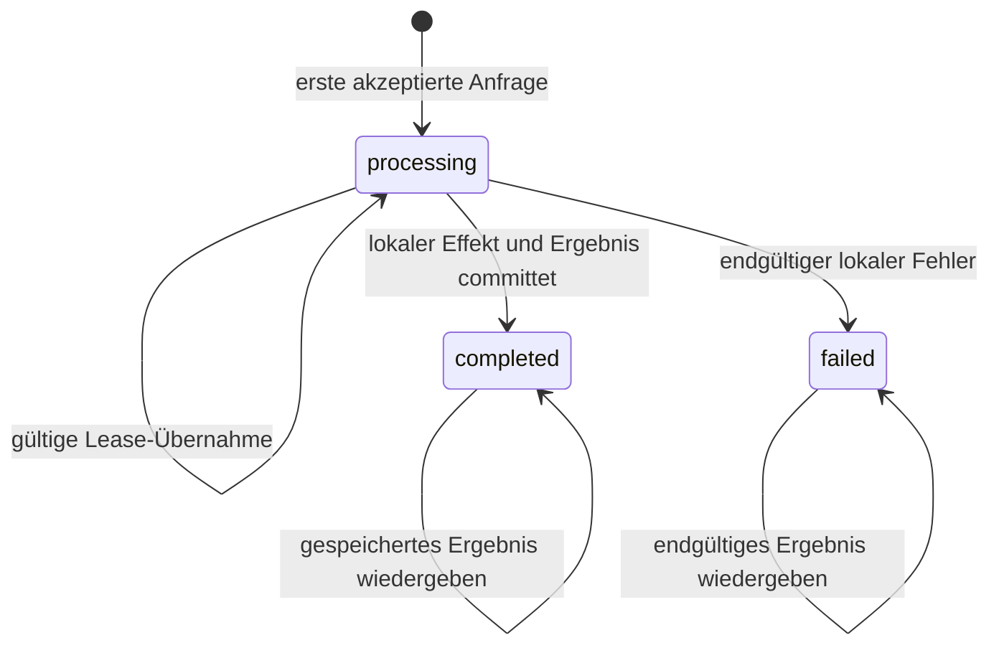

Ein Timeout sagt einem Client nicht, ob eine Operation fehlgeschlagen ist. Er sagt lediglich, dass der Client nicht länger gewartet hat.

Der Server kann die Anfrage abgelehnt, die Änderung committet oder die Änderung committet und die Antwort verloren haben. Wird ein `POST` in diesem Unsicherheitsfenster erneut gesendet, kann eine zweite Bestellung, Abbuchung, Aufgabe oder Bereitstellung entstehen. Auf den erneuten Versuch zu verzichten, macht dagegen aus einem vorübergehenden Netzwerkfehler einen für Benutzer sichtbaren Ausfall.

Ein Idempotency-Key beseitigt diese Mehrdeutigkeit nur, wenn der Server ihn als Identität einer einzelnen logischen Operation behandelt. Ein zuverlässiger Entwurf ist kein Cache-Lookup um einen Handler herum. Er ist eine dauerhafte Zustandsmaschine mit atomarer Besitzübernahme, Request-Validierung, stabilem Ergebnis, expliziter Wiederherstellung und einem Vertrag zur Aufbewahrungsdauer.

Dieser Artikel entwickelt diesen Referenzentwurf, ohne eine konkrete Produktionsimplementierung zu beanspruchen.

## Die Garantie vor der Speicherwahl definieren

HTTP bezeichnet eine Methode als idempotent, wenn mehrere identische Anfragen dieselbe beabsichtigte Wirkung haben wie eine einzelne Anfrage. `PUT` und `DELETE` besitzen idempotente Semantik; `POST` bietet diese Garantie standardmäßig nicht ([RFC 9110, Abschnitt 9.2.2](https://www.rfc-editor.org/rfc/rfc9110.html#name-idempotent-methods)). Eine API kann ein bestimmtes `POST` durch zusätzliche Anwendungssemantik wiederholungssicher machen, doch der Vertrag braucht eine klare Grenze.

Ein sinnvoller Vertrag lautet:

> Für einen authentifizierten Aufrufer, eine Operation und einen Idempotency-Key führt der Service innerhalb der Aufbewahrungsfrist höchstens eine akzeptierte logische Anfrage aus und liefert bei Wiederholungen eine stabile Darstellung ihres Ergebnisses zurück.

Jede Einschränkung ist relevant.

- **Aufrufer:** Zwei Mandanten können gefahrlos denselben zufälligen Schlüssel erzeugen.
- **Operation:** Derselbe Schlüssel darf bei `POST /orders` und `POST /refunds` nicht kollidieren.
- **Akzeptierte Anfrage:** Fehlerhafte Eingaben müssen einen Schlüssel nicht dauerhaft reservieren.
- **Logische Anfrage:** Der Schlüssel steht für die Absicht, nicht nur für identische Bytes.
- **Aufbewahrungsfrist:** Nach dem Löschen des Datensatzes besteht die bisherige Garantie nicht mehr.
- **Stabile Darstellung:** Eine Wiederholung darf den Aufrufer weder mit einem zweiten Effekt noch mit einer sachfremden Antwort überraschen.

AWS beschreibt vom Aufrufer bereitgestellte Request-IDs als Möglichkeit, eine Absicht auszudrücken, statt Duplikate aus übereinstimmenden Parametern abzuleiten ([Making retries safe with idempotent APIs](https://aws.amazon.com/builders-library/making-retries-safe-with-idempotent-APIs/)). Diese Unterscheidung verhindert, dass zwei legitime, gleich aussehende Operationen versehentlich zusammengeführt werden.

## Den Schlüssel als Zustand modellieren

Ein Cache speichert häufig erst nach Abschluss der Arbeit `key -> response`. Damit fehlt das wichtigste Zeitfenster: Zwei Anfragen mit demselben Schlüssel können gleichzeitig eintreffen, bevor eine Antwort existiert. Beide sehen einen Cache-Miss und beide führen die Operation aus.

Der Datenbankdatensatz muss vor dem fachlichen Effekt existieren, und seine Erstellung muss atomar sein. Ein kompaktes PostgreSQL-Modell sieht so aus:

```sql
CREATE TYPE idempotency_state AS ENUM (
  'processing', 'completed', 'failed'
);

CREATE TABLE idempotency_requests (
  tenant_id text NOT NULL,
  operation text NOT NULL,
  idempotency_key text NOT NULL,
  request_hash text NOT NULL,
  state idempotency_state NOT NULL,
  status_code integer,
  response_body jsonb,
  resource_id text,
  owner_token uuid,
  lease_expires_at timestamptz,
  created_at timestamptz NOT NULL DEFAULT now(),
  completed_at timestamptz,
  expires_at timestamptz NOT NULL,
  PRIMARY KEY (tenant_id, operation, idempotency_key)
);
```

Der Primärschlüssel ist der Mechanismus zur Steuerung der Nebenläufigkeit. PostgreSQL dokumentiert, dass `INSERT ... ON CONFLICT` bei einem Konflikt mit einem Unique Constraint eine alternative Aktion ausführen kann ([PostgreSQL `INSERT`](https://www.postgresql.org/docs/current/sql-insert.html)). Ein anwendungsseitiges "erst prüfen, dann einfügen" reicht nicht aus, weil zwischen diesen Anweisungen eine andere Transaktion aktiv werden kann.

Die Zustandsübergänge sind überschaubar:



Der Lease-Übergang ist optional. Wird er verwendet, braucht er mehr als einen Zeitstempel: Veraltete Worker dürfen nach der Übernahme durch einen neuen Besitzer nicht mehr committen können.

## Den Schlüssel an die Anfrage binden

Ein Client kann einen Schlüssel versehentlich mit anderen Parametern wiederverwenden. Würde der Server das erste Ergebnis zurückgeben, erschiene die zweite Anfrage erfolgreich, obwohl ihre neue Absicht ignoriert wurde.

Speichern Sie deshalb einen kanonischen Fingerprint der Anfrage zusammen mit dem Schlüssel. Er kann die Operation, den Mandanten, den normalisierten Body und alle semantischen Header umfassen, die das Ergebnis beeinflussen. Reine Transportdaten wie Tracing-Header bleiben außen vor. Die Kanonisierung muss deterministisch sein: Andernfalls können die Reihenfolge von JSON-Schlüsseln, weggelassene Standardwerte, Zahlendarstellung und Unicode-Behandlung falsche Abweichungen erzeugen.

Bei jeder Wiederholung:

1. Den Fingerprint erneut berechnen.
2. Den Idempotenzdatensatz laden.
3. Die Anfrage ablehnen, falls der gespeicherte Fingerprint abweicht.
4. Bei Übereinstimmung anhand des gespeicherten Zustands fortfahren.

Stripe dokumentiert dieselbe Sicherheitsregel: Der Dienst vergleicht eingehende Parameter mit der ursprünglichen Anfrage und meldet einen Fehler, wenn ein Schlüssel mit anderen Parametern wiederverwendet wird ([Idempotent requests](https://docs.stripe.com/api/idempotent_requests)). Der Schlüssel selbst sollte undurchsichtig sein und eine hohe Entropie besitzen. E-Mail-Adressen, Kontonummern oder andere sensible Werte gehören nicht in Schlüssel, Logs und Indizes.

## Den lokalen Effekt in derselben Transaktion halten

Die stärkste Implementierung ist möglich, wenn Idempotenzdatensatz und fachlicher Zustand in derselben transaktionalen Datenbank liegen.

```ts
await db.transaction(async (tx) => {
  const claim = await tx.claimIdempotencyKey({
    tenantId,
    operation: "create-order",
    key,
    requestHash,
    expiresAt
  })

  if (claim.kind === "mismatch") throw new KeyReuseError()
  if (claim.kind === "completed") return claim.storedResponse
  if (claim.kind === "processing") throw new RequestInProgressError()

  const order = await tx.orders.create(command)
  const response = { orderId: order.id, state: order.state }

  await tx.completeIdempotencyKey({
    tenantId,
    operation: "create-order",
    key,
    requestHash,
    statusCode: 201,
    response,
    resourceId: order.id
  })

  return response
})
```

Der Pseudocode blendet Datenbankdetails aus, macht die Grenze aber deutlich: Das Reservieren des Schlüssels, die Änderung des fachlichen Zustands und das Speichern des stabilen Ergebnisses werden gemeinsam committet. Bei einem Absturz vor dem Commit bleibt nichts davon bestehen. Nach einem Absturz nach dem Commit ist alles vorhanden, sodass eine Wiederholung das Ergebnis erneut ausgeben kann.

Halten Sie diese Transaktion nicht während eines langsamen externen API-Aufrufs offen. Datenbanksperren, Verbindungen und Wiederholungsversuche würden sonst an die Latenz eines anderen Systems gekoppelt. Umfasst die logische Operation einen externen Effekt, sollte das nachgelagerte System mit derselben stabilen Operationsidentität seinen eigenen Idempotenzmechanismus nutzen. Alternativ wird eine dauerhafte Workflow-Absicht committet und asynchron abgearbeitet. Ein lokaler Schlüssel kann weder E-Mail-Provider noch Zahlungsdienst oder eine zweite Datenbank atomar machen.

## Die Antwort auf gleichzeitige Wiederholungen festlegen

Trifft ein Duplikat ein, während die erste Anfrage noch `processing` ist, hat der Service mehrere vertretbare Möglichkeiten:

- **Sofort abbrechen** und mit einer konfliktartigen oder wiederholbaren Antwort zum späteren Versuch auffordern.
- **Kurz warten**, begrenzt durch die verbleibende Deadline des Aufrufers.
- **Eine Operationsressource zurückgeben**, deren Zustand der Aufrufer abfragen kann.

Keine Option ist immer richtig. Werden bei einem Ausfall alle duplizierten Verbindungen offengehalten, kann dies Kapazität binden. Eine gewöhnliche Erfolgsmeldung vor dem Commit des Effekts wäre falsch. Den Handler erneut zu starten, bricht die Garantie.

Lange Operationen lassen sich meist klarer als asynchrone Ressourcen abbilden: Die erste Anfrage gibt eine Operations-ID zurück, spätere Anfragen mit demselben Schlüssel erhalten dieselbe ID. Die Operation besitzt dann einen eigenen beobachtbaren Zustand. So bleiben Transportwiederholungen und Workflow-Fortschritt getrennt.

## Wiederherstellung braucht Besitz, nicht nur einen Timeout

Eine `processing`-Zeile kann nach dem Absturz eines Workers bestehen bleiben, wenn der fachliche Effekt außerhalb derselben Transaktion liegt oder die Implementierung Schlüssel separat reserviert. Ein Bereinigungsprozess könnte alte Zeilen als wiederholbar markieren, doch verstrichene Zeit beweist nicht, dass der ursprüngliche Worker beendet ist. Ein pausierter Worker kann weiterlaufen, nachdem ein neuer Worker den Besitz übernommen hat.

Ist eine Übernahme erforderlich, vergeben Sie eine neue monoton steigende Generation oder ein eindeutiges Owner-Token und verlangen Sie dieses beim Abschluss:

```sql
UPDATE idempotency_requests
SET state = 'completed',
    status_code = $1,
    response_body = $2,
    completed_at = now()
WHERE tenant_id = $3
  AND operation = $4
  AND idempotency_key = $5
  AND state = 'processing'
  AND owner_token = $6;
```

Ein Update von null Zeilen bedeutet, dass der Worker nicht mehr Besitzer der Operation ist und sein Ergebnis nicht veröffentlichen darf. Diese Fencing-Prüfung schützt den Zustandsdatensatz; externe Effekte brauchen weiterhin eine eigene Idempotenz- oder Abgleichsgrenze.

Bei kurzen lokalen Transaktionen sind Entwürfe ohne Übernahme vorzuziehen. Leases sind nur sinnvoll, wenn der Workflow tatsächlich länger als eine Transaktion lebt. Das Verhalten veralteter Besitzer muss dann explizit getestet werden.

## Response-Replay ist Teil des API-Vertrags

Der Server muss festlegen, welche Resultate zu dauerhaften Ergebnissen werden. Stripe speichert Statuscode und Response Body nach Beginn der Endpoint-Ausführung, einschließlich Fehlern. Validierungsfehler und gleichzeitige Konflikte können dagegen erneut versucht werden, weil die Ausführung noch nicht begonnen hat ([Stripe idempotent requests](https://docs.stripe.com/api/idempotent_requests)). Das ist eine konsistente Richtlinie, aber nicht die einzig mögliche.

Klassifizieren Sie die Resultate Ihrer API:

- **Validierungsfehler vor der Ausführung:** Den Schlüssel normalerweise weder reservieren noch finalisieren.
- **Committeter Erfolg:** Status und stabile Antwort oder genügend Identität zu deren Rekonstruktion speichern.
- **Committete fachliche Ablehnung:** Speichern, wenn eine Wiederholung die Entscheidung nicht ändern kann.
- **Vorübergehender Abhängigkeitsfehler ohne Effekt:** Nach einer definierten Richtlinie freigeben oder als wiederholbar markieren.
- **Unbekanntes externes Ergebnis:** Nicht als Fehler ausgeben, sondern `pending` oder `uncertain` anzeigen und abgleichen.

Den gesamten Response Body wiederzugeben ist bequem, koppelt die Aufbewahrung jedoch an Payload-Größe und Schema. Eine Ressourcen-ID benötigt weniger Platz, doch die spätere Rekonstruktion kann inzwischen geänderte Daten offenlegen. Treffen Sie eine bewusste Wahl und versionieren Sie die gespeicherte Darstellung, wenn Clients eine exakte Wiedergabe benötigen.

## Die Aufbewahrungsdauer verändert die Korrektheit

Ein Schlüssel lässt sich nicht unbegrenzt ohne Kosten speichern. Er darf aber auch nicht beiläufig gelöscht werden. Nach dem Löschen kann eine alte Wiederholung als neue Operation ausgeführt werden.

Legen Sie die Aufbewahrungsdauer anhand des längsten plausiblen Wiederholungszeitraums fest: Client-Bibliotheken, Offline-Geräte, erneute Nachrichtenzustellung, Operator-Replay und Wiederherstellung vorgelagerter Jobs. Veröffentlichen Sie diesen Zeitraum im API-Vertrag. Stripe dokumentiert beispielsweise, dass Schlüssel erst nach mindestens 24 Stunden automatisch entfernt werden; dies ist die Richtlinie von Stripe, kein allgemeiner Standardwert.

Für die Bereinigung braucht es betriebliche Nachweise. Erfassen Sie Anzahl und Speicherbedarf der Datensätze, den ältesten noch gültigen Schlüssel, Rückstand der Bereinigung, Schlüsselkonflikte, Payload-Abweichungen, Alter laufender Datensätze, Übernahmen, Replay-Rate und unbekannte Ergebnisse. Alarmieren Sie bei alten `processing`-Datensätzen, statt sie unbemerkt zu löschen.

## Die Unsicherheitsfenster testen

Eine sinnvolle Testsuite erzwingt genau die Fehler, die der Schlüssel beherrschen soll:

1. Denselben Schlüssel gleichzeitig senden und genau einen fachlichen Effekt nachweisen.
2. Den Schlüssel mit einer anderen Payload wiederverwenden und die Ablehnung verlangen.
3. Die Transaktion committen, die Antwort verwerfen, anschließend wiederholen und das Replay prüfen.
4. Vor dem Commit abstürzen und prüfen, dass die Operation gefahrlos wiederholt werden kann.
5. Eine Anfrage über den Client-Timeout hinauslaufen lassen, während der Server sie abschließt.
6. Einen veralteten Besitzer erzeugen, den Besitz übertragen und dessen verspäteten Abschluss zurückweisen.
7. Eine externe Abhängigkeit nach einem ungewissen Ergebnis fehlschlagen lassen und den Abgleich prüfen.
8. Einen Schlüssel ablaufen lassen, ihn erneut verwenden und das dokumentierte Verhalten nach Ablauf der Aufbewahrung prüfen.
9. Einen gespeicherten Erfolg erneut ausgeben, nachdem die zugrunde liegende Ressource geändert oder gelöscht wurde.
10. Einen Abhängigkeitsausfall unter Last testen und sicherstellen, dass Wiederholungen mit begrenztem Backoff und Jitter den Fehler nicht verstärken. AWS warnt davor, dass sich Wiederholungen über Service-Schichten hinweg vervielfachen können, und empfiehlt Begrenzung, Backoff und Jitter ([Timeouts, retries, and backoff with jitter](https://aws.amazon.com/builders-library/timeouts-retries-and-backoff-with-jitter/)).

Diese Tests definieren den Anspruch. Ein Header, Redis-Eintrag oder Unique Index allein tut es nicht.

## Praktisches Fazit

Behandeln Sie einen Idempotency-Key als Identität einer einzelnen Operation mit Gültigkeit für Aufrufer und Endpoint. Binden Sie ihn an einen kanonischen Request-Fingerprint und reservieren Sie ihn vor der Ausführung atomar. Committen Sie, wenn möglich, den fachlichen Effekt und das dauerhafte Ergebnis in derselben Transaktion. Geben Sie gleichzeitigen Wiederholungen eine explizite Antwort. Sichern Sie Übernahmen durch Fencing ab, wenn Arbeit übernommen werden kann. Übertragen Sie die Identität in nachgelagerte Systeme oder dauerhafte Workflows, statt anzunehmen, ein lokaler Datensatz kontrolliere externe Effekte. Bewahren Sie Schlüssel für einen dokumentierten Zeitraum auf und testen Sie die exakten Absturzfenster um Commit und Antwortzustellung.

Der Schlüssel ist klein. Die Garantie entsteht durch die Zustandsmaschine um ihn herum.
