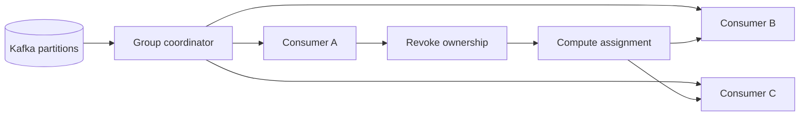

Eine Kafka-Consumer-Group lässt sich einfach beschreiben: Die Partitionen werden auf Consumer verteilt, sodass jede Partition innerhalb der Gruppe genau einen aktiven Besitzer hat. Schwierig wird es, sobald sich die Mitgliedschaft ändert.

Bei einem Deployment starten Consumer neu. Autoscaling fügt Instanzen hinzu oder entfernt sie. Ein langer Verarbeitungsschritt verzögert `poll()`. Eine Netzwerkunterbrechung verbirgt ein Mitglied vor dem Koordinator. Kafka muss dann entscheiden, welche Consumer noch leben, alten Besitz entziehen, eine neue Zuweisung berechnen und festlegen, wer weiterarbeiten darf.

Diese Abfolge ist ein verteiltes Koordinationsprotokoll. Wer sie nur als Timeout-Einstellung behandelt, erhält häufig eines von zwei schlechten Ergebnissen: eine aggressive Fehlererkennung mit vermeidbarer Unruhe oder eine langsame Erkennung, durch die Partitionen zu lange ungenutzt bleiben.

Dieser Artikel beschreibt eine Referenzarchitektur, keinen Bericht über ein vermessenes Produktivsystem. Die Entscheidungen müssen gegen Client-Version, Gruppenprotokoll, Workload und Fehlerbudget des konkreten Systems geprüft werden.

## Warum Rebalances teuer sind

Ein Rebalance ist nicht automatisch ein Fehler. Er ermöglicht einer Gruppe, sich zu erholen und Arbeit neu zu verteilen. Die Kosten hängen davon ab, wie oft er stattfindet, wie viel Besitz entzogen wird und welchen Zustand Consumer anschließend neu aufbauen müssen.

Bei einem eager Rebalance können Mitglieder die Verarbeitung vorübergehend stoppen, während die Gruppe eine neue Generation und Zuweisung festlegt. Consumer müssen möglicherweise Puffer leeren, Offsets committen, partitionsgebundene Ressourcen schließen und danach Caches oder lokalen Zustand wiederherstellen. Ein zustandsbehafteter Stream-Prozessor zahlt dafür deutlich mehr als ein zustandsloser Event-Handler.

Die betrieblichen Auswirkungen reichen über die Pause hinaus:

- Der Consumer Lag steigt, solange Partitionen keinen aktiven Prozessor haben.
- Datensätze in Bearbeitung können erneut erscheinen, wenn Offset- und Seiteneffektgrenzen nicht zusammenpassen.
- Lokale Caches und partitionsgebundene Verbindungen können unnötig verworfen werden.
- Ein langsamer Neustart kann die nächste Mitgliedschaftsänderung auslösen, bevor sich die erste beruhigt hat.
- Rolling Deployments können zu einer Folge gruppenweiter Unterbrechungen werden.

Die nützliche Frage lautet deshalb nicht: „Wie schalten wir Rebalances aus?“ Eine Consumer Group braucht diesen Mechanismus. Die richtige Frage ist: „Wie machen wir Besitzwechsel bewusst, begrenzt und beobachtbar?“

## Das Koordinationsmodell

Drei Zeitachsen werden häufig verwechselt.

Der **Heartbeat- und Session-Pfad** erkennt, ob ein Mitglied mit der Gruppe verbunden bleibt. Der **Poll-Intervall-Pfad** erkennt, ob die Anwendung `poll()` häufig genug aufruft. Die **Verarbeitungslatenz** der Datensätze ist die eigene Workload-Uhr der Anwendung. Diese Zeiten beeinflussen einander, beschreiben aber nicht denselben Fehler.

Die aktuelle Kafka-Referenz für Consumer-Konfiguration erklärt, dass `max.poll.interval.ms` unter Gruppenverwaltung die maximale Verzögerung zwischen zwei `poll()`-Aufrufen begrenzt. Überschreitet ein Consumer dieses Intervall, kann die Gruppe ihn als ausgefallen betrachten und seine Partitionen neu zuweisen. Session- und Heartbeat-Verhalten hängen vom gewählten Gruppenprotokoll und der Client-Konfiguration ab. Ratschläge für das klassische Protokoll dürfen daher nicht blind auf Consumer mit dem neueren Protokoll übertragen werden.

Partitionsbesitz ist außerdem eine Korrektheitsgrenze. Ein Consumer, der den Besitz verloren hat, darf keine Offsets mehr committen, als wäre seine Generation noch aktuell. Anwendungscode sollte einen Entzug als Zustandsübergang behandeln, nicht nur als Callback für einen Logeintrag.

Der Koordinator verwaltet Mitgliedschaft und Zuweisung. Die Anwendung bleibt dafür verantwortlich, laufende Arbeit abzuschließen oder abzubrechen, nur sichere Offsets zu committen und partitionsgebundene Ressourcen bei einem Besitzwechsel freizugeben.

## Was einen Rebalance auslöst

Offensichtliche Auslöser sind der Beitritt oder Austritt eines Consumers sowie neue Partitionen in einem abonnierten Topic. Weniger offensichtliche Ursachen richten oft mehr Schaden an, weil sie wie zufällige Instabilität der Infrastruktur wirken.

Ein Consumer kann seine Poll-Frist verpassen, weil die Verarbeitung im Poll-Thread läuft, eine nachgelagerte Abhängigkeit blockiert, die Garbage Collection den Prozess pausiert oder ein Batch schlicht größer ist als das Zeitbudget. Ein Container kann ein Beendigungssignal erhalten, die Gruppe aber nicht sauber verlassen, bevor er hart beendet wird. Eine Liveness-Probe kann einen gesunden, vorübergehend ausgelasteten Consumer neu starten und damit Lastdruck in Mitgliedschaftsunruhe verwandeln.

Vor jeder Konfigurationsänderung sollten die Auslöser getrennt werden:

1. **Erwartete Topologieänderung:** Deployment, geplante Skalierung oder Erweiterung der Partitionen.
2. **Anwendungsstillstand:** Die Verarbeitung blockiert die Poll-Schleife oder überschreitet ihr Budget.
3. **Infrastrukturunterbrechung:** Prozessabsturz, Knotenausfall oder Netzwerkbruch.
4. **Koordinator- oder Protokollunruhe:** inkompatible Zuweisungsstrategien, wiederholte Join-Fehler oder instabile Identitäten.

Jede Klasse verlangt eine andere Korrektur. Größere Timeouts können Anwendungsstillstände verstecken und echte Fehler langsamer beheben. Kleinere Timeouts erkennen Abstürze schneller, verwandeln aber kurze Pausen in wiederholte Rebalances.

## Dynamische und statische Mitgliedschaft

Dynamische Mitglieder erhalten beim Beitritt eine neue Identität. Das passt zu austauschbaren Instanzen, doch ein kurzer Neustart kann wie ein völlig neues Mitglied aussehen und eine Neuverteilung erzwingen.

Kafka unterstützt statische Mitgliedschaft über `group.instance.id`. Ein nicht leerer, eindeutiger Wert gibt einer Instanz eine stabile Identität innerhalb der Gruppe. Die offizielle Konfigurationsreferenz beschreibt die Kombination mit einem geeigneten Session-Timeout, um Rebalances durch kurze Unterbrechungen wie Prozessneustarts zu reduzieren. KIP-345 definiert die Protokolländerung und das Fencing-Verhalten.

Statische Mitgliedschaft ist kein kostenloser Zuverlässigkeitsschalter. Jede gleichzeitig laufende Instanz benötigt eine eindeutige und stabile ID. Nutzen zwei aktive Prozesse dieselbe ID, entsteht ein Fencing-Konflikt. Verschwindet eine Instanz, ohne die Gruppe zu verlassen, kann ihr Platz bis zum Session-Timeout reserviert bleiben und die Neuzuweisung verzögern. In einem Orchestrator sollte die Identität aus einer stabilen Ordnungsnummer oder einer anderen bewussten Abbildung stammen, nicht aus einer zufälligen Pod-UID, die sich bei jedem Neustart ändert.

Statische Mitgliedschaft ist sinnvoll, wenn Kontinuität über Neustarts wichtig ist und sich Instanzidentitäten sicher verwalten lassen. Dynamische Mitgliedschaft bleibt passend, wenn Instanzen absichtlich anonym sind und ein schneller Ersatz wichtiger ist als die vorherige Zuweisung.

## Kooperative Zuweisung begrenzt den Wirkungsbereich

Ein traditioneller eager Rebalance entzieht Besitz breit, bevor die neue Zuweisung installiert wird. Kooperatives Rebalancing macht daraus einen schrittweisen Besitztransfer: Mitglieder behalten nicht betroffene Partitionen, während nur tatsächlich zu verschiebende Partitionen entzogen und neu zugewiesen werden.

KIP-429 führte dieses inkrementelle Protokoll und den Cooperative Sticky Assignor ein. Der praktische Nutzen liegt in geringeren Unterbrechungen bei rollierenden Änderungen, nicht in der Abschaffung von Koordination. Anwendungen benötigen weiterhin korrekte Behandlung des Entzugs, und alle Mitglieder müssen kompatible Strategien aushandeln.

Eine Migration braucht Sorgfalt. Die Consumer-Konfiguration unterstützt eine geordnete Liste von Zuweisungsstrategien. Eine Gruppe sollte über ein kompatibles Rollout wechseln, statt Clients abrupt zu mischen, die sich nicht auf ein Protokoll einigen können. Vor der Änderung sind die genaue Client-Dokumentation und das Release-Verhalten zu prüfen.

Kooperative Zuweisung ist besonders wertvoll, wenn der Wiederaufbau partitionslokalen Zustands teuer ist. Sie bringt weniger, wenn Consumer keinen lokalen Zustand teilen und Verarbeitungspausen bereits vernachlässigbar sind. Entscheidend sind gemessene Rebalance-Dauer und Anzahl entzogener Partitionen, nicht nur die Attraktivität eines neueren Verfahrens.

## Die Poll-Schleife bewusst langweilig halten

Der Poll-Thread sollte Fetching und Besitz koordinieren, nicht unbegrenzte Arbeit ausführen. Kann die Verarbeitung das Poll-Budget überschreiten, gehört sie in begrenzte Worker. Dabei müssen Reihenfolge je Partition und sichere Commits erhalten bleiben.

Diese Architektur braucht explizite Grenzen. Ein unbegrenzter Executor verschiebt den Stillstand nur von Kafka in den Arbeitsspeicher. Partitionen sollten pausieren, wenn die interne Queue einen oberen Schwellenwert erreicht, und bei freier Kapazität fortgesetzt werden. Gleichzeitig muss der Client-Vertrag für Poll-Aufrufe eingehalten werden. Die Anzahl der pro Poll gelieferten Datensätze sollte an gemessene Verarbeitungszeit und Speichernutzung angepasst werden. `max.poll.records` steuert jedoch, was `poll()` zurückgibt, nicht das zugrunde liegende Fetch-Verhalten des Consumers.

Offset-Verwaltung muss dem Abschluss folgen, nicht dem Dispatch. Läuft Offset 42 noch, während 43 fertig ist, kann ein Commit von 44 nach einem Absturz Datensatz 42 verlieren. Übliche Lösungen sind sequenzielle Verarbeitung pro Partition, ein partitionslokaler Completion-Tracker oder ein Workload-Design mit idempotenten Seiteneffekten und sicherem Replay.

Das Ziel ist eine einfache Invariante: Ein committeter Offset bedeutet, dass jeder erforderliche Effekt vor diesem Offset dauerhaft abgeschlossen ist.

## Deployments als Gruppenereignisse entwerfen

Ein Rolling Deployment ist nicht nur eine Container-Operation. Es ist eine geplante Abfolge von Mitgliedschaftsänderungen.

Beim Herunterfahren nimmt der Consumer keine neue Arbeit mehr an, hält den Poll- und Heartbeat-Vertrag während des begrenzten Drainings ein, committet nur abgeschlossene Offsets, schließt den Consumer für einen sauberen Gruppenaustritt und bleibt innerhalb der Terminierungsfrist des Orchestrators. Kann das Draining länger dauern, müssen Batchgröße oder Parallelität vor dem Shutdown reduziert werden, statt auf zusätzliche Zeit zu hoffen.

Auch der Start zählt. Eine Readiness-Probe darf die Instanz nicht als bereit melden, bevor sie zugewiesene Partitionen sicher verarbeiten kann. Eine Liveness-Probe sollte einen wirklich nicht mehr behebbaren Consumer erkennen und keinen Prozess nur deshalb neu starten, weil nachgelagerte Arbeit langsam ist.

Zeitlich versetzte Neustarts reduzieren gleichzeitige Mitgliedschaftsänderungen. Statische Mitgliedschaft und kooperative Zuweisung können die Unterbrechung weiter begrenzen, ersetzen aber keine Shutdown-Frist, die mindestens zum Drain-Budget der Anwendung passt.

## Ursachen, Übergänge und Auswirkungen beobachten

Ein einzelner Rebalance-Zähler reicht nicht. Er zeigt, dass Koordination stattgefunden hat, aber weder warum noch mit welcher Auswirkung auf Nutzer.

Mindestens erfasst werden sollten:

- Anzahl und Rate der Rebalances pro Consumer Group.
- Rebalance-Dauer und Zuweisungslatenz.
- Entzogene, zugewiesene und beibehaltene Partitionen pro Ereignis.
- Consumer Lag pro Partition und, sofern verfügbar, das Alter des ältesten unverarbeiteten Datensatzes.
- Zeit zwischen `poll()`-Aufrufen und Datensätze pro Poll.
- Laufende Arbeit, interne Queue-Tiefe, pausierte Partitionen und Drain-Dauer.
- Join-, Leave-, Timeout-, Fencing- und Zuweisungsfehler.
- Deployment-Version und Instanzidentität in Korrelation mit jedem Rebalance.

Alarme sollten Auswirkung und Dauer bewerten, nicht jeden erwarteten Übergang. Ein kurzer Rebalance während eines kontrollierten Rollouts kann normal sein. Wiederholte Rebalances mit wachsendem Lag, ohne stabile Generation oder mit oszillierender Mitgliedschaft sind dagegen ein Koordinationsvorfall.

Logs sollten Gruppen-ID, Mitglieds- oder Instanz-ID, Generation, zugewiesene Partitionen, Auslöser und Dauer enthalten, aber keine Nachrichteninhalte oder Zugangsdaten. Traces können einen langsamen Downstream-Aufruf mit Druck auf die Poll-Schleife verbinden. Gruppenweite Metriken bleiben dennoch unverzichtbar, weil Besitzwechsel mehrere Prozesse betreffen.

## Fehlergrenzen testen

Eine Konfigurationsprüfung beweist kein Rebalance-Verhalten. Das Protokoll muss unter kontrollierten Fehlern ausgeführt werden.

1. Einen Consumer sauber neu starten und prüfen, ob nicht betroffene Partitionen weiterarbeiten.
2. Einen Consumer ohne Cleanup beenden und Erkennungs- sowie Neuzuweisungszeit messen.
3. Verarbeitung über das Poll-Intervall hinaus verzögern und sicherstellen, dass die Anwendung nach Besitzverlust nicht committet.
4. Zwei Instanzen mit derselben statischen Identität starten und prüfen, ob das Fencing-Signal sichtbar ist.
5. Die gesamte Gruppe unter laufender Produktion ausrollen und Lag, Duplikatbehandlung sowie Erholung messen.
6. Eine nachgelagerte Abhängigkeit blockieren, die Worker-Queue füllen und begrenztes Pause/Resume-Verhalten verifizieren.
7. Einem abonnierten Topic Partitionen hinzufügen und Zuweisung sowie partitionslokale Initialisierung prüfen.
8. In einer Nicht-Produktivumgebung einen Client mit inkompatibler Zuweisungsstrategie einführen und eine handlungsfähige Fehlermeldung verlangen.

Erfolgskriterien gehören vor den Test: maximal zulässiges Lag-Alter, Erholungszeit, Duplikattoleranz und die Frage, ob nicht betroffene Partitionen weiterlaufen müssen. Ohne diese Grenzen kann ein Test enden und trotzdem eine untragbare Pause verbergen.

## Eine praktische Entwurfsreihenfolge

Der Ausgangspunkt sind Belege, nicht überlieferte Timeout-Rezepte.

Zuerst werden Auslöser anhand von Koordinator-Logs, Client-Metriken, Deployments und Poll-Zeiten identifiziert. Danach wird die Verarbeitung so begrenzt, dass der Consumer sein Protokoll einhalten kann. Anschließend müssen Offset-Commits mit dauerhaftem Abschluss übereinstimmen. Shutdown und Startup werden als Besitzübergänge entworfen. Erst dann ist zu entscheiden, ob stabile Instanzidentität und kooperative Zuweisung einen gemessenen Preis senken. Zum Schluss werden Abstürze, Stillstände und rollierende Änderungen getestet, während Lag und Zuweisungszustand beobachtet werden.

Eine gute Consumer Group vermeidet Veränderungen nicht. Sie ändert Besitz vorhersehbar, hindert veraltete Besitzer am Handeln, begrenzt unnötige Entzüge und stellt genug Zustand bereit, um jede Unterbrechung zu erklären.

## Quellen

- [Apache-Kafka-Konfiguration für Consumer](https://kafka.apache.org/42/configuration/consumer-configs/)
- [KIP-345: Statische Mitgliedschaft](https://cwiki.apache.org/confluence/display/KAFKA/KIP-345%3A+Introduce+static+membership+protocol+to+reduce+consumer+rebalances)
- [KIP-429: Inkrementelles kooperatives Rebalancing](https://cwiki.apache.org/confluence/display/KAFKA/KIP-429%3A+Kafka+Consumer+Incremental+Rebalance+Protocol)
- [Confluent-Dokumentation zu Consumer Groups](https://docs.confluent.io/platform/current/clients/consumer.html#consumer-groups)
