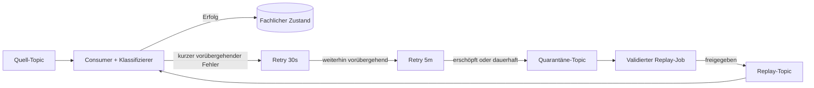

Ein Entwurf für Kafka-Retries sollte fünf Fragen beantworten, bevor er auch nur ein Retry-Topic hinzufügt: **Was ist fehlgeschlagen? Ist ein weiterer Versuch sinnvoll? Was geschieht mit der Reihenfolge? Wann wird der Quell-Offset committet? Wie lässt sich der Datensatz erneut verarbeiten, ohne einen fachlichen Effekt zu wiederholen?**

Ein Dead-Letter-Topic ist nur ein Abstellplatz. Es klassifiziert keine Fehler, macht Consumer nicht idempotent, erhält keine Reihenfolge über Retry-Topics hinweg und beweist nicht, dass ein Replay sicher ist. Ein zuverlässiger Entwurf legt eine kleine Fehlerzustandsmaschine um den Consumer: validieren, klassifizieren, innerhalb eines Budgets wiederholen, mit vollständigem Kontext isolieren und über einen kontrollierten Pfad erneut verarbeiten.

Dieser Artikel entwickelt diese Referenzarchitektur, ohne ein konkretes Produktions-Deployment zu beanspruchen.

## Mit dem Consumer-Vertrag beginnen

Kafka speichert Datensätze in geordneten Topic-Partitionen. Datensätze mit demselben Schlüssel können an dieselbe Partition geleitet werden, und Kafka garantiert, dass ein Consumer eine bestimmte Partition in Schreibreihenfolge liest ([Apache-Kafka-Dokumentation](https://kafka.apache.org/documentation/)). Die Consumer Group verfolgt ihren Fortschritt anhand von Offsets.

Dieser Mechanismus definiert keinen Anwendungserfolg. Ein Handler kann einen Datensatz lesen und anschließend beim Parsen, beim Aktualisieren einer Datenbank, beim Aufruf einer API oder beim Erzeugen eines weiteren Events fehlschlagen. Die Anwendung muss entscheiden, ob sie die Partition anhält, die Arbeit wiederholt oder über den Datensatz hinweg fortschreitet.

Halten Sie diese Entscheidung als Vertrag fest:

1. Ein Datensatz wird erst bestätigt, wenn er einen abschließenden Zustand erreicht hat.
2. Ein abschließender Zustand ist entweder `processed` oder `quarantined`.
3. Wiederholungen sind durch Anzahl und verstrichene Zeit begrenzt.
4. Mehrfachzustellung darf den fachlichen Effekt nicht duplizieren.
5. Ein Replay ist eine neue kontrollierte Operation und keine automatische Schleife zurück zur Quelle.

Das ist bewusst strenger als "Exception abfangen und in eine DLQ veröffentlichen".

## Fehler vor der Wahl eines Retries klassifizieren

Jede Exception als vorübergehend zu behandeln, erzeugt Retry-Stürme. Jede Exception als dauerhaft einzustufen, schickt wiederherstellbare Arbeit in die manuelle Prüfung. Eine brauchbare Unterteilung kennt vier Klassen.

### Ungültige Eingabe

Fehlerhafte Bytes, eine nicht unterstützte Schemaversion oder ein fehlendes Pflichtfeld verbessern sich nicht mit der Zeit. Solche Datensätze gehören sofort in Quarantäne. Erhalten Sie, soweit es die Richtlinien erlauben, die ursprünglichen Bytes sowie Topic, Partition, Offset, Zeitstempel, Schlüssel, Schemaidentität und einen stabilen Fehlercode.

### Dauerhafte fachliche Ablehnung

Auch ein gültiger Datensatz kann gegen eine Regel verstoßen, etwa durch einen unmöglichen Zustandsübergang, einen unbekannten Mandanten oder eine Anfrage, die das nachgelagerte System dauerhaft ablehnt. Auch hier ist eine blinde Retry-Schleife falsch. Abhängig von der Domäne kann der endgültige Zustand ein Event zur fachlichen Ablehnung statt einer technischen DLQ sein.

### Vorübergehender Abhängigkeitsfehler

Timeouts, Rate Limits, Leader-Wechsel oder ein kurzer Datenbankausfall können einen erneuten Versuch rechtfertigen. Das Retry-Budget sollte zum Wiederherstellungsverhalten der Abhängigkeit und zum Latenzziel des Workflows passen, nicht aus einem Framework-Standard übernommen werden.

### Unbekannter Fehler

Eine unerwartete Exception ist weder sicher vorübergehend noch sicher dauerhaft. Gewähren Sie ein kleines, begrenztes Retry-Budget, erfassen Sie genügend Diagnosedaten, um ähnliche Fehler zu gruppieren, und stellen Sie den Datensatz dann unter Quarantäne. Unbegrenzte Wiederholung ist keine Vorsicht, sondern ein Ausfall ohne Obergrenze.

Ein Klassifizierer sollte Daten liefern, statt eine weitere generische Exception auszulösen:

```ts
type FailureDecision =
  | { kind: "quarantine"; code: string }
  | { kind: "retry"; code: string; delayMs: number }
  | { kind: "reject"; code: string };

function classify(error: unknown, attempt: number): FailureDecision {
  if (error instanceof UnsupportedSchema) {
    return { kind: "quarantine", code: "SCHEMA_UNSUPPORTED" };
  }
  if (error instanceof RateLimited && attempt < 4) {
    return { kind: "retry", code: "RATE_LIMITED", delayMs: backoff(attempt) };
  }
  if (error instanceof InvalidTransition) {
    return { kind: "reject", code: "INVALID_TRANSITION" };
  }
  return attempt < 2
    ? { kind: "retry", code: "UNCLASSIFIED", delayMs: backoff(attempt) }
    : { kind: "quarantine", code: "UNCLASSIFIED_EXHAUSTED" };
}
```

Die Zahlen dienen nur als Beispiel. Produktionswerte müssen auf gemessenem Verhalten der Abhängigkeiten und den Servicezielen beruhen.

## Blockierende oder nicht blockierende Retries bewusst wählen

Ein blockierender Retry pausiert die Arbeit am fehlgeschlagenen Datensatz, meist mit lokalem Backoff. Der Datensatz bleibt im aktuellen Verarbeitungspfad, und die Reihenfolge der Partition kann erhalten bleiben. Das ist für ein oder zwei kurze Versuche vertretbar, wenn die erwartete Wiederherstellungszeit unter dem Verarbeitungsbudget des Consumers liegt.

Diese Lösung hat klare Grenzen. Ein Sleep in der Poll-Schleife verzögert jeden späteren Datensatz dieser Partition. Lange Verarbeitungszeiten können die Liveness der Consumer Group und Rebalancing beeinträchtigen. Bei einem Ausfall einer Abhängigkeit kann jede Consumer-Instanz zu einer synchronisierten Retry-Engine werden.

Ein nicht blockierender Retry veröffentlicht den fehlgeschlagenen Datensatz in ein Retry-Topic, committet den Fortschritt an der Quelle und arbeitet weiter. Separate Consumer verarbeiten Retry-Stufen mit steigenden Verzögerungen:



Das gibt die Quellpartition frei, verändert aber die Reihenfolge. Datensatz `A2` kann erfolgreich sein, während der frühere Datensatz `A1` in einem Retry-Topic wartet. Das erneute Veröffentlichen mit demselben Schlüssel stellt die ursprüngliche Sequenz nicht wieder her, weil die Datensätze nun verschiedene Topics und Consumer Groups durchlaufen.

Wählen Sie nicht blockierende Retries nur, wenn mindestens eine dieser Bedingungen erfüllt ist:

- Die Verarbeitungsreihenfolge ist unerheblich.
- Der Consumer verwendet Versionen und weist veraltete Aktualisierungen zurück.
- Das Aggregat kann gesperrt oder zurückgestellt werden, solange ein Event erneut versucht wird.
- Ein Abgleich kann Auswirkungen falscher Reihenfolge korrigieren.

Ist eine strikte Reihenfolge pro Schlüssel eine fachliche Invariante, muss der Schlüssel blockiert, hinter einem schlüsselbasierten Scheduler isoliert oder der Zustandsübergang neu entworfen werden. Verbergen Sie diesen Zielkonflikt nicht hinter dem Wort "resilient".

## Den Offset-Übergang explizit machen

Die gefährliche Grenze liegt nicht allein in der Verarbeitung des Datensatzes. Sie liegt im Übergang vom Quell-Topic in einen anderen dauerhaften Zustand.

Bei einem erfolgreichen Datenbankschreibvorgang sind das Committen der Datenbanktransaktion und das Committen des Kafka-Offsets zwei unabhängige Operationen. Ein Absturz dazwischen kann eine Mehrfachverarbeitung verursachen. Das [Idempotent Consumer Pattern](https://microservices.io/patterns/communication-style/idempotent-consumer.html) begegnet dem, indem es eine stabile Nachrichtenidentität und die fachliche Änderung in derselben Datenbanktransaktion speichert.

Dasselbe Dual-Write-Problem tritt bei der Quarantäne auf:

1. Den fehlgeschlagenen Datensatz im Quarantäne-Topic veröffentlichen.
2. Den Quell-Offset committen.

Stürzt der Prozess zwischen diesen Schritten ab, kann der Quelldatensatz erneut gelesen und zweimal unter Quarantäne gestellt werden. Wird zuerst committet und schlägt dann die Veröffentlichung fehl, kann der Datensatz aus dem Verarbeitungspfad verschwinden.

Es gibt zwei ehrliche Ansätze:

- Kafka-Transaktionen verwenden, wenn der konsumierte Datensatz, der erzeugte Retry- oder Quarantänedatensatz und die Quell-Offsets vollständig in Kafka bleiben und Client sowie Framework die nötige Consume-Transform-Produce-Transaktion unterstützen.
- Andernfalls von einer At-least-once-Verschiebung ausgehen, vor dem Commit des Quell-Offsets veröffentlichen und jedem Fehler-Envelope eine deterministische Identität wie `source-topic/source-partition/source-offset` geben, damit sich Duplikate erkennen lassen.

Ein Quarantänedatensatz sollte die ursprünglichen Koordinaten behalten, auch wenn er einen neuen Kafka-Offset erhält:

```json
{
  "failureId": "orders/12/884193",
  "source": { "topic": "orders", "partition": 12, "offset": 884193 },
  "attempt": 4,
  "firstFailedAt": "2026-07-31T09:10:00Z",
  "lastFailedAt": "2026-07-31T09:16:42Z",
  "errorCode": "RATE_LIMITED_EXHAUSTED",
  "payloadSchema": "order-created.v3",
  "traceId": "..."
}
```

Serialisieren Sie keine unbeschränkten Stacktraces, Zugangsdaten oder personenbezogenen Daten in Header. Speichern Sie einen begrenzten Fehlercode und eine Korrelations-ID; sensible Diagnosedaten gehören in zugriffsgeschützte Logs.

## Idempotenz muss den fachlichen Effekt abdecken

Eine Menge verarbeiteter Offsets im Arbeitsspeicher ist keine Idempotenz. Sie verschwindet beim Neustart und koordiniert nicht mehrere Consumer-Instanzen.

Bei einem Datenbankeffekt werden Nachrichtenidentität und fachliche Änderung in derselben Transaktion gespeichert. Ein Unique Constraint auf `(consumer_name, message_id)` macht eine erneute Zustellung wirkungslos. Dies ist derselbe Kernmechanismus, den Microservices.io beschreibt.

Externe Effekte brauchen eigenen Schutz. Übergeben Sie einen stabilen Idempotency-Key an APIs, die einen solchen unterstützen. Für E-Mail-, Zahlungs- oder Webhook-Systeme ohne geeignete atomare Grenze wird die Aktion als dauerhafter Zustand mit expliziten Ergebnissen `pending`, `sent` und `uncertain` samt Abgleich modelliert. Ein Replay-Button kann nachträglich kein Exactly-once-Verhalten erzeugen.

## Quarantäne als betriebliche Queue behandeln, nicht als Archiv

Eine DLQ ohne Besitzer ist verzögerter Datenverlust. Jedes Quarantäne-Topic benötigt:

- einen verantwortlichen Service und ein verantwortliches Team;
- eine Aufbewahrungsdauer, die für das Reaktionsziel ausreicht;
- Fehleranzahl und Fehlerrate je Fehlercode;
- das Alter des ältesten ungelösten Datensatzes;
- die Anzahl der Versuche und die in Retry-Stufen verbrachte Zeit;
- Anzahl erfolgreicher Replays und wiederholter Fehlschläge;
- einen an die fachliche Dringlichkeit gekoppelten Alarmschwellwert;
- ein Runbook für Prüfung, Reparatur, Replay und Verifikation.

Confluents Überblick empfiehlt begrenzte Wiederholungen, Zustandsüberwachung, Untersuchung und kontrollierte Neuverarbeitung. Sinnvoll ist zusätzlich, neben der Tiefe auch das Alter zu überwachen. Eine einzelne alte fehlgeschlagene Zahlung kann wichtiger sein als Tausende neue Analytics-Datensätze geringer Priorität.

Die Quarantäne sollte standardmäßig ein Endzustand sein. Eine automatische Schleife von der DLQ zurück zur Quelle kann denselben Seiteneffekt wiederholt auslösen, Diagnosekontext verlieren und Traffic erzeugen, der wie gesunder Durchsatz aussieht.

## Ein Replay ist ein Deployment mit Auswirkungsradius

Ein Replay sollte ein separater, beobachtbarer Workflow sein:

1. Datensätze anhand unveränderlicher Fehler-ID und eines expliziten Grundes auswählen.
2. Prüfen, dass der Consumer korrigiert oder die Abhängigkeit wiederhergestellt wurde.
3. Schemakompatibilität prüfen.
4. Volumen und nachgelagerte Kapazität abschätzen.
5. Mit begrenzter Rate in ein eigenes Replay-Topic veröffentlichen.
6. Die ursprüngliche Identität erhalten und Replay-Metadaten hochzählen.
7. Den fachlichen Zustand prüfen, nicht nur die Kafka-Zustellung.
8. Den Datensatz in Quarantäne schließen oder annotieren.

Ein eigenes Replay-Topic macht Berechtigungen, Rate Limits, Dashboards und Audit-Verlauf übersichtlicher als das direkte Zurückschreiben in die Quelle. Außerdem kann der Consumer so Live-Datensätze von Replays unterscheiden, ohne die fachliche Identität zu ändern.

Testen Sie bei umfangreichen Replays zuerst eine kleine deterministische Stichprobe. Abbruchbedingungen sollten eine erneut steigende Fehlerrate, unerwartete Duplikaterkennung, Sättigung von Abhängigkeiten und wachsenden Consumer Lag umfassen.

## Die Fehlerzustandsmaschine testen

Happy-Path-Tests belegen wenig über die Sicherheit von Retries. Testen Sie die Grenzen:

1. Fehlerhafte Eingaben ohne Retry ablehnen.
2. Einen vorübergehenden Fehler innerhalb des blockierenden Budgets beheben.
3. Blockierende Retries ausschöpfen und genau einmal in ein Retry-Topic verschieben.
4. Nach der Veröffentlichung im Retry-Topic, aber vor dem Commit des Quell-Offsets abstürzen.
5. Denselben Datensatz gleichzeitig zustellen und genau einen fachlichen Effekt erzeugen.
6. Einen späteren Datensatz mit demselben Schlüssel verarbeiten, während der frühere wartet, und anschließend die Richtlinie zur Reihenfolge prüfen.
7. Die Veröffentlichung in die Quarantäne fehlschlagen lassen und nachweisen, dass der Quelldatensatz wiederherstellbar bleibt.
8. Eine feste Stichprobe zweimal erneut verarbeiten und Idempotenz prüfen.
9. Einen Abhängigkeitsausfall lange genug ausführen, um Backoff, Lag und Alarmverhalten zu beobachten.
10. Sensible Fehlerdaten einspeisen und prüfen, dass der Envelope sie schwärzt.

Diese Tests machen aus Retry-Konfiguration belastbare Nachweise.

## Praktisches Fazit

Die Zuverlässigkeit eines Kafka-Consumers wird nicht durch das Vorhandensein eines Dead-Letter-Topics bestimmt. Sie entsteht durch explizite Übergänge und begrenzte Zusagen.

Klassifizieren Sie Fehler vor dem Retry. Verwenden Sie kurze blockierende Retries nur, wenn sie in Polling- und Latenzbudget passen. Nutzen Sie Retry-Topics, wenn Fortschritt wichtiger als strikte Reihenfolge ist, und benennen Sie diesen Zielkonflikt klar. Veröffentlichen Sie Fehlerdatensätze, bevor Sie den Fortschritt an der Quelle committen, sofern nicht eine Kafka-Transaktion beides abdeckt. Machen Sie fachliche Effekte idempotent. Halten Sie die Quarantäne beobachtbar und endgültig. Führen Sie Replays über einen ratenbegrenzten, auditierbaren Pfad aus und prüfen Sie den resultierenden Zustand.

Das Ziel ist nicht, jeden Datensatz automatisch erfolgreich zu verarbeiten. Jeder Datensatz soll vielmehr einen bekannten Zustand erreichen, ohne Verlust, Duplizierung oder betriebliche Altlasten zu verbergen.

---
