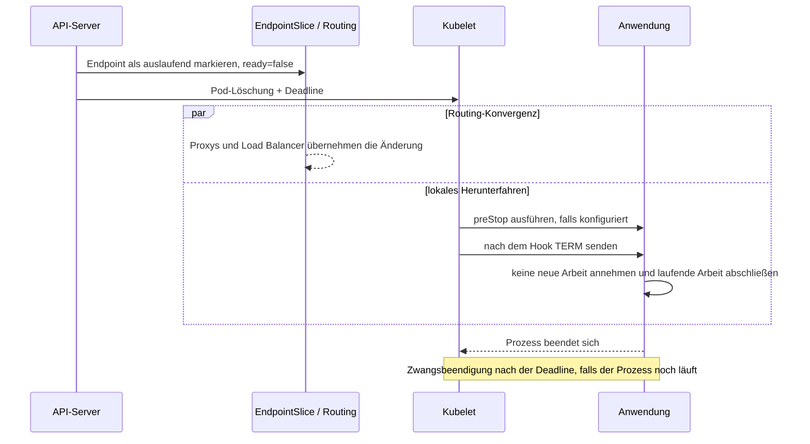

Graceful Shutdown in Kubernetes wird oft auf eine einzige Anweisung reduziert: `SIGTERM` abfangen. Das ist notwendig, aber noch kein vollständiges System.

Ein Pod befindet sich hinter mehreren unabhängig arbeitenden Komponenten: API-Server, EndpointSlices, kube-proxy oder ein Service Proxy, Ingress Controller, möglicherweise ein externer Load Balancer und schließlich der Anwendungsprozess selbst. Während der Beendigung beginnen Routing-Änderungen und das lokale Herunterfahren des Prozesses ohne eine globale Transaktion zwischen beiden. Ein Prozess kann aufhören, Verbindungen anzunehmen, bevor alle Routen konvergiert sind. Ein Ersatz-Pod kann innerhalb von Kubernetes bereit sein, während ihn ein externer Load Balancer noch für fehlerhaft hält.

Das sicherere Modell ist ein zeitlich abgestimmtes Protokoll mit drei Aufgaben: **den Endpoint aus dem Routing nehmen, bereits angenommene Arbeit abschließen und den Prozess vor Ablauf der Grace Period beenden**. Dieser Artikel entwickelt diese Referenzarchitektur, ohne ein konkretes Produktions-Deployment zu beanspruchen.

## Routing und Prozesslebensdauer liefern sich ein Rennen

Wird ein Pod gelöscht, zeichnet Kubernetes eine Löschfrist auf und der Kubelet beginnt mit dem lokalen Herunterfahren. Definiert ein Container einen `preStop`-Hook, führt der Kubelet ihn aus, bevor er die Container-Runtime anweist, das Stoppsignal an den Container zu senden. Standardmäßig ist dieses Signal `SIGTERM`. Ein nach Ablauf der Grace Period noch laufender Prozess wird zwangsweise beendet. Kubernetes dokumentiert eine standardmäßige Grace Period von 30 Sekunden und weist darauf hin, dass ihre Uhr bereits während des `preStop`-Hooks läuft ([Pod-Lebenszyklus](https://kubernetes.io/docs/concepts/workloads/pods/pod-lifecycle/#pod-termination)).

An der Service-Grenze ändert sich ebenfalls der Endpoint. Das Kubernetes-Tutorial zur Endpoint-Beendigung zeigt einen auslaufenden EndpointSlice-Eintrag mit:

```yaml
conditions:
  ready: false
  serving: true
  terminating: true
```

`ready: false` verhindert, dass bestehende Load Balancer den Endpoint für gewöhnlichen neuen Traffic auswählen. `serving: true` kann mitteilen, dass der Endpoint während seiner Beendigung bestehende Verbindungen weiterhin bedient ([Ablauf der Endpoint-Beendigung](https://kubernetes.io/docs/tutorials/services/pods-and-endpoint-termination-flow/)).

Entscheidend ist, dass Endpoint-Propagation und Kubelet-Shutdown über Zustand koordiniert werden, nicht durch eine Ende-zu-Ende-Bestätigung jedes Netzwerkabschnitts. Die Anwendung erhält keinen Nachweis, dass alle Proxys das Routing eingestellt haben, bevor sie ihr Beendigungssignal empfängt.



Jeder Entwurf, der für diese beiden Zweige eine feste Abschlussreihenfolge voraussetzt, enthält eine Race Condition.

## Shutdown in drei Phasen definieren

### 1. Aus dem Routing nehmen

Zuerst darf das System keine neue Arbeit mehr annehmen. Kubernetes markiert einen auslaufenden Endpoint als nicht bereit, doch die Weitergabe durch den tatsächlichen Request-Pfad braucht Zeit. Dieser Pfad kann EndpointSlice-Watcher, Regeln auf Node-Ebene, einen Mesh Proxy, Ingress und einen Cloud Load Balancer mit eigenen Health Checks und eigenem Deregistrierungsverhalten umfassen.

Eine Verzögerung im `preStop`-Hook kann ein Zeitfenster schaffen, in dem das Routing zurückgezogen wird, bevor die Anwendung `SIGTERM` erhält. Sie ist ein grobes Werkzeug, kein Korrektheitsnachweis. Die Dauer sollte aus der beobachteten Routing-Konvergenz der tatsächlichen Umgebung stammen, nicht aus einem kopierten `sleep 10`.

Eine von der Anwendung gesteuerte Drain-Schnittstelle ist eine weitere Möglichkeit: Ein `preStop`-Hook weist den Prozess an, die Readiness zurückzunehmen, und wartet dann auf die Ableitung des Traffics. Damit erhält die Anwendung einen expliziten Zustand, doch es entsteht auch ein weiterer Steuerungs-Endpoint, der authentifiziert, getestet und auf lokale Aufrufe beschränkt werden muss. Kubernetes weist darauf hin, dass eine Löschung den EndpointSlice-Eintrag bereits als nicht bereit markiert. Ein eigener Readiness-Übergang ist daher nicht allein für das Ableiten des Traffics von einem zu löschenden Pod erforderlich ([Dokumentation zu Probes](https://kubernetes.io/docs/concepts/configuration/liveness-readiness-startup-probes/#readiness-probe)).

### 2. Laufende Arbeit abschließen

Sobald die Traffic-Ableitung beginnt, muss der Prozess die bereits angenommene Arbeit beenden. Was als "Arbeit" gilt, hängt vom Protokoll ab:

- HTTP-Anfragen brauchen einen Server, der keine neuen Verbindungen annimmt, aktive Handler aber abschließen lässt.
- WebSockets und Streaming-RPCs brauchen eine Richtlinie: abschließen, benachrichtigen und neu verbinden oder innerhalb einer Frist schließen.
- Queue-Consumer sollten keine neuen Nachrichten mehr abrufen, bevor sie auf laufende Handler warten.
- Hintergrund-Worker brauchen dauerhafte Checkpoints statt eines unbegrenzten Versprechens, alles fertigzustellen.

Der Shutdown ist nicht der richtige Zeitpunkt, umfangreiche Bereinigungsaufgaben zu beginnen. Speichern Sie den für die Wiederherstellung nötigen Zustand bereits während der normalen Verarbeitung. Der Drain-Handler sollte begrenzt, idempotent, beobachtbar und auch bei mehrfachen Aufrufen sicher sein.

### 3. Beenden

Schließen Sie abschließend Pools und Telemetrie-Exporter, protokollieren Sie das Shutdown-Ergebnis und beenden Sie den Prozess freiwillig, bevor Kubernetes die Deadline erreicht. Wartet der Prozess unbegrenzt, ist `SIGKILL` der Endzustand und nicht Graceful Shutdown.

Verwenden Sie ein einfaches Budget:

```text
termination grace >= routing withdrawal + maximum admitted work + cleanup + safety margin
```

Für jeden Term braucht es Nachweise. Der längste Request-Timeout entspricht nicht automatisch der maximalen Dauer angenommener Arbeit: Streams, Retries, externe Aufrufe und Queue Visibility Timeouts können längere Laufzeiten verursachen. Umgekehrt können übergroße Grace Periods Rollouts und Node Drains unnötig verlangsamen, wenn die Annahme neuer Arbeit nicht kontrolliert wird.

## Ein Anwendungsvertrag in TypeScript

Die Anwendung muss ihren lokalen Teil des Protokolls selbst beherrschen. Dieses vereinfachte Node.js-Beispiel trennt Readiness von Liveness, nimmt bei der Beendigung keine neuen Verbindungen mehr an und gibt laufender Arbeit ein begrenztes Zeitfenster zum Abschluss:

```ts
import http from "node:http";

let accepting = true;
let active = 0;

const server = http.createServer(async (req, res) => {
  if (req.url === "/live") return void res.end("ok");
  if (req.url === "/ready") {
    res.statusCode = accepting ? 200 : 503;
    return void res.end(accepting ? "ready" : "draining");
  }

  if (!accepting) {
    res.statusCode = 503;
    res.setHeader("connection", "close");
    return void res.end("draining");
  }

  active++;
  try {
    await handle(req, res);
  } finally {
    active--;
  }
});

process.on("SIGTERM", () => {
  accepting = false;
  server.close(); // stop new connections; existing work may finish

  const deadline = setTimeout(() => process.exit(1), 20_000);
  deadline.unref();

  const check = setInterval(async () => {
    if (active !== 0) return;
    clearInterval(check);
    await closeDependencies();
    process.exit(0);
  }, 100);
});
```

`handle` und `closeDependencies` sind Platzhalter. Das 20-Sekunden-Limit dient nur als Beispiel und ist kein empfohlener Produktionswert. Tatsächlicher Code muss außerdem Verbindungen nach einem Protokoll-Upgrade, Keep-Alive-Verhalten, abgewiesene Anfragen, Fehlerberichte und ein zweites Beendigungssignal berücksichtigen.

Liveness sollte normalerweise unabhängig vom Drain-Zustand bleiben. Wird Liveness während eines beabsichtigten Shutdowns auf false gesetzt, kann dies einen auf Neustart ausgerichteten Mechanismus auslösen, obwohl der Pod bereits beendet wird. Readiness beantwortet die Frage "Soll diese Instanz Traffic erhalten?" Liveness beantwortet "Ist ein Neustart dieses Prozesses die richtige Wiederherstellungsmaßnahme?"

## Das Pod-Budget explizit machen

Ein Deployment-Template kann denselben Vertrag ausdrücken:

```yaml
spec:
  strategy:
    type: RollingUpdate
    rollingUpdate:
      maxUnavailable: 0
      maxSurge: 1
  template:
    spec:
      terminationGracePeriodSeconds: 45
      containers:
        - name: api
          image: example/api:sha-immutable
          ports:
            - containerPort: 8080
          readinessProbe:
            httpGet:
              path: /ready
              port: 8080
            periodSeconds: 2
            failureThreshold: 2
          livenessProbe:
            httpGet:
              path: /live
              port: 8080
            periodSeconds: 10
          lifecycle:
            preStop:
              sleep:
                seconds: 8
```

Alle Zeitangaben sind Beispiele. Der Kubernetes Deployment Controller steuert mit `maxUnavailable` und `maxSurge`, wie schnell Instanzen während eines Rolling Updates ersetzt werden ([Deployment-Dokumentation](https://kubernetes.io/docs/concepts/workloads/controllers/deployment/)). Diese Einstellungen schützen die Verfügbarkeit von Replikas innerhalb des Rollouts, beweisen aber nicht, dass ein externer Load Balancer das neue Backend aufgenommen oder das alte vollständig geleert hat.

Diese Unterscheidung ist wichtig. In einer Umgebung mit einem externen Target-Health-Gate sollte der Rollout dieses Gate berücksichtigen, bevor er ein weiteres altes Replikat entfernt. Bei einem Service mit nur einem Replikat erfordert `maxUnavailable: 0` gewöhnlich zusätzliche Surge-Kapazität. Die Einstellung kann keine Kapazität schaffen, wenn Scheduling-, Quota- oder Infrastrukturgrenzen verhindern, dass der Ersatz nutzbar wird.

Die Lifecycle-Aktion `preStop.sleep` erfordert in Kubernetes-Versionen mit Unterstützung für den Sleep-Handler keine Shell im Image. In anderen Umgebungen kann ein Exec-Hook oder eine Verzögerung auf Anwendungsebene notwendig sein. In jedem Fall verbraucht die Hook-Laufzeit dasselbe Beendigungsbudget wie der Drain-Vorgang der Anwendung.

## Das Protokoll testen, nicht das Manifest

Eine gültige YAML-Datei belegt nur korrekte Syntax. Ein Shutdown-Test muss die Race Condition gezielt erzeugen.

1. Während wiederholter Rollouts zwischen zwei unveränderlichen Images kontinuierlich kurze Anfragen senden.
2. Ausgewählte Anfragen nahe der maximal unterstützten Dauer offenhalten und dann ihren Pod löschen.
3. EndpointSlice-Zustände gemeinsam mit Anwendungslogs und dem Target-Zustand von Proxy oder Load Balancer beobachten.
4. Prüfen, dass keine neuen Anfragen die auslaufende Instanz erreichen, während bereits angenommene Anfragen abgeschlossen werden.
5. Den Drain-Vorgang über die Grace Period hinaus verlängern und sicherstellen, dass die Zwangsbeendigung als Fehler sichtbar wird.
6. Den `preStop`-Hook unterbrechen und prüfen, dass die Anwendung `SIGTERM` weiterhin sicher verarbeitet.
7. Während eines Node Drains mehrere Replikas beenden und die tatsächliche Mindestverfügbarkeit prüfen.
8. Langlebige Verbindungen und Queue-Consumer separat testen; erfolgreiche HTTP-Anfragen decken sie nicht ab.
9. Rollout-Dauer, Request-Fehler, Verbindungsabbrüche, Drain-Zeit, erzwungene Beendigungen und aktive Arbeit beim Prozessende messen.
10. Die Tests durch den tatsächlichen Ingress und externen Load Balancer wiederholen, nicht nur über `kubectl port-forward`.

Die EKS-Fallstudie von Glasskube ist hilfreich, weil sie die externe Verzögerung bei Target-Registrierung und -Deregistrierung verfolgt, statt bei der Pod-Readiness aufzuhören. DevOpsCube bietet eine praktische Anleitung zur Signalverarbeitung. OneUptime behandelt die Koordination vor dem Stoppen über Load Balancer und Anwendungs-Readiness hinweg. Das hier beschriebene Protokoll macht zusätzlich Zeitannahmen, Fehlerzustände und Testnachweise über alle Schichten hinweg explizit.

## Fehlerfälle, die der Entwurf abdecken sollte

Einige Fehler legen schwache Shutdown-Verträge schnell offen:

- **Der Hook verwendet eine nicht vorhandene Shell oder Binärdatei.** Die angenommene Verzögerung tritt nicht ein.
- **Der Hook verbraucht die gesamte Grace Period.** Dem Prozess bleibt fast keine Zeit für den Drain-Vorgang.
- **Der Prozess erhält nicht das beabsichtigte Stoppsignal.** Ein Wrapper leitet es nicht weiter oder das Image definiert ein unerwartetes Signal.
- **Readiness bedeutet nur "Prozess läuft".** Neue Pods erhalten Traffic, bevor Caches, Verbindungen oder externe Registrierung tatsächlich bereit sind.
- **Der Load Balancer leert langsamer als erwartet.** Der alte Prozess endet, während noch eine veraltete Route existiert.
- **Ein Stream hat keine maximale Laufzeit.** Eine einzelne Verbindung kann die Beendigung bis zum erzwungenen Abbruch offenhalten.
- **Bereinigung wird als atomar behandelt.** Ein halb abgeschlossener Flush oder eine halbe Bestätigung verursacht nach dem Neustart doppelte oder verlorene Arbeit.
- **Nur Rolling Updates werden getestet.** Node Drains, Autoscaling, direkte Löschung und Eviction durchlaufen andere betriebliche Pfade.

Keiner dieser Fehler wird allein durch einen größeren Wert für `terminationGracePeriodSeconds` behoben.

## Praktisches Fazit

Graceful Shutdown in Kubernetes ist ein verteiltes Timing-Problem mit einer lokalen Deadline.

Entwerfen Sie ihn als Protokoll. Nehmen Sie den Endpoint aus dem Routing und geben Sie dem tatsächlichen Routing-Pfad Zeit zur Konvergenz. Stoppen Sie die Annahme neuer Arbeit in der Anwendung. Schließen Sie laufende Anfragen, Streams oder Nachrichten innerhalb einer gemessenen Frist ab. Schließen Sie Abhängigkeiten und beenden Sie den Prozess vor Ablauf der Grace Period. Koordinieren Sie die Verfügbarkeit des Rollouts anhand des Health Signals, von dem Benutzer tatsächlich abhängen, nicht nur anhand des Signals für den Deployment Controller.

Testen Sie anschließend die problematischen Zeitfenster: veraltete Routen, langsame Anfragen, fehlgeschlagene Hooks, erzwungene Beendigungen, externe Target Health und gleichzeitige Störungen. "Zero Downtime" sollte ein gemessenes Ergebnis für ein definiertes Traffic-Modell und eine definierte Umgebung sein, keine Eigenschaft, die aus einer vorhandenen Readiness Probe abgeleitet wird.

---
