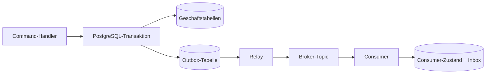

Das Transactional Outbox Pattern löst ein klar abgegrenztes Problem: Geschäftszustand und die Absicht zur Veröffentlichung eines Events lassen sich ohne verteilte Transaktion gemeinsam committen. Das Pattern garantiert **keine** Exactly-once-Verarbeitung, keine globale Reihenfolge und auch keine automatische Wiederherstellung nach jedem möglichen Fehler.

Ein produktionsorientierter Entwurf benötigt deshalb zwei Hälften. Der Producer schreibt Geschäftsdaten und einen Outbox-Eintrag atomar. Das Relay veröffentlicht mit At-least-once-Semantik, während jeder Consumer seine eigene Zustandsänderung idempotent ausführt. Die anspruchsvolle Engineering-Arbeit liegt zwischen diesen beiden Hälften: Mehrfachzustellung, Gültigkeitsbereich der Reihenfolge, nicht verarbeitbare Events, wachsender Rückstau, Schema-Evolution und betriebliche Transparenz.

Dieser Artikel beschreibt eine Referenzarchitektur für den vollständigen Pfad.

## Der Fehlerfall hinter dem Pattern

Angenommen, ein Order-Service muss PostgreSQL aktualisieren und `OrderCreated` an Kafka oder einen anderen Broker veröffentlichen. Die naheliegende Implementierung führt zwei unabhängige Schreibvorgänge aus:

```ts
await orders.insert(order)
await broker.publish("order.created", event)
```

Für diese Aufrufe gibt es keine sichere Reihenfolge.

Committet die Datenbank zuerst und der Prozess stürzt vor der Veröffentlichung ab, existiert die Bestellung, aber nachgelagerte Systeme erfahren nie davon. Wird das Event zuerst veröffentlicht und die Datenbanktransaktion anschließend zurückgerollt, reagieren Consumer auf eine nicht vorhandene Bestellung. Ein erneuter Versuch der gesamten Anfrage kann ein drittes Problem verursachen: doppelt ausgeführte Geschäftsoperationen.

Das Transactional Outbox Pattern ersetzt die beiden Schreibvorgänge durch eine lokale Datenbanktransaktion. Der Service schreibt die Geschäftszeile und einen dauerhaften Event-Envelope gemeinsam. Ein separates Relay veröffentlicht die committeten Outbox-Zeilen später. Dies ist das von [Microservices.io](https://microservices.io/patterns/data/transactional-outbox.html) und [AWS Prescriptive Guidance](https://docs.aws.amazon.com/prescriptive-guidance/latest/cloud-design-patterns/transactional-outbox.html) beschriebene Grundmuster.



Die Datenbanktransaktion stellt eine nützliche Invariante her:

> Wird die Geschäftsänderung committet, ist auch die Veröffentlichungsabsicht gespeichert. Wird die Transaktion zurückgerollt, existiert keiner der beiden Einträge.

Das ist stärker als eine Veröffentlichung nach dem Best-effort-Prinzip, aber enger gefasst als "Exactly once".

## Den Event-Envelope vor dem Relay entwerfen

Eine Outbox-Zeile sollte mehr als eine beliebige JSON-Payload enthalten. Sie ist ein dauerhafter Vertrag und zugleich ein betrieblicher Datensatz. Eine praxistaugliche PostgreSQL-Tabelle könnte so aussehen:

```sql
CREATE TABLE outbox_events (
  id uuid PRIMARY KEY,
  aggregate_type text NOT NULL,
  aggregate_id text NOT NULL,
  aggregate_version bigint NOT NULL,
  event_type text NOT NULL,
  schema_version integer NOT NULL,
  payload jsonb NOT NULL,
  trace_id text,
  created_at timestamptz NOT NULL DEFAULT now(),
  published_at timestamptz,
  attempt_count integer NOT NULL DEFAULT 0,
  next_attempt_at timestamptz NOT NULL DEFAULT now(),
  last_error text
);

CREATE INDEX outbox_pending_idx
  ON outbox_events (next_attempt_at, created_at)
  WHERE published_at IS NULL;
```

Die Event-ID dient als Identität für die Deduplizierung. `aggregate_id` und `aggregate_version` definieren den Gültigkeitsbereich der Reihenfolge. `schema_version` macht die Weiterentwicklung der Payload explizit. Zeitstempel und Versuchsdaten sorgen dafür, dass das Relay beobachtbar und nicht undurchsichtig bleibt.

Das Event wird in derselben Transaktion wie die Geschäftsänderung eingefügt:

```ts
await db.transaction(async (tx) => {
  const order = await tx.orders.create(command)

  await tx.outboxEvents.insert({
    id: crypto.randomUUID(),
    aggregateType: "order",
    aggregateId: order.id,
    aggregateVersion: order.version,
    eventType: "order.created",
    schemaVersion: 1,
    payload: { orderId: order.id, customerId: order.customerId },
    traceId: currentTraceId()
  })
})
```

Die Transaktionsgrenze ist nicht verhandelbar. Ein Repository-Helper, der eine eigene Verbindung öffnet, ein ORM-Hook, der nach dem Commit ausgeführt wird, oder ein asynchroner Event-Emitter im Request-Pfad kann den doppelten Schreibvorgang unbemerkt wieder einführen.

## Das Relay kann die letzte Atomaritätslücke nicht schließen

Das Relay liest ausstehende Zeilen, veröffentlicht sie und markiert sie anschließend als veröffentlicht. Dabei kommuniziert es weiterhin mit zwei Systemen: dem Broker und PostgreSQL. Keine lokale Transaktion kann beide atomar abdecken.

Die kritische Abfolge lautet:

1. Das Event wird veröffentlicht.
2. Der Broker bestätigt die Veröffentlichung.
3. Das Relay stürzt ab, bevor es `published_at` setzt.
4. Nach dem Neustart veröffentlicht das Relay dasselbe Event erneut.

Microservices.io weist ausdrücklich auf dieses Zeitfenster für Mehrfachveröffentlichungen hin. Auch AWS empfiehlt idempotente Consumer, weil ein Outbox-Relay oder Broker ein Event mehrfach zustellen kann. Der belastbare Zustellvertrag lautet deshalb in der Regel **at least once**.

Diese Formulierung ist wichtig. "Exactly once" wird häufig zu weit ausgelegt. Ein Broker kann eine Veröffentlichung innerhalb eines begrenzten Gültigkeitsbereichs deduplizieren. Er kann jedoch nicht garantieren, dass ein externer Seiteneffekt, etwa eine Kartenbelastung, der Versand einer E-Mail oder die Änderung einer anderen Datenbank, genau einmal eintritt. Dafür muss der Consumer an einem geeigneten atomaren oder idempotenten Protokoll teilnehmen.

## Consumer-Zustand und Deduplizierung in einer Transaktion zusammenführen

Eine separate Tabelle namens `processed_events` oder eine Inbox gibt dem Consumer ein dauerhaftes Gedächtnis:

```sql
CREATE TABLE processed_events (
  consumer_name text NOT NULL,
  event_id uuid NOT NULL,
  processed_at timestamptz NOT NULL DEFAULT now(),
  PRIMARY KEY (consumer_name, event_id)
);
```

Der Consumer startet eine Datenbanktransaktion, fügt die Event-Identität ein und führt die Geschäftsänderung in derselben Transaktion aus. Der Primärschlüssel weist Duplikate zurück. Microservices.io beschreibt diesen Ansatz als [Idempotent Consumer Pattern](https://microservices.io/patterns/communication-style/idempotent-consumer.html).

```ts
await consumerDb.transaction(async (tx) => {
  const accepted = await tx.processedEvents.insertIfAbsent({
    consumerName: "inventory-reserver",
    eventId: message.id
  })

  if (!accepted) return

  await tx.inventory.reserve({
    orderId: message.payload.orderId,
    items: message.payload.items
  })
})
```

Die Broker-Nachricht darf erst nach dem Commit der Transaktion bestätigt werden. Stürzt der Prozess vor dem Commit ab, stellt der Broker die Nachricht erneut zu und die Verarbeitung beginnt von vorn. Stürzt er nach dem Commit, aber vor der Bestätigung ab, trifft die erneute Zustellung auf den Unique Constraint und bleibt ohne Wirkung.

Dabei gilt eine wichtige Einschränkung: Geschützt sind nur Datenbankeffekte innerhalb der Transaktion. Ein HTTP-Aufruf, E-Mail-Versand oder Zahlungsauftrag liegt weiterhin außerhalb. Für solche Effekte sollte, sofern unterstützt, ein stabiler Idempotency-Key an das nachgelagerte System übergeben werden. Andernfalls muss der Seiteneffekt als eigener dauerhafter Workflow mit eigenem Zustand, Abgleichsprozess und explizit modellierter Unsicherheit behandelt werden.

## Reihenfolge ist eine begrenzte Anforderung, kein globales Versprechen

Viele Erklärungen behaupten, die Outbox "bewahre die Reihenfolge", ohne zu definieren, welche Ereignisse geordnet werden müssen. Eine globale Reihenfolge über sämtliche Events ist teuer und selten nötig. Die sinnvolle Anforderung gilt normalerweise pro Aggregat: Aktualisierungen für Bestellung `A` müssen in Versionsreihenfolge eintreffen, während Bestellung `B` unabhängig fortschreiten kann.

`aggregate_id` dient als Partitionsschlüssel des Brokers; zusätzlich enthält jedes Event eine monoton steigende `aggregate_version`. Der Consumer kann dadurch veraltete Versionen zurückweisen, Lücken puffern oder einen Abgleich auslösen. `created_at` allein reicht nicht aus: Parallele Transaktionen können Zeitstempel erzeugen, die nicht der fachlichen Reihenfolge entsprechen, und mehrere Relays können verschiedene Aggregate gleichzeitig veröffentlichen.

Ein Relay kann mit `FOR UPDATE SKIP LOCKED` dafür sorgen, dass Worker unterschiedliche ausstehende Zeilen übernehmen. Laut der [PostgreSQL-Dokumentation](https://www.postgresql.org/docs/current/sql-select.html) liefert `SKIP LOCKED` eine inkonsistente Sicht und eignet sich nicht für allgemeine Abfragen, wohl aber zur Vermeidung von Konflikten zwischen mehreren Consumern einer queue-artigen Tabelle. Damit eignet sich die Klausel zum Reservieren von Arbeit, nicht als Nachweis einer fachlichen Reihenfolge. Die Partitionierung nach Aggregatschlüssel oder die serialisierte Verarbeitung ausstehender Events je Aggregat muss weiterhin bewusst entworfen werden.

## Polling und CDC lösen unterschiedliche betriebliche Probleme

Ein Polling-Relay ist eine gute Standardwahl, wenn die Anforderungen an Durchsatz und Latenz moderat sind. Es lässt sich leicht verstehen, deployen und debuggen. Batch-Größe, Polling-Intervall, Zeilensperren, Retry-Backoff und Aufbewahrung bleiben sichtbare Entscheidungen der Anwendung.

Change Data Capture verlagert die Veröffentlichung näher an das Datenbankprotokoll. Debeziums [Outbox Event Router](https://debezium.io/documentation/reference/stable/transformations/outbox-event-router.html) erfasst Änderungen an der Outbox-Tabelle und kann Nachrichten anhand von Aggregat- und Event-Feldern weiterleiten. CDC kann Polling-Last und Veröffentlichungslatenz verringern, bringt aber Connector-Konfiguration, Replikations-Slots, Schemaannahmen und eine neue Fehlerdomäne mit sich.

Die Wahl sollte sich an gemessenen Anforderungen orientieren:

- **Polling**, wenn Einfachheit zählt und eine kurze Verzögerung bei der Veröffentlichung akzeptabel ist.
- **CDC**, wenn dauerhaft hohes Volumen, niedrigere Latenz oder ein bereits etablierter Kafka-Connect-Betrieb die zusätzliche Plattformkomplexität rechtfertigen.

CDC sollte nicht allein deshalb eingeführt werden, um einen kurzen Poller zu vermeiden. Auch der Connector muss überwacht, aktualisiert, abgesichert und wiederhergestellt werden.

## Die Outbox als Zuverlässigkeitssubsystem betreiben

Eine funktionierende Demonstration zeigt, dass Events fließen. Ein betriebsfähiges System zeigt, wenn der Fluss abreißt.

Mindestens folgende Informationen sollten sichtbar sein:

- Alter des ältesten unveröffentlichten Events.
- Anzahl ausstehender Events.
- Veröffentlichungsversuche und Fehlerrate.
- Relay-Durchsatz und Batch-Dauer.
- Anzahl der Dead-Letter- oder endgültig fehlgeschlagenen Events.
- Consumer-Lag und Anzahl der Duplikate.
- Trace-Korrelation je Event vom Command bis zum Consumer.
- Tabellenwachstum, Indexzustand und Fortschritt der Bereinigung.

Warnmeldungen sollten sich am Alter des Rückstands orientieren, nicht allein an der Tiefe der Queue. Zehn alte Events in einem kritischen Workflow können schwerer wiegen als zehntausend neue Analytics-Events. Fehlgeschlagene Datensätze müssen einsehbar bleiben; sensible Payloads sollten jedoch geschwärzt oder gar nicht erst gespeichert werden. Ein Replay-Werkzeug sollte unveränderliche Event-IDs gezielt auswählen, die Nachverfolgbarkeit erhalten und einen Grund verlangen, statt ein unbegrenztes "Alle erneut versuchen" auszuführen.

Nicht verarbeitbare Events benötigen eine begrenzte Richtlinie. Exponentieller Backoff verhindert, dass eine defekte Abhängigkeit eine enge Wiederholungsschleife erzeugt. Nach einer maximalen Anzahl von Versuchen kann ein Event in einen überprüfbaren Fehlerzustand wechseln. Dies darf die zugesicherte Veröffentlichungsabsicht jedoch nicht unbemerkt in dauerhaften Verlust verwandeln. Das Runbook sollte festlegen, wer für das Event verantwortlich ist, wie es repariert wird und wie sich der nachgelagerte Zustand nach einem Replay prüfen lässt.

Auch die Aufbewahrungsdauer ist eine Entwurfsentscheidung. Das Löschen veröffentlichter Zeilen begrenzt das Tabellenwachstum, schwächt bei sofortiger Ausführung jedoch Audit und Abgleich. Identitäts- und Zeitdaten sollten lange genug archiviert oder aufbewahrt werden, um die Fehlerfenster untersuchen zu können, die das System laut seinem Vertrag beherrscht.

## Die Grenzen testen, nicht nur den Happy Path

Die aussagekräftigsten Tests stoppen den Prozess in ungünstigen Momenten:

1. Die Geschäftstransaktion zurückrollen und prüfen, dass keine Outbox-Zeile existiert.
2. Beide Zeilen committen, den Broker nicht verfügbar halten und die spätere Veröffentlichung prüfen.
3. Erfolgreich veröffentlichen, vor dem Setzen von `published_at` abstürzen und die Mehrfachzustellung prüfen.
4. Das Duplikat gleichzeitig an zwei Consumer-Instanzen zustellen und prüfen, dass die Geschäftsoperation nur einmal wirksam wird.
5. Versionen in falscher Reihenfolge veröffentlichen und die gewählte Consumer-Richtlinie prüfen.
6. Eine ungültige Schemaversion einspeisen und Quarantäne sowie ein verwertbares Signal prüfen.
7. Ein nicht verarbeitbares Event im Retry halten und bestätigen, dass neuere unabhängige Aggregate weiterverarbeitet werden.
8. Einen ausreichend großen Rückstau aufbauen, um Indizes, Batch-Dauer und Wiederherstellungsrate zu testen.

Diese Tests definieren den Zuverlässigkeitsanspruch. Ohne sie enthält die Architektur zwar nützliche Mechanismen, aber keinen Nachweis für korrektes Verhalten in Fehlerfällen.

## Praktisches Fazit

Ein Transactional Outbox Pattern eignet sich, wenn ein Service lokalen Zustand committen und die Änderung zuverlässig bekannt geben muss, ohne seine Transaktion an einen Broker zu koppeln. Dabei muss klar benannt werden, was das Pattern nicht löst.

Der vollständige Entwurf umfasst:

1. Geschäftszustand und Event-Absicht werden in einer Datenbanktransaktion committet.
2. Das Relay geht davon aus, dass es mehrfach veröffentlichen kann.
3. Events erhalten stabile Identitäten und einen definierten Gültigkeitsbereich für die Reihenfolge.
4. Consumer committen Deduplizierung und Geschäftsoperationen gemeinsam.
5. Externe Seiteneffekte erhalten eigene Idempotenz- oder Abgleichsmechanismen.
6. Rückstand, Wiederholungsversuche, Fehler und Aufbewahrung werden als betrieblicher Zustand behandelt.
7. Tests mit gezielt ausgelösten Fehlern weisen den Vertrag nach.

Die Outbox beseitigt einen gefährlichen doppelten Schreibvorgang. Zuverlässigkeit entsteht erst, wenn der restliche Pfad mit derselben Sorgfalt entworfen wird.
