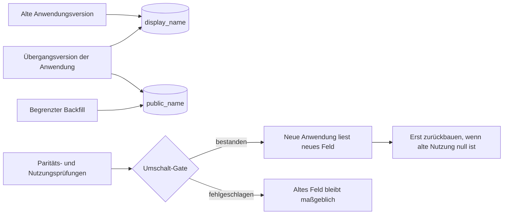

Eine Datenbanktransaktion kann eine einzelne Schemaoperation atomar machen. Sie kann kein Rolling Deployment über Anwendungsinstanzen, Connection Pools, Hintergrund-Worker, zwischengespeicherte Schemas und einen laufenden Backfill hinweg atomar machen.

Deshalb sollte eine sichere Online-Migration als **Kompatibilitätsprotokoll** behandelt werden. Für einen begrenzten Zeitraum muss die Datenbank sowohl den auslaufenden als auch den neuen Code unterstützen. Der Übergang braucht explizite Startbedingungen, beobachtbare Invarianten, eine Rollback-Richtung und einen verzögerten destruktiven Schritt.

Das praktische Muster lautet: erweitern, migrieren, verifizieren, umschalten und zurückbauen. Die Schwierigkeit liegt nicht im Schreiben des endgültigen Schemas, sondern im Nachweis, ab wann das alte Schema nicht mehr zum Laufzeitvertrag gehört.

## Die Überschneidung der Deployments ist die eigentliche Einschränkung

Bei einem Rolling Release laufen bewusst mehrere Anwendungsversionen gleichzeitig. Selbst nachdem der Deployment Controller Erfolg meldet, können noch alte Worker, geplante Jobs oder langlebige Prozesse existieren. Eine direkte Umbenennung wie diese ändert den Datenbankvertrag sofort:

```sql
ALTER TABLE accounts RENAME COLUMN display_name TO public_name;
```

Jede noch laufende Query, die `display_name` referenziert, kann nun fehlschlagen. Die Umbenennung in eine Transaktion zu packen bestimmt lediglich, ob sie committet wird. Die Aufrufer werden dadurch nicht im selben Moment aktualisiert.

Parallel Change, auch Expand and Contract genannt, löst dieses Problem, indem alte und neue Schnittstelle während einer Migrationsphase gleichzeitig unterstützt werden. Martin Fowlers Beschreibung gliedert das Muster in Expand, Migrate und Contract und benennt ausdrücklich die Kosten zweier vorübergehend paralleler Schnittstellen ([Parallel Change](https://martinfowler.com/bliki/ParallelChange.html)). Die Migrationsrichtlinien von GitLab zeigen dieselbe betriebliche Realität: Das destruktive Entfernen einer Spalte wird über mehrere Releases verteilt, weil laufende Prozesse und Schema-Caches die Spalte weiterhin erwarten können ([Avoiding downtime in migrations](https://docs.gitlab.com/development/database/avoiding_downtime_in_migrations/)).

Das Kompatibilitätsfenster sollte entworfen und nicht erst während des Rollouts entdeckt werden.



## Phase 1: Erweitern, ohne bestehendes Verhalten zu ändern

Das erste Release fügt die Zielstruktur hinzu und erhält alles, was die aktuelle Anwendung benötigt:

```sql
SET lock_timeout = '1s';
SET statement_timeout = '10s';

ALTER TABLE accounts
  ADD COLUMN public_name text;
```

Die Werte sind Beispiele und keine allgemeingültigen Empfehlungen. PostgreSQL definiert `lock_timeout` als maximale Wartezeit einer Anweisung auf eine Sperre, während `statement_timeout` ihre gesamte Ausführungszeit begrenzt ([Standardeinstellungen für Client-Verbindungen](https://www.postgresql.org/docs/current/runtime-config-client.html#GUC-LOCK-TIMEOUT)). Ein kurzer Lock Timeout lässt eine Migration fehlschlagen, statt hinter einer langen Transaktion zu warten, während sich weitere Queries dahinter anstauen. Die richtigen Grenzwerte hängen von Traffic, Transaktionsdauer, Tabellengröße und Retry-Richtlinie ab.

Die Erweiterung sollte additiv sein. Die neue Spalte beginnt nullable, weil alte Instanzen nichts von ihr wissen. Ein sofortiges `NOT NULL` würde ihre bisher gültigen Schreibvorgänge fehlschlagen lassen. Ein Default kann sinnvoll sein, muss aber die tatsächliche Domäne abbilden, statt einen unvollständigen Migrationszustand zu verbergen.

Prüfen Sie vor dem Produktionseinsatz das konkrete DDL auf der eingesetzten PostgreSQL-Version. Die Sperrebenen von `ALTER TABLE` variieren je nach Unterbefehl, und PostgreSQL erklärt, dass eine `ACCESS EXCLUSIVE`-Sperre verwendet wird, sofern für eine Unterform nichts anderes dokumentiert ist ([ALTER TABLE](https://www.postgresql.org/docs/current/sql-altertable.html)). Selbst eine schnelle Metadatenoperation kann einen Ausfall verursachen, wenn sie im falschen Moment in der Lock Queue wartet.

## Phase 2: Neue Schreibvorgänge kompatibel machen

Die Übergangsversion schreibt beide Darstellungen, während Lesezugriffe noch die alte verwenden. Bei zwei Spalten derselben Zeile muss die Aktualisierung in einer Datenbankanweisung oder Transaktion erfolgen:

```sql
UPDATE accounts
SET display_name = $1,
    public_name = $1,
    updated_at = now()
WHERE id = $2;
```

Damit entfällt eine Klasse partieller Abweichungen, doch Dual Write bleibt eine vorübergehende Fehlerquelle. Jeder Änderungspfad muss teilnehmen: API-Updates, Importe, Administrationsskripte, Event-Consumer, Reparaturjobs und datenbankseitige Prozeduren. Aktualisiert ein einziger Pfad nur die alte Spalte, geht die Parität verloren. Besitzen unabhängige Services diese Pfade, kann eine lokale Transaktion möglicherweise nicht mehr beide Effekte abdecken.

Instrumentieren Sie den Übergang vor dem Backfill:

- Zeilen zählen, in denen nur einer der beiden Werte null ist;
- Zeilen zählen, deren normalisierte Werte voneinander abweichen;
- Schreibvorgänge nach Anwendungsversion kennzeichnen;
- fehlgeschlagene Dual Writes und Migrations-Retries aufzeichnen;
- Queries identifizieren, die weiterhin die Legacy-Spalte lesen.

Stellen Sie die Lesezugriffe nicht allein deshalb um, weil das Deployment abgeschlossen ist. Schalten Sie um, wenn Daten und Aufrufer eine explizite Invariante erfüllen.

## Phase 3: Backfill als kontrollierten Produktionstraffic behandeln

Ein einzelnes unbegrenztes `UPDATE` kann eine lange Transaktion erzeugen, viel Write-ahead Log schreiben, tote Tupel erhalten, Replica Lag erhöhen, mit Anwendungsschreibvorgängen konkurrieren und einen Abbruch teuer machen. Behandeln Sie einen Backfill als Workload mit steuerbarer Rate, sichtbarem Fortschritt und Pausenfunktion.

Eine einfache PostgreSQL-Variante arbeitet mit kleinen, wiederholbaren Batches:

```sql
WITH batch AS (
  SELECT id
  FROM accounts
  WHERE public_name IS NULL
  ORDER BY id
  LIMIT 1000
  FOR UPDATE SKIP LOCKED
)
UPDATE accounts AS a
SET public_name = a.display_name
FROM batch
WHERE a.id = batch.id
  AND a.public_name IS NULL;
```

Die Batch-Größe dient als Beispiel. Die zweite Nullprüfung macht Wiederholungen sicherer und verhindert, dass der Backfill einen durch parallelen Übergangscode erzeugten Wert überschreibt. `SKIP LOCKED` kann mehreren Workern helfen, nicht auf dieselben ausgewählten Zeilen zu warten. Die Klausel garantiert jedoch weder Fairness noch, dass jede Zeile irgendwann besucht wird. Für den Abschluss ist weiterhin eine vollständige Endprüfung nötig.

Drosseln Sie anhand des beobachteten Datenbankverhaltens und nicht mit einem festen Sleep aus einem anderen System. Beobachten Sie Batch-Latenz, Lock Waits, Replica Lag, CPU, I/O, tote Tupel, Autovacuum-Aktivität, Fehlerrate und Anwendungslatenz. Pausieren Sie automatisch, wenn ein definierter Sicherheitsschwellwert überschritten wird. Speichern Sie einen dauerhaften Cursor oder gestalten Sie jeden Batch so, dass er nach einem Neustart sicher wiedergefunden werden kann.

Definieren Sie vor allem die semantische Parität. Das Kopieren eines Strings ist einfach. Eine Typkonvertierung, Feldaufteilung, Deduplizierung oder Normalisierung kann irreversibel sein. Prismas Leitfaden zu Expand and Contract zeigt anhand der Aufteilung eines Namens, warum scheinbar einfache Datentransformationen mehrdeutig sein können ([Using the expand and contract pattern](https://www.prisma.io/dataguide/types/relational/expand-and-contract-pattern)). Die Migration muss den Umgang mit Ausnahmezeilen festlegen, statt unbemerkt zu raten.

## Phase 4: Vor der Umstellung des Lesepfads verifizieren

Das Umschalt-Gate sollte vier Fragen beantworten:

1. **Abdeckung:** Sind alle berechtigten Zeilen in der neuen Struktur befüllt?
2. **Parität:** Stimmen alte und neue Darstellung gemäß der dokumentierten Transformation überein?
3. **Aktualität:** Erhalten laufende Schreibvorgänge die Parität, statt nur der historische Backfill?
4. **Kompatibilität:** Können alle deployten und weiterhin für ein Rollback unterstützten Anwendungsversionen mit dem erweiterten Schema arbeiten?

Führen Sie Shadow Reads oder stichprobenartige Vergleiche durch, bevor das neue Feld maßgeblich wird. Verlegen Sie die Lesezugriffe anschließend über ein kontrolliertes Release oder Feature Flag, während Dual Writes weiterlaufen. Überwachen Sie Datenbankfehler, Fallback-Lesezugriffe, Paritätsabweichungen, Query-Latenz und fachliche Validierungsfehler.

Ein Rollback bedeutet zu diesem Zeitpunkt, Lesezugriffe wieder auf die alte Darstellung zu lenken. Das ist nur sicher, solange diese weiterhin alle erforderlichen Schreibvorgänge erhält. Sobald das neue Modell Informationen akzeptiert, die sich im alten nicht darstellen lassen, wird der Rollback selbst zu einer Datenmigration. Die bloße Existenz der alten Spalte reicht nicht aus.

## PostgreSQL-Online-DDL verringert Blockierung, schafft aber keine Kompatibilität

Schemaübergänge benötigen häufig Indizes und Constraints. PostgreSQL bietet dafür nützliche Mechanismen mit jeweils eigenen Einschränkungen.

Ein gewöhnlicher Indexaufbau blockiert Schreibvorgänge. `CREATE INDEX CONCURRENTLY` erlaubt parallele Inserts, Updates und Deletes, doch PostgreSQL dokumentiert zusätzliche Scans, Wartezeiten, Einschränkungen und die Möglichkeit eines ungültigen Index nach einem Fehler ([CREATE INDEX](https://www.postgresql.org/docs/current/sql-createindex.html#SQL-CREATEINDEX-CONCURRENTLY)). Der Vorgang muss überwacht und sein Ergebnis überprüft werden:

```sql
CREATE INDEX CONCURRENTLY idx_accounts_public_name
  ON accounts (public_name);
```

Bei einem Foreign Key oder Check Constraint auf bestehenden Daten lässt sich zunächst die Durchsetzung für neue Änderungen hinzufügen und die Prüfung historischer Zeilen anschließend separat durchführen:

```sql
ALTER TABLE account_profiles
  ADD CONSTRAINT account_profiles_account_fk
  FOREIGN KEY (account_id)
  REFERENCES accounts(id)
  NOT VALID;

ALTER TABLE account_profiles
  VALIDATE CONSTRAINT account_profiles_account_fk;
```

PostgreSQL stellt dies als weniger belastenden Pfad zum Hinzufügen eines Foreign Key dar. Squawk erklärt, warum die Trennung von `NOT VALID` und `VALIDATE CONSTRAINT` verhindert, dass die Validierungssperre, die Schreibvorgänge blockiert, während des gesamten Tabellenscans gehalten wird ([ALTER-TABLE-Beispiele](https://www.postgresql.org/docs/current/sql-altertable.html), [Squawk-Empfehlungen für Foreign Keys](https://squawkhq.com/docs/adding-foreign-key-constraint)). Die anfängliche Metadatenänderung benötigt weiterhin eine Sperre. Lock Timeout und Retry-Strategie bleiben erforderlich.

Diese Funktionen lösen Nebenläufigkeitsprobleme auf Datenbankebene. Sie belegen weder, dass alter Code einen neuen Constraint verträgt, noch dass ein Backfill semantisch korrekt oder ein Rollback weiterhin möglich ist.

## Phase 5: Nur mit Nachweisen zurückbauen

Destruktive Bereinigung ist ein separates Deployment und nicht die letzte Zeile der Erweiterungsmigration. Vor dem Löschen von `display_name` muss belegt sein, dass:

- keine deployte Binärdatei die Spalte liest oder schreibt;
- kein verzögerter Worker, Bericht, View, Trigger, keine Funktion, kein Export und keine Ad-hoc-Integration darauf verweist;
- die Rollback-Richtlinie die alte Anwendungsversion nicht mehr benötigt;
- die Parität über einen vereinbarten Beobachtungszeitraum stabil geblieben ist;
- Backups und Wiederherstellungsverfahren den destruktiven Schritt abdecken;
- die Entfernung eine eigene Analyse von Sperren und Laufzeit erhalten hat.

Beenden Sie dann Dual Writes, beobachten Sie erneut und entfernen Sie die alte Struktur in einer späteren kontrollierten Änderung. GitLabs Richtlinien verteilen bestimmte destruktive Änderungen bewusst über mehrere Releases, damit sich Anwendungsverhalten und Schema-Caches nicht in einem einzigen riskanten Release überlagern ([Avoiding downtime in migrations](https://docs.gitlab.com/development/database/avoiding_downtime_in_migrations/)).

Ein häufiger Fehler ist eine nie abgeschlossene Contract-Phase. Temporäre Spalten, Flags, Trigger und Kompatibilitätszweige werden zu dauerhafter Komplexität. Weisen Sie der Migration bereits zu Beginn der Erweiterung einen Besitzer, einen Zustandsdatensatz, ein Bereinigungs-Issue und eine Ablaufbedingung zu.

## Den Übergang testen, nicht nur das Ziel

Ein Migrationstest, der mit dem alten Schema startet, sämtliche DDL-Anweisungen ausführt und nur die neue Anwendung startet, verfehlt die gefährliche Überschneidung. Eine aussagekräftige Probe sollte:

1. alte und neue Anwendungsversion gleichzeitig gegen das erweiterte Schema ausführen;
2. während des Backfills Schreibvorgänge über jeden bekannten Änderungspfad erzeugen;
3. den Backfill nach beliebigen Batches unterbrechen und neu starten;
4. Fehler durch Lock Timeout und Statement Timeout erzwingen;
5. Paritätsabweichungen erzeugen und prüfen, dass das Umschalt-Gate blockiert;
6. Lesezugriffe umstellen und anschließend zurückrollen, solange Dual Writes aktiv bleiben;
7. einen parallelen Indexaufbau fehlschlagen lassen und den Umgang mit dem ungültigen Index prüfen;
8. Lock Waits, Replica Lag, Batch-Durchsatz, Anwendungslatenz und Fehlerraten messen;
9. nachweisen, dass der Rückbau abgewiesen wird, solange noch ein alter Aufrufer existiert;
10. die Wiederherstellung nach der endgültigen destruktiven Operation proben.

"Zero Downtime" ist keine Eigenschaft eines Migrations-Frameworks oder SQL-Schlüsselworts. Es ist ein gemessenes Ergebnis für ein bestimmtes Traffic-Modell, eine Deployment-Topologie, Datenbankversion und einen definierten Fehlerbereich.

## Praktisches Fazit

Sichere Schema-Evolution beginnt mit einer Frage: **Welche Anwendungsversionen und Datendarstellungen müssen in jedem Schritt gleichzeitig funktionieren?**

Erweitern Sie additiv. Machen Sie Übergangsschreibvorgänge nach Möglichkeit atomar. Führen Sie Backfills in begrenzten, beobachtbaren und neu startbaren Batches aus. Prüfen Sie Abdeckung, Parität, Aktualität und Rollback-Kompatibilität, bevor Sie Lesezugriffe umstellen. Verwenden Sie die Mechanismen von PostgreSQL für parallelen Indexaufbau und verzögerte Validierung entsprechend ihrem dokumentierten Sperrverhalten, nicht als magische Etiketten. Bauen Sie erst zurück, wenn Laufzeitnachweise zeigen, dass die alte Schnittstelle nicht mehr genutzt wird.

Transaktionen bleiben wichtig. Sie schützen lokale Zustandsübergänge. Die Migration als Ganzes gelingt, weil das Team Kompatibilität über die Zeit hinweg entwirft.

---
