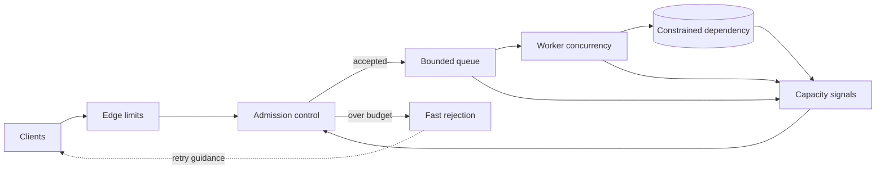

A service rarely fails at the exact instant demand exceeds capacity. It usually fails later, after excess work has accumulated in queues, thread pools, connection pools, and client retry loops.

That delay makes overload deceptive. The service is already unable to keep up, but it continues accepting requests. Latency rises, deadlines expire, clients retry, and the extra retries consume the capacity needed to finish useful work. What began as a short traffic spike becomes a self-sustaining backlog.

A reliable overload design needs one contract across the whole request path. Backpressure tells producers to slow down. Admission control decides whether new work may enter. Load shedding rejects work that cannot be completed within the available budget. Bounded queues make the limit explicit. Retry policy prevents rejection from turning into more load.

This article presents that contract as a reference architecture. It explains general mechanisms and tests, not a claim about a specific deployed or measured system.

## Overload begins as waiting, not CPU

High CPU can be a useful signal, but overload is broader than processor utilization. A service can be saturated on database connections, memory, file descriptors, downstream concurrency, a single hot partition, or an external rate limit. It can also have moderate average utilization while one expensive request class blocks every cheap request behind it.

The earliest useful symptom is often growing waiting work. Queue depth increases. Time spent waiting for a worker exceeds time spent executing. Connection acquisition slows. Requests approach their deadlines before business logic starts. Throughput stops rising even though arrivals continue to rise.

An unbounded queue hides this condition. It converts an immediate, visible rejection into delayed timeouts and memory pressure. It also makes recovery harder: after demand returns to normal, the service must still process stale work that clients may no longer need.

The [Reactive Streams](https://www.reactive-streams.org/) specification frames the core problem precisely: an asynchronous receiver must not be forced to buffer an arbitrary amount of data from a faster producer. Its answer is non-blocking backpressure across the asynchronous boundary. That is necessary inside a stream, but a complete service also needs a policy for traffic that cannot wait or cannot be slowed.

## Backpressure, admission control, and shedding solve different stages

These mechanisms are related, but they are not interchangeable.

**Backpressure** communicates available demand upstream. A consumer requests only what it can process, a streaming transport delays writes, or a worker stops pulling messages when its concurrency budget is full. The mechanism is cooperative: the producer must react to the signal.

**Admission control** evaluates a new unit of work before committing scarce resources. It can check current concurrency, estimated cost, tenant quota, priority, deadline, or downstream health. The answer is accept, degrade, defer, or reject.

**Load shedding** is the deliberate rejection of work during overload. It protects capacity for work the system can still complete. Shedding is not an exceptional crash path. It is a normal control action with an explicit response, metric, and client contract.

**Bounded queues** connect these stages. A queue should have a capacity justified by throughput and acceptable waiting time, not by the largest integer the library supports. When that bound is reached, the system must apply a defined policy instead of silently allocating more memory.

The [gRPC flow-control guide](https://grpc.io/docs/guides/flow-control/) explains how streaming RPCs prevent a fast sender from overwhelming a receiver and notes that a successful write call can mean data was handed to the framework rather than sent over the network. Transport flow control protects buffers. It does not decide whether the business operation should have been admitted in the first place.

## Put the control loop before the scarce resource

The overload boundary should sit before the resource that becomes saturated. If the database connection pool is the constraint, rejecting after acquiring a connection is too late. If CPU-heavy parsing is the constraint, parsing the full payload before admission wastes the resource being protected.

The edge applies cheap protections such as request-size limits, authentication, tenant quotas, and coarse rate limits. Admission control then uses local capacity signals to decide whether the request can enter. Accepted work moves into a bounded queue and a limited worker pool. Rejected work receives a response that tells the caller whether retrying is appropriate.

This design keeps the decision local to the bottleneck. A global controller can distribute long-term quotas or desired concurrency, but each instance still needs a fast local safety mechanism. A central decision that arrives after the local process has exhausted its pool cannot protect that process.

The control path must also be cheaper than the work it rejects. Complex remote policy calls, full payload deserialization, or expensive authentication after saturation can make rejection almost as costly as success. Cache stable policy inputs and perform the cheapest safe checks first.

## Choose signals that describe remaining capacity

Request rate alone is a weak overload signal because requests can have very different costs. One request may perform a cache lookup; another may fan out to several services and scan a large result set. The Google SRE chapter on [handling overload](https://sre.google/sre-book/handling-overload/) describes this limitation and recommends reasoning about resource consumption rather than assuming queries per second represents capacity.

Useful local signals include:

1. In-flight work relative to a tested concurrency limit.
2. Queue depth and the age of the oldest queued item.
3. Worker utilization and event-loop delay.
4. Database or downstream connection-pool wait time.
5. Deadline budget remaining at admission.
6. Memory pressure and garbage-collection time.
7. Recent dependency latency and error rate.

No single signal is universally correct. CPU may be appropriate for compute-heavy work, while connection wait is more direct for a database-bound API. Queue age is often more actionable than depth because it relates backlog to user-visible latency.

Avoid a controller that flips at one exact threshold. Small fluctuations can cause rapid accept/reject oscillation. Use separate open and close thresholds, a smoothed measurement, or an adaptive concurrency algorithm with explicit minimum and maximum values. Any adaptive controller still needs a hard ceiling for safety.

Priority must be bounded too. If every caller labels its request critical, criticality has no meaning. Define a small, reviewed set of classes and reserve capacity intentionally. Administrative health checks should remain cheap and independent enough to report overload rather than joining the same saturated queue.

## Bound queues by waiting budget

A queue is useful when it absorbs normal scheduling variation. It is dangerous when it stores more work than can finish before its deadline.

A practical bound starts from the service rate and acceptable queueing delay. If workers complete approximately 200 operations per second and the maximum acceptable queue wait is 250 milliseconds, a rough starting bound is 50 waiting operations. This is a sizing illustration, not a universal setting; real workloads need measured service-time distributions and failure tests.

Queue age should be checked both at admission and before execution. A request can be valid when accepted but obsolete when a worker finally receives it. Dropping expired work before expensive processing preserves capacity and avoids producing a response after the caller has already abandoned the request.

Separate queues can protect latency-sensitive work from bulk work, but every queue still needs a bound and a scheduling rule. A priority queue without starvation protection can postpone low-priority work forever. A single FIFO queue can create head-of-line blocking when one expensive item delays many cheap ones.

For durable asynchronous work, rejection may mean returning an overload response before creating the job. Once a job is durably accepted, the system has made a different promise and needs retention, retry, and completion semantics. Do not acknowledge durable acceptance and then discard the job because an in-memory worker queue is full.

## Make rejection part of the client protocol

A fast rejection is useful only when callers interpret it correctly. An overloaded service should return a specific status, a stable machine-readable reason, and retry guidance when a retry may succeed. HTTP services commonly distinguish overload or temporary unavailability from validation and authorization failures. Streaming and messaging systems need equivalent typed outcomes.

Retries must use exponential backoff, jitter, a bounded attempt count, and the original end-to-end deadline. A retry that starts after the caller's deadline cannot deliver value. Immediate retries from thousands of clients can synchronize into a retry storm and keep the backend overloaded after the original spike has passed.

Retry budgets cap retry volume relative to original traffic. They force clients to stop treating every failure as permission to send more work. Local client-side throttling can go further by rejecting some attempts before they reach a backend that is already refusing traffic.

Only retry operations whose semantics allow it. Reads are often safe, while writes may need an idempotency key or an operation-status lookup. Overload control does not remove duplicate-effect risks.

Degraded responses are another option when cheaper work still provides value. A service might omit an expensive enrichment, return cached data with explicit freshness, or reduce fan-out. The degradation must actually consume less of the saturated resource. Returning a smaller payload does not help if the expensive database query already ran.

## Observe accepted work and refused work together

A dashboard showing only successful throughput can make shedding look like recovery. The service may appear healthy because it serves accepted requests quickly while rejecting half of demand.

Track arrivals, admissions, rejections, completions, retries, queue depth, queue age, in-flight work, and dependency saturation on the same timeline. Break rejection down by reason, tenant, route, and priority without exposing sensitive identifiers. Measure latency from the client's arrival, not only from the moment a worker starts execution.

The most important ratio is offered load versus completed useful work. Accepted request count is not enough if many accepted requests later expire. Completion after the caller deadline may consume resources without producing value.

Alerts should distinguish controlled shedding from uncontrolled collapse. A small shedding rate during a known burst may indicate the protection is working. Sustained shedding, exhausted reserved capacity, growing queue age, or falling completion throughput requires intervention. The controller's current threshold and observed signal should be visible so an operator can explain every rejection decision.

## Test recovery, fairness, and retry amplification

A load test that stops as soon as latency rises misses the most important behavior. Drive the service beyond capacity, hold it there, then reduce arrivals and observe whether it recovers without a restart.

A useful test suite should verify:

1. Queue depth and memory remain bounded above the sustainable arrival rate.
2. Accepted work continues completing within its deadline during controlled shedding.
3. Rejection is fast and materially cheaper than normal execution.
4. Client retries remain within the retry budget and include jitter.
5. High-priority traffic retains its reserved capacity without starving other classes indefinitely.
6. Expired queued work is discarded before consuming the constrained dependency.
7. The service recovers promptly after load falls rather than draining a large stale backlog.
8. One overloaded dependency does not consume unrelated pools through shared concurrency.
9. Controller thresholds do not oscillate under traffic near the limit.
10. Metrics account for offered, accepted, rejected, expired, and completed work.

Run the same tests with a slow dependency, not only high request volume. Latency inflation reduces effective capacity even when arrival rate stays constant. Also test partial failure, where only one instance or partition is slow, because naive load balancing can continue feeding a sick target.

The invariant is straightforward: the system must not accept more work than it can hold and finish under its declared policy. During overload, it should lose optional work deliberately rather than lose control of all work accidentally.

## A practical overload contract

A complete design states the contract at every boundary:

1. Producers know how capacity is communicated.
2. Admission happens before the constrained resource.
3. Queues and concurrency pools have explicit bounds.
4. Rejection has a typed, observable client response.
5. Retries preserve deadlines and consume a bounded budget.
6. Priority and degradation policies are limited and tested.
7. Recovery is verified after sustained overload.

Backpressure is strongest when the producer can slow down. Load shedding is necessary when it cannot, when the work is already too late, or when accepting it would threaten more valuable work. Admission control joins both decisions at the point where capacity is still available to protect.

The goal is not to avoid every rejection. The goal is to make overload finite, visible, and recoverable.