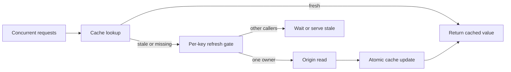

Caching removes repeated work only while the cached value is usable. When a popular key expires, hundreds of requests can observe the same miss at nearly the same time. If every request independently queries the origin, one expiry becomes a synchronized load test against the database or downstream API.

This is a cache stampede. The dangerous part is not merely a low hit rate. It is coordinated concurrency focused on the same dependency, often while that dependency is already slow. Increasing the time-to-live reduces how often expiry happens, but it does not control what happens at the expiry boundary.

A reliable design needs a bounded refresh contract: one request refreshes a key, concurrent requests reuse that work or receive an acceptable stale value, and the origin still has admission limits. This article describes that contract as a reference architecture. It explains general mechanisms and tests, not a claim about a specific deployed system.

## Expiry turns independent requests into coordinated load

Assume a product page receives steady traffic and its cached record expires every five minutes. During a normal cache hit, requests are cheap and mostly independent. At expiry, all requests arriving before the first refresh completes see the key as absent. They become origin reads together.

The amplification is roughly arrival rate multiplied by refresh latency. At 500 requests per second and a 200 millisecond origin read, about 100 requests may race to rebuild the same value. If the origin slows to two seconds under pressure, the race can grow toward 1,000 requests. The exact numbers depend on arrival shape and scheduling, but the feedback loop is the important part: slower refreshes create more concurrent refreshers, which make the origin slower.

A longer TTL moves this event further into the future. Randomized expiry can spread many different keys across time. Neither mechanism guarantees single-key concurrency control. A hot key can still expire once and release a large burst.

The correct question is therefore not “How long should this value live?” It is “When this value needs refresh, how many callers may perform that refresh, what do the others receive, and how is the origin protected?”

## Define freshness, availability, and concurrency separately

A cache policy should distinguish three concerns that are often compressed into one TTL.

**Freshness** defines how old a value may be before it should be refreshed. This is a product and correctness decision. An authorization decision may tolerate almost no staleness. A public catalog description may tolerate minutes.

**Availability** defines whether an older value may be served when refresh is slow or failing. [RFC 5861](https://www.rfc-editor.org/rfc/rfc5861) defines the HTTP `stale-while-revalidate` and `stale-if-error` controls. The same ideas can be applied inside a service, but only when the data semantics permit it.

**Refresh concurrency** defines how many workers may rebuild one key. The usual answer is one active refresher per key, not one refresher per request. This is request coalescing, also called duplicate suppression or single flight.

These decisions need independent budgets. A value might be fresh for 60 seconds, serveable while stale for another 30 seconds, and protected by a five-second refresh lease. Treating all three as “TTL = 60” hides the failure behavior.

## Coalesce concurrent misses around one refresh

Request coalescing keeps an in-flight operation registry keyed by the canonical cache key. The first caller starts the origin fetch. Later callers for the same key await the same promise rather than starting new work. Go's [singleflight package](https://pkg.go.dev/golang.org/x/sync/singleflight) describes this mechanism as duplicate function-call suppression.

```ts
const inFlight = new Map<string, Promise<CacheValue>>()

async function getOrRefresh(key: string): Promise<CacheValue> {
  const cached = await cache.get(key)
  if (cached?.fresh) return cached.value

  const existing = inFlight.get(key)
  if (existing) return existing

  const refresh = loadOrigin(key)
    .then((value) => cache.set(key, value).then(() => value))
    .finally(() => inFlight.delete(key))

  inFlight.set(key, refresh)
  return refresh
}
```

The registry must remove completed and failed promises. Otherwise one failure can become a permanently cached rejection. Callers also need deadlines; coalescing should not force a request with 50 milliseconds remaining to wait behind a refresh expected to take one second.

An in-process registry protects one application instance. Ten replicas can still produce ten refreshes. That may be acceptable if the origin budget allows it. If the requirement is one refresher across the fleet, use a distributed lease or a cache-native atomic claim. Do not introduce distributed coordination until the allowed concurrency is explicit.



## Serve stale data through explicit windows

Waiting for the refresh is not always the best response. If the cache contains a recently expired value, callers may receive it immediately while one worker refreshes in the background. This keeps latency stable and absorbs a temporary origin failure.

Stale serving must be bounded and visible. Store freshness metadata with the value rather than inferring every policy from key existence. A useful record includes the payload, creation time, fresh-until time, stale-until time, schema version, and source version where available.

The decision can then be precise:

- Before `fresh_until`, return the value.
- Between `fresh_until` and `stale_until`, return the stale value and let one owner refresh.
- After `stale_until`, wait for a bounded refresh or fail according to the endpoint contract.
- During an origin error, serve stale only if the data class explicitly allows it.

Never use stale serving for data where old means unauthorized, financially wrong, or unsafe. Cache policy belongs to the data contract, not only to infrastructure configuration.

## Protect the origin even when coalescing fails

Coalescing reduces duplicate work, but it is not the last defense. A process restart clears the in-flight map. A network partition can let distributed leases expire while an old owner is still running. Many different keys can miss at once after a cache flush or deployment. The origin therefore needs its own concurrency and deadline limits.

Place admission control before acquiring the scarce resource. Bound refresh concurrency globally and, where useful, per tenant or dependency. Give refresh calls deadlines shorter than the caller's total budget. Reject or serve stale when no refresh capacity is available. A cache rebuild must not consume every database connection needed by uncached requests.

A fleet-wide lease should use an atomic claim with a unique owner token and a short expiry. Only the current owner may publish the refresh result. If lease expiry can permit a newer owner to start, add a monotonic version or fencing check before updating shared state. A time-based lock alone does not prove that an older worker has stopped.

The cache update should be atomic: write the complete value and its metadata together, ideally under a versioned key or compare-and-set condition. Readers should never observe a new freshness timestamp paired with an old payload.

## Make invalidation and key versions explicit

Stampede prevention cannot repair an ambiguous cache key. Every input that can change the response belongs in the key or in the validation metadata: tenant, locale, authorization scope, query shape, schema version, and relevant feature configuration.

Prefer versioned keys for incompatible schema or policy changes. Deploying readers and writers against `product:v3:<id>` avoids treating a previous representation as current. Old versions can expire naturally after the deployment window.

Invalidation events should carry a stable entity identity and, when possible, a monotonic source version. A delayed invalidation for version 41 must not delete a value already refreshed from version 42. Meta's account of [cache consistency engineering](https://engineering.fb.com/2022/06/08/core-infra/cache-made-consistent/) illustrates why cache correctness depends on ordering and version information, not only deletion speed.

Expiry still has value as a safety bound. It limits how long a missed invalidation can survive. But expiry, invalidation, and refresh coordination solve different problems and should be tested independently.

## Observe and test the failure boundary

A high aggregate hit ratio can hide a dangerous hot-key miss. Measure behavior by key class and outcome rather than relying on one global percentage.

Useful signals include fresh hits, stale hits, blocking misses, refresh ownership wins, coalesced waiters, refresh duration, refresh errors, lease expiry, rejected refreshes, origin concurrency, and the age of the oldest served value. Trace the owner refresh and link waiting callers without creating one origin span per waiter.

Failure tests should create the race deliberately:

1. Expire one hot key and release hundreds of concurrent callers; assert the allowed number of origin reads.
2. Slow the origin beyond caller deadlines; verify bounded waiting and stale policy.
3. Fail the owner refresh; verify cleanup lets a later call retry.
4. Restart one replica during refresh; verify the fleet-wide origin limit still holds.
5. Let a lease expire while the old owner continues; verify a stale owner cannot overwrite newer data.
6. Flush many keys together; verify global admission control protects the origin.
7. Deliver invalidations out of order; verify source versions prevent regression.
8. Advance beyond the stale window; verify the service fails instead of serving indefinitely old data.

These tests define the claim. A mutex in code is configuration evidence. A concurrency test showing one permitted origin read is behavioral evidence.

## Practical design checklist

Start with the smallest mechanism that enforces the required boundary.

1. Define fresh, stale, and unavailable states for each data class.
2. Use a canonical, versioned cache key that includes every response-changing input.
3. Coalesce refreshes per key inside each process.
4. Add fleet-wide leases only when per-instance duplication exceeds the origin budget.
5. Bound global refresh concurrency and set deadlines before scarce resources.
6. Publish payload and freshness metadata atomically.
7. Use source versions to reject stale refreshes and out-of-order invalidations.
8. Measure stale age, waiters, owner count, refresh failure, and origin pressure.
9. Test expiry races, owner crashes, cache flushes, and stale-owner writes.

Longer TTLs can reduce refresh frequency. Jitter can prevent many unrelated keys from expiring together. Neither is a concurrency protocol. The reliable boundary is explicit: one bounded refresh path, a documented stale policy, and an origin that remains protected when the cache stops helping.
