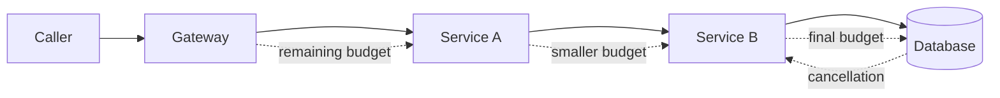

A timeout on every network call looks responsible. It can still produce a request path that runs far longer than the user or upstream system is willing to wait.

The problem appears when each service starts a fresh timer. An API receives a request with a two-second objective, spends 600 milliseconds on local work, then gives a dependency another two seconds. That dependency repeats the mistake. The original request may already be abandoned while lower layers continue consuming connections, database slots, CPU, and retry capacity.

A reliable design treats time as one end-to-end budget. The entry point establishes a deadline. Every hop computes the remaining time, reserves enough for local cleanup and response delivery, and passes only the usable remainder downstream. Expiration must also trigger cancellation, because stopping the wait without stopping the work only hides resource waste.

This article presents that design as a reference architecture. It describes mechanisms and tests, not a claim about a particular deployed system.

## A chain of timeouts is not a deadline

A timeout is a duration attached to one operation. A deadline is the latest point at which the overall result still has value. The distinction matters as soon as one request crosses more than one boundary.

Suppose a gateway has a two-second response objective. It calls an account service with a two-second timeout. The account service performs a database query and calls a policy service, again with two-second timeouts. Those values are locally valid but globally inconsistent. Queueing, connection establishment, TLS negotiation, application work, retries, and serialization can accumulate at each hop.

The failure is not simply a slow response. It is unbounded work after value has disappeared. The client may have disconnected. The gateway may have returned an error. Yet a database query and two remote calls can still be active because their independent timers have not expired.

The [gRPC deadline guide](https://grpc.io/docs/guides/deadlines/) defines a deadline as the point after which a client is no longer willing to wait, and explains that elapsed time should be deducted when the deadline moves to another RPC. This is the correct model even when the transport is HTTP rather than gRPC.

A service should therefore receive one of two equivalent representations:

1. An absolute deadline in a well-defined clock domain.
2. A remaining duration calculated immediately before the outgoing call.

Inside a process, use a monotonic clock for elapsed-time calculations. Across machines, avoid assuming perfectly synchronized wall clocks. A transport or framework that converts an incoming deadline into a decreasing timeout can protect the propagation path from clock skew.

## Establish the budget at the entry point

The outermost trusted component should convert the caller's expectation into a bounded server-side deadline. It might be an API gateway, an RPC server, a job dispatcher, or a message consumer with an execution lease.

Do not accept arbitrary values without policy. A caller asking for thirty minutes must not pin scarce request resources for thirty minutes. A caller providing no limit should not receive infinite time. Clamp the requested budget between a minimum that permits useful work and a maximum that protects the service.

The starting budget must cover the complete response path, not only downstream execution. Reserve time for serialization, network return, cleanup, and any protocol-specific acknowledgement. If an HTTP endpoint has 1,500 milliseconds available, sending all 1,500 to its database leaves no time to map an error or flush the response.



The reserve should be explicit and small, not an unexplained percentage copied into every service. A useful outgoing allowance is the minimum of three values: the remaining request budget minus the local reserve, the dependency's own safety cap, and a timeout derived from observed dependency latency. If the result is already below the minimum useful duration, fail before starting more work.

That early rejection is a reliability feature. It prevents requests that cannot finish from entering queues, acquiring database connections, or creating retry traffic.

## Propagate the remainder, not the original value

Budget propagation belongs in shared client and server infrastructure because manual propagation is easy to omit. Server middleware should parse and validate the incoming value, create a cancellation context, and expose a monotonic remaining-time function. Client middleware should compute the remainder immediately before dispatch, subtract the configured reserve, and attach the result to the outgoing call.

The calculation happens late for a reason. A value captured at handler start becomes stale after queueing or local computation. Every downstream call needs the budget available at that moment.

The following TypeScript sketch shows the shape. It deliberately uses a duration header rather than prescribing a universal public protocol. Internal header names, trust boundaries, and maximum values are system-specific.

```ts
const MAX_REQUEST_MS = 5_000
const RESPONSE_RESERVE_MS = 75

async function callDependency(
  request: Request,
  remainingMs: () => number
): Promise<Response> {
  const usableMs = Math.min(
    MAX_REQUEST_MS,
    remainingMs() - RESPONSE_RESERVE_MS
  )

  if (usableMs <= 0) {
    throw new Error("deadline_exceeded_before_dispatch")
  }

  const controller = new AbortController()
  const timer = setTimeout(() => controller.abort(), usableMs)

  try {
    return await fetch(request, {
      signal: controller.signal,
      headers: {
        ...Object.fromEntries(request.headers),
        "x-request-timeout-ms": String(usableMs)
      }
    })
  } finally {
    clearTimeout(timer)
  }
}
```

A production implementation also links the outgoing abort signal to the incoming cancellation signal. If the caller disconnects before the timer expires, downstream work should be cancelled immediately. Framework defaults vary, so propagation and cancellation behavior need explicit integration tests rather than assumptions.

## Cancellation must reach the work

Returning a timeout error does not cancel a SQL query, terminate a subprocess, stop an object-store upload, or halt a model inference call. It only stops one layer from waiting. The underlying operation must support cancellation, or the application must periodically observe cancellation and exit safely.

This difference explains many overload cascades. Latency rises, clients time out, but servers continue doing obsolete work. New requests arrive while old work still occupies threads, connections, memory, and queue slots. Retried requests add even more load. Google SRE's discussion of [cascading failures](https://sre.google/sre-book/addressing-cascading-failures/) highlights the waste created when servers process requests that can no longer meet their client deadlines.

Cancellation should flow through every resource boundary that can honor it:

1. Abort the HTTP or RPC client.
2. Cancel the database statement, not merely the promise waiting for it.
3. Stop child tasks spawned for the request.
4. Release semaphores, connection-pool entries, and temporary files in `finally` paths.
5. Prevent a cancelled handler from committing an effect unless the operation has a deliberate completion policy.

Not every operation is safely interruptible. A payment instruction or state transition may have crossed its commit point before cancellation arrives. In that case, cancellation means "the caller stopped waiting," not "nothing happened." The API needs idempotency, durable operation state, and reconciliation so a later request can determine the outcome.

## Retries spend the same budget

A retry does not reset the deadline. Every attempt, backoff delay, connection setup, and response consumes the same end-to-end allowance.

This gives a simple admission rule: start another attempt only when the remaining budget can cover the backoff, a realistic attempt duration, and the response reserve. If not, return the best available error immediately. A retry launched with 20 milliseconds left against a dependency whose normal tail latency is 80 milliseconds is load without a credible chance of success.

The AWS article on [timeouts, retries, backoff, and jitter](https://aws.amazon.com/builders-library/timeouts-retries-and-backoff-with-jitter/) explains two relevant constraints. Timeouts should reflect measured downstream latency and acceptable false-timeout rates, and retries can make an overloaded dependency worse. Deadline propagation connects those local practices to the complete request path.

Retry ownership should also be singular. If the gateway, service, SDK, and database driver each perform three attempts, one user operation can multiply into many backend calls. Choose the layer with enough context to judge safety and remaining value. Disable or tightly bound retries elsewhere.

Only retry operations whose effects are known to be safe. A timeout is ambiguous: the dependency may have completed the operation while the response was lost. Idempotency keys or read-after-timeout reconciliation are part of the retry contract, not optional enhancements.

## Derive limits from evidence, then add policy

There is no universal correct timeout. Start from the externally meaningful objective and measured latency distributions, then account for the path.

For each dependency, inspect connection time, request time, queue time, and tail latency separately. A single aggregate duration can hide DNS, TLS, pool acquisition, or proxy queueing. Confirm exactly what the client library's timeout covers. Some options cover only socket reads; others include connection establishment and redirects; cancellation support can differ again.

Use measurements to define a realistic per-attempt cap, but keep the end-to-end deadline authoritative. A fast dependency may normally need 40 milliseconds, yet receive only 15 because earlier work consumed the budget. It should not start merely because its static timeout says 100 milliseconds.

Policy also decides the minimum useful budget. Some work can degrade: omit an optional recommendation, serve slightly stale cache data, or return a partial response. Other work must fail closed. Make that decision at a boundary where business semantics are understood, not inside a generic timeout helper.

Tail latency deserves particular attention. A timeout based on averages will fail under the exact conditions where protection matters. Compare percentiles by route, region, payload class, and connection reuse. Load tests should include cold connections and constrained dependencies, not only warm steady-state calls.

## Observe budget consumption as a path

Timeout metrics that count only final errors are too late and too shallow. Instrument how the budget changes across the request.

Useful span attributes and metrics include:

1. Budget received at each service.
2. Budget remaining before and after each dependency call.
3. Local queue and processing time.
4. Configured reserve and dependency cap.
5. Cancellation source: caller disconnect, local deadline, or upstream cancellation.
6. Work completed after cancellation was signalled.
7. Retry attempts skipped because insufficient budget remained.
8. Timeout phase: pool acquisition, connect, TLS, request, database execution, or response.

Avoid placing absolute wall-clock deadlines in high-cardinality metric labels. Durations and coarse reason codes are easier to aggregate. Traces can retain per-request detail, subject to normal privacy and retention controls.

A healthy dashboard distinguishes a dependency that is slow from a caller that sends unrealistic budgets. Those are different incidents. It should also reveal services that consume most of the budget before their first downstream call, because propagation alone cannot repair excessive local queueing.

## Test expiration at every boundary

Deadline handling is failure behavior, so happy-path unit tests are insufficient. Verification should deliberately spend or expire the budget at controlled points.

Test at least these cases:

1. No caller deadline: the server applies its default maximum.
2. Excessive caller deadline: the server clamps it.
3. Budget expires during local queueing: no downstream call begins.
4. Budget expires during an RPC: the client aborts and the server observes cancellation.
5. Budget expires during a database query: the statement is cancelled and the connection remains reusable.
6. Caller disconnects early: child work stops before the configured deadline.
7. First attempt fails: a retry starts only when enough budget remains.
8. Operation commits as cancellation arrives: reconciliation returns the durable outcome.
9. Clocks differ between services: propagated remaining duration does not increase.
10. Load rises sharply: obsolete work decreases rather than accumulating behind timed-out callers.

The final test is the operational proof. A timeout design is not successful because clients receive errors quickly. It is successful when expired requests stop consuming scarce resources, retries remain bounded, and the system recovers instead of amplifying overload.

## Practical conclusion

Per-hop timeouts are necessary, but they are not an end-to-end latency contract. The contract starts with one bounded deadline and becomes a decreasing budget as the request moves through the system.

A complete design establishes the budget at the trusted edge, deducts elapsed time before every dispatch, reserves time for response and cleanup, propagates cancellation into real work, and makes retries spend the same remaining allowance. It derives caps from measured latency while preserving business-level policy for degradation and failure.

Most importantly, it tests resource release rather than only error delivery. Once the caller no longer values the result, the system should stop as much associated work as safely possible. That is what turns a timeout from a local exception into a reliability mechanism.
