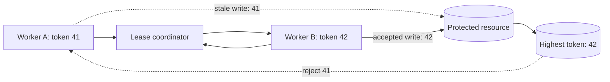

A distributed lock can tell two workers who should act now. It cannot reach into a paused process and revoke work that has already started.

That distinction is the source of a dangerous failure. Worker A acquires a lock, then pauses long enough for its lease to expire. Worker B acquires the same lock and begins valid work. A later resumes and writes to the protected resource using an authority that no longer exists. From the lock service's perspective, ownership changed correctly. From the resource's perspective, two owners still produced effects.

Expiry limits how long other workers wait. It does not make stale operations harmless. A correctness-sensitive design needs a second mechanism: every successful acquisition receives a strictly increasing fencing token, and the protected resource rejects any operation carrying a token older than the newest token it has accepted.

This article presents that mechanism as a reference architecture. It explains general design choices and failure tests, not a claim about a specific deployed system.

## A lease does not revoke a paused client

A lease is time-bounded ownership. The holder renews it while work continues; if renewal stops, another participant can eventually acquire the lock. This is useful for liveness because a crashed owner cannot block progress forever.

The unresolved problem is that the old owner may be slow rather than dead. A runtime pause, CPU starvation, network partition, blocked I/O, or overloaded event loop can prevent renewal while leaving the process capable of resuming later. Local time is also not a safe proof of ownership. The worker may believe that its lease remains valid even though the coordinator has expired it and granted a new lease.

The failure sequence is simple:

1. Worker A receives a lease and starts calculating a write.
2. A pauses beyond the lease duration.
3. The coordinator expires A's lease.
4. Worker B acquires the lock and commits a newer result.
5. A resumes and commits its older result.

The final write wins even though it came from the invalid owner. Extending the lease only changes how long the pause must be. Perfectly tuning the timeout is impossible because pauses and network delays do not have a reliable upper bound.

Martin Kleppmann's analysis of [distributed locking](https://martin.kleppmann.com/2016/02/08/how-to-do-distributed-locking.html) makes this stale-client problem explicit and argues that a correctness lock needs fencing at the storage boundary. The important question is therefore not only “who owns the lock?” but also “can the resource distinguish the newest owner from every older one?”

## Separate ownership from authorization to write

The lock coordinator and the protected resource have different responsibilities.

The coordinator serializes acquisition and issues a monotonically increasing token. The worker carries that token with every protected operation. The resource remembers the highest token it has accepted and rejects lower values. Ownership remains temporary, but authorization becomes ordered.



Suppose A has token 41 and B later receives 42. If B's write reaches the resource first, the resource records 42. A's delayed write with 41 can then be rejected even if A is still running and even if it never learned that its lease expired.

This is stronger than checking a random lock value during release. A unique value can prevent one client from deleting another client's Redis lock, which is why the [Redis distributed lock documentation](https://redis.io/docs/latest/develop/clients/patterns/distributed-locks/) recommends comparing the stored value before deletion. Uniqueness, however, does not order owners. The resource cannot determine whether random identifier X is older or newer than Y. Fencing needs an ordered token.

The rule must be enforced where the effect becomes durable. A check performed only in the worker has the same pause vulnerability as the lease itself: the worker can pass the check, pause, lose ownership, and resume the write later.

## Generate fencing tokens from ordered state

A token generator needs one property: successful acquisitions must receive values ordered by the coordinator's serialization of ownership. Gaps are acceptable; duplicates and reversals are not.

A consensus-backed coordinator can expose such an order directly. The [etcd concurrency API](https://etcd.io/docs/v3.6/dev-guide/api_concurrency_reference_v3/) associates mutex ownership with keys created under a lease, while etcd's revisioned keyspace provides ordered state that an implementation can use carefully as a fencing source. The exact mapping must follow the chosen client's guarantees rather than assuming that every lease identifier is monotonic.

A database-backed coordinator can allocate tokens from a sequence in the same acquisition protocol. PostgreSQL documents that [`nextval`](https://www.postgresql.org/docs/current/functions-sequence.html) is atomic across concurrent sessions and that sequence values are not reclaimed when a transaction aborts. That gap behavior is suitable for fencing because tokens need to increase, not remain contiguous.

The acquisition record can be modeled as:

```sql
CREATE TABLE resource_fence (
  resource_id text PRIMARY KEY,
  highest_token bigint NOT NULL,
  owner_id text NOT NULL,
  lease_expires_at timestamptz NOT NULL,
  updated_at timestamptz NOT NULL DEFAULT now()
);
```

Token allocation and lease acquisition must form one coherent protocol. Do not allocate a token, fail acquisition, then accidentally expose that token as valid ownership. Gaps are harmless, but authorization without ownership is not.

A timestamp is a poor substitute. Wall clocks can move, machines can disagree, and equal timestamps create ambiguous ordering. A random UUID is excellent for identity but does not provide age. The token should come from serialized coordinator state, not from a worker's clock.

## Enforce the token at the resource boundary

Fencing works only if the target system can compare and persist token order atomically with the protected effect.

For a row in PostgreSQL, a conditional update can combine both actions:

```sql
UPDATE account_projection
SET balance = $1,
    last_fencing_token = $2,
    updated_at = now()
WHERE account_id = $3
  AND last_fencing_token < $2;
```

The worker treats an affected-row count of zero as stale ownership, not as a transient database error to retry blindly. The initial row needs a defined token floor, and every write path that mutates the protected state must apply the same rule. One unfenced administrative script is enough to bypass the invariant.

For an append-only log, the token can be part of an optimistic condition or uniqueness constraint. For a queue, a compare-and-set operation can advance the accepted token alongside job state. For an external API that cannot compare tokens, the lock cannot by itself provide strong correctness. The operation may need to pass through a gateway that owns durable fence state, use the target's version preconditions, or be redesigned as an idempotent workflow with reconciliation.

This boundary is where many lock designs stop too early. They prove exclusive acquisition in Redis or etcd but never show how the database, object store, device, or third-party service rejects a late owner. If the resource cannot enforce order, the result is best described as coordination that reduces overlap, not a correctness guarantee.

## Renewal, release, and clock assumptions

Fencing does not remove the need for sound lease handling. It limits the damage caused when lease handling loses a race.

Renew only while the coordinator still recognizes the same ownership record. A delayed renewal must not revive an expired lease after another owner has acquired a newer token. Release should be ownership-checked and idempotent. A client that no longer owns the lock should stop local work when possible, but correctness must not depend on that cancellation arriving in time.

Lease duration is an operational trade-off. Short leases speed recovery but increase renewal traffic and false expiry under pauses. Long leases reduce churn but delay takeover after a crash. Measure acquisition latency, renewal latency, lease loss, work duration, and stale-write rejection before changing the value.

Clock assumptions should be explicit. A coordinator may use time to decide lease expiry, but workers should not grant themselves authority from their local wall clocks. Kubernetes [Lease objects](https://kubernetes.io/docs/reference/kubernetes-api/coordination/lease-v1/) illustrate how distributed systems represent holder identity, renewal time, and duration for coordination. The API is useful state, but consumers still need a clear protocol for what happens when observations are delayed.

## Design failure behavior explicitly

A rejected stale write is a successful safety decision, but the surrounding workflow still needs a defined outcome.

The old worker should not retry the same operation with the same token. It has lost authority. It should record a structured `stale_fencing_token` result, stop dependent work, and allow the current owner or a reconciliation process to determine final state. Retrying acquisition creates a new operation and should happen only if the business workflow permits it.

The new owner must also be careful with partial effects. If work spans several resources, one fenced database write does not automatically fence an email, object-store update, or remote request. Each durable boundary needs compatible version enforcement, idempotency, or compensating reconciliation. Calling the whole workflow “protected by a lock” hides these separate contracts.

Useful telemetry includes acquisition wait, lease age, renewal failures, current token, highest token observed by the resource, rejected stale operations, and work completed after local cancellation. Logs should include resource identity, owner identity, token, and trace identity without exposing sensitive payloads.

An alert on any stale rejection may be noisy during deliberate failure tests, but an unexpected increase is valuable. It can indicate runtimes pausing beyond the lease, overloaded coordinators, delayed networks, or code continuing after lease-loss notification.

## Test stale owners, not only contention

A test where ten workers race and one acquires the lock proves only the easy path. The critical tests force time and ordering to become hostile:

1. Pause A after acquisition, let its lease expire, let B commit, then resume A and require rejection.
2. Delay A's network write until after B's newer write reaches the resource.
3. Deliver renew and release messages after expiry and confirm they cannot alter B's ownership.
4. Abort acquisition after token allocation and confirm the gap grants no authority.
5. Restart the coordinator and verify token ordering survives according to its documented durability model.
6. Send concurrent writes with the same token and verify the business operation has its intended idempotency behavior.
7. Exercise every alternate write path and confirm none can omit the token check.
8. Partition the worker from the coordinator while leaving its resource connection alive.

These tests should assert durable resource state, not only lock-service logs. The invariant is that once token 42 has been accepted, token 41 can never change the protected state afterward.

## Practical decision guide

Use a simple expiring lock when overlap is an efficiency problem and duplicate work is harmless or already idempotent. Examples can include cache refreshes or best-effort cleanup where an occasional duplicate costs resources but does not corrupt state.

Add fencing when stale overlap can violate correctness and the resource can atomically reject older tokens. The complete design has five parts:

1. A coordinator that serializes ownership.
2. A renewable lease for liveness.
3. A monotonic token for every successful acquisition.
4. Resource-side comparison persisted with the protected effect.
5. Failure tests that pause old owners and verify rejection.

If the final resource cannot enforce token order, say so plainly. Use idempotency, optimistic versions, a serialized gateway, or reconciliation according to the actual effect. A distributed lock is a coordination primitive, not remote process control.

Expiry lets the system move on. Fencing prevents the system from accepting the past after it has moved on.
