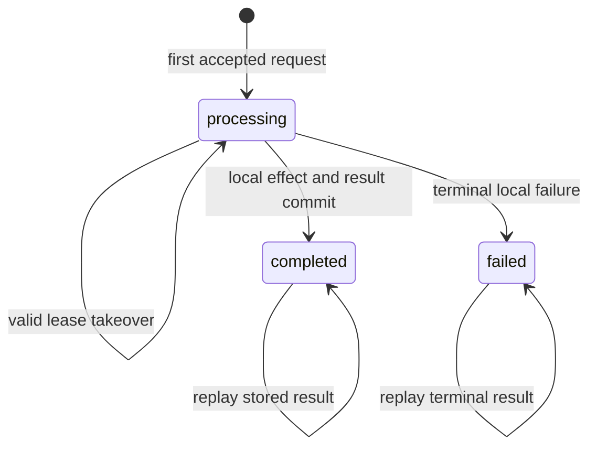

A timeout does not tell a client whether an operation failed. It only says the client stopped waiting.

The server may have rejected the request, committed the change, or committed the change and lost the response. Retrying a `POST` in that uncertainty window can create a second order, charge, job, or deployment. Refusing to retry turns a transient network fault into a user-visible failure.

An idempotency key resolves the ambiguity only when the server treats it as the identity of one logical operation. The reliable design is not a cache lookup around a handler. It is a durable state machine with atomic ownership, request validation, a stable result, explicit recovery, and a retention contract.

This article develops that reference design without claiming a specific production implementation.

## Define the guarantee before choosing the storage

HTTP calls a method idempotent when multiple identical requests have the same intended effect as one request. `PUT` and `DELETE` have idempotent semantics; `POST` does not provide that guarantee by default ([RFC 9110, Section 9.2.2](https://www.rfc-editor.org/rfc/rfc9110.html#name-idempotent-methods)). An API can make a particular `POST` retry-safe by adding application semantics, but the contract needs a boundary.

A useful contract is:

> For one authenticated caller, operation, and idempotency key, the service will execute at most one accepted logical request during the retention window and return a stable representation of its result to retries.

Every qualifier matters.

- **Caller:** two tenants can safely generate the same random key.
- **Operation:** the same key on `POST /orders` and `POST /refunds` should not collide.
- **Accepted request:** malformed input need not reserve a key forever.
- **Logical request:** the key represents intent, not merely identical bytes.
- **Retention window:** once the record is removed, the old guarantee no longer exists.
- **Stable representation:** a retry should not surprise the caller with a second effect or an unrelated response.

AWS describes caller-provided request identifiers as a way to express intent rather than inferring duplicates from matching parameters ([Making retries safe with idempotent APIs](https://aws.amazon.com/builders-library/making-retries-safe-with-idempotent-APIs/)). That distinction prevents two legitimate, identical-looking operations from being collapsed accidentally.

## Model the key as state

A cache commonly stores `key -> response` after work finishes. That misses the most important interval: two requests with the same key can arrive concurrently before either response exists. Both observe a miss and both execute.

The database record must exist before the business effect begins, and creation must be atomic. A compact PostgreSQL model is:

```sql
CREATE TYPE idempotency_state AS ENUM (
  'processing', 'completed', 'failed'
);

CREATE TABLE idempotency_requests (
  tenant_id text NOT NULL,
  operation text NOT NULL,
  idempotency_key text NOT NULL,
  request_hash text NOT NULL,
  state idempotency_state NOT NULL,
  status_code integer,
  response_body jsonb,
  resource_id text,
  owner_token uuid,
  lease_expires_at timestamptz,
  created_at timestamptz NOT NULL DEFAULT now(),
  completed_at timestamptz,
  expires_at timestamptz NOT NULL,
  PRIMARY KEY (tenant_id, operation, idempotency_key)
);
```

The primary key is the concurrency primitive. PostgreSQL documents that `INSERT ... ON CONFLICT` can take an alternative action when a unique constraint conflicts ([PostgreSQL `INSERT`](https://www.postgresql.org/docs/current/sql-insert.html)). Application-level “check, then insert” is insufficient because another transaction can act between those statements.

The state transitions are small:



The lease transition is optional. If it exists, it needs more than a timestamp; stale workers must be prevented from committing after a new owner takes over.

## Bind the key to the request

A client can accidentally reuse a key with different parameters. Returning the first result would make the second request appear successful even though the server ignored its new intent.

Store a canonical request fingerprint with the key. It can include the operation, tenant, normalized body, and any semantic headers that affect the result. Exclude transport noise such as tracing headers. Canonicalization must be deterministic: JSON key order, omitted defaults, number representation, and Unicode handling can otherwise produce false mismatches.

On every retry:

1. Recompute the fingerprint.
2. Load the idempotency record.
3. Reject the request if the stored fingerprint differs.
4. Continue according to the stored state if it matches.

Stripe documents the same safety rule: it compares incoming parameters with the original request and errors when a key is reused with different parameters ([Idempotent requests](https://docs.stripe.com/api/idempotent_requests)). The key itself should be opaque and high entropy. Do not encode an email address, account number, or other sensitive value into logs and indexes.

## Keep the local effect in the same transaction

The strongest implementation is available when the idempotency record and business state live in the same transactional database.

```ts
await db.transaction(async (tx) => {
  const claim = await tx.claimIdempotencyKey({
    tenantId,
    operation: "create-order",
    key,
    requestHash,
    expiresAt
  })

  if (claim.kind === "mismatch") throw new KeyReuseError()
  if (claim.kind === "completed") return claim.storedResponse
  if (claim.kind === "processing") throw new RequestInProgressError()

  const order = await tx.orders.create(command)
  const response = { orderId: order.id, state: order.state }

  await tx.completeIdempotencyKey({
    tenantId,
    operation: "create-order",
    key,
    requestHash,
    statusCode: 201,
    response,
    resourceId: order.id
  })

  return response
})
```

The pseudocode hides database details, but the boundary is explicit: claiming the key, changing business state, and storing the stable result commit together. A crash before commit leaves none of them. A crash after commit leaves all of them, so a retry can replay the result.

Do not hold that transaction open across a slow external API. Database locks, connections, and retries then become coupled to another system's latency. If the logical operation includes an external effect, use the downstream system's idempotency mechanism with the same stable operation identity, or commit durable workflow intent and complete it asynchronously. A local key cannot make an email provider, payment gateway, or second database atomic.

## Decide what concurrent retries receive

When a duplicate arrives while the first request is still `processing`, the service has several defensible options:

- **Fail fast** with a conflict-style or retryable response and guidance to retry later.
- **Wait briefly** for the first request to finish, bounded by the caller's remaining deadline.
- **Return an operation resource** that the caller can poll.

None is universally correct. Holding every duplicate connection open can consume capacity during an incident. Returning an ordinary success before the effect commits is dishonest. Starting the handler again defeats the guarantee.

Long operations are usually clearer as asynchronous resources: the first request returns an operation ID, and later requests with the same key return the same ID. The operation then has its own observable state. This separates transport retries from workflow progress.

## Recovery needs ownership, not just a timeout

A `processing` row can remain after a worker crashes when the business effect is outside the same transaction or the implementation reserves keys separately. A cleanup process might mark old rows retryable, but elapsed time does not prove that the original worker is dead. A paused worker can resume after a new worker takes ownership.

If takeover is required, issue a new monotonically increasing generation or unique owner token and require it on completion:

```sql
UPDATE idempotency_requests
SET state = 'completed',
    status_code = $1,
    response_body = $2,
    completed_at = now()
WHERE tenant_id = $3
  AND operation = $4
  AND idempotency_key = $5
  AND state = 'processing'
  AND owner_token = $6;
```

A zero-row update means the worker no longer owns the operation and must not publish its result. This is a fencing check. It protects the state record; external effects still require their own idempotency or reconciliation boundary.

Prefer designs that avoid takeover entirely for short local transactions. Add leases only when the workflow genuinely outlives one transaction, then test stale-owner behavior explicitly.

## Response replay is part of the API contract

The server must decide which outcomes become durable results. Stripe stores the status code and response body after endpoint execution begins, including failures, while validation failures and concurrent conflicts can be retried because execution did not begin ([Stripe idempotent requests](https://docs.stripe.com/api/idempotent_requests)). That is one coherent policy, not the only one.

For your API, classify outcomes:

- **Pre-execution validation failure:** normally do not reserve or finalize the key.
- **Committed success:** store the status and a stable response, or enough identity to reconstruct one.
- **Committed business rejection:** store it if repeating the request cannot change the decision.
- **Transient dependency failure before any effect:** release or mark retryable under a defined policy.
- **Unknown external outcome:** do not claim failure; expose `pending` or `uncertain` and reconcile.

Replaying an entire response body is convenient but couples retention to payload size and schema. Storing a resource ID is smaller, but reconstructing the response later can expose changed data. Choose deliberately and version the stored representation if clients require exact replay.

## Retention changes correctness

A key cannot be remembered forever without cost. It also cannot be deleted casually. After deletion, an old retry can execute as new.

Set retention from the longest credible retry horizon: client libraries, offline devices, message redelivery, operator replay, and upstream job recovery. Publish that window in the API contract. Stripe, for example, documents automatic removal only after keys are at least 24 hours old; that is Stripe's policy, not a universal default.

Cleanup needs operational evidence. Track record count, storage size, oldest unexpired key, cleanup lag, key conflicts, payload mismatches, processing age, takeovers, replay rate, and unknown outcomes. Alert on old `processing` records rather than silently deleting them.

## Test the ambiguity windows

A useful test suite forces the failures the key is meant to control:

1. Send the same key concurrently and verify one business effect.
2. Reuse the key with a different payload and require rejection.
3. Commit the transaction, drop the response, then retry and verify replay.
4. Crash before commit and verify that the operation remains safe to retry.
5. Let a request exceed the client timeout while the server completes it.
6. Create a stale owner, transfer ownership, and reject the stale completion.
7. Fail an external dependency after an uncertain outcome and verify reconciliation.
8. Expire a key, retry it, and confirm the documented post-retention behavior.
9. Replay stored success after the underlying resource changes or is deleted.
10. Load-test a dependency incident and confirm retries use bounded backoff and jitter rather than amplifying failure. AWS warns that retries can multiply load across service layers and recommends limiting them, backing off, and adding jitter ([Timeouts, retries, and backoff with jitter](https://aws.amazon.com/builders-library/timeouts-retries-and-backoff-with-jitter/)).

These tests define the claim. A header, Redis entry, or unique index alone does not.

## Practical conclusion

Treat an idempotency key as the identity of one operation, scoped to the caller and endpoint. Bind it to a canonical request fingerprint. Claim it atomically before executing. When possible, commit the business effect and durable result in the same transaction. Give concurrent retries an explicit response. Fence stale owners if work can be taken over. Carry the identity into downstream systems or durable workflows instead of assuming a local record controls external effects. Retain keys for a documented horizon and test the exact crash windows around commit and response delivery.

The key is small. The guarantee comes from the state machine around it.
