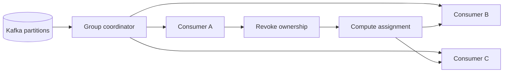

A Kafka consumer group is easy to describe: partitions are divided among consumers, so each partition has one active owner within the group. The difficult part begins when membership changes.

A deployment restarts consumers. Autoscaling adds or removes instances. A long processing step delays `poll()`. A network interruption hides a member from the coordinator. Kafka then has to decide which consumers are alive, revoke old ownership, calculate a new assignment, and establish who may continue processing.

That sequence is a distributed coordination protocol. Treating it as a single timeout setting usually produces one of two bad outcomes: aggressive detection that causes avoidable churn, or slow detection that leaves partitions idle for too long.

This article is a reference architecture, not a report about a measured production system. The design choices must be validated against the client version, group protocol, workload, and failure budget of the system that adopts them.

## Why rebalances are expensive

A rebalance is not automatically a defect. It is the mechanism that lets a group recover and redistribute work. The cost comes from how often it happens, how much ownership is revoked, and what consumers must rebuild afterward.

During an eager rebalance, members can temporarily stop processing while the group establishes a new generation and assignment. Consumers may flush buffers, commit offsets, close partition-scoped resources, and later rebuild caches or local state. A stateful stream processor can pay much more than a stateless event handler.

The operational impact is wider than the pause itself:

- Consumer lag rises while partitions have no active processor.
- In-flight records may be handled again if offset and side-effect boundaries are not aligned.
- Local caches and partition-scoped connections may be discarded unnecessarily.
- A slow restart can trigger another membership change before the first recovery settles.
- Rolling deployments can become a sequence of group-wide disruptions.

The useful question is therefore not “How do we disable rebalances?” A consumer group needs rebalancing. The useful question is “How do we make ownership changes deliberate, bounded, and observable?”

## The coordination model

Three clocks are often confused.

The **heartbeat and session** path detects whether a member remains connected to the group. The **poll interval** path detects whether the application continues to call `poll()` often enough. The **processing latency** of the records is the application’s own workload clock. These clocks interact, but they do not represent the same failure.

Kafka’s current consumer configuration reference explains that `max.poll.interval.ms` places an upper bound on the delay between calls to `poll()` under group management. If the consumer exceeds it, the group can consider the member failed and reassign its partitions. Session and heartbeat behavior depends on the selected group protocol and client configuration, so advice written for the classic protocol should not be copied blindly into a consumer using the newer protocol.

Partition ownership is also a correctness boundary. A consumer that has lost ownership must not continue committing offsets as if its generation were current. Application code should treat revocation as a state transition, not as a logging callback.

The coordinator manages membership and assignment. The application remains responsible for completing or cancelling in-flight work, committing only safe offsets, and releasing partition-scoped resources when ownership changes.

## What triggers a rebalance

The obvious triggers are a consumer joining or leaving and a subscribed topic gaining partitions. The less obvious triggers are often more damaging because they look like random infrastructure instability.

A consumer can miss its poll deadline because record processing runs on the polling thread, a downstream dependency stalls, garbage collection pauses the process, or a batch is simply larger than the time budget. A container can receive a termination signal but fail to leave the group cleanly before being killed. A liveness probe can restart a healthy but temporarily busy consumer, turning workload pressure into membership churn.

Separate the trigger classes before changing configuration:

1. **Expected topology change:** deployments, planned scaling, partition expansion.
2. **Application stall:** processing blocks the poll loop or exceeds its budget.
3. **Infrastructure interruption:** process crash, node loss, network break.
4. **Coordinator or protocol churn:** incompatible assignment strategies, repeated join failures, or unstable membership identity.

Each class needs a different fix. Increasing every timeout can hide application stalls while making genuine failures slower to recover. Lowering every timeout can detect crashes faster while converting brief pauses into repeated rebalances.

## Dynamic and static membership

Dynamic members receive a new identity when they join. That is appropriate for disposable instances, but a short restart can look like a completely new member and force redistribution.

Kafka supports static membership through `group.instance.id`. A non-empty, unique value gives an instance a stable identity within the group. The official configuration reference describes using it with an appropriate session timeout to reduce rebalances caused by transient unavailability such as process restarts. KIP-345 defines the protocol change and its fencing behavior.

Static membership is not a free reliability switch. Every concurrently running instance needs a unique and stable ID. Reusing one ID for two live processes creates a fencing conflict. An instance that disappears without leaving can retain its place until the session timeout, which delays reassignment. In an orchestrator, the identity should come from a stable ordinal or another deliberate mapping, not from a random pod UID that changes on every restart.

Use static membership when restart continuity matters and instance identity can be managed safely. Keep dynamic membership when instances are intentionally anonymous and rapid replacement matters more than preserving the previous assignment.

## Cooperative assignment reduces the blast radius

Traditional eager rebalancing revokes ownership broadly before a new assignment is installed. Cooperative rebalancing changes the process into incremental ownership transfer: members can retain unaffected partitions while only partitions that must move are revoked and reassigned.

KIP-429 introduced this incremental protocol and the cooperative sticky assignor. Its practical value is reduced disruption during rolling changes, not the elimination of coordination. Applications still need correct revocation handling, and all members must negotiate compatible strategies.

Migration deserves care. The consumer configuration supports an ordered list of assignment strategies. A group should transition through a compatible rollout rather than abruptly mixing clients that cannot agree on the protocol. Verify the exact client documentation and release behavior before changing the list.

Cooperative assignment is especially valuable when rebuilding partition-local state is expensive. It offers less benefit when every consumer shares no local state and processing pauses are already negligible. Measure the actual rebalance duration and revoked-partition count instead of adopting it only because it sounds newer.

## Keep the poll loop boring

The polling thread should coordinate fetching and ownership, not perform unbounded work. If record handling can exceed the poll budget, move processing to bounded workers while preserving partition ordering and commit safety.

That architecture needs explicit limits. An unbounded executor only moves the stall from Kafka into memory. Pause partitions when the internal queue reaches a high-water mark, resume them when capacity returns, and continue polling as required by the client contract. Limit the records returned per poll according to measured processing time and memory use, but remember that `max.poll.records` controls what `poll()` returns, not the consumer’s underlying fetch behavior.

Offset management must follow completion, not dispatch. If offset 42 is still running while 43 finishes, committing 44 can lose 42 after a crash. Common options are sequential processing per partition, a partition-local completion tracker, or a workload design where downstream effects are idempotent and replay is safe.

The goal is a simple invariant: a committed offset means every required effect before that offset is durably complete.

## Design deployments as group events

A rolling deployment is not only a container operation. It is a planned sequence of membership changes.

On shutdown, stop accepting new work, keep the poll and heartbeat contract healthy while draining bounded in-flight work, commit only completed offsets, close the consumer so it can leave the group, and finish before the orchestrator’s termination deadline. If draining can exceed that deadline, reduce the batch or concurrency before shutdown rather than hoping the process will receive more time.

Startup also matters. A readiness probe should not expose the instance as ready before it can process assigned partitions safely. A liveness probe should detect a genuinely unrecoverable consumer, not restart a process merely because downstream work is slow.

Staggering restarts can reduce simultaneous membership changes. Static membership and cooperative assignment can further reduce disruption, but neither compensates for a shutdown grace period shorter than the application’s drain budget.

## Observe causes, transitions, and impact

A single rebalance counter is insufficient. It shows that coordination happened but not why or whether users were affected.

Track at least:

- Rebalance count and rate by consumer group.
- Rebalance duration and assignment latency.
- Partitions revoked, assigned, and retained per event.
- Consumer lag by partition, including the age of the oldest unprocessed record when available.
- Time spent between `poll()` calls and records returned per poll.
- In-flight work, internal queue depth, paused partitions, and drain time.
- Member join, leave, timeout, fencing, and assignment errors.
- Deployment version and instance identity correlated with each rebalance.

Alert on impact and persistence, not every expected transition. One short rebalance during a controlled rollout may be normal. Repeated rebalances with rising lag, no stable generation, or oscillating membership indicate a coordination incident.

Logs should include group ID, member or instance ID, generation, assigned partitions, trigger, and duration, while avoiding message payloads and credentials. Traces can connect a slow downstream call to poll-loop pressure, but group-level metrics remain essential because ownership changes span processes.

## Test failure boundaries

Configuration review cannot prove rebalance behavior. Exercise the protocol under controlled failures.

1. Restart one consumer cleanly and record whether unaffected partitions continue processing.
2. Kill one consumer without cleanup and measure detection plus reassignment time.
3. Delay processing beyond the poll interval and verify the application does not commit after losing ownership.
4. Run two instances with the same static identity and verify the fencing signal is visible.
5. Roll the full group while producing traffic and measure lag, duplicate handling, and recovery.
6. Stall a downstream dependency, fill the worker queue, and verify pause/resume remains bounded.
7. Add partitions to a subscribed topic and verify assignment plus partition-local initialization.
8. Introduce a client with an incompatible assignment strategy in a non-production environment and verify the failure is actionable.

Define success before the test: maximum acceptable lag age, recovery time, duplicate tolerance, and whether unaffected partitions must continue. Without those boundaries, a test can complete while still hiding an unacceptable pause.

## A practical design sequence

Start with evidence, not timeout folklore.

First, identify the rebalance triggers from coordinator logs, client metrics, deployments, and poll-loop timing. Second, make processing bounded so the consumer can honor its protocol. Third, align offset commits with durable completion. Fourth, design graceful shutdown and startup as ownership transitions. Fifth, decide whether stable instance identity and cooperative assignment reduce a measured cost. Finally, test crashes, stalls, and rolling changes while watching lag and assignment state.

A good consumer group does not avoid change. It changes ownership predictably, stops stale owners from acting, limits unnecessary revocation, and exposes enough state to explain every disruption.

## Sources

- [Apache Kafka consumer configuration](https://kafka.apache.org/42/configuration/consumer-configs/)
- [KIP-345: Static membership](https://cwiki.apache.org/confluence/display/KAFKA/KIP-345%3A+Introduce+static+membership+protocol+to+reduce+consumer+rebalances)
- [KIP-429: Incremental cooperative rebalancing](https://cwiki.apache.org/confluence/display/KAFKA/KIP-429%3A+Kafka+Consumer+Incremental+Rebalance+Protocol)
- [Confluent consumer groups documentation](https://docs.confluent.io/platform/current/clients/consumer.html#consumer-groups)
