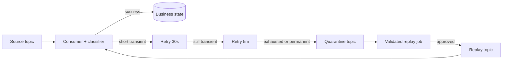

A Kafka retry design should answer five questions before it adds a single retry topic: **What failed? Is another attempt useful? What happens to ordering? When is the source offset committed? How can the record be replayed without repeating a business effect?**

A dead-letter topic is only a parking place. It does not classify failures, make consumers idempotent, preserve ordering across retry topics, or prove that replay is safe. The reliable design is a small failure state machine around the consumer: validate, classify, retry within a budget, quarantine with complete context, and replay through a controlled path.

This article develops that reference architecture without claiming a specific production deployment.

## Start with the consumer contract

Kafka stores records in ordered topic partitions. Records with the same key can be routed to the same partition, and Kafka guarantees that a consumer reads a given partition in write order ([Apache Kafka documentation](https://kafka.apache.org/documentation/)). The consumer group tracks progress with offsets.

That mechanism does not define application success. A handler can read a record and then fail while parsing it, updating a database, calling an API, or producing another event. The application must decide whether to stop the partition, retry the work, or move past the record.

Write that decision as a contract:

1. A record is acknowledged only after it reaches a conclusive state.
2. A conclusive state is either `processed` or `quarantined`.
3. Retrying is bounded by attempts and elapsed time.
4. Duplicate delivery must not duplicate the business effect.
5. Replay is a new controlled operation, not an automatic loop back to the source.

This is deliberately stricter than “catch the exception and publish to a DLQ.”

## Classify failure before choosing a retry

Treating every exception as transient creates retry storms. Treating every exception as permanent sends recoverable work to manual review. The useful split has four classes.

### Invalid input

Malformed bytes, an unsupported schema version, or a missing required field will not improve with time. Quarantine immediately. Preserve the original bytes where policy permits, plus topic, partition, offset, timestamp, key, schema identity, and a stable error code.

### Permanent business rejection

A valid record may still violate a rule: an impossible state transition, an unknown tenant, or a request that the downstream system rejects permanently. This also should not enter a blind retry loop. The terminal state may be a business rejection event rather than a technical DLQ, depending on the domain.

### Transient dependency failure

Timeouts, rate limits, leader changes, or a short database outage can justify retry. The retry budget should be tied to the dependency’s recovery behavior and the workflow’s latency objective, not copied from a framework default.

### Unknown failure

An unexpected exception is neither safely transient nor safely permanent. Give it a small bounded retry budget, capture enough diagnostics to group similar failures, then quarantine it. Infinite retry is not caution; it is an unbounded outage.

A classifier should produce data rather than throw another generic exception:

```ts
type FailureDecision =
  | { kind: "quarantine"; code: string }
  | { kind: "retry"; code: string; delayMs: number }
  | { kind: "reject"; code: string };

function classify(error: unknown, attempt: number): FailureDecision {
  if (error instanceof UnsupportedSchema) {
    return { kind: "quarantine", code: "SCHEMA_UNSUPPORTED" };
  }
  if (error instanceof RateLimited && attempt < 4) {
    return { kind: "retry", code: "RATE_LIMITED", delayMs: backoff(attempt) };
  }
  if (error instanceof InvalidTransition) {
    return { kind: "reject", code: "INVALID_TRANSITION" };
  }
  return attempt < 2
    ? { kind: "retry", code: "UNCLASSIFIED", delayMs: backoff(attempt) }
    : { kind: "quarantine", code: "UNCLASSIFIED_EXHAUSTED" };
}
```

The numbers are illustrative. Production values need measured dependency behavior and service objectives.

## Choose blocking or non-blocking retry deliberately

A blocking retry pauses work on the failed record, usually with local backoff. It keeps the record in the current processing path and can preserve partition order. It is reasonable for one or two short attempts when the expected recovery time is smaller than the consumer’s processing budget.

It also has sharp limits. Sleeping inside the poll loop delays every later record in that partition. Long processing can interact badly with consumer-group liveness and rebalancing. A dependency outage can turn every consumer instance into a synchronized retry engine.

A non-blocking retry publishes the failed record to a retry topic, commits progress on the source, and continues. Separate consumers process retry tiers after increasing delays:



This frees the source partition, but it changes ordering. Record `A2` can succeed while earlier record `A1` waits in a retry topic. Republishing the same key does not restore the original sequence because the records now travel through different topics and consumer groups.

Choose non-blocking retry only when one of these is true:

- processing order is irrelevant;
- the consumer uses versions and rejects stale updates;
- the aggregate can be locked or deferred while one event is retrying;
- reconciliation can repair out-of-order effects.

If strict per-key order is a business invariant, keep the key blocked, isolate it behind a keyed work scheduler, or redesign the state transition. Do not hide the trade-off behind the word “resilient.”

## Make the offset transition explicit

The dangerous boundary is not just processing the record. It is moving from the source topic to another durable state.

For a successful database write, committing the database transaction and committing the Kafka offset are two independent operations. A crash between them can cause duplicate processing. The [idempotent consumer pattern](https://microservices.io/patterns/communication-style/idempotent-consumer.html) addresses this by storing a stable message identity with the business change in one database transaction.

The same dual-write problem appears when quarantining:

1. publish the failed record to the quarantine topic;
2. commit the source offset.

If the process crashes between those steps, the source record may be read again and quarantined twice. If it commits first, then fails to publish, the record can disappear from the processing path.

There are two honest approaches:

- Use Kafka transactions when the consumed record, produced retry or quarantine record, and source offsets all remain within Kafka and the client/framework supports the required consume-transform-produce transaction.
- Otherwise assume at-least-once movement, publish before committing the source offset, and give every failure envelope a deterministic identity such as `source-topic/source-partition/source-offset` so duplicates can be recognized.

A quarantine record should retain the original coordinates even if it gets a new Kafka offset:

```json
{
  "failureId": "orders/12/884193",
  "source": { "topic": "orders", "partition": 12, "offset": 884193 },
  "attempt": 4,
  "firstFailedAt": "2026-07-31T09:10:00Z",
  "lastFailedAt": "2026-07-31T09:16:42Z",
  "errorCode": "RATE_LIMITED_EXHAUSTED",
  "payloadSchema": "order-created.v3",
  "traceId": "..."
}
```

Do not serialize unrestricted stack traces, credentials, or personal data into headers. Store a bounded error code and correlation ID; keep sensitive diagnostics in access-controlled logs.

## Idempotency must cover the business effect

A set of processed offsets in memory is not idempotency. It disappears on restart and does not coordinate multiple consumer instances.

For a database effect, insert the message identity and apply the business change in the same transaction. A unique constraint on `(consumer_name, message_id)` turns redelivery into a no-op. This is the same core mechanism described by Microservices.io.

External effects need their own protection. Pass a stable idempotency key to an API that supports one. For email, payment, or webhook systems without a suitable atomic boundary, model the action as durable state with explicit `pending`, `sent`, and `uncertain` outcomes plus reconciliation. A replay button cannot manufacture exactly-once behavior after the fact.

## Treat quarantine as an operational queue, not an archive

A DLQ that nobody owns is delayed data loss. Every quarantine topic needs:

- an owning service and team;
- retention long enough for the response objective;
- failure count and failure rate by error code;
- age of the oldest unresolved record;
- attempt count and time spent across retry tiers;
- replay success and repeat-failure counts;
- an alert threshold tied to business urgency;
- a runbook for inspect, repair, replay, and verify.

Confluent’s overview recommends bounded retries, health monitoring, investigation, and controlled reprocessing. The useful refinement is to monitor age as well as depth. One old failed payment can matter more than thousands of fresh low-priority analytics records.

Keep quarantine terminal by default. An automatic loop from DLQ to source can repeatedly trigger the same side effect, lose diagnostic context, and create traffic that looks like healthy throughput.

## Replay is a deployment with a blast radius

Replay should be a separate, observable workflow:

1. select records by immutable failure ID and explicit reason;
2. confirm that the consumer fix or dependency recovery exists;
3. verify schema compatibility;
4. estimate volume and downstream capacity;
5. publish to a dedicated replay topic at a bounded rate;
6. retain the original identity and increment replay metadata;
7. verify business state, not only Kafka delivery;
8. close or annotate the quarantined record.

A dedicated replay topic makes permissions, rate limits, dashboards, and audit history clearer than writing directly back to the source. It also lets the consumer distinguish a live record from a replay without changing the business identity.

For bulk replay, test on a small deterministic sample first. Stop conditions should include renewed failure rate, unexpected duplicate detection, dependency saturation, and growing consumer lag.

## Test the failure state machine

Happy-path tests prove very little about retry safety. Exercise the boundaries:

1. reject malformed input without retry;
2. recover from a transient failure inside the blocking budget;
3. exhaust blocking retry and move once to a retry topic;
4. crash after retry-topic publication but before source-offset commit;
5. deliver the same record concurrently and produce one business effect;
6. process a later same-key record while the earlier one waits, then verify the ordering policy;
7. fail quarantine publication and prove the source record remains recoverable;
8. replay a fixed sample twice and verify idempotency;
9. run a dependency outage long enough to observe backoff, lag, and alert behavior;
10. feed sensitive error data and verify that the envelope redacts it.

These tests turn retry policy from configuration into evidence.

## Practical conclusion

Kafka consumer reliability is not defined by the presence of a dead-letter topic. It comes from explicit transitions and bounded claims.

Classify failures before retrying. Use short blocking retries only when they fit the poll and latency budget. Use retry topics when progress matters more than strict order, and state that ordering trade-off plainly. Publish failure records before committing source progress unless a Kafka transaction covers both. Make business effects idempotent. Keep quarantine observable and terminal. Replay through a rate-limited, auditable path and verify resulting state.

The goal is not to make every record succeed automatically. It is to ensure that every record reaches a known state without hiding loss, duplication, or operational debt.

---
