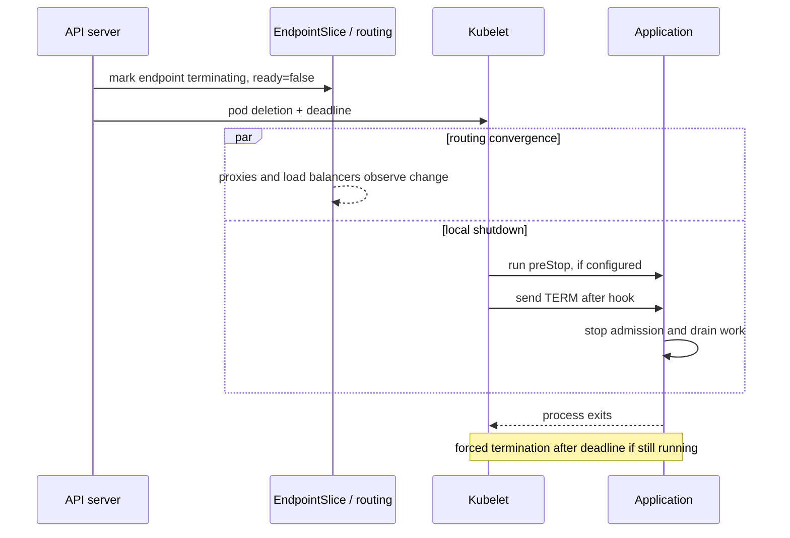

Graceful shutdown in Kubernetes is often reduced to one instruction: catch `SIGTERM`. That is necessary, but it is not the system.

A pod sits behind several independently moving components: the API server, EndpointSlices, kube-proxy or a service proxy, an ingress controller, perhaps an external load balancer, and the application process itself. During termination, routing changes and local process shutdown begin without a global transaction between them. A process can stop listening before every route has converged. A replacement can be ready inside Kubernetes while an external load balancer still considers it unhealthy.

The safer model is a timed protocol with three responsibilities: **withdraw the endpoint, drain admitted work, and exit before the grace period expires**. This article develops that reference architecture without claiming a specific production deployment.

## The race is between routing and process lifetime

When a pod is deleted, Kubernetes records a deletion deadline and the kubelet begins local shutdown. If a container defines a `preStop` hook, the kubelet runs it before asking the runtime to send the container's stop signal. The default stop signal is `SIGTERM`, and a process still running when the grace period expires is forcibly terminated. Kubernetes documents a default grace period of 30 seconds and notes that the grace-period clock includes the `preStop` hook ([Pod lifecycle](https://kubernetes.io/docs/concepts/workloads/pods/pod-lifecycle/#pod-termination)).

At the service boundary, the endpoint also changes. The Kubernetes endpoint-termination tutorial shows a terminating EndpointSlice entry with:

```yaml
conditions:
  ready: false
  serving: true
  terminating: true
```

`ready: false` keeps existing load balancers from selecting the endpoint for ordinary new traffic. `serving: true` can communicate that the endpoint still serves established connections while it terminates ([endpoint termination flow](https://kubernetes.io/docs/tutorials/services/pods-and-endpoint-termination-flow/)).

The important detail is that endpoint propagation and kubelet shutdown are coordinated by state, not by an end-to-end acknowledgement from every network hop. Your application does not receive proof that all proxies have stopped routing before it receives its termination signal.



Any design that assumes those two branches finish in a fixed order contains a race.

## Define shutdown as three phases

### 1. Withdraw

The first goal is to stop admitting new work. Kubernetes marks a terminating endpoint not ready, but propagation through the actual request path takes time. The path may include EndpointSlice watchers, node-level rules, a mesh proxy, ingress, and a cloud load balancer with its own health checks and deregistration behavior.

A `preStop` delay can create a withdrawal window before the application receives `SIGTERM`. It is a coarse tool, not a correctness proof. The delay should come from observed routing convergence in the real environment, not from a copied `sleep 10`.

An application-controlled drain endpoint is another option: a `preStop` hook tells the process to reject readiness, then waits for withdrawal. That gives the application explicit state, but it also creates another control endpoint to authenticate, test, and keep local-only. Kubernetes notes that deletion already makes the EndpointSlice endpoint not ready, so a custom readiness transition is not mandatory merely to drain a deleted pod ([probe documentation](https://kubernetes.io/docs/concepts/configuration/liveness-readiness-startup-probes/#readiness-probe)).

### 2. Drain

After withdrawal starts, the process must finish work it already admitted. “Work” depends on the protocol:

- HTTP requests need a server that stops accepting new connections while allowing active handlers to complete.
- WebSockets and streaming RPCs need a policy: finish, notify and reconnect, or enforce a bounded close.
- Queue consumers should stop fetching new messages before waiting for current handlers.
- Background workers need durable checkpoints rather than an unbounded promise to finish everything.

Shutdown is not the time to begin large cleanup jobs. Persist the state needed for recovery during normal processing. The drain handler should be bounded, idempotent, observable, and safe if called more than once.

### 3. Exit

Finally, close pools and telemetry exporters, record the shutdown result, and exit voluntarily before Kubernetes reaches the deadline. If the process waits forever, `SIGKILL` is the final state, not graceful shutdown.

Use a simple budget:

```text
termination grace >= routing withdrawal + maximum admitted work + cleanup + safety margin
```

Each term needs evidence. The longest request timeout is not automatically the maximum admitted work: streams, retries, external calls, and queue visibility timeouts may create longer lifetimes. Conversely, inflating the grace period without controlling admission can make rollouts and node drains unnecessarily slow.

## An application contract in TypeScript

The application should own its local part of the protocol. This simplified Node.js example separates readiness from liveness, stops accepting connections on termination, and gives active work a bounded drain window:

```ts
import http from "node:http";

let accepting = true;
let active = 0;

const server = http.createServer(async (req, res) => {
  if (req.url === "/live") return void res.end("ok");
  if (req.url === "/ready") {
    res.statusCode = accepting ? 200 : 503;
    return void res.end(accepting ? "ready" : "draining");
  }

  if (!accepting) {
    res.statusCode = 503;
    res.setHeader("connection", "close");
    return void res.end("draining");
  }

  active++;
  try {
    await handle(req, res);
  } finally {
    active--;
  }
});

process.on("SIGTERM", () => {
  accepting = false;
  server.close(); // stop new connections; existing work may finish

  const deadline = setTimeout(() => process.exit(1), 20_000);
  deadline.unref();

  const check = setInterval(async () => {
    if (active !== 0) return;
    clearInterval(check);
    await closeDependencies();
    process.exit(0);
  }, 100);
});
```

`handle` and `closeDependencies` are placeholders. The 20-second limit is illustrative, not a recommended production value. Real code also needs to account for upgraded connections, keep-alive behavior, rejected requests, error reporting, and a second termination signal.

Liveness should normally stay independent of draining. Turning liveness false during an intentional shutdown can trigger a restart-oriented mechanism while the pod is already terminating. Readiness answers “should this instance receive traffic?” Liveness answers “is restarting this process the recovery action?”

## Make the pod budget explicit

A deployment template can state the same contract:

```yaml
spec:
  strategy:
    type: RollingUpdate
    rollingUpdate:
      maxUnavailable: 0
      maxSurge: 1
  template:
    spec:
      terminationGracePeriodSeconds: 45
      containers:
        - name: api
          image: example/api:sha-immutable
          ports:
            - containerPort: 8080
          readinessProbe:
            httpGet:
              path: /ready
              port: 8080
            periodSeconds: 2
            failureThreshold: 2
          livenessProbe:
            httpGet:
              path: /live
              port: 8080
            periodSeconds: 10
          lifecycle:
            preStop:
              sleep:
                seconds: 8
```

All timings are examples. The Kubernetes Deployment controller uses `maxUnavailable` and `maxSurge` to control replacement rate during a rolling update ([Deployment documentation](https://kubernetes.io/docs/concepts/workloads/controllers/deployment/)). Those settings protect replica availability inside the rollout, but they do not prove that an external load balancer has accepted the new backend or drained the old one.

That distinction matters. In an environment with an external target-health gate, the rollout should consider that gate before removing another old replica. In a single-replica service, `maxUnavailable: 0` usually requires surge capacity; it cannot create capacity when scheduling, quota, or infrastructure constraints prevent the replacement from becoming usable.

The `preStop.sleep` lifecycle action avoids requiring a shell in the image on Kubernetes versions that support the sleep handler. On other environments, an exec hook or application-level delay may be necessary. In every case, hook time consumes the same termination budget as application draining.

## Test the protocol, not the manifest

A valid YAML file proves syntax. A shutdown test must create the race deliberately.

1. Send continuous short requests while repeatedly rolling between two immutable images.
2. Hold selected requests open near the maximum supported duration, then delete their pod.
3. Watch EndpointSlice conditions alongside application logs and proxy or load-balancer target state.
4. Confirm that new requests stop reaching the terminating instance while admitted requests complete.
5. Make the drain exceed the grace period and verify that forced termination is visible as a failure.
6. Break the `preStop` hook and confirm the application still handles `SIGTERM` safely.
7. Terminate several replicas during a node drain and verify the real availability floor.
8. Test long-lived connections and queue consumers separately; HTTP success does not cover them.
9. Measure rollout duration, request failures, resets, drain time, forced exits, and active work at exit.
10. Repeat through the real ingress and external load balancer, not only through `kubectl port-forward`.

The Glasskube EKS case study is useful because it follows the external target-registration and deregistration delay rather than stopping at pod readiness. DevOpsCube provides a practical signal-handling walkthrough. OneUptime covers pre-stop coordination across load balancers and application readiness. The gap this protocol closes is making timing assumptions, failure states, and test evidence explicit across all layers.

## Failure modes worth designing for

A few failures expose weak shutdown contracts quickly:

- **The hook uses a missing shell or binary.** The assumed delay never occurs.
- **The hook consumes the whole grace period.** The process receives almost no useful drain time.
- **The process is not receiving the intended stop signal.** A wrapper fails to forward it, or the image defines an unexpected stop signal.
- **Readiness means “process is up.”** New pods receive traffic before caches, connections, or external registration are actually ready.
- **The load balancer drains slower than expected.** The old process exits while a stale route still exists.
- **A stream has no maximum lifetime.** One connection can hold termination open until forced exit.
- **Cleanup is treated as atomic.** A half-completed flush or acknowledgement creates duplicate or lost work after restart.
- **Only rolling updates are tested.** Node drains, autoscaling, direct deletion, and eviction exercise different operational paths.

None of these is fixed by a larger `terminationGracePeriodSeconds` alone.

## Practical conclusion

Kubernetes graceful shutdown is a distributed timing problem with a local deadline.

Design it as a protocol. Withdraw the endpoint and allow the actual routing path to converge. Stop admitting work in the application. Drain in-flight requests, streams, or messages within a measured bound. Close dependencies and exit before the grace period. Coordinate rollout availability with the health signal that users actually depend on, not only the signal visible to the Deployment controller.

Then test the awkward windows: stale routes, slow requests, failed hooks, forced exits, external target health, and concurrent disruption. “Zero downtime” should be a measured result for a defined traffic model and environment—not a property inferred from the presence of a readiness probe.

---
