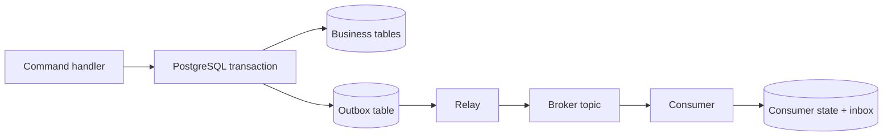

The transactional outbox pattern solves one precise problem: committing business state and the intent to publish an event without a distributed transaction. It does **not** give you exactly-once processing, global ordering, or automatic recovery from every failure.

A production-oriented design therefore needs two halves. The producer writes business data and an outbox record atomically. The relay publishes with at-least-once semantics, while each consumer makes its own state change idempotent. The difficult engineering work lives in the gap between those halves: duplicate delivery, ordering scope, poison events, backlog growth, schema evolution, and operational visibility.

This article is a reference architecture for that complete path.

## The failure that creates the pattern

Consider an order service that must update PostgreSQL and publish `OrderCreated` to Kafka or another broker. The obvious implementation performs two independent writes:

```ts
await orders.insert(order)
await broker.publish("order.created", event)
```

There is no safe order for these calls.

If the database commits first and the process crashes before publishing, the order exists but downstream systems never hear about it. If the event is published first and the database transaction later rolls back, consumers react to an order that does not exist. Retrying the entire request can then add a third problem: duplicated business effects.

The transactional outbox replaces those two writes with one local database transaction. The service writes the business row and a durable event envelope together. A separate relay publishes committed outbox rows later. This is the core pattern described by [Microservices.io](https://microservices.io/patterns/data/transactional-outbox.html) and [AWS Prescriptive Guidance](https://docs.aws.amazon.com/prescriptive-guidance/latest/cloud-design-patterns/transactional-outbox.html).



The database transaction establishes one useful invariant:

> If the business change commits, the intent to publish exists. If it rolls back, neither record exists.

That is stronger than a best-effort publish. It is also narrower than “exactly once.”

## Design the event envelope before the relay

An outbox row should be more than an arbitrary JSON payload. It is a durable contract and an operational record. A practical PostgreSQL table might contain:

```sql
CREATE TABLE outbox_events (
  id uuid PRIMARY KEY,
  aggregate_type text NOT NULL,
  aggregate_id text NOT NULL,
  aggregate_version bigint NOT NULL,
  event_type text NOT NULL,
  schema_version integer NOT NULL,
  payload jsonb NOT NULL,
  trace_id text,
  created_at timestamptz NOT NULL DEFAULT now(),
  published_at timestamptz,
  attempt_count integer NOT NULL DEFAULT 0,
  next_attempt_at timestamptz NOT NULL DEFAULT now(),
  last_error text
);

CREATE INDEX outbox_pending_idx
  ON outbox_events (next_attempt_at, created_at)
  WHERE published_at IS NULL;
```

The event ID is the deduplication identity. `aggregate_id` and `aggregate_version` define an ordering scope. `schema_version` makes payload evolution explicit. Timestamps and attempt data make the relay observable instead of opaque.

Insert the event in the same transaction as the business update:

```ts
await db.transaction(async (tx) => {
  const order = await tx.orders.create(command)

  await tx.outboxEvents.insert({
    id: crypto.randomUUID(),
    aggregateType: "order",
    aggregateId: order.id,
    aggregateVersion: order.version,
    eventType: "order.created",
    schemaVersion: 1,
    payload: { orderId: order.id, customerId: order.customerId },
    traceId: currentTraceId()
  })
})
```

The transaction boundary is non-negotiable. A repository helper that opens its own connection, an ORM hook that runs after commit, or an asynchronous event emitter inside the request path can silently reintroduce the dual write.

## The relay cannot close the last atomicity gap

The relay reads pending rows, publishes them, and marks them as published. It still talks to two systems: the broker and PostgreSQL. No local transaction can atomically cover both.

The critical sequence is:

1. Publish the event.
2. The broker acknowledges it.
3. The relay crashes before setting `published_at`.
4. The relay restarts and publishes the same event again.

Microservices.io explicitly calls out this duplicate-publication window. AWS likewise recommends idempotent consumers because an outbox relay or broker can deliver an event more than once. The honest delivery contract is therefore usually **at least once**.

That wording matters. “Exactly once” is often used too broadly. A broker may deduplicate a publish within a bounded scope, but it cannot guarantee that an external side effect, such as charging a card, sending an email, or changing another database, occurs exactly once unless the consumer participates in an appropriate atomic or idempotent protocol.

## Make consumer state and deduplication one transaction

A separate `processed_events` or inbox table gives the consumer a durable memory:

```sql
CREATE TABLE processed_events (
  consumer_name text NOT NULL,
  event_id uuid NOT NULL,
  processed_at timestamptz NOT NULL DEFAULT now(),
  PRIMARY KEY (consumer_name, event_id)
);
```

The consumer starts a database transaction, inserts the event identity, and applies the business change in that same transaction. The primary key rejects duplicates. Microservices.io describes this as the [idempotent consumer pattern](https://microservices.io/patterns/communication-style/idempotent-consumer.html).

```ts
await consumerDb.transaction(async (tx) => {
  const accepted = await tx.processedEvents.insertIfAbsent({
    consumerName: "inventory-reserver",
    eventId: message.id
  })

  if (!accepted) return

  await tx.inventory.reserve({
    orderId: message.payload.orderId,
    items: message.payload.items
  })
})
```

Only acknowledge the broker message after the transaction commits. If the process crashes before commit, the broker redelivers and the work runs again. If it crashes after commit but before acknowledgement, redelivery reaches the unique constraint and becomes a no-op.

There is an important limit: this protects database effects inside the transaction. An HTTP call, email send, or payment request still sits outside it. For those effects, pass a stable idempotency key to the downstream system when supported. Otherwise, model the side effect as another durable workflow with its own state, reconciliation process, and explicit uncertainty.

## Ordering is a scoped requirement, not a global promise

Many explanations say the outbox “preserves ordering” without defining what must be ordered. Global ordering across every event is expensive and rarely necessary. The useful requirement is normally per aggregate: updates for order `A` must arrive in version order, while order `B` can progress independently.

Use `aggregate_id` as the broker partition key and include a monotonic `aggregate_version`. The consumer can then reject stale versions, buffer gaps, or trigger reconciliation. Do not rely on `created_at` alone: concurrent transactions can produce timestamps that do not reflect the business sequence, and multiple relays can publish different aggregates concurrently.

A relay can use `FOR UPDATE SKIP LOCKED` to let workers claim different pending rows. [PostgreSQL documents](https://www.postgresql.org/docs/current/sql-select.html) that `SKIP LOCKED` provides an inconsistent view and is unsuitable for general-purpose queries, but useful for avoiding contention with multiple consumers of a queue-like table. That makes it appropriate for work claiming, not proof of business ordering. Partitioning by aggregate key or serializing each aggregate’s pending events still requires deliberate design.

## Polling and CDC solve different operational problems

A polling relay is a good default when throughput and latency requirements are moderate. It is easy to understand, deploy, and debug. Batch size, poll interval, row locks, retry backoff, and retention are visible application decisions.

Change data capture moves publication closer to the database log. Debezium’s [Outbox Event Router](https://debezium.io/documentation/reference/stable/transformations/outbox-event-router.html) captures outbox-table changes and can route messages using aggregate and event fields. CDC can reduce polling load and publication latency, but it adds connector configuration, replication slots, schema assumptions, and a new failure domain.

Choose from measured constraints:

- **Polling** when simplicity matters and a small publication delay is acceptable.
- **CDC** when sustained volume, lower latency, or existing Kafka Connect operations justify the extra platform surface.

Do not adopt CDC merely to avoid writing a short poller. The connector must still be monitored, upgraded, secured, and recovered.

## Operate the outbox as a reliability subsystem

A working demo shows events moving. An operable system shows when they stop moving.

At minimum, expose:

- Age of the oldest unpublished event.
- Pending-event count.
- Publish attempts and failure rate.
- Relay throughput and batch duration.
- Dead-letter or terminal-failure count.
- Consumer lag and duplicate count.
- Per-event trace correlation from command to consumer.
- Table growth, index health, and cleanup progress.

Alert on lag age rather than queue depth alone. Ten old events for a critical workflow can matter more than ten thousand fresh analytics events. Keep failed records inspectable, but redact or avoid sensitive payloads. A replay tool should select immutable event IDs, preserve traceability, and require a reason rather than issuing an unbounded “retry all.”

Poison events need a bounded policy. Exponential backoff prevents a broken dependency from creating a hot loop. A maximum-attempt threshold can move an event into a reviewable failure state, but it must not quietly convert guaranteed intent into permanent loss. The runbook should say who owns the event, how to repair it, and how to verify downstream state after replay.

Retention is also a design choice. Deleting published rows controls table growth, but removing them immediately weakens audit and reconciliation. Archive or retain enough identity and timing data to investigate the failure windows your system claims to handle.

## Test the boundaries, not only the happy path

The most valuable tests stop the process at awkward moments:

1. Roll back the business transaction and verify that no outbox row exists.
2. Commit both rows, keep the broker unavailable, then verify later publication.
3. Publish successfully, crash before `published_at`, and verify duplicate delivery.
4. Deliver the duplicate concurrently to two consumer instances and verify one business effect.
5. Publish versions out of order and verify the consumer’s chosen policy.
6. Feed an invalid schema version and verify quarantine plus an actionable signal.
7. Hold a poison event in retry and confirm newer independent aggregates continue.
8. Build a backlog large enough to test indexes, batch time, and recovery rate.

These tests define the reliability claim. Without them, the architecture contains useful mechanisms but no evidence that the failure behavior is correct.

## Practical conclusion

Use a transactional outbox when one service must commit local state and reliably announce that change without coupling its transaction to a broker. Then be precise about what the pattern does not solve.

The complete design is:

1. Business state and event intent committed in one database transaction.
2. A relay that assumes it may publish more than once.
3. Stable event identities and a defined ordering scope.
4. Consumers that commit deduplication and business effects together.
5. Separate idempotency or reconciliation for external side effects.
6. Lag, retries, failures, and retention treated as operated state.
7. Failure-injection tests that prove the contract.

The outbox removes one dangerous dual write. Reliability comes from designing the rest of the path just as carefully.
