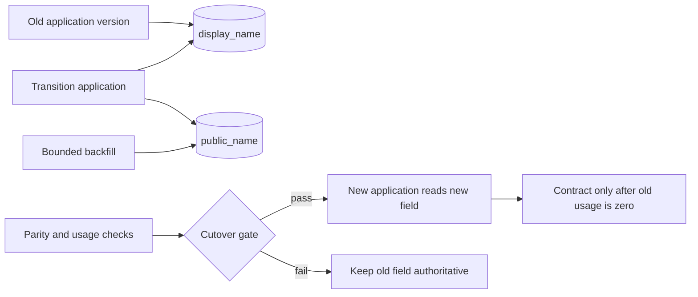

A database transaction can make one schema operation atomic. It cannot make a rolling deployment atomic across application instances, connection pools, background workers, cached schemas, and a live backfill.

That is why a safe online migration is better treated as a **compatibility protocol**. For a bounded period, the database must support both the code that is leaving and the code that is arriving. The transition needs explicit entry conditions, observable invariants, a rollback direction, and a delayed destructive step.

The practical pattern is expand, migrate, verify, cut over, and contract. The difficult part is not writing the final schema. It is proving when the old schema is no longer part of the runtime contract.

## The deployment overlap is the real constraint

A rolling release deliberately runs more than one application version at once. Even after the deployment controller reports success, old workers, scheduled jobs, or long-lived processes may still exist. A direct rename such as this changes the database contract immediately:

```sql
ALTER TABLE accounts RENAME COLUMN display_name TO public_name;
```

Every still-running query that references `display_name` can now fail. Wrapping the rename in a transaction only determines whether the rename commits. It does not update those callers at the same instant.

Parallel change, also called expand and contract, addresses this by supporting old and new interfaces during a migration phase. Martin Fowler's description divides the pattern into expand, migrate, and contract, with the explicit cost that two interfaces must coexist temporarily ([Parallel Change](https://martinfowler.com/bliki/ParallelChange.html)). GitLab's migration guidance shows the same operational reality: destructive column removal is separated across releases because running processes and schema caches may still expect the column ([Avoiding downtime in migrations](https://docs.gitlab.com/development/database/avoiding_downtime_in_migrations/)).

The compatibility window should be designed, not discovered during rollout.



## Phase 1: expand without changing existing behavior

The first release adds the destination structure while preserving everything the current application needs:

```sql
SET lock_timeout = '1s';
SET statement_timeout = '10s';

ALTER TABLE accounts
  ADD COLUMN public_name text;
```

The values are illustrative, not universal recommendations. PostgreSQL defines `lock_timeout` as the maximum time a statement waits to acquire a lock, while `statement_timeout` limits total statement execution time ([client connection defaults](https://www.postgresql.org/docs/current/runtime-config-client.html#GUC-LOCK-TIMEOUT)). A short lock timeout makes a migration fail rather than wait behind a long transaction while later queries queue behind it. The correct limits depend on traffic, transaction duration, table size, and the retry policy.

Expansion should be additive. The new column starts nullable because old instances know nothing about it. Adding `NOT NULL` immediately would make their valid writes fail. A default may be appropriate, but it must represent the real domain rather than hide incomplete migration state.

Before production, inspect the exact DDL on the deployed PostgreSQL version. `ALTER TABLE` lock levels vary by subcommand, and PostgreSQL states that an `ACCESS EXCLUSIVE` lock is taken unless a subform documents otherwise ([ALTER TABLE](https://www.postgresql.org/docs/current/sql-altertable.html)). A fast metadata operation can still cause an outage if it waits in the lock queue at the wrong moment.

## Phase 2: make new writes compatible

The transition application writes both representations while reads remain on the old one. For two columns in the same row, keep the update in one database statement or transaction:

```sql
UPDATE accounts
SET display_name = $1,
    public_name = $1,
    updated_at = now()
WHERE id = $2;
```

This removes one class of partial-write drift, but dual write is still a temporary liability. Every mutation path must participate: API updates, imports, administrative scripts, event consumers, repair jobs, and database-side procedures. If one path updates only the old column, parity falls behind. If independent services own the paths, one local transaction may no longer cover both effects.

Instrument the transition before backfilling:

- count rows where one value is null and the other is not;
- count rows where normalized values disagree;
- tag writes by application version;
- record failed dual writes and migration retries;
- identify queries still reading the legacy column.

Do not switch reads merely because the deployment completed. Switch when the data and callers satisfy an explicit invariant.

## Phase 3: backfill as controlled production traffic

A single unbounded `UPDATE` can create a long transaction, generate substantial write-ahead log, retain dead tuples, increase replica lag, contend with application writes, and make cancellation expensive. Treat a backfill as a workload with rate, progress, and pause controls.

One simple PostgreSQL shape is a small, repeatable batch:

```sql
WITH batch AS (
  SELECT id
  FROM accounts
  WHERE public_name IS NULL
  ORDER BY id
  LIMIT 1000
  FOR UPDATE SKIP LOCKED
)
UPDATE accounts AS a
SET public_name = a.display_name
FROM batch
WHERE a.id = batch.id
  AND a.public_name IS NULL;
```

The batch size is illustrative. The second null check makes retries safer and prevents the backfill from overwriting a value created by concurrent transition code. `SKIP LOCKED` can help multiple workers avoid waiting on the same selected rows, but it does not provide fairness or prove that every row will eventually be visited. Completion still needs a final exhaustive check.

Throttle using observed database behavior, not a fixed sleep copied from another system. Watch batch latency, lock waits, replica lag, CPU, I/O, dead tuples, autovacuum activity, error rate, and application latency. Pause automatically when a defined safety threshold is crossed. Record a durable cursor or design each batch to be safely discoverable again after restart.

Most importantly, define semantic parity. A string copy is straightforward. A type conversion, split field, deduplication, or normalization may not be reversible. Prisma's expand-and-contract guide uses name splitting to show why apparently simple data transformations can be ambiguous ([Using the expand and contract pattern](https://www.prisma.io/dataguide/types/relational/expand-and-contract-pattern)). The migration must specify how exceptional rows are handled instead of quietly guessing.

## Phase 4: verify before changing the read path

The cutover gate should answer four questions:

1. **Coverage:** are all eligible rows populated in the new structure?
2. **Parity:** do old and new representations agree under the documented transformation?
3. **Freshness:** are current writes maintaining parity, not only the historical backfill?
4. **Compatibility:** can every deployed and rollback-eligible application version operate against the expanded schema?

Run shadow reads or sampled comparisons before the new field becomes authoritative. Then move reads behind a controlled release or feature flag while dual writes continue. Monitor database errors, fallback reads, parity divergence, query latency, and business-level validation failures.

Rollback at this point means moving reads back to the old representation. That is only safe while the old representation still receives every write it needs. Once the new model accepts information that cannot be represented in the old model, rollback becomes a data migration of its own. “The old column still exists” is not enough.

## PostgreSQL online DDL reduces blocking; it does not create compatibility

Schema transitions often need indexes and constraints. PostgreSQL provides useful mechanisms, each with caveats.

A normal index build blocks writes. `CREATE INDEX CONCURRENTLY` permits concurrent inserts, updates, and deletes, but PostgreSQL documents additional scans, waits, restrictions, and the possibility of an invalid index after failure ([CREATE INDEX](https://www.postgresql.org/docs/current/sql-createindex.html#SQL-CREATEINDEX-CONCURRENTLY)). It must be monitored and its result verified:

```sql
CREATE INDEX CONCURRENTLY idx_accounts_public_name
  ON accounts (public_name);
```

For a foreign key or check constraint on existing data, add enforcement for new changes first, then validate historical rows separately:

```sql
ALTER TABLE account_profiles
  ADD CONSTRAINT account_profiles_account_fk
  FOREIGN KEY (account_id)
  REFERENCES accounts(id)
  NOT VALID;

ALTER TABLE account_profiles
  VALIDATE CONSTRAINT account_profiles_account_fk;
```

PostgreSQL presents this as the lower-impact path for adding a foreign key, and Squawk explains why separating `NOT VALID` from `VALIDATE CONSTRAINT` avoids holding the write-blocking validation lock for the full table scan ([ALTER TABLE examples](https://www.postgresql.org/docs/current/sql-altertable.html), [Squawk foreign-key guidance](https://squawkhq.com/docs/adding-foreign-key-constraint)). The initial metadata change still needs a lock. A lock timeout and retry strategy remain necessary.

These features solve database-level concurrency problems. They do not prove that old code tolerates a new constraint, that a backfill is semantically correct, or that rollback remains possible.

## Phase 5: contract only with evidence

Destructive cleanup is a separate deployment, not the last line of the expansion migration. Before dropping `display_name`, require evidence that:

- no deployed binary reads or writes it;
- no delayed worker, report, view, trigger, function, export, or ad hoc integration references it;
- rollback policy no longer requires the old application version;
- parity has remained stable for an agreed observation window;
- backups and recovery procedures cover the destructive step;
- the removal has its own lock and runtime analysis.

Then stop dual writes, observe again, and remove the old structure in a later controlled change. GitLab's guidance deliberately spreads some destructive changes over multiple releases so application behavior and schema caches cannot be collapsed into one risky release ([Avoiding downtime in migrations](https://docs.gitlab.com/development/database/avoiding_downtime_in_migrations/)).

The common failure is an unfinished contract phase. Temporary columns, flags, triggers, and compatibility branches become permanent complexity. Give the migration an owner, a state record, a cleanup issue, and an expiry condition when expansion begins.

## Test the transition, not only the destination

A migration test that starts on the old schema, applies all DDL, and boots only the new application misses the dangerous overlap. A useful rehearsal should:

1. run old and new application versions concurrently against the expanded schema;
2. generate writes through every known mutation path during the backfill;
3. interrupt and restart the backfill at arbitrary batches;
4. force lock-timeout and statement-timeout failures;
5. create parity drift and verify that the cutover gate blocks;
6. cut reads forward, then roll them back while dual writes remain active;
7. fail a concurrent index build and verify invalid-index handling;
8. measure lock waits, replica lag, batch throughput, application latency, and error rates;
9. prove that contract is rejected while any old caller remains;
10. rehearse recovery from the final destructive operation.

“Zero downtime” is not a property of a migration framework or SQL keyword. It is a measured result for a specified traffic model, deployment topology, database version, and failure envelope.

## Practical conclusion

Safe schema evolution begins with one question: **which application versions and data representations must coexist at each step?**

Expand additively. Make transition writes atomic where possible. Backfill in bounded, observable, restartable batches. Verify coverage, parity, freshness, and rollback compatibility before moving reads. Use PostgreSQL's concurrent index and deferred-validation mechanisms with their documented lock behavior, not as magic labels. Contract only after runtime evidence shows the old interface is unused.

Transactions still matter. They protect local state transitions. The larger migration succeeds because the team designs compatibility across time.

---
